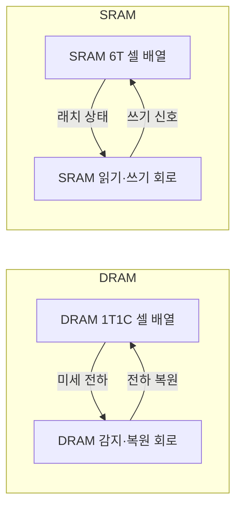
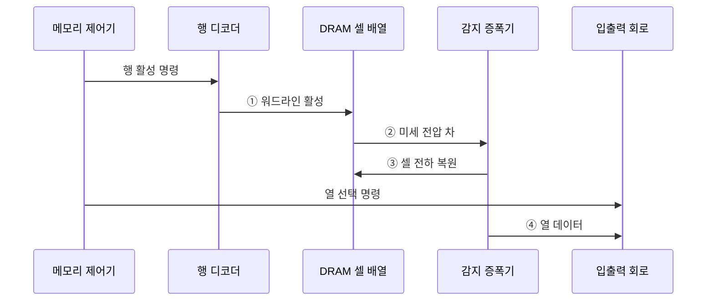

---
sidebar:
  order: 23
  label: "023. DRAM과 SRAM 비교 (DRAM vs SRAM)"
  badge:
    text: "기출 · 50%"
    variant: note
title: "DRAM과 SRAM 비교 (DRAM vs SRAM)"
date: "2026-07-29T01:10:00+09:00"
tags:
  - "notes-hardware"
weight: 23
extra:
  question_no: "023"
  source_status: "기출"
  source_history: "125회"
  priority: 50
  priority_note: "셀 구조·지연·밀도 비교"
---

## 미리 알고가기

- **DRAM과 SRAM**: DRAM은 커패시터 전하로 비트를 저장해 주기적 리프레시가 필요하고, SRAM은 플립플롭 상태로 저장해 빠르지만 셀 면적과 비용이 크다
- **동적 랜덤 접근 메모리(Dynamic Random-Access Memory, DRAM)**: 커패시터 전하를 주기적으로 복원하는 고밀도 메모리
- **정적 랜덤 접근 메모리(Static Random-Access Memory, SRAM)**: 래치 상태로 비트를 유지하여 리프레시가 필요 없는 고속 메모리
- **1T1C 셀(One Transistor One Capacitor Cell)**: 접근 트랜지스터 하나와 커패시터 하나로 DRAM의 1비트를 저장하는 셀 구조
- **6T 셀(Six Transistor Cell)**: 교차 결합 인버터의 트랜지스터 4개와 접근 트랜지스터 2개로 SRAM의 1비트를 유지하는 셀 구조
- **인버터(Inverter)**: 입력의 논릿값을 뒤집어 내보내는 회로이며 둘을 서로 물리면 값이 스스로 유지되는 래치가 된다
- **워드라인(Word Line)**: 한 행의 접근 트랜지스터를 한꺼번에 여는 선
- **비트라인(Bit Line)**: 열린 셀의 값을 읽고 쓰는 신호가 오가는 선
- **감지 증폭기(Sense Amplifier)**: 셀 전하가 비트라인에 만든 아주 작은 전압 차를 판별 가능한 크기로 키우는 회로
- **복원(Restore)**: DRAM은 읽는 순간 전하가 비트라인으로 흩어지므로, 감지한 값을 그 셀에 곧바로 다시 써 넣어야 하는 동작
- **리프레시(Refresh)**: 읽지 않아도 새어 나가는 전하를 메우려고 모든 행을 주기적으로 열었다 닫는 동작
- **프리차지(Precharge)**: 다음 행을 열기 전에 비트라인 전압을 중간값으로 되돌려 놓는 준비 동작
- **비파괴 판독(Non-destructive Read)**: 읽어도 저장 상태가 무너지지 않아 다시 써 넣을 필요가 없는 판독이며 SRAM의 성질이다
- **행·열(Row·Column)**: 워드라인으로 한꺼번에 열리는 셀 묶음이 행, 그중 실제로 내보낼 위치를 고르는 것이 열이다
- **데이터 버스(Data Bus)**: 선택한 열의 읽기·쓰기 데이터를 메모리 제어기와 주고받는 병렬 신호 경로
- **휘발성(Volatility)**: 전원이 끊기면 저장한 값이 사라지는 성질이며 두 메모리 모두 해당한다
- **L1 캐시(Level 1 Cache)**: 프로세서 코어에 가장 가깝게 배치하며 일반적으로 SRAM으로 구현하는 최소 지연 캐시
- **오류 정정 코드(Error-Correcting Code, ECC)**: 추가 검사 비트로 메모리 비트 오류를 검출·정정하는 기법
- **누설 전력(Leakage Power)**: 회로가 전환하지 않아도 트랜지스터에서 새어 소비되는 전력

## Ⅰ. 개요

- 정의/개념: 전하 셀과 래치 셀로 용량·지연을 나눠 맡는 **휘발성 메모리**
- 기존 한계: 단일 셀 구조로는 **고밀도·저지연** 동시 확보 불가

### 쉽게 이해하기 (학습용)

- 셀을 작게 만들면 한 비트를 담을 힘도 작아져 읽을 때마다 증폭하고 다시 채워야 하고 셀을 크게 만들면 읽기는 즉시 끝나지만 같은 면적에 훨씬 적게 들어가는데, 답안이 배경 자리에 이 못 겸함을 적은 이유는 두 메모리가 경쟁 제품이 아니라 계층의 서로 다른 칸을 맡는 짝이기 때문이다

## Ⅱ. 특징

- DRAM **1T1C 셀**의 고밀도와 낮은 비트 단가
- SRAM **6T 래치**의 비파괴 판독과 짧은 지연
- 전원 차단 시 값이 사라지는 공통 **휘발성**

### 쉽게 이해하기 (학습용)

- 부품 수 하나와 여섯이라는 차이가 밀도와 속도를 동시에 갈라 버리는데, 소자 하나짜리는 같은 웨이퍼에 수십 배 많이 찍어 낼 수 있어 기가바이트를 싸게 만들고 여섯 개짜리는 값이 비싼 대신 읽을 때 증폭도 복원도 없이 스위치 방향만 보면 끝나며, 둘 다 전기가 끊기면 기억이 사라진다는 점만은 같다

## Ⅲ. 아키텍처

**도표안 A — 구조도**

**도표안 B — sequenceDiagram**

| 구성요소 | 책임 |
|:---|:---|
| DRAM 1T1C 셀 배열 | **고밀도 전하 비트** 보관 |
| DRAM 감지·복원 회로 | 전압 증폭·**전하 재기록** |
| SRAM 6T 셀 배열 | **비파괴 래치 상태** 유지 |
| SRAM 읽기·쓰기 회로 | 워드·비트라인 **입출력** |

**동작 원리**

- ① **워드라인 활성**: 선택 행 셀 연결
- ② **미세 전압 차**: 저장 전하의 판독 전달
- ③ **셀 전하 복원**: 파괴 판독 상태 재기록
- ④ **열 데이터**: 선택 열의 외부 출력

> 요약: DRAM만 읽기 경로에 **복원 회귀선**이 필요

### 쉽게 이해하기 (학습용)

- 왼쪽 상자에만 셀로 되돌아가는 화살표가 하나 더 있는 것이 두 메모리의 값 차이를 그대로 보여 주는데, 물통을 들여다보는 순간 물이 쏟아지므로 본 값을 곧바로 다시 부어 놓아야 하고 그 되붓는 시간이 매 읽기에 붙는다

## Ⅳ. 종류 및 비교

| 휘발성 메모리 | DRAM | SRAM |
|:---|:---|:---|
| 적용 기준 | 기가바이트급 용량이 우선일 때 | 나노초급 **접근 지연**이 우선일 때 |
| 핵심 특징 | **1T1C 셀** 고밀도와 낮은 비트 단가 | **6T 래치**의 즉시 판독 |
| 한계 | **복원·리프레시**에 묶이는 접근 간격 | 셀 면적에 따른 **높은 비트 단가** |

> 요약: 용량을 얻으면 **복원 지연**, 지연을 얻으면 **단가**를 부담

### 쉽게 이해하기 (학습용)

- 두 한계가 각각 시간과 돈이라는 다른 화폐로 청구된다는 점이 선택을 가르는데, 싼 쪽은 매 읽기마다 되붓는 시간을 내야 하고 빠른 쪽은 같은 용량을 만들려면 면적과 값을 수십 배 내야 하므로 어느 자원이 더 빠듯한지가 곧 답이다

## Ⅴ. 실무 고려사항 및 대책

| 고려사항 | 대책 | 효과 |
|:---|:---|:---|
| 리프레시의 **요청 중단** | 분산 실행·온도별 주기 | **지연 급증** 완화 |
| 행 전환의 **프리차지 비용** | 주소 매핑·행 적중 스케줄 | **유효 대역폭** 증가 |
| SRAM의 **면적·누설 전력** | 크기·연관도·전력 차단 조정 | **성능·전력** 균형 |
| 셀 오류의 **데이터 손상** | ECC·오류율·온도 감시 | **신뢰성** 향상 |

### 쉽게 이해하기 (학습용)

- 서버 한 대에 수백 기가바이트를 담아야 하는데 래치 셀로는 값도 면적도 감당이 안 되므로, 작은 전하 셀을 촘촘히 심은 모듈을 여러 채널에 나눠 꽂아 용량과 대역폭을 함께 늘린다

## Ⅵ. 결론

- 메모리 선정을 위해 용량·지연을 검토하여 **DRAM·SRAM** 활용

### 쉽게 이해하기 (학습용)

- 같은 자리에 무엇을 넣을지는 그 계층이 몇 나노초 안에 답해야 하는지로 갈리고, 그 시간 제약이 느슨한 계층부터는 값이 싼 쪽으로 내려 용량을 벌어야 전체 비용이 맞는다
