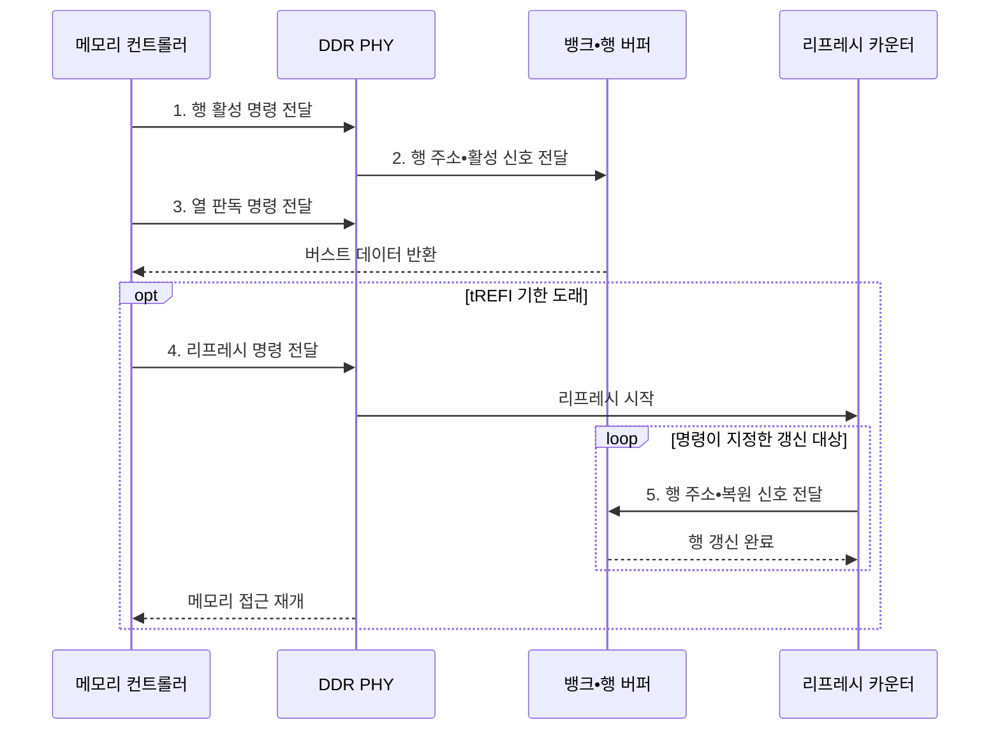

---
sidebar:
  order: 24
  label: "024. DDR SDRAM과 리프레시 방식 (DDR SDRAM Refresh)"
  badge:
    text: "기출 • 50%"
    variant: note
title: "DDR SDRAM과 리프레시 방식 (DDR SDRAM Refresh)"
date: "2026-08-03T08:48:47+09:00"
tags:
  - "notes-hardware"
weight: 24
extra:
  question_no: "024"
  source_status: "기출"
  source_history: "129회"
  priority: 50
  priority_note: "뱅크 병렬성•리프레시 차단 비교"
---

## Ⅰ. 개요

핵심 용어

- **두 배 데이터율 동기식 동적 임의 접근 메모리(Double Data Rate Synchronous Dynamic Random-Access Memory, DDR SDRAM)**: 클록 상승•하강 엣지에서 데이터를 전송하고 주기적으로 전하를 복원하는 메모리
- **동적 임의 접근 메모리(Dynamic Random-Access Memory, DRAM)**: 셀 전하로 비트를 저장해 주기적인 복원이 필요한 휘발성 메모리
- **전하 누설**: DRAM 셀의 저장 전하가 시간이 지나며 줄어 데이터 보존을 위해 복원이 필요한 현상

- 정의/개념: 양 엣지 전송과 주기적 전하 복원을 쓰는 **DRAM 규격**
- 배경/필요성: 단일 에지 전송과 **전하 누설** 보완

#### 한줄 요약

- DDR은 양 에지 전송으로 대역폭을 높이고 리프레시로 누설 전하를 복원한다.

## Ⅱ. 특징

핵심 용어

- **양 엣지 전송**: 한 클록 주기의 상승과 하강 순간 모두에 데이터를 전달하는 방식
- **뱅크 병렬성**: 독립 셀 배열과 행 버퍼를 가진 여러 뱅크가 접근을 겹쳐 수행하는 성질
- **버스트 전송**: 열 명령 한 번으로 연속 데이터를 여러 엣지에 걸쳐 보내는 방식
- **두 배 데이터율(Double Data Rate, DDR)**: 클록의 상승•하강 엣지 모두에서 데이터를 전송하는 방식
- **리프레시**: 누설되는 셀 전하를 보충하기 위해 메모리 행을 주기적으로 읽고 복원하는 동작

- **클록 양 에지** 전송으로 핀당 대역폭 배증
- **뱅크 병렬성•버스트 전송** 기반 연속 처리량 확대
- 누설 전하를 메우는 주기적 **리프레시** 강제

#### 한줄 요약

- DDR은 양 에지 전송과 뱅크 병렬성으로 처리량을 높이지만, 리프레시 동안 일부 또는 전체 접근이 제한된다.

## Ⅲ. 구조 및 구성요소

핵심 용어

- **메모리 컨트롤러**: 주소를 채널•랭크•뱅크•행•열로 나누고 접근과 리프레시 순서를 조정하는 회로
- **두 배 데이터율 물리 계층(Double Data Rate Physical Layer, DDR PHY)**: 컨트롤러 명령과 데이터를 메모리 버스의 전기 신호로 변환하는 회로
- **데이터 입출력(Data Input/Output, DQ)•데이터 스트로브(Data Strobe, DQS)**: 실제 데이터 비트를 운반하고 수신기의 샘플링 시점을 알려 주는 신호
- **행 버퍼**: 활성화한 행 전체를 보관하며 감지와 복원을 수행하는 회로

| 구성요소 | 책임 |
|:---|:---|
| 메모리 컨트롤러 | 주소 매핑•**명령 순서** 조정 |
| DDR 채널•PHY | 명령•DQ•DQS **신호 변환** |
| 뱅크•행 버퍼 | 행•열 접근과 **전하 복원** |
| 리프레시 카운터 | 갱신 대상 **행 순환 지정** |

#### 한줄 요약

- 컨트롤러와 PHY가 명령을 전달하고 뱅크와 카운터가 데이터 접근과 전하 복원을 수행한다.

## Ⅳ. 흐름도

핵심 용어

- **행 활성(Activate, ACT)•프리차지(Precharge, PRE)**: 대상 행을 열고 다음 행 접근 전에 현재 행을 닫는 DDR 명령
- **리프레시 간격(Refresh Interval, tREFI)**: 연속 리프레시 명령 사이에 허용되는 평균 시간 간격
- **리프레시 주기 시간(Refresh Cycle Time, tRFC)**: 리프레시 수행으로 메모리 접근이 제한되는 시간
- **두 배 데이터율 물리 계층(Double Data Rate Physical Layer, DDR PHY)**: 컨트롤러와 메모리 사이의 명령•주소•데이터 신호를 전달하는 회로

**동작 원리**

- **1. 행 활성 명령 전달**: 대상 행 지정
- **2. 행 주소•활성 신호 전달**: 대상 행을 행 버퍼로 개방
- **3. 열 판독 명령 전달**: 출력 열 지정
- **4. 리프레시 명령 전달**: tREFI 기한 내 발행
- **5. 행 주소•복원 신호 전달**: 순환 대상 행의 전하 갱신

#### 한줄 요약

- 컨트롤러는 보존 기한과 접근 일정을 보고 리프레시 시점을 정하고, 장치 내부 카운터는 다음에 복원할 행을 골라 모든 행이 기한 안에 순환하도록 역할을 나눈다

## Ⅴ. 종류 및 비교

핵심 용어

- **전체 뱅크 리프레시**: 명령 하나로 랭크의 모든 뱅크를 함께 갱신하는 방식
- **뱅크별 리프레시**: 대상 뱅크만 갱신하고 나머지 뱅크의 접근을 허용하는 방식
- **자체 리프레시**: 절전 상태에서 메모리가 내부 타이머로 스스로 전하를 복원하는 방식
- **리프레시 주기 시간(Refresh Cycle Time, tRFC)**: 전체 뱅크 리프레시 동안 랭크 접근이 차단되는 시간

| 리프레시 방식 | 전체 뱅크 | 뱅크별 | 자체 리프레시 |
|:---|:---|:---|:---|
| 적용 기준 | **접근이 한산한 구간** | **지연 민감 요청** 이 지속되는 구간 | **절전 대기** 로 진입할 때 |
| 핵심 특징 | 명령 하나로 **전 뱅크 동시** 갱신 | 대상 **뱅크만 선택** 갱신 | **내부 타이머** 기반 자율 갱신 |
| 한계 | **tRFC** 동안 랭크 전체 차단 | 갱신 횟수 증가로 명령 대역 소모 | 외부 접근 **전면 차단** |

> 요약: 전체 갱신의 **랭크 차단** 을 뱅크별 갱신이 범위 축소로 완화

#### 한줄 요약

- 전체 뱅크 방식은 랭크를 차단하고, 뱅크별 방식은 차단 범위를 줄이며, 자체 방식은 절전 중 내부 타이머로 갱신한다.

## Ⅵ. 실무 고려사항 및 대책

핵심 용어

- **꼬리 지연**: 일부 요청이 리프레시 차단과 겹쳐 평균보다 크게 늦어지는 응답 시간
- **행 적중**: 이미 활성화된 행에서 열만 선택해 ACT•PRE 비용을 피하는 접근
- **행 활성(Activate, ACT)•프리차지(Precharge, PRE)**: 행을 열고 닫는 명령으로 행 미적중 때 추가 지연을 만든다.
- **물리 계층 트레이닝(Physical Layer Training, PHY 트레이닝)**: 데이터 입출력(Data Input/Output, DQ)과 데이터 스트로브(Data Strobe, DQS)의 지연을 보정해 고속 샘플링 시점을 맞추는 절차

| 문제 | 대책 | 효과 |
|:---|:---|:---|
| 전체 갱신의 **꼬리 지연** | **뱅크별•한산 구간** 실행 | **접근 중단** 분산 |
| 행 미적중의 **ACT•PRE 증가** | **주소 매핑•요청 재정렬** | **처리량** 증가 |
| 고온의 **보존 시간 단축** | **온도별 리프레시 주기** | **데이터 보존** 확보 |
| 고속 **DQ•DQS 마진 감소** | **PHY 트레이닝**•오류 감시 | **신호 무결성** 유지 |

#### 한줄 요약

- 응답 시간의 꼬리가 중요한 서비스에서는 랭크 전체가 수백 나노초 멈추는 순간이 그대로 최악 지연으로 찍히므로, 한 번에 한 뱅크만 세워 멈춤을 잘게 쪼개 흩뿌린다

## Ⅶ. 결론

핵심 용어

- **지연 민감 구간**: 리프레시로 인한 일시 중단이 서비스 응답 목표를 위반할 수 있는 처리 구간
- **절전 대기**: 외부 접근이 없는 동안 컨트롤러와 클록을 멈추고 메모리만 데이터를 보존하는 상태

- 지연 민감은 **뱅크별**, 절전 대기는 **자체 리프레시** 선택

#### 한줄 요약

- 갱신 방식은 성능 좋은 순서가 있는 것이 아니라 지금 무엇을 지키려는지로 갈리므로, 응답이 튀면 안 되는 구간에서는 멈춤을 잘게 쪼개고 아무도 안 쓰는 구간에서는 통째로 재워 전력을 아낀다
