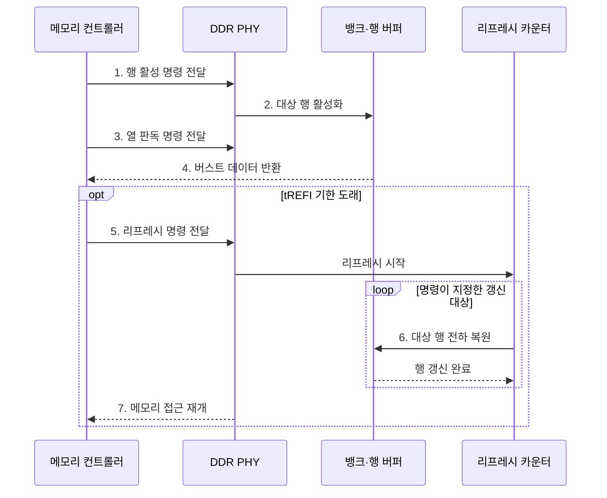

---
sidebar:
  order: 24
  label: "024. DDR SDRAM과 리프레시 방식 (DDR SDRAM Refresh)"
  badge:
    text: "기출 · 50%"
    variant: note
title: "DDR SDRAM과 리프레시 방식 (DDR SDRAM Refresh)"
date: "2026-07-29T01:16:00+09:00"
tags:
  - "notes-hardware"
weight: 24
extra:
  question_no: "024"
  source_status: "기출"
  source_history: "129회"
  priority: 50
  priority_note: "뱅크 병렬성·리프레시 차단 비교"
---

## 미리 알고가기

- **DDR SDRAM(Double Data Rate Synchronous Dynamic Random-Access Memory)**: 클록의 상승·하강 에지에서 데이터를 전송하고 주기적으로 전하를 복원하는 동기식 DRAM이다
- **클록 에지(Clock Edge)**: 클록 신호가 올라가거나 내려가는 전환 순간이며, DDR은 이 두 순간 모두에서 데이터를 실어 보낸다
- **버스트 전송(Burst Transfer)**: 열 명령 한 번에 연속된 데이터를 여러 에지에 걸쳐 몰아 보내 명령 발행 횟수를 줄이는 방식
- **뱅크(Bank)**: 독립된 셀 배열과 행 버퍼를 갖는 접근 단위이며, 서로 다른 뱅크는 동시에 다른 행을 열어 둘 수 있다
- **행 버퍼(Row Buffer)**: 활성화한 행 전체를 담아 두고 감지·복원을 수행하는 회로이며, 같은 행을 다시 읽으면 여기서 바로 나온다
- **행 활성화(Activate, ACT)**: 대상 메모리 행의 데이터를 행 버퍼로 여는 DDR 명령
- **읽기·쓰기 명령(Read·Write, RD/WR)**: 활성화된 행에서 선택한 열의 데이터를 읽거나 쓰는 DDR 명령
- **프리차지(Precharge, PRE)**: 열린 행을 닫고 비트라인을 다음 행 접근이 가능한 상태로 복원하는 DDR 명령
- **데이터 입출력(DQ)·데이터 스트로브(DQS)**: DQ는 데이터를 전달하고 DQS는 양 에지로 데이터 수신 시점을 동기화하는 DDR 신호
- **물리 계층(Physical Layer, PHY)**: 명령·주소·데이터를 DDR 전기 신호로 변환하고 신호 타이밍을 보정하는 계층
- **메모리 컨트롤러(Memory Controller)**: 물리 주소를 채널·랭크·뱅크·행·열로 나누고 접근 명령과 리프레시 기한의 순서를 조정하는 회로
- **메모리 채널·랭크(Memory Channel·Rank)**: 컨트롤러와 메모리 사이의 독립 전송 경로가 채널, 같은 명령에 함께 응답하는 칩 묶음이 랭크다
- **리프레시(Refresh, REF)**: DRAM 셀의 누설 전하를 복원하기 위해 행을 주기적으로 갱신하는 명령
- **평균 리프레시 간격(tREFI)**: 연속된 리프레시 명령 사이에 허용되는 평균 시간 간격
- **리프레시 주기 시간(tRFC)**: 리프레시 명령 수행으로 메모리 접근이 제한되는 시간
- **전체 뱅크 리프레시(All-bank Refresh)**: 명령 하나로 모든 뱅크의 해당 행을 한꺼번에 갱신하는 방식
- **뱅크별 리프레시(Per-bank Refresh)**: 규격이 지원하면 대상 뱅크만 갱신해 나머지 뱅크는 계속 쓰게 하는 방식
- **자체 리프레시(Self-refresh)**: 외부 클록과 컨트롤러를 재운 저전력 상태에서 메모리가 내부 타이머로 스스로 갱신하는 방식
- **PHY 트레이닝(PHY Training)**: DQ·DQS 지연을 보정해 데이터 샘플링 시점을 맞추는 초기화 절차
- **타이밍 마진(Timing Margin)**: 신호가 설정·유지 시간을 만족하고 남는 시간 여유

## Ⅰ. 개요

- 정의/개념: 양 에지 전송과 주기적 전하 복원을 쓰는 **DRAM 규격**
- 배경/필요성: 단일 에지 전송과 **전하 누설** 보완

### 쉽게 이해하기 (학습용)

- DDR은 양 에지 전송으로 대역폭을 높이고 리프레시로 누설 전하를 복원한다.

## Ⅱ. 특징

- **클록 양 에지** 전송으로 핀당 대역폭 배증
- **뱅크 병렬성**과 버스트로 연속 처리량 확대
- 누설 전하를 메우는 주기적 **리프레시** 강제

### 쉽게 이해하기 (학습용)

- DDR은 양 에지 전송과 뱅크 병렬성으로 처리량을 높이지만, 리프레시 동안 일부 또는 전체 접근이 제한된다.

## Ⅲ. 구조 및 구성요소

| 구성요소 | 책임 |
|:---|:---|
| 메모리 컨트롤러 | 주소 매핑·**명령 순서** 조정 |
| DDR 채널·PHY | 명령·DQ·DQS **신호 변환** |
| 뱅크·행 버퍼 | 행·열 접근과 **전하 복원** |
| 리프레시 카운터 | 갱신 대상 **행 순환 지정** |

### 쉽게 이해하기 (학습용)

- 컨트롤러와 PHY가 명령을 전달하고 뱅크와 카운터가 데이터 접근과 전하 복원을 수행한다.

## Ⅳ. 흐름도

**동작 원리**

- **1. 행 활성 명령 전달**: 대상 행 지정
- **2. 대상 행 활성화**: 행 버퍼 개방
- **3. 열 판독 명령 전달**: 출력 열 지정
- **4. 버스트 데이터 반환**: 양 에지 전송
- **5. 리프레시 명령 전달**: 기한 내 발행
- **6. 대상 행 전하 복원**: 순환 행 갱신
- **7. 메모리 접근 재개**: tRFC 후 명령 재개

### 쉽게 이해하기 (학습용)

- 컨트롤러는 보존 기한과 접근 일정을 보고 리프레시 시점을 정하고, 장치 내부 카운터는 다음에 복원할 행을 골라 모든 행이 기한 안에 순환하도록 역할을 나눈다

## Ⅴ. 종류 및 비교

| 리프레시 방식 | 전체 뱅크 | 뱅크별 | 자체 리프레시 |
|:---|:---|:---|:---|
| 적용 기준 | 접근이 한산한 일반 동작일 때 | 지연 민감 요청이 끊이지 않을 때 | **절전 대기**로 진입할 때 |
| 핵심 특징 | 명령 하나로 **전 뱅크 동시** 갱신 | 대상 **뱅크만 선택** 갱신 | **내부 타이머** 기반 자율 갱신 |
| 한계 | **tRFC** 동안 랭크 전체 차단 | 갱신 횟수 증가로 명령 대역 소모 | 외부 접근 **전면 차단** |

> 요약: 전체 갱신의 **랭크 차단**을 뱅크별 갱신이 범위 축소로 완화

### 쉽게 이해하기 (학습용)

- 전체 뱅크 방식은 랭크를 차단하고, 뱅크별 방식은 차단 범위를 줄이며, 자체 방식은 절전 중 내부 타이머로 갱신한다.

## Ⅵ. 실무 고려사항 및 대책

| 고려사항 | 대책 | 효과 |
|:---|:---|:---|
| 전체 갱신의 **꼬리 지연** | 뱅크별·한산 구간 실행 | **접근 중단** 분산 |
| 행 미적중의 **ACT·PRE 증가** | 주소 매핑·요청 재정렬 | **처리량** 증가 |
| 고온의 **보존 시간 단축** | 온도별 리프레시 주기 | **데이터 보존** 확보 |
| 고속 DQ·DQS의 **마진 감소** | PHY 트레이닝·오류 감시 | **신호 무결성** 유지 |

### 쉽게 이해하기 (학습용)

- 응답 시간의 꼬리가 중요한 서비스에서는 랭크 전체가 수백 나노초 멈추는 순간이 그대로 최악 지연으로 찍히므로, 한 번에 한 뱅크만 세워 멈춤을 잘게 쪼개 흩뿌린다

## Ⅶ. 결론

- **꼬리 지연·접근률·온도·대기 전력** 기반 선택

### 쉽게 이해하기 (학습용)

- 갱신 방식은 성능 좋은 순서가 있는 것이 아니라 지금 무엇을 지키려는지로 갈리므로, 응답이 튀면 안 되는 구간에서는 멈춤을 잘게 쪼개고 아무도 안 쓰는 구간에서는 통째로 재워 전력을 아낀다
