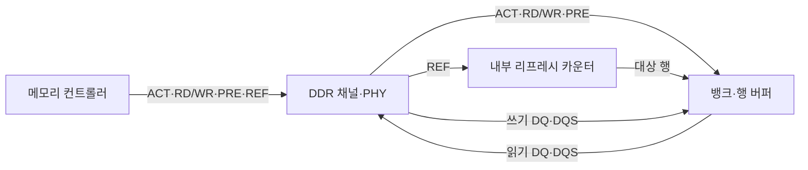
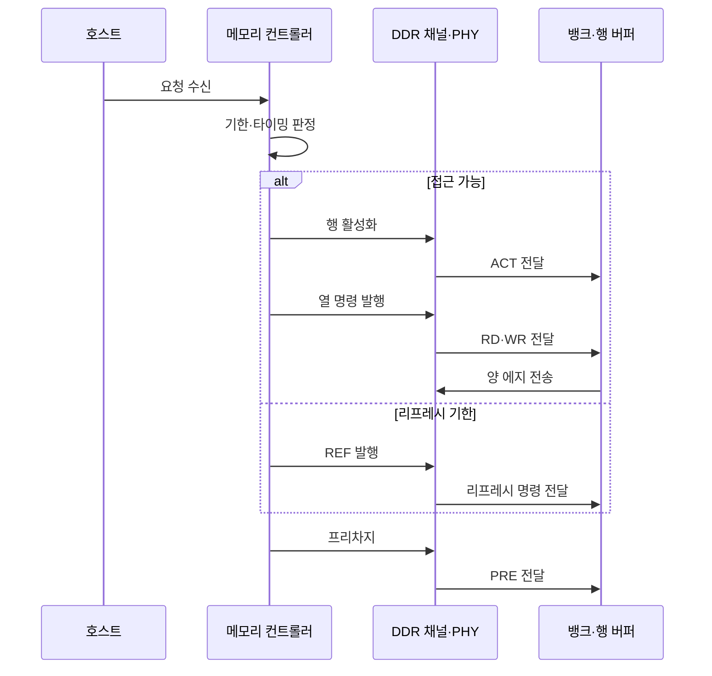

---
sidebar:
  order: 24
  label: "024. DDR SDRAM과 리프레시 방식 (DDR SDRAM Refresh)"
  badge:
    text: "기출 · 50%"
    variant: note
title: "DDR SDRAM과 리프레시 방식 (DDR SDRAM Refresh)"
date: "2026-07-27T23:59:59+09:00"
tags:
  - "notes-hardware"
weight: 24
extra:
  question_no: "024"
  source_status: "기출"
  source_history: "129회"
  priority: 50
  priority_note: "뱅크 병렬성·리프레시 차단 비교"
---

## 미리 알고가기

- **DDR SDRAM(Double Data Rate Synchronous Dynamic Random-Access Memory)**: ‘디디알 에스디램’으로 읽고 영문 머리글자를 딴 약어이며, 클록 양 에지 전송과 주기적 전하 복원을 사용하는 동기식 DRAM이다
- **클록 에지(Clock Edge)**: 클록 신호가 올라가거나 내려가는 전환 순간이며, DDR은 이 두 순간 모두에서 데이터를 실어 보낸다
- **버스트 전송(Burst Transfer)**: 열 명령 한 번에 연속된 데이터를 여러 에지에 걸쳐 몰아 보내 명령 발행 횟수를 줄이는 방식
- **뱅크(Bank)**: 독립된 셀 배열과 행 버퍼를 갖는 접근 단위이며, 서로 다른 뱅크는 동시에 다른 행을 열어 둘 수 있다
- **행 버퍼(Row Buffer)**: 활성화한 행 전체를 담아 두고 감지·복원을 수행하는 회로이며, 같은 행을 다시 읽으면 여기서 바로 나온다
- **행 활성화(Activate, ACT)**: ‘에이씨티’로 읽고 Activate를 줄인 표기이며, 대상 행을 행 버퍼로 여는 명령이다
- **읽기·쓰기 명령(Read·Write, RD/WR)**: ‘알디·더블유알’로 읽고 각 영문을 줄여 빗금으로 구분한 표기이며, 열린 행의 열 데이터를 읽거나 쓰는 명령이다
- **프리차지(Precharge, PRE)**: ‘피알이’로 읽고 Precharge를 줄인 표기이며, 열린 행을 닫고 비트라인을 다음 접근 상태로 되돌리는 명령이다
- **데이터 입출력(DQ)·데이터 스트로브(DQS)**: ‘디큐·디큐에스’로 읽는 DDR 표준 신호명이며, DQ로 데이터를 보내고 DQS 양 에지로 수신 시점을 맞춘다
- **물리 계층(Physical Layer, PHY)**: ‘파이’로 읽고 Physical을 줄인 표기이며, 명령·주소·데이터를 DDR 전기 신호로 변환하고 타이밍을 맞춘다
- **메모리 컨트롤러(Memory Controller)**: 물리 주소를 채널·랭크·뱅크·행·열로 나누고 접근 명령과 리프레시 기한의 순서를 조정하는 회로
- **메모리 채널·랭크(Memory Channel·Rank)**: 컨트롤러와 메모리 사이의 독립 전송 경로가 채널, 같은 명령에 함께 응답하는 칩 묶음이 랭크다
- **리프레시(Refresh, REF)**: ‘알이에프’로 읽고 Refresh를 줄인 표기이며, 누설 전하를 복원하려고 행을 주기적으로 갱신하는 명령이다
- **평균 리프레시 간격(tREFI)**: ‘티 레피’로 읽고 시간의 t와 Refresh Interval을 결합한 표기이며, 리프레시 명령 사이의 평균 허용 시간이다
- **리프레시 주기 시간(tRFC)**: ‘티 알에프씨’로 읽고 시간의 t와 Refresh Cycle을 결합한 표기이며, 리프레시 동안 접근이 차단되는 시간이다
- **전체 뱅크 리프레시(All-bank Refresh)**: 명령 하나로 모든 뱅크의 해당 행을 한꺼번에 갱신하는 방식
- **뱅크별 리프레시(Per-bank Refresh)**: 규격이 지원하면 대상 뱅크만 갱신해 나머지 뱅크는 계속 쓰게 하는 방식
- **자체 리프레시(Self-refresh)**: 외부 클록과 컨트롤러를 재운 저전력 상태에서 메모리가 내부 타이머로 스스로 갱신하는 방식

## Ⅰ. 개요

- 정의/개념: **클록 양 에지** 전송과 주기적 전하 복원을 병행하는 DRAM 규격
- 기존 한계: 단일 에지 전송과 전하 누설로 **대역폭·보존 시간** 동시 제약

### 쉽게 이해하기 (학습용)

- 시계 한 박자에 짐을 한 번만 실으면 시계를 아무리 빨리 돌려도 신호가 흐트러져 한계에 닿고 그렇다고 셀을 그냥 두면 물이 새어 값이 지워지는데, 답안이 배경 자리에 이 두 제약을 함께 적은 이유는 이 규격이 대역폭 기술과 보존 기술을 한 몸에 묶어 놓은 이름이기 때문이다

## Ⅱ. 특징

- **클록 양 에지** 전송으로 핀당 대역폭 배증
- **뱅크 병렬성**과 버스트로 연속 처리량 확대
- 누설 전하를 메우는 주기적 **리프레시** 강제

### 쉽게 이해하기 (학습용)

- 앞 두 줄이 더 나르는 이야기이고 마지막 줄이 반드시 멈추는 이야기라는 대비가 이 주제의 전부인데, 시계 한 박자에 두 번 싣고 여러 뱅크를 번갈아 열어 쉬는 틈을 메워도 정해진 기한이 오면 하던 일을 멈추고 물부터 채워야 하므로 표에 적힌 속도와 실제로 나른 양은 늘 벌어진다

## Ⅲ. 아키텍처 및 구성요소

| 설계 요소 | 설명 |
|:---|:---|
| 메모리 컨트롤러 | 주소 매핑·타이밍과 **리프레시 기한** 조정 |
| DDR 채널·PHY | 명령·주소 전달과 **DQ·DQS** 신호 변환 |
| 뱅크·행 버퍼 | **행 활성화**·열 접근과 전하 복원 수행 |
| 내부 리프레시 카운터 | **REF** 수신마다 갱신 대상 행 지정 |

> 요약: 컨트롤러는 리프레시 시점을 정하고 **내부 카운터**는 대상 행 결정

### 쉽게 이해하기 (학습용)

- 컨트롤러는 보존 기한과 접근 일정을 보고 리프레시 시점을 정하고, 장치 내부 카운터는 다음에 복원할 행을 골라 모든 행이 기한 안에 순환하도록 역할을 나눈다

## Ⅳ. 원리 및 절차 흐름도

| 절차 | 설명 |
|:---|:---|
| 요청 수신 | 물리 주소의 **채널·랭크·뱅크·행·열** 매핑 |
| 기한·타이밍 판정 | **tREFI** 잔여와 명령 간 타이밍 제약 확인 |
| 행 활성화 | 행 미적중 시 **ACT**로 대상 행 개방 |
| ACT 전달 | PHY가 행 활성화 명령을 뱅크에 전달 |
| 열 명령 발행 | 열린 행에 **RD·WR** 버스트 명령 전달 |
| RD·WR 전달 | PHY가 열 접근 명령을 뱅크에 전달 |
| 양 에지 전송 | **DQS** 양 에지 기준 DQ 데이터 송수신 |
| REF 발행 | 기한 도달 시 **행 전하 복원** 지시 |
| 리프레시 명령 전달 | PHY가 리프레시 명령을 뱅크에 전달 |
| 프리차지 | 다음 행 개방을 위한 **행 닫기** |
| PRE 전달 | PHY가 프리차지 명령을 뱅크에 전달 |

> 요약: 접근과 리프레시가 **같은 명령 버스**를 두고 순서 경쟁

### 쉽게 이해하기 (학습용)

- 두 갈래가 하나의 컨트롤러에서 나와 같은 뱅크로 들어간다는 배치가 성능 손실의 원인인데, 갱신 명령과 데이터 명령이 같은 통로를 쓰므로 갱신이 도는 동안에는 아무리 급한 읽기라도 뒤에서 기다려야 하고 그 기다림이 tRFC만큼 통째로 쌓인다

## Ⅴ. 종류 및 비교

| 리프레시 방식 | 전체 뱅크 리프레시 | 뱅크별 리프레시 | 자체 리프레시 |
|:---|:---|:---|:---|
| 적용 기준 | 접근이 한산한 일반 동작일 때 | 지연 민감 요청이 끊이지 않을 때 | **절전 대기**로 진입할 때 |
| 핵심 특징 | 명령 하나로 **전 뱅크 동시** 갱신 | 대상 **뱅크만 선택** 갱신 | **내부 타이머** 기반 자율 갱신 |
| 한계 | **tRFC** 동안 랭크 전체 차단 | 갱신 횟수 증가로 명령 대역 소모 | 외부 접근 **전면 차단** |

> 요약: 전체 갱신의 **랭크 차단**을 뱅크별 갱신이 범위 축소로 완화

### 쉽게 이해하기 (학습용)

- 세 방식이 차단 범위를 점점 좁히거나 아예 통째로 재우는 쪽으로 갈린다는 것이 표의 요지인데, 랭크를 통으로 세우면 그동안 모든 요청이 멈추고 뱅크만 세우면 나머지 뱅크는 계속 응답하지만 명령을 그만큼 자주 보내야 하며, 어차피 아무도 안 쓰는 대기 상태라면 통째로 재우고 스스로 채우게 두는 편이 전력에 이득이다

## Ⅵ. 실무 사례

1. 지연 민감 서버는 **뱅크별 리프레시**로 접근 중단 분산
2. 모바일 절전 모드는 **자체 리프레시**로 데이터 보존

### 쉽게 이해하기 (학습용)

- 응답 시간의 꼬리가 중요한 서비스에서는 랭크 전체가 수백 나노초 멈추는 순간이 그대로 최악 지연으로 찍히므로, 한 번에 한 뱅크만 세워 멈춤을 잘게 쪼개 흩뿌린다
- 화면이 꺼진 휴대폰은 메모리 내용을 지울 수 없지만 컨트롤러와 외부 클록을 계속 돌릴 이유도 없으므로, 그 둘을 재우고 메모리가 자기 타이머로만 물을 채우게 둔다

## Ⅶ. 결론

- 지연 꼬리는 **뱅크별**, 대기 전력은 **자체 리프레시** 선택

### 쉽게 이해하기 (학습용)

- 갱신 방식은 성능 좋은 순서가 있는 것이 아니라 지금 무엇을 지키려는지로 갈리므로, 응답이 튀면 안 되는 구간에서는 멈춤을 잘게 쪼개고 아무도 안 쓰는 구간에서는 통째로 재워 전력을 아낀다
