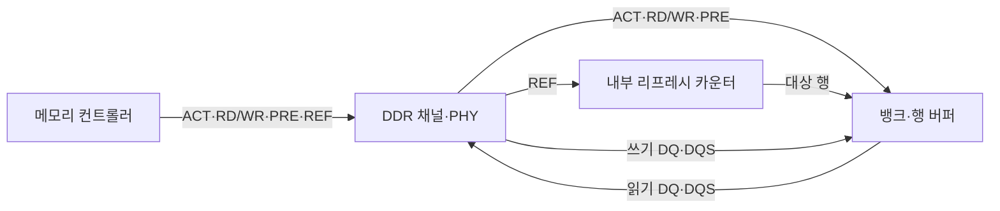
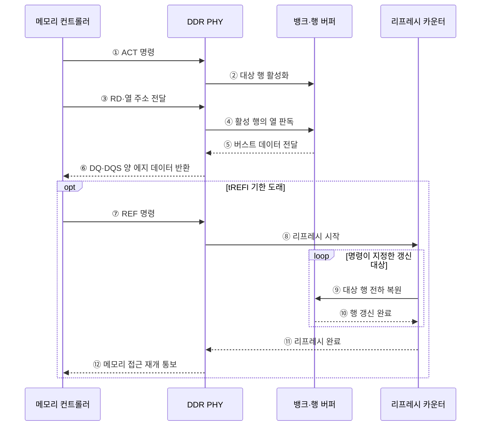

---
sidebar:
  order: 24
  label: "024. DDR SDRAM과 리프레시 방식 (DDR SDRAM Refresh)"
  badge:
    text: "기출 · 50%"
    variant: note
title: "DDR SDRAM과 리프레시 방식 (DDR SDRAM Refresh)"
date: "2026-07-29T01:16:00+09:00"
tags:
  - "notes-hardware"
weight: 24
extra:
  question_no: "024"
  source_status: "기출"
  source_history: "129회"
  priority: 50
  priority_note: "뱅크 병렬성·리프레시 차단 비교"
---

## 미리 알고가기

- **DDR SDRAM(Double Data Rate Synchronous Dynamic Random-Access Memory)**: 클록의 상승·하강 에지에서 데이터를 전송하고 주기적으로 전하를 복원하는 동기식 DRAM이다
- **클록 에지(Clock Edge)**: 클록 신호가 올라가거나 내려가는 전환 순간이며, DDR은 이 두 순간 모두에서 데이터를 실어 보낸다
- **버스트 전송(Burst Transfer)**: 열 명령 한 번에 연속된 데이터를 여러 에지에 걸쳐 몰아 보내 명령 발행 횟수를 줄이는 방식
- **뱅크(Bank)**: 독립된 셀 배열과 행 버퍼를 갖는 접근 단위이며, 서로 다른 뱅크는 동시에 다른 행을 열어 둘 수 있다
- **행 버퍼(Row Buffer)**: 활성화한 행 전체를 담아 두고 감지·복원을 수행하는 회로이며, 같은 행을 다시 읽으면 여기서 바로 나온다
- **행 활성화(Activate, ACT)**: 대상 메모리 행의 데이터를 행 버퍼로 여는 DDR 명령
- **읽기·쓰기 명령(Read·Write, RD/WR)**: 활성화된 행에서 선택한 열의 데이터를 읽거나 쓰는 DDR 명령
- **프리차지(Precharge, PRE)**: 열린 행을 닫고 비트라인을 다음 행 접근이 가능한 상태로 복원하는 DDR 명령
- **데이터 입출력(DQ)·데이터 스트로브(DQS)**: DQ는 데이터를 전달하고 DQS는 양 에지로 데이터 수신 시점을 동기화하는 DDR 신호
- **물리 계층(Physical Layer, PHY)**: 명령·주소·데이터를 DDR 전기 신호로 변환하고 신호 타이밍을 보정하는 계층
- **메모리 컨트롤러(Memory Controller)**: 물리 주소를 채널·랭크·뱅크·행·열로 나누고 접근 명령과 리프레시 기한의 순서를 조정하는 회로
- **메모리 채널·랭크(Memory Channel·Rank)**: 컨트롤러와 메모리 사이의 독립 전송 경로가 채널, 같은 명령에 함께 응답하는 칩 묶음이 랭크다
- **리프레시(Refresh, REF)**: DRAM 셀의 누설 전하를 복원하기 위해 행을 주기적으로 갱신하는 명령
- **평균 리프레시 간격(tREFI)**: 연속된 리프레시 명령 사이에 허용되는 평균 시간 간격
- **리프레시 주기 시간(tRFC)**: 리프레시 명령 수행으로 메모리 접근이 제한되는 시간
- **전체 뱅크 리프레시(All-bank Refresh)**: 명령 하나로 모든 뱅크의 해당 행을 한꺼번에 갱신하는 방식
- **뱅크별 리프레시(Per-bank Refresh)**: 규격이 지원하면 대상 뱅크만 갱신해 나머지 뱅크는 계속 쓰게 하는 방식
- **자체 리프레시(Self-refresh)**: 외부 클록과 컨트롤러를 재운 저전력 상태에서 메모리가 내부 타이머로 스스로 갱신하는 방식
- **PHY 트레이닝(PHY Training)**: DQ·DQS 지연을 보정해 데이터 샘플링 시점을 맞추는 초기화 절차
- **타이밍 마진(Timing Margin)**: 신호가 설정·유지 시간을 만족하고 남는 시간 여유

## Ⅰ. 개요

- 정의/개념: **클록 양 에지** 전송과 주기적 전하 복원을 병행하는 DRAM 규격
- 기존 한계: 단일 에지 전송과 전하 누설로 **대역폭·보존 시간** 동시 제약

### 쉽게 이해하기 (학습용)

- 시계 한 박자에 짐을 한 번만 실으면 시계를 아무리 빨리 돌려도 신호가 흐트러져 한계에 닿고 그렇다고 셀을 그냥 두면 물이 새어 값이 지워지는데, 답안이 배경 자리에 이 두 제약을 함께 적은 이유는 이 규격이 대역폭 기술과 보존 기술을 한 몸에 묶어 놓은 이름이기 때문이다

## Ⅱ. 특징

- **클록 양 에지** 전송으로 핀당 대역폭 배증
- **뱅크 병렬성**과 버스트로 연속 처리량 확대
- 누설 전하를 메우는 주기적 **리프레시** 강제

### 쉽게 이해하기 (학습용)

- 앞 두 줄이 더 나르는 이야기이고 마지막 줄이 반드시 멈추는 이야기라는 대비가 이 주제의 전부인데, 시계 한 박자에 두 번 싣고 여러 뱅크를 번갈아 열어 쉬는 틈을 메워도 정해진 기한이 오면 하던 일을 멈추고 물부터 채워야 하므로 표에 적힌 속도와 실제로 나른 양은 늘 벌어진다

## Ⅲ. 아키텍처

**도표안 A — 구조도**

**도표안 B — DDR 읽기·리프레시 명령 시퀀스**

| 구성요소 | 책임 |
|:---|:---|
| 메모리 컨트롤러 | 주소 매핑·**명령 순서** 조정 |
| DDR 채널·PHY | 명령·DQ·DQS **신호 변환** |
| 뱅크·행 버퍼 | 행·열 접근과 **전하 복원** |
| 리프레시 카운터 | 갱신 대상 **행 순환 지정** |

### 동작 원리

1. **① ACT 명령**: 메모리 컨트롤러는 주소가 가리키는 뱅크와 행을 열도록 DDR PHY에 활성 명령을 전달한다.
2. **② 대상 행 활성화**: PHY는 ACT 신호를 메모리 장치에 전송하고 뱅크는 해당 행을 행 버퍼에 연다.
3. **③ RD·열 주소 전달**: 타이밍 제약을 만족한 뒤 컨트롤러는 활성 행에서 읽을 열 주소와 RD 명령을 보낸다.
4. **④ 활성 행의 열 판독**: PHY를 거친 RD 명령이 뱅크에 도착하면 행 버퍼에서 선택 열 데이터를 고른다.
5. **⑤ 버스트 데이터 전달**: 뱅크는 한 번의 열 명령으로 정해진 길이의 연속 데이터를 PHY에 전달한다.
6. **⑥ DQ·DQS 양 에지 데이터 반환**: PHY는 DQS의 상승·하강 에지에 맞춰 DQ 데이터를 샘플링하고 컨트롤러에 반환한다.
7. **⑦ REF 명령**: 평균 tREFI 기한이 오면 컨트롤러는 일반 접근과 충돌하지 않도록 일정을 정해 리프레시 명령을 발행한다.
8. **⑧ 리프레시 시작**: PHY는 REF 명령을 장치 내부 리프레시 카운터에 전달한다.
9. **⑨ 대상 행 전하 복원**: 내부 카운터는 순환 순서에 따른 행을 선택하고 셀 전하를 다시 감지·복원한다.
10. **⑩ 행 갱신 완료**: 뱅크는 지정된 행의 전하 복원이 끝났음을 내부 카운터에 알린다.
11. **⑪ 리프레시 완료**: 대상 갱신이 끝나면 카운터는 PHY에 리프레시 완료 상태를 전달한다.
12. **⑫ 메모리 접근 재개 통보**: tRFC가 충족되면 PHY는 컨트롤러가 후속 ACT·RD·WR 명령을 보낼 수 있음을 알린다.

> 요약: 컨트롤러는 리프레시 시점을 정하고 **내부 카운터**는 대상 행 결정

### 쉽게 이해하기 (학습용)

- 컨트롤러는 보존 기한과 접근 일정을 보고 리프레시 시점을 정하고, 장치 내부 카운터는 다음에 복원할 행을 골라 모든 행이 기한 안에 순환하도록 역할을 나눈다

## Ⅳ. 종류 및 비교

| 리프레시 방식 | 전체 뱅크 | 뱅크별 | 자체 리프레시 |
|:---|:---|:---|:---|
| 적용 기준 | 접근이 한산한 일반 동작일 때 | 지연 민감 요청이 끊이지 않을 때 | **절전 대기**로 진입할 때 |
| 핵심 특징 | 명령 하나로 **전 뱅크 동시** 갱신 | 대상 **뱅크만 선택** 갱신 | **내부 타이머** 기반 자율 갱신 |
| 한계 | **tRFC** 동안 랭크 전체 차단 | 갱신 횟수 증가로 명령 대역 소모 | 외부 접근 **전면 차단** |

> 요약: 전체 갱신의 **랭크 차단**을 뱅크별 갱신이 범위 축소로 완화

### 쉽게 이해하기 (학습용)

- 세 방식이 차단 범위를 점점 좁히거나 아예 통째로 재우는 쪽으로 갈린다는 것이 표의 요지인데, 랭크를 통으로 세우면 그동안 모든 요청이 멈추고 뱅크만 세우면 나머지 뱅크는 계속 응답하지만 명령을 그만큼 자주 보내야 하며, 어차피 아무도 안 쓰는 대기 상태라면 통째로 재우고 스스로 채우게 두는 편이 전력에 이득이다

## Ⅴ. 실무 고려사항 및 대책

| 고려사항 | 대책 | 효과 |
|:---|:---|:---|
| 전체 갱신의 **꼬리 지연** | 뱅크별·한산 구간 실행 | **접근 중단** 분산 |
| 행 미적중의 **ACT·PRE 증가** | 주소 매핑·요청 재정렬 | **처리량** 증가 |
| 고온의 **보존 시간 단축** | 온도별 리프레시 주기 | **데이터 보존** 확보 |
| 고속 DQ·DQS의 **마진 감소** | PHY 트레이닝·오류 감시 | **신호 무결성** 유지 |

### 쉽게 이해하기 (학습용)

- 응답 시간의 꼬리가 중요한 서비스에서는 랭크 전체가 수백 나노초 멈추는 순간이 그대로 최악 지연으로 찍히므로, 한 번에 한 뱅크만 세워 멈춤을 잘게 쪼개 흩뿌린다

## Ⅵ. 결론

- 데이터 보존을 위해 지연·대기 전력을 검토하여 **리프레시** 활용

### 쉽게 이해하기 (학습용)

- 갱신 방식은 성능 좋은 순서가 있는 것이 아니라 지금 무엇을 지키려는지로 갈리므로, 응답이 튀면 안 되는 구간에서는 멈춤을 잘게 쪼개고 아무도 안 쓰는 구간에서는 통째로 재워 전력을 아낀다
