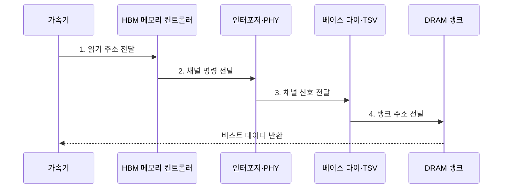

---
sidebar:
  order: 25
  label: "025. HBM 고대역폭 메모리 (High Bandwidth Memory)"
  badge:
    text: "기출 · 85%"
    variant: note
title: "HBM 고대역폭 메모리 (High Bandwidth Memory)"
date: "2026-08-02T10:45:00+09:00"
tags:
  - "notes-hardware"
weight: 25
extra:
  question_no: "025"
  source_status: "기출"
  source_history: "129회, 131회, 137회"
  priority: 85
  priority_note: "반복 기출, 가속기 메모리 병목 핵심"
---

## Ⅰ. 개요

핵심 용어

- **고대역폭 메모리(High Bandwidth Memory, HBM)**: 동적 임의 접근 메모리(Dynamic Random-Access Memory, DRAM) 다이를 수직 적층하고 광폭 인터페이스로 가속기와 연결한 메모리
- **입출력(Input/Output, I/O)**: 메모리와 가속기 사이에서 명령과 데이터를 주고받는 신호 경로
- **메모리 장벽**: 연산 성능보다 데이터 공급 속도가 느려 연산 유닛이 대기하는 병목

- 정의/개념: DRAM 적층과 **광폭 I/O 기반 연결** 을 사용하는 메모리
- 배경/필요성: 연산 유닛 대기를 만드는 **메모리 장벽 완화**

#### 한줄 요약

- HBM은 연산기 옆에 적층 DRAM을 두고 통로 폭을 넓혀 메모리 장벽으로 놀던 가속기에 데이터를 공급한다

## Ⅱ. 특징

핵심 용어

- **채널·뱅크 병렬성**: 독립 전송 경로와 셀 배열에 요청을 분산해 동시 처리하는 성질
- **핀 전송률**: 신호 핀 하나가 초당 전송하는 데이터량
- **실효 대역폭**: 주소 편향과 프로토콜 오버헤드를 반영해 실제 워크로드가 얻는 전송량
- **실리콘 관통 전극(Through-Silicon Via, TSV)**: 적층 다이를 수직으로 관통해 신호와 전력을 전달하는 미세 배선
- **입출력(Input/Output, I/O) 전력**: 메모리 인터페이스에서 신호를 구동하고 수신하는 데 소비되는 전력

- **채널 수·폭·핀 전송률의 곱** 기반 총대역폭
- 짧은 신호 거리와 낮은 I/O 전력을 만드는 **TSV 적층 구조**
- 요청의 **채널•뱅크 균등 분산** 기반 실효 대역폭 확보

$$
Bandwidth_{theoretical} = \frac{N_{channel} \times W_{channel} \times R_{pin}}{8}
$$

> 채널 수·폭·핀 전송률로 이론값 계산

#### 한줄 요약

- 이론 대역폭은 채널 수·폭·핀 전송률의 곱이지만, 요청이 특정 채널에 몰리면 실효 대역폭은 낮아진다

## Ⅲ. 구조 및 구성요소

핵심 용어

- **동적 임의 접근 메모리(Dynamic Random-Access Memory, DRAM) 다이 스택**: 여러 DRAM 칩 층을 수직으로 쌓아 저장 용량과 병렬 채널을 제공하는 구조
- **실리콘 관통 전극(Through-Silicon Via, TSV)·베이스 다이**: 적층 층 사이의 신호·전력을 전달하고 외부 채널로 중계하는 수직 배선과 하단 다이
- **실리콘 인터포저**: 고대역폭 메모리(High Bandwidth Memory, HBM) 스택과 가속기를 짧고 넓은 배선으로 연결하는 패키지 기판

| 구성요소 | 책임 |
|:---|:---|
| DRAM 다이 스택 | 수직 적층 **저장 공간** 제공 |
| TSV·다이 접합 | 층간 **신호·전력 경로** 제공 |
| 베이스 다이 | 채널 신호 **중계·분배** |
| 실리콘 인터포저 | 가속기·스택 **광폭 연결** |

#### 한줄 요약

- TSV는 적층 다이를 연결하고 인터포저는 HBM 스택과 가속기를 광폭으로 연결한다.

## Ⅳ. 흐름도

핵심 용어

- **고대역폭 메모리(High Bandwidth Memory, HBM) 컨트롤러**: 주소를 채널·뱅크로 나누고 병렬 메모리 명령을 스케줄링하는 회로
- **버스트 데이터**: 한 메모리 명령으로 연속해서 반환되는 데이터 묶음
- **광폭 입출력(Wide Input/Output, 광폭 I/O)**: 낮은 핀 속도에서도 많은 배선을 병렬 사용해 총대역폭을 높이는 인터페이스
- **물리 계층(Physical Layer, PHY)**: 디지털 명령과 데이터를 실제 패키지 배선의 전기 신호로 변환하는 회로
- **실리콘 관통 전극(Through-Silicon Via, TSV)**: 베이스 다이와 적층 메모리 뱅크 사이를 수직 연결하는 배선

**동작 원리**

- **1. 읽기 주소 전달**: 주소에서 채널·뱅크 선택
- **2. 채널 명령 전달**: 인터포저 경로 진입
- **3. 채널 신호 전달**: 베이스 다이에서 층간 분배
- **4. 뱅크 주소 전달**: TSV 경로의 대상 뱅크 판독

#### 한줄 요약

- TSV는 적층 다이 사이를 수직 연결하고, 인터포저는 HBM 스택과 가속기를 짧고 넓게 연결한다

## Ⅴ. 종류 및 비교

핵심 용어

- **그래픽 두 배 데이터율 메모리(Graphics Double Data Rate Memory, GDDR)**: 보드의 개별 메모리 칩에서 높은 핀 전송률로 대역폭을 확보하는 그래픽 메모리
- **고대역폭 메모리(High Bandwidth Memory, HBM)**: 적층 다이와 광폭 입출력으로 다채널 병렬 대역폭을 확보하는 메모리
- **입출력(Input/Output, I/O)**: 메모리 칩과 가속기 사이의 데이터 전송 인터페이스
- **적층 수율**: 쌓은 모든 다이와 접합이 정상 동작해 완제품으로 사용할 수 있는 비율
- **신호 무결성**: 잡음과 반사 속에서도 신호가 올바른 전압과 타이밍을 유지하는 성질

| 가속기 메모리 | HBM | GDDR |
|:---|:---|:---|
| 적용 기준 | 전력·면적 안에서 **대역폭** 을 최대로 밀 때 | 용량 대비 **비용** 과 보드 유연성이 앞설 때 |
| 핵심 특징 | 적층·광폭 I/O 기반 **다채널 병렬** | 개별 칩의 **고속 핀 전송** 과 칩 수 확장 |
| 한계 | 패키지·발열 비용을 높이는 **적층 수율 부담** | 핀 속도 상승 시 **신호 무결성** 유지 부담 |

> 요약: HBM은 패키지, GDDR은 신호 부담

#### 한줄 요약

- HBM은 넓은 통로의 패키지·수율 비용을, GDDR은 빠른 핀의 전력·신호 무결성 비용을 부담한다

## Ⅵ. 실무 고려사항 및 대책

핵심 용어

- **채널 포화**: 주소 요청이 일부 채널에 몰려 다른 채널이 놀고 전체 대역폭이 제한되는 상태
- **열 스로틀링**: 온도 한계를 지키려고 메모리나 가속기의 동작 속도를 낮추는 제어
- **양품 다이·예비 경로**: 적층 전 검사한 정상 다이와 결함 배선을 우회할 여분 경로
- **오류 정정 코드(Error-Correcting Code, ECC)**: 추가 검사 비트로 메모리 전송 오류를 검출하고 정정하는 기법

| 문제 | 대책 | 효과 |
|:---|:---|:---|
| 주소 편향의 **채널 포화** | 주소·데이터의 **채널 분산** | **실효 대역폭** 향상 |
| 적층 내부의 **열 집중** | 온도 감시·**액체 냉각** | **지속 처리량** 유지 |
| 다이·접합의 **수율 저하** | **양품 다이·예비 경로** 적용 | **패키지 수율** 개선 |
| 채널 오류의 **연산 전파** | ECC 기반 정정과 **오류 격리** | **데이터 신뢰성** 확보 |

#### 한줄 요약

- AI 학습처럼 데이터를 계속 공급해야 하는 작업은 HBM의 광폭 경로로 연산 유닛의 대기를 줄인다

## Ⅶ. 결론

핵심 용어

- **대역폭 집약 워크로드**: 연산량보다 메모리 데이터 이동량이 성능을 제한하는 작업
- **패키지·냉각 비용**: 적층 메모리 조립과 집중 발열을 처리하기 위해 추가되는 제조·운영 비용
- **고대역폭 메모리(High Bandwidth Memory, HBM)**: 적층·광폭 연결 비용을 감수하고 높은 메모리 대역폭을 제공하는 메모리

- 대역폭 이득이 적층·냉각 비용을 넘으면 **HBM** 적용

#### 한줄 요약

- 실효 처리량 이득이 적층·냉각 비용을 넘는 대역폭 집약 워크로드에 HBM을 적용한다
