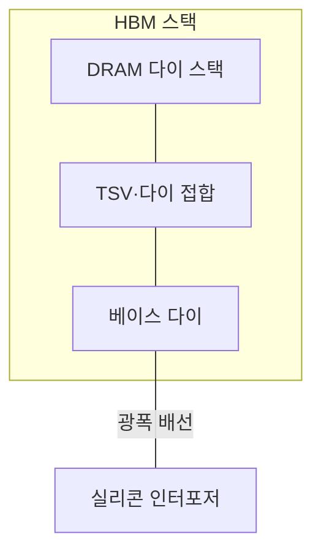
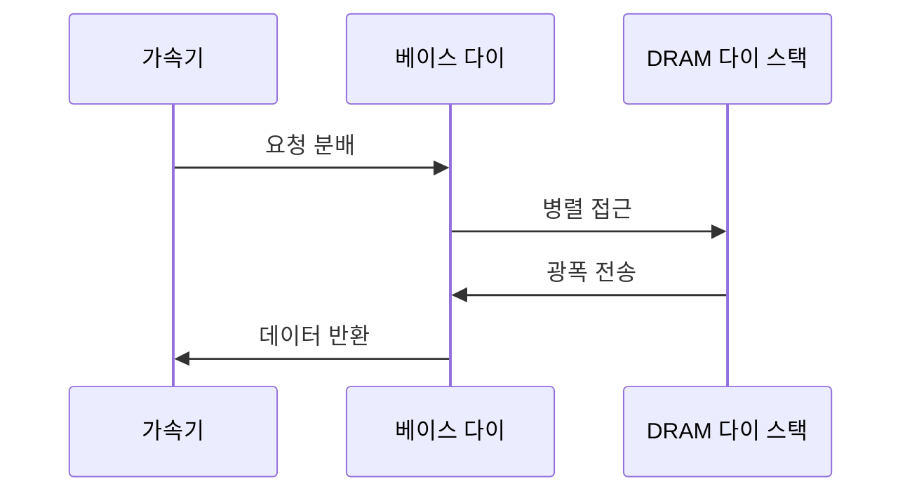

---
sidebar:
  order: 25
  label: "025. HBM 고대역폭 메모리 (High Bandwidth Memory)"
  badge:
    text: "기출 · 85%"
    variant: note
title: "HBM 고대역폭 메모리 (High Bandwidth Memory)"
date: "2026-07-27T23:59:59+09:00"
tags:
  - "notes-hardware"
weight: 25
extra:
  question_no: "025"
  source_status: "기출"
  source_history: "129회, 131회, 137회"
  priority: 85
  priority_note: "반복 기출, 가속기 메모리 병목 핵심"
---

## 미리 알고가기

- **고대역폭 메모리(High Bandwidth Memory, HBM)**: ‘에이치비엠’으로 읽고 영문 머리글자를 딴 약어이며, DRAM 다이를 적층하고 광폭 인터페이스로 가속기와 연결한 메모리다
- **동적 랜덤 접근 메모리(Dynamic Random-Access Memory, DRAM)**: ‘디램’으로 읽고 영문 머리글자를 단어처럼 읽는 약어이며, 커패시터 전하로 비트를 저장하는 메모리다
- **메모리 장벽(Memory Wall)**: 연산 성능은 계속 오르는데 메모리가 데이터를 그만큼 못 실어 날라 연산기가 놀게 되는 병목
- **다이·스택(Die·Stack)**: 웨이퍼에서 잘라 낸 개별 칩이 다이, 그 다이를 수직으로 여러 장 쌓은 묶음이 스택이다
- **실리콘 관통 전극(Through-Silicon Via, TSV)**: ‘티에스브이’로 읽고 영문 머리글자를 딴 약어이며, 적층 다이를 관통해 층 사이를 잇는 수직 배선이다
- **베이스 다이(Base Die)**: 스택 맨 아래에서 채널과 신호를 정리해 바깥으로 중계하는 층
- **실리콘 인터포저(Silicon Interposer)**: 스택과 가속기를 한 받침 위에 올려 놓고 그 사이를 수천 가닥으로 잇는 광폭 배선 기판
- **채널·뱅크(Channel·Bank)**: 서로 독립적으로 명령을 받는 전송 경로가 채널, 그 안에서 동시에 열 수 있는 셀 배열이 뱅크다
- **핀 전송률(Pin Data Rate)**: 신호 핀 하나가 초당 나르는 데이터량이며, 총대역폭은 채널 수와 채널 폭과 이 값의 곱으로 정해진다
- **입출력(Input/Output, I/O)**: ‘아이오’로 읽고 입력·출력의 영문 머리글자를 빗금으로 구분한 표기이며, 스택과 가속기 사이의 명령·주소·데이터 전송이다
- **신호 무결성(Signal Integrity)**: 잡음과 반사 속에서도 신호가 판별 가능한 전압과 타이밍을 유지하는 성질이며, 핀 속도를 올릴수록 지키기 어려워진다
- **적층 수율(Stack Yield)**: 쌓은 다이와 접합이 모두 정상 동작하는 완제품 비율이며, 한 층만 불량이어도 스택 전체를 버리므로 값이 여기서 뛴다
- **방열판·액체 냉각(Heat Sink·Liquid Cooling)**: 열을 넓은 금속 면으로 퍼뜨리는 방식과 냉각수가 열을 실어 나르는 방식이며, 쌓인 층 가운데의 열은 빠져나갈 길이 없어 이 대책이 필요하다
- **그래픽 이중 데이터 전송률(Graphics Double Data Rate, GDDR)**: ‘지디디알’로 읽고 영문 머리글자를 딴 약어이며, 보드 위 개별 칩의 고속 핀 전송으로 대역폭을 얻는 그래픽 메모리다
- **가속기(Accelerator)**: 특정 병렬 연산을 높은 처리량으로 수행하며 이 대역폭을 소비하는 전용 처리 장치
- **그래픽 처리 장치(Graphics Processing Unit, GPU)**: ‘지피유’로 읽고 영문 머리글자를 딴 약어이며, 다수 연산 유닛으로 데이터 병렬 계산을 수행하는 가속기다
- **인공지능(Artificial Intelligence, AI) 학습**: ‘에이아이’로 읽고 영문 머리글자를 딴 약어이며, 대량 데이터로 모델 파라미터를 반복 갱신하는 작업이다

## Ⅰ. 개요

- 정의/개념: DRAM 다이를 적층해 **광폭 I/O**로 연결한 가속기용 메모리
- 기존 한계: **메모리 장벽**으로 연산 유닛의 데이터 공급 부족

### 쉽게 이해하기 (학습용)

- 연산기를 수천 개 붙여 놓아도 책을 나르는 복도가 하나뿐이면 대부분이 책을 기다리며 서 있게 되는데, 답안이 배경 자리에 이 굶주림을 적은 이유는 HBM이 메모리를 빠르게 만든 기술이 아니라 놀고 있는 연산기를 먹여 살리려고 통로를 넓힌 기술이기 때문이다

## Ⅱ. 특징

- **채널 수·폭·핀 전송률**의 곱으로 정해지는 총대역폭
- **TSV 적층**으로 짧아진 신호 거리와 낮은 I/O 전력
- 요청의 **채널·뱅크 분산**이 실효 대역폭 좌우

### 쉽게 이해하기 (학습용)

- 통로를 아무리 넓게 깔아도 주문이 한 서가에만 몰리면 나머지 통로는 비어 있으므로 표에 적힌 숫자는 모든 채널이 고르게 움직일 때의 값일 뿐이고, 그 넓은 통로가 성립하는 것도 옆으로 길게 배선을 돌리지 않고 위아래로 곧장 꿰뚫어 거리를 줄였기 때문이다

## Ⅲ. 아키텍처 및 구성요소

| 설계 요소 | 설명 |
|:---|:---|
| DRAM 다이 스택 | 수직 적층 다이로 구성한 **저장 공간** |
| TSV·다이 접합 | 층 사이를 관통하는 **수직 전기 경로** |
| 베이스 다이 | 스택의 **채널·신호 인터페이스** 중계 |
| 실리콘 인터포저 | 스택과 가속기를 잇는 **광폭 배선** |

> 요약: **수직 TSV**와 **광폭 인터포저**가 배선 거리를 함께 단축

### 쉽게 이해하기 (학습용)

- 위로 쌓아 올린 부분과 옆으로 깔린 받침이 각각 다른 거리를 줄인다는 점이 요지인데, 층 사이는 관통 배선으로 몇십 마이크로미터까지 좁혀지고 스택과 연산기 사이는 보드가 아닌 실리콘 받침을 써서 배선을 수천 가닥까지 촘촘히 깔 수 있다

## Ⅳ. 원리 및 절차 흐름도

| 절차 | 설명 |
|:---|:---|
| 요청 분배 | 주소 요청의 독립 **채널·뱅크** 분산 |
| 병렬 접근 | 서로 다른 뱅크의 **행 동시 개방** |
| 광폭 전송 | **TSV·인터포저** 경유 병렬 데이터 전달 |
| 데이터 반환 | 채널별 결과의 **가속기 전달** |

> 요약: **채널·뱅크 병렬성 활용도**가 실효 대역폭 결정

### 쉽게 이해하기 (학습용)

- 네 걸음 중 두 번째가 성능을 가르는 자리인데, 주문이 여러 서가로 갈라져야 사서들이 동시에 움직이고 그래야 넓은 통로가 실제로 꽉 차므로 통로 폭을 늘리기 전에 주소를 어떻게 흩는지부터 정해야 한다

## Ⅴ. 종류 및 비교

| 가속기 메모리 | HBM | GDDR |
|:---|:---|:---|
| 적용 기준 | 전력·면적 안에서 **대역폭**을 최대로 밀 때 | 용량 대비 **비용**과 보드 유연성이 앞설 때 |
| 핵심 특징 | 적층·**광폭 I/O**의 다채널 병렬 | 개별 칩의 **고속 핀** 전송과 칩 수 확장 |
| 한계 | **적층 수율**과 패키지·발열 비용 | 핀 속도 상승 시 **신호 무결성** 유지 부담 |

> 요약: 통로를 넓히면 **패키지 값**, 핀을 빨리 돌리면 **신호 품질** 부담

### 쉽게 이해하기 (학습용)

- 같은 대역폭을 통로 폭으로 살지 통로 속도로 살지의 차이인데, 넓히는 쪽은 쌓고 붙이는 공정 때문에 한 층만 불량이어도 통째로 버려 값이 뛰고 빨리 돌리는 쪽은 보드 위 긴 배선에서 신호가 흐트러져 그 속도를 유지하는 데 전력과 설계 여유를 쓴다

## Ⅵ. 실무 사례

1. AI 학습 **GPU**는 HBM으로 연산 유닛 데이터 공급 유지
2. HBM 패키지는 **방열판·액체 냉각**으로 적층 발열 배출

### 쉽게 이해하기 (학습용)

- 파라미터를 갱신하는 학습은 같은 데이터를 쉬지 않고 퍼 나르는 일이라 통로가 좁으면 수천 개 연산 유닛이 그대로 멈추므로, 메모리를 칩 옆에 붙이고 통로를 수천 갈래로 깔아 공급이 끊기지 않게 한다
- 쌓아 올린 층 가운데의 열은 옆으로 빠져나갈 길이 없어 그대로 갇히므로, 패키지 위에 큰 금속판을 얹거나 냉각수를 돌려 열을 강제로 끌어낸다

## Ⅶ. 결론

- **대역폭 이득**이 적층 수율·발열 비용을 넘을 때 HBM 채택

### 쉽게 이해하기 (학습용)

- 넓은 통로가 늘려 주는 실제 처리량이 쌓고 식히는 데 드는 값보다 큰 워크로드에서만 값을 하므로, 데이터를 계속 퍼 나르지 않는 작업이라면 굳이 쌓지 않고 싼 칩을 여러 개 쓰는 편이 낫다
