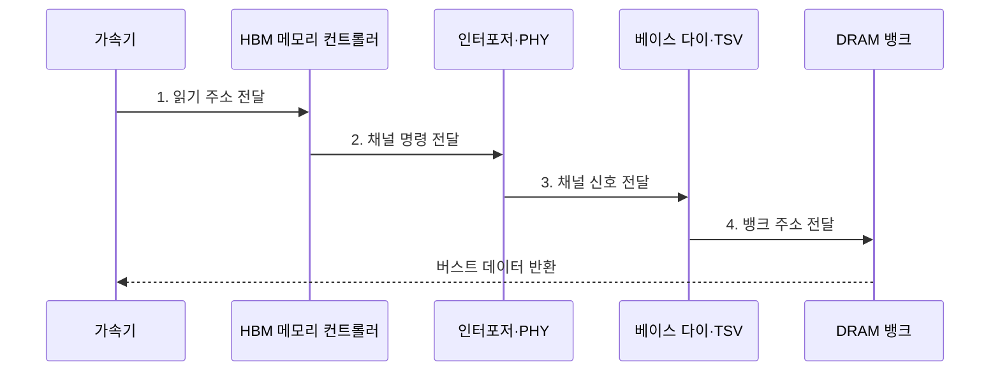

---
sidebar:
  order: 25
  label: "025. HBM 고대역폭 메모리 (High Bandwidth Memory)"
  badge:
    text: "기출 · 85%"
    variant: note
title: "HBM 고대역폭 메모리 (High Bandwidth Memory)"
date: "2026-07-30T19:07:00+09:00"
tags:
  - "notes-hardware"
weight: 25
extra:
  question_no: "025"
  source_status: "기출"
  source_history: "129회, 131회, 137회"
  priority: 85
  priority_note: "반복 기출, 가속기 메모리 병목 핵심"
---

## 미리 알고가기

- **고대역폭 메모리(High Bandwidth Memory, HBM)**: DRAM 다이를 수직 적층하고 광폭 인터페이스로 프로세서와 연결한 고대역폭 메모리다
- **동적 랜덤 접근 메모리(Dynamic Random-Access Memory, DRAM)**: 커패시터 전하로 비트를 저장하고 주기적으로 리프레시하는 메모리
- **메모리 장벽(Memory Wall)**: 연산 성능은 계속 오르는데 메모리가 데이터를 그만큼 못 실어 날라 연산기가 놀게 되는 병목
- **다이·스택(Die·Stack)**: 웨이퍼에서 잘라 낸 개별 칩이 다이, 그 다이를 수직으로 여러 장 쌓은 묶음이 스택이다
- **실리콘 관통 전극(Through-Silicon Via, TSV)**: 적층된 실리콘 다이를 관통하여 층간 신호와 전력을 전달하는 수직 배선
- **베이스 다이(Base Die)**: 스택 맨 아래에서 채널과 신호를 정리해 바깥으로 중계하는 층
- **실리콘 인터포저(Silicon Interposer)**: 스택과 가속기를 한 받침 위에 올려 놓고 그 사이를 수천 가닥으로 잇는 광폭 배선 기판
- **채널·뱅크(Channel·Bank)**: 서로 독립적으로 명령을 받는 전송 경로가 채널, 그 안에서 동시에 열 수 있는 셀 배열이 뱅크다
- **핀 전송률(Pin Data Rate)**: 신호 핀 하나가 초당 나르는 데이터량이며, 총대역폭은 채널 수와 채널 폭과 이 값의 곱으로 정해진다
- **입출력(Input/Output, I/O)**: HBM 스택과 프로세서 사이에서 명령·주소·데이터를 전달하는 인터페이스
- **신호 무결성(Signal Integrity)**: 잡음과 반사 속에서도 신호가 판별 가능한 전압과 타이밍을 유지하는 성질이며, 핀 속도를 올릴수록 지키기 어려워진다
- **적층 수율(Stack Yield)**: 쌓은 다이와 접합이 모두 정상 동작하는 완제품 비율이며, 한 층만 불량이어도 스택 전체를 버리므로 값이 여기서 뛴다
- **방열판·액체 냉각(Heat Sink·Liquid Cooling)**: 열을 넓은 금속 면으로 퍼뜨리는 방식과 냉각수가 열을 실어 나르는 방식이며, 쌓인 층 가운데의 열은 빠져나갈 길이 없어 이 대책이 필요하다
- **그래픽 이중 데이터 전송률(Graphics Double Data Rate, GDDR)**: 보드에 개별 메모리 칩을 배치하고 핀당 전송률을 높여 대역폭을 확보하는 그래픽 메모리
- **가속기(Accelerator)**: 특정 병렬 연산을 높은 처리량으로 수행하며 이 대역폭을 소비하는 전용 처리 장치
- **그래픽 처리 장치(Graphics Processing Unit, GPU)**: 다수 연산 유닛으로 데이터 병렬 계산을 수행하는 프로세서
- **인공지능(Artificial Intelligence, AI) 학습**: 대량 데이터를 반복 처리하여 모델 파라미터를 최적화하는 작업
- **열 스로틀링(Thermal Throttling)**: 온도 한계를 넘지 않도록 동작 속도·대역폭을 낮추는 제어
- **알려진 양품 다이(Known Good Die)**: 적층 전에 시험을 통과해 정상으로 확인된 개별 다이
- **예비 경로(Redundant Path)**: 결함 배선을 대체하도록 마련한 여분의 신호 경로
- **오류 정정 코드(Error-Correcting Code, ECC)**: 추가 검사 비트로 데이터 오류를 검출·정정하는 기법

## Ⅰ. 개요

- 정의/개념: DRAM을 적층하고 **광폭 I/O**로 연결한 메모리
- 배경/필요성: **메모리 장벽**에 따른 연산 유닛 대기 완화

### 쉽게 이해하기 (학습용)

- HBM은 연산기 옆에 적층 DRAM을 두고 통로 폭을 넓혀 메모리 장벽으로 놀던 가속기에 데이터를 공급한다

## Ⅱ. 특징

- **채널 수·폭·핀 전송률**의 곱으로 정해지는 총대역폭
- **TSV 적층**으로 짧아진 신호 거리와 낮은 I/O 전력
- 요청의 **채널·뱅크 분산**이 실효 대역폭 좌우

$$
Bandwidth_{theoretical} = \frac{N_{channel} \times W_{channel} \times R_{pin}}{8}
$$

> 채널 수·폭·핀 전송률로 이론값 계산

### 쉽게 이해하기 (학습용)

- 이론 대역폭은 채널 수·폭·핀 전송률의 곱이지만, 요청이 특정 채널에 몰리면 실효 대역폭은 낮아진다

## Ⅲ. 구조 및 구성요소

| 구성요소 | 책임 |
|:---|:---|
| DRAM 다이 스택 | 수직 적층 **저장 공간** 제공 |
| TSV·다이 접합 | 층간 **신호·전력 경로** 제공 |
| 베이스 다이 | 채널 신호 **중계·분배** |
| 실리콘 인터포저 | 가속기·스택 **광폭 연결** |

### 쉽게 이해하기 (학습용)

- TSV는 적층 다이를 연결하고 인터포저는 HBM 스택과 가속기를 광폭으로 연결한다.

## Ⅳ. 흐름도

### 동작 원리

- **1. 읽기 주소 전달**: 주소에서 채널·뱅크 선택
- **2. 채널 명령 전달**: 인터포저 경로 진입
- **3. 채널 신호 전달**: 베이스 다이에서 층간 분배
- **4. 뱅크 주소 전달**: TSV 경로의 대상 뱅크 판독

### 쉽게 이해하기 (학습용)

- TSV는 적층 다이 사이를 수직 연결하고, 인터포저는 HBM 스택과 가속기를 짧고 넓게 연결한다

## Ⅴ. 종류 및 비교

| 가속기 메모리 | HBM | GDDR |
|:---|:---|:---|
| 적용 기준 | 전력·면적 안에서 **대역폭**을 최대로 밀 때 | 용량 대비 **비용**과 보드 유연성이 앞설 때 |
| 핵심 특징 | 적층·**광폭 I/O**의 다채널 병렬 | 개별 칩의 **고속 핀** 전송과 칩 수 확장 |
| 한계 | **적층 수율**과 패키지·발열 비용 | 핀 속도 상승 시 **신호 무결성** 유지 부담 |

> 요약: HBM은 패키지, GDDR은 신호 부담

### 쉽게 이해하기 (학습용)

- HBM은 넓은 통로의 패키지·수율 비용을, GDDR은 빠른 핀의 전력·신호 무결성 비용을 부담한다

## Ⅵ. 실무 고려사항 및 대책

| 고려사항 | 대책 | 효과 |
|:---|:---|:---|
| 주소 편향의 채널 포화 | 주소·데이터의 **채널 분산** | **실효 대역폭** 향상 |
| 적층 내부의 열 집중 | 온도 감시·**액체 냉각** | **지속 처리량** 유지 |
| 다이·접합의 수율 저하 | **양품 다이·예비 경로** 적용 | **패키지 수율** 개선 |
| 채널 오류의 연산 전파 | **ECC**·오류 격리 | **데이터 신뢰성** 확보 |

### 쉽게 이해하기 (학습용)

- AI 학습처럼 데이터를 계속 공급해야 하는 작업은 HBM의 광폭 경로로 연산 유닛의 대기를 줄인다

## Ⅶ. 결론

- 대역폭 이득이 적층·냉각 비용을 넘으면 **HBM** 적용

### 쉽게 이해하기 (학습용)

- 실효 처리량 이득이 적층·냉각 비용을 넘는 대역폭 집약 워크로드에 HBM을 적용한다
