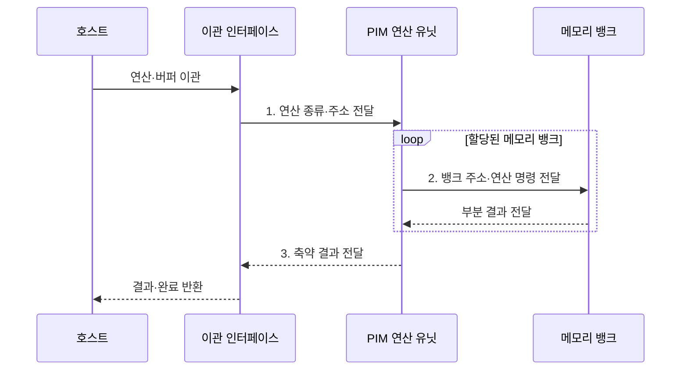

---
sidebar:
  order: 26
  label: "026. PIM 메모리 내 처리 (Processing-in-Memory)"
  badge:
    text: "기출 · 70%"
    variant: note
title: "PIM 메모리 내 처리 (Processing-in-Memory)"
date: "2026-07-31T10:52:00+09:00"
tags:
  - "notes-hardware"
weight: 26
extra:
  question_no: "026"
  source_status: "기출"
  source_history: "129회, 131회"
  priority: 70
  priority_note: "반복 기출, 데이터 이동 병목 해소"
---

## 미리 알고가기

- **메모리 내 처리(Processing-in-Memory, PIM)**: 메모리 내부에 연산기를 배치하여 원본 데이터의 외부 이동을 줄이는 구조다
- **동적 랜덤 접근 메모리(Dynamic Random-Access Memory, DRAM)**: 전하 저장 셀을 뱅크 단위로 묶어 구성한 메모리이며 PIM은 이 뱅크 옆에 연산기를 붙인다
- **메모리 장벽(Memory Wall)**: 연산 성능은 계속 오르는데 메모리 지연과 대역폭이 못 따라와 전체 속도를 제한하는 병목
- **데이터 이동 병목(Data Movement Bottleneck)**: 계산 자체보다 데이터를 옮기는 시간과 전력이 더 커진 상태
- **입출력(Input/Output, I/O)**: 호스트 프로세서와 외부 메모리 사이에서 명령과 데이터를 전달하는 작업
- **인메모리 컴퓨팅(In-Memory Computing, IMC)**: 메모리 셀 배열의 물리적 동작을 이용해 데이터 저장 위치에서 연산하는 방식
- **근접 메모리 처리(Processing-Near-Memory, PNM)**: 메모리 셀 배열과 가까운 로직 계층에서 데이터를 처리하는 방식
- **곱셈-누산(Multiply-Accumulate, MAC)**: 두 값을 곱한 결과를 기존 부분합에 누적하는 행렬 연산의 기본 단위
- **축약(Reduction)**: 많은 입력을 합계·최댓값·조건 통과 행처럼 훨씬 작은 결과로 줄이는 연산이며, 돌려보낼 양이 줄어야 이관이 이득이 된다
- **스캔·필터(Scan·Filter)**: 행을 차례로 훑는 동작과 조건을 만족하는 행만 남기는 동작이며 대표적인 축약 작업이다
- **연산 이관(Offloading)**: 작업 일부를 데이터가 있는 쪽 연산기로 넘기는 것
- **호스트(Host)**: 이관할 연산과 주소를 보내고 축약 결과와 완료 상태를 돌려받는 실행 주체
- **명령·이관 인터페이스(Command·Offload Interface)**: 연산 종류·주소·버퍼·동기화 정보를 호스트와 PIM 사이에서 주고받는 접점
- **버퍼(Buffer)**: 처리 전후 데이터를 담아 두어 호스트와 PIM이 입력과 결과를 주고받는 메모리 영역
- **동기화(Synchronization)**: 두 주체의 접근 순서와 완료 시점을 맞춰 같은 데이터를 두고 충돌하거나 낡은 값을 쓰지 않게 하는 제어
- **캐시 일관성(Cache Coherence)**: 호스트 캐시에 남은 사본과 메모리의 실제 값이 어긋나지 않도록 맞추는 성질
- **비캐시 매핑(Non-cacheable Mapping)**: PIM 전용 버퍼를 아예 캐시에 담지 않도록 주소 속성을 지정해, PIM이 고친 값을 호스트가 옛 사본으로 읽는 일을 막는 방식
- **다이(Die)**: 웨이퍼에서 잘라 낸 개별 반도체 칩이며 PIM에서는 뱅크와 연산 유닛을 한 다이에 함께 담는다
- **중앙처리장치(Central Processing Unit, CPU)·그래픽 처리 장치(Graphics Processing Unit, GPU)**: PIM에 연산과 데이터 범위를 지정하고 결과를 처리하는 호스트 프로세서
- **관계형 데이터베이스(Relational Database, RDB)**: 데이터를 행·열 구조의 테이블과 관계로 관리하는 데이터베이스
- **캐시 플러시·무효화(Cache Flush·Invalidation)**: 수정 캐시 라인을 메모리에 반영하고 오래된 사본의 사용 권한을 제거하는 동작
- **선택도(Selectivity)**: 전체 입력 중 조건을 만족해 결과로 남는 데이터의 비율

> **키워드:** PIM 메모리 내 처리 (Processing-in-Memory)

## Ⅰ. 개요

- 정의/개념: 메모리 내부에서 데이터를 직접 연산하는 **처리 구조**
- 배경/필요성: 호스트 중심 처리는 원본 왕복으로 **이동 시간•에너지 증가**

### 쉽게 이해하기 (학습용)

- PIM은 데이터가 있는 메모리에서 연산하고 작은 결과만 반환해 전송 시간과 전력을 줄인다

## Ⅱ. 특징

- 뱅크 **내부 대역폭** 활용으로 외부 I/O 시간·에너지 절감
- 메모리 공정·열 한도가 정하는 **지원 연산 범위**
- 연산 위치에 따른 **IMC·PNM** 구현 스펙트럼

### 쉽게 이해하기 (학습용)

- PIM은 넓은 내부 대역폭을 쓰지만 면적·발열 제약 때문에 단순 반복 연산에 적합하다

## Ⅲ. 구조 및 구성요소

| 구성요소 | 책임 |
|:---|:---|
| 명령·이관 인터페이스 | 명령 수신·**결과 반환** |
| 메모리 내 연산 유닛 | **MAC·축약**의 병렬 실행 |
| 메모리 뱅크 배열 | 원본의 **내부 병렬 접근** |

### 쉽게 이해하기 (학습용)

- 이관 인터페이스가 작업을 받고 연산 유닛이 메모리 뱅크의 데이터를 내부에서 처리한다.

## Ⅳ. 흐름도

**동작 원리**

- **1. 연산 종류·주소 전달**: 실행할 연산과 데이터 범위 확정
- **2. 뱅크 주소·연산 명령 전달**: 원본 이동 없이 병렬 처리
- **3. 축약 결과 전달**: 부분 결과를 작은 출력으로 통합

### 쉽게 이해하기 (학습용)

- 호스트는 작업을 보내고, PIM은 원본을 다이 안에서 처리해 축약 결과만 돌려준다

## Ⅴ. 종류 및 비교

| 연산 수행 위치 | PIM | 호스트 중심 처리 |
|:---|:---|:---|
| 적용 기준 | 읽는 양 대비 **축약 비율**이 높을 때 | 분기가 많고 **데이터 재사용**이 클 때 |
| 핵심 특징 | 원본을 옮기지 않는 **뱅크 내 병렬 연산** | 코어로 적재 후 **범용·복잡 연산** |
| 한계 | 지원 연산 제약과 **캐시 일관성** 관리 | 원본 이동에 드는 **대역폭·전송 에너지** |

> 요약: PIM은 **원본 이동 감소•지원 연산 범위 제한**

### 쉽게 이해하기 (학습용)

- 단순 연산으로 결과를 크게 줄이면 PIM, 복잡한 분기와 데이터 재사용이 많으면 호스트 처리가 유리하다

## Ⅵ. 실무 고려사항 및 대책

| 고려사항 | 대책 | 효과 |
|:---|:---|:---|
| 이관 비용이 **이동 절감량 초과** | **축약률·이관 지연** 손익 판정 | **비효율 이관** 방지 |
| 캐시·PIM의 **수정본 불일치** | **비캐시 버퍼·플러시**·동기화 | **데이터 정합성** 유지 |
| 주소 편향의 **뱅크 포화** | 데이터·주소의 **뱅크 분산** | **내부 병렬성** 향상 |
| 복잡 연산의 **열•공정 한계** | **단순 축약** 선별·온도 감시 | **안정 처리량** 확보 |

### 쉽게 이해하기 (학습용)

- 조건을 만족하는 행이 적은 질의는 PIM에서 필터링해 일치한 행만 호스트로 보낸다

## Ⅶ. 결론

- 고축약·단순 연산은 **PIM**, 분기·재사용은 **호스트** 실행

### 쉽게 이해하기 (학습용)

- 반환 데이터가 충분히 작고 연산이 단순할 때 PIM 이관 효과가 크다
