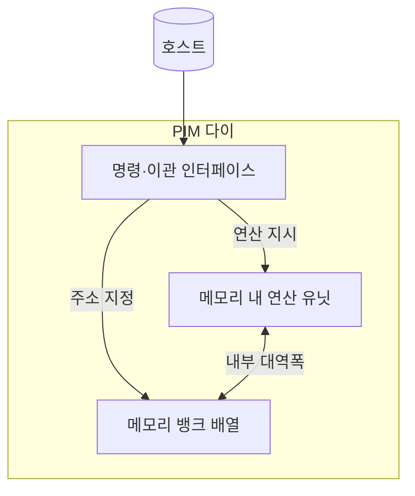
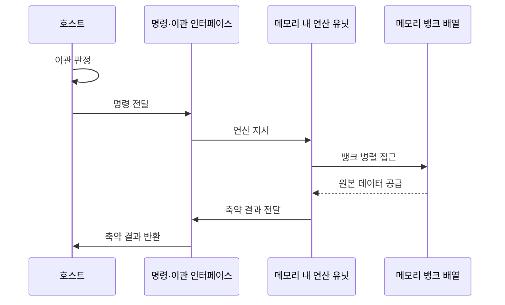

---
sidebar:
  order: 26
  label: "026. PIM 메모리 내 처리 (Processing-in-Memory)"
  badge:
    text: "기출 · 70%"
    variant: note
title: "PIM 메모리 내 처리 (Processing-in-Memory)"
date: "2026-07-27T23:59:59+09:00"
tags:
  - "notes-hardware"
weight: 26
extra:
  question_no: "026"
  source_status: "기출"
  source_history: "129회, 131회"
  priority: 70
  priority_note: "반복 기출, 데이터 이동 병목 해소"
---

## 미리 알고가기

- **메모리 내 처리(Processing-in-Memory, PIM)**: ‘핌’으로 읽고 영문 머리글자를 단어처럼 읽는 약어이며, 메모리 안쪽 연산기로 원본 데이터 이동을 줄이는 구조다
- **동적 랜덤 접근 메모리(Dynamic Random-Access Memory, DRAM)**: 전하 저장 셀을 뱅크 단위로 묶어 구성한 메모리이며 PIM은 이 뱅크 옆에 연산기를 붙인다
- **메모리 장벽(Memory Wall)**: 연산 성능은 계속 오르는데 메모리 지연과 대역폭이 못 따라와 전체 속도를 제한하는 병목
- **데이터 이동 병목(Data Movement Bottleneck)**: 계산 자체보다 데이터를 옮기는 시간과 전력이 더 커진 상태
- **입출력(Input/Output, I/O)**: ‘아이오’로 읽고 입력·출력의 영문 머리글자를 빗금으로 구분한 표기이며, 호스트와 외부 메모리 사이의 데이터 왕복이다
- **인메모리 컴퓨팅(In-Memory Computing, IMC)**: ‘아이엠씨’로 읽고 영문 머리글자를 딴 약어이며, 메모리 셀 배열의 물리 동작으로 연산하는 방식이다
- **근접 메모리 처리(Processing-Near-Memory, PNM)**: ‘피엔엠’으로 읽고 영문 머리글자를 딴 약어이며, 셀 배열 옆 로직 층에서 연산하는 방식이다
- **곱셈-누산(Multiply-Accumulate, MAC)**: ‘맥’으로 읽고 영문 머리글자를 단어처럼 읽는 약어이며, 곱한 값을 누적해 더하는 연산이다
- **축약(Reduction)**: 많은 입력을 합계·최댓값·조건 통과 행처럼 훨씬 작은 결과로 줄이는 연산이며, 돌려보낼 양이 줄어야 이관이 이득이 된다
- **스캔·필터(Scan·Filter)**: 행을 차례로 훑는 동작과 조건을 만족하는 행만 남기는 동작이며 대표적인 축약 작업이다
- **연산 이관(Offloading)**: 작업 일부를 데이터가 있는 쪽 연산기로 넘기는 것
- **호스트(Host)**: 이관할 연산과 주소를 보내고 축약 결과와 완료 상태를 돌려받는 실행 주체
- **명령·이관 인터페이스(Command·Offload Interface)**: 연산 종류·주소·버퍼·동기화 정보를 호스트와 PIM 사이에서 주고받는 접점
- **버퍼(Buffer)**: 처리 전후 데이터를 담아 두어 호스트와 PIM이 입력과 결과를 주고받는 메모리 영역
- **동기화(Synchronization)**: 두 주체의 접근 순서와 완료 시점을 맞춰 같은 데이터를 두고 충돌하거나 낡은 값을 쓰지 않게 하는 제어
- **캐시 일관성(Cache Coherence)**: 호스트 캐시에 남은 사본과 메모리의 실제 값이 어긋나지 않도록 맞추는 성질
- **비캐시 매핑(Non-cacheable Mapping)**: PIM 전용 버퍼를 아예 캐시에 담지 않도록 주소 속성을 지정해, PIM이 고친 값을 호스트가 옛 사본으로 읽는 일을 막는 방식
- **다이(Die)**: 웨이퍼에서 잘라 낸 개별 반도체 칩이며 PIM에서는 뱅크와 연산 유닛을 한 다이에 함께 담는다
- **중앙처리장치(Central Processing Unit, CPU)·그래픽 처리 장치(Graphics Processing Unit, GPU)**: ‘씨피유·지피유’로 읽고 영문 머리글자를 딴 약어이며, PIM 이관을 지시하는 호스트 프로세서다
- **관계형 데이터베이스(Relational Database, RDB)**: ‘알디비’로 읽고 영문 머리글자를 딴 약어이며, 행·열 테이블로 데이터를 관리하는 시스템이다

## Ⅰ. 개요

- 정의/개념: 메모리 내부 연산으로 외부 전송을 줄이는 **데이터 인접 처리 구조**
- 기존 한계: **메모리 장벽**으로 연산보다 전송이 시간·에너지 지배

### 쉽게 이해하기 (학습용)

- 창고에 쌓인 백만 상자 중 조건에 맞는 열 상자를 찾으려고 백만 상자를 전부 본사로 실어 나르면 트럭 값이 고르는 값을 압도하는데, 답안이 배경 자리에 이 역전을 적은 이유는 PIM이 연산을 빠르게 하는 기술이 아니라 옮기는 일을 없애는 기술이기 때문이다

## Ⅱ. 특징

- 뱅크 **내부 대역폭** 활용으로 외부 I/O 시간·에너지 절감
- 메모리 공정·열 한도가 정하는 **지원 연산 범위**
- 연산 위치에 따른 **IMC·PNM** 구현 스펙트럼

### 쉽게 이해하기 (학습용)

- 창고 안 통로는 밖으로 나가는 문보다 훨씬 넓어 거기서 처리하면 시간과 전기를 함께 아끼지만, 창고는 원래 물건을 쌓으려고 지은 곳이라 큰 기계를 들일 자리도 열을 뺄 길도 없어 작업대에 올릴 수 있는 일은 단순 반복으로 제한되며, 그 작업대를 선반 사이에 둘지 창고 문 옆에 둘지에 따라 구현이 갈린다

## Ⅲ. 아키텍처 및 구성요소

| 설계 요소 | 설명 |
|:---|:---|
| 명령·이관 인터페이스 | 연산 종류·주소·**동기화** 정보 수신 |
| 메모리 내 연산 유닛 | **MAC·축약** 등 단순 반복의 뱅크별 병렬 실행 |
| 메모리 뱅크 배열 | 원본 데이터 보관과 **내부 병렬 접근** 제공 |

> 요약: 연산 유닛과 뱅크가 **다이 내부**에서만 데이터를 주고받음

### 쉽게 이해하기 (학습용)

- 연산 유닛과 뱅크를 잇는 굵은 양방향 선이 다이 경계 안에서만 그려져 있고 바깥으로 나가는 선은 명령과 결과뿐이라는 점이 이 구조의 전부인데, 원본이 경계를 넘지 않기 때문에 아무리 큰 데이터라도 바깥 통로를 쓰지 않는다

## Ⅳ. 원리 및 절차 흐름도

| 절차 | 설명 |
|:---|:---|
| 이관 판정 | 이동 감소 이득과 **지원 연산** 여부 확인 |
| 명령 전달 | 연산·주소·**동기화** 정보의 PIM 전달 |
| 연산 지시 | 대상 **버퍼** 범위와 연산 종류 지정 |
| 뱅크 병렬 접근 | 여러 뱅크의 **동시 데이터 개방** |
| 원본 데이터 공급 | 내부 대역폭 경유 **경계 내 전달** |
| 축약 결과 전달 | 연산 유닛이 완료 상태·결과를 인터페이스에 전달 |
| 축약 결과 반환 | 인터페이스가 **축약 결과**만 호스트에 반환 |

> 요약: **축약 비율**이 낮으면 이관해도 외부 전송량 유지

### 쉽게 이해하기 (학습용)

- 아래에서 두 번째 줄이 다이 안쪽에만 그려지고 마지막 줄만 바깥으로 나간다는 대비가 이관 판정의 근거인데, 백만 행을 읽어 열 행만 돌려주면 크게 남지만 백만 행을 읽어 백만 행을 그대로 돌려줘야 하는 연산이라면 옮기는 양이 그대로여서 이관할 이유가 사라진다

## Ⅴ. 종류 및 비교

| 연산 수행 위치 | PIM | 호스트 중심 처리 |
|:---|:---|:---|
| 적용 기준 | 읽는 양 대비 **축약 비율**이 높을 때 | 분기가 많고 **데이터 재사용**이 클 때 |
| 핵심 특징 | 원본을 옮기지 않는 **뱅크 내 병렬 연산** | 코어로 적재 후 **범용·복잡 연산** |
| 한계 | 지원 연산 제약과 **캐시 일관성** 관리 | 원본 이동에 드는 **대역폭·전송 에너지** |

> 요약: PIM은 전송을 줄이는 대신 **연산 표현력**을 내주는 교환

### 쉽게 이해하기 (학습용)

- 창고 작업대는 단순 작업만 되고 본사는 무엇이든 되지만 재료를 다 실어 와야 하므로, 고를 조건이 단순하고 버릴 것이 많은 일은 창고가 이기고 같은 재료를 여러 번 다시 쓰며 판단이 복잡한 일은 본사가 이긴다

## Ⅵ. 실무 사례

1. 관계형 데이터베이스 스캔은 뱅크에서 **조건 필터** 선수행

### 쉽게 이해하기 (학습용)

- 수억 행 테이블에서 조건에 맞는 몇천 행만 필요한 질의는 전부 실어 오면 통로가 먼저 막히므로, 창고에서 조건을 걸어 걸러 낸 결과만 올려 보낸다

## Ⅶ. 결론

- **축약 비율**이 높은 반복 연산만 PIM으로 이관

### 쉽게 이해하기 (학습용)

- 데이터가 크다고 무조건 창고에 맡기는 것이 아니라 읽는 양에 비해 돌려보낼 양이 얼마나 줄어드는지가 기준이며, 줄어드는 폭이 작으면 이관해도 통로 사용량은 그대로다
