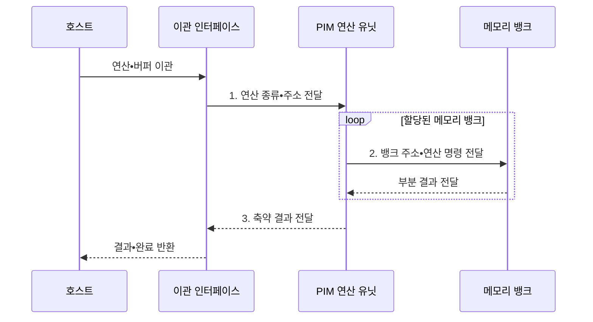

---
sidebar:
  order: 26
  label: "026. PIM 메모리 내 처리 (Processing-in-Memory)"
  badge:
    text: "기출 • 70%"
    variant: note
title: "PIM 메모리 내 처리 (Processing-in-Memory)"
date: "2026-08-05T00:45:06+09:00"
tags:
  - "notes-hardware"
weight: 26
extra:
  question_no: "026"
  source_status: "기출"
  source_history: "129회, 131회"
  priority: 70
  priority_note: "반복 기출, 데이터 이동 병목 해소"
---

## Ⅰ. 개요

<details><summary>핵심 용어</summary>

- **메모리 내 처리(Processing-in-Memory, PIM)**: 메모리 내부에 연산기를 배치해 원본 데이터의 외부 이동을 줄이는 처리 구조
- **데이터 이동 병목**: 계산보다 데이터를 옮기는 시간과 에너지가 더 크게 성능을 제한하는 상태

</details>

- 정의/개념: 메모리 내부에서 데이터를 직접 연산하는 **처리 구조**
- 배경/필요성: 호스트 중심 처리는 원본 왕복으로 **이동 시간•에너지 증가**

#### 한줄 요약

- PIM은 데이터가 있는 메모리에서 연산하고 작은 결과만 반환해 전송 시간과 전력을 줄인다

## Ⅱ. 특징

<details><summary>핵심 용어</summary>

- **내부 대역폭**: 메모리 뱅크와 다이 내부 연산기 사이에서 외부 핀보다 넓게 제공되는 전송량
- **IMC**: In-Memory Computing, 메모리 셀의 물리 동작으로 연산하는 방식
- **PNM**: Processing-Near-Memory, 메모리 셀 가까운 로직 계층에서 처리하는 방식
- **축약**: 많은 입력을 합계•최댓값•조건 통과 행처럼 작은 결과로 줄이는 연산
- **입출력(Input/Output, I/O)**: 메모리와 외부 호스트 사이에서 원본과 결과를 전송하는 경로

</details>

- 뱅크 **내부 대역폭** 활용으로 외부 I/O 시간•에너지 절감
- 메모리 공정•열 한도가 정하는 **지원 연산 범위**
- 연산 위치에 따른 **IMC•PNM** 구현 스펙트럼

#### 한줄 요약

- PIM은 넓은 내부 대역폭을 쓰지만 면적•발열 제약 때문에 단순 반복 연산에 적합하다

## Ⅲ. 구조 및 구성요소

<details><summary>핵심 용어</summary>

- **연산 이관 인터페이스**: 호스트와 PIM 사이에서 연산 종류•주소•버퍼•완료 정보를 전달하는 접점
- **MAC**: Multiply-Accumulate, 입력값을 곱한 뒤 누적 합계에 더하는 연산
- **메모리 내 연산 유닛**: 뱅크 가까이에서 MAC•스캔•필터•축약을 병렬 실행하는 회로
- **메모리 뱅크 배열**: 원본 데이터를 저장하고 내부 병렬 접근을 제공하는 셀 배열

</details>

```text
[명령•이관 인터페이스] -- [메모리 내 연산 유닛] -- [메모리 뱅크 배열]
```

선의 의미: 외부 명령 접점, 메모리 내부 연산 회로, 저장 뱅크가 하나의 PIM 장치 안에서 결합된 정적 구조다.

| 구성요소 | 책임 |
|:---|:---|
| 명령•이관 인터페이스 | 명령 수신•**결과 반환** |
| 메모리 내 연산 유닛 | **MAC•축약** 의 병렬 실행 |
| 메모리 뱅크 배열 | 원본의 **내부 병렬 접근** |

#### 한줄 요약

- 이관 인터페이스가 작업을 받고 연산 유닛이 메모리 뱅크의 데이터를 내부에서 처리한다.

## Ⅳ. 흐름도

<details><summary>핵심 용어</summary>

- **호스트**: PIM에 연산과 주소 범위를 지정하고 결과를 처리하는 실행 장치
- **CPU**: Central Processing Unit, 범용 명령을 실행하는 중앙 처리 장치
- **GPU**: Graphics Processing Unit, 대규모 병렬 연산을 실행하는 처리 장치
- **연산 이관**: 작업 일부를 데이터가 있는 메모리 쪽 연산기에 넘기는 동작
- **부분 결과**: 여러 뱅크가 독립적으로 계산한 뒤 최종 축약에 합쳐지는 중간값

</details>



**동작 원리**

- **1. 연산 종류•주소 전달**: 실행할 연산과 데이터 범위 확정
- **2. 뱅크 주소•연산 명령 전달**: 원본 이동 없이 병렬 처리
- **3. 축약 결과 전달**: 부분 결과를 작은 출력으로 통합

#### 한줄 요약

- 호스트는 작업을 보내고, PIM은 원본을 다이 안에서 처리해 축약 결과만 돌려준다

## Ⅴ. 종류 및 비교

<details><summary>핵심 용어</summary>

- **축약 비율**: 읽은 원본 데이터 양에 비해 호스트로 반환하는 결과가 얼마나 작아졌는지 나타내는 비율
- **데이터 재사용**: 호스트 캐시나 레지스터에 올린 값을 여러 번 연산에 사용하는 특성
- **범용 연산**: 복잡한 분기와 다양한 명령을 유연하게 처리하는 호스트 중심 실행

</details>

| 연산 수행 위치 | PIM | 호스트 중심 처리 |
|:---|:---|:---|
| 적용 기준 | 읽는 양 대비 높은 **축약 비율** | 분기가 많고 큰 **데이터 재사용 효과** |
| 핵심 특징 | 원본을 옮기지 않는 **뱅크 내 병렬 연산** | 코어로 적재 후 **범용•복잡 연산** |
| 한계 | 지원 연산 제약과 **캐시 일관성** 관리 | 원본 이동에 드는 **대역폭•전송 에너지** |

> 요약: PIM은 **원본 이동 감소•지원 연산 범위 제한**

#### 한줄 요약

- 단순 연산으로 결과를 크게 줄이면 PIM, 복잡한 분기와 데이터 재사용이 많으면 호스트 처리가 유리하다

## Ⅵ. 실무 고려사항 및 대책

<details><summary>핵심 용어</summary>

- **비캐시 버퍼**: PIM과 공유하는 데이터를 호스트 캐시에 담지 않아 오래된 사본을 막는 메모리 영역
- **캐시 플러시**: 호스트 캐시의 수정 사본을 메모리에 반영하는 처리
- **동기화**: 호스트와 PIM의 메모리 접근 순서를 맞추는 처리
- **뱅크 포화**: 주소가 일부 뱅크에 몰려 다른 뱅크의 병렬성이 활용되지 않는 상태

</details>

| 문제 | 대책 | 효과 |
|:---|:---|:---|
| 이관 비용이 **이동 절감량 초과** | **축약률•이관 지연** 손익 판정 | **비효율 이관** 방지 |
| 캐시•PIM의 **수정본 불일치** | **비캐시 버퍼•플러시**•동기화 | **데이터 정합성** 유지 |
| 주소 편향의 **뱅크 포화** | 데이터•주소의 **뱅크 분산** | **내부 병렬성** 향상 |
| 복잡 연산의 **열•공정 한계** | **단순 축약** 선별•온도 감시 | **안정 처리량** 확보 |

#### 한줄 요약

- 조건을 만족하는 행이 적은 질의는 PIM에서 필터링해 일치한 행만 호스트로 보낸다

## Ⅶ. 결론

<details><summary>핵심 용어</summary>

- **고축약 연산**: 대량 입력을 처리한 뒤 호스트로 돌려보낼 결과가 매우 작아지는 연산
- **분기 연산**: 복잡한 제어 흐름으로 호스트 실행이 유리한 연산
- **재사용 연산**: 캐시 데이터를 반복 사용해 호스트 실행이 유리한 연산

</details>

- 고축약•단순 연산은 **PIM**, 분기•재사용은 **호스트** 실행

#### 한줄 요약

- 반환 데이터가 충분히 작고 연산이 단순할 때 PIM 이관 효과가 크다
