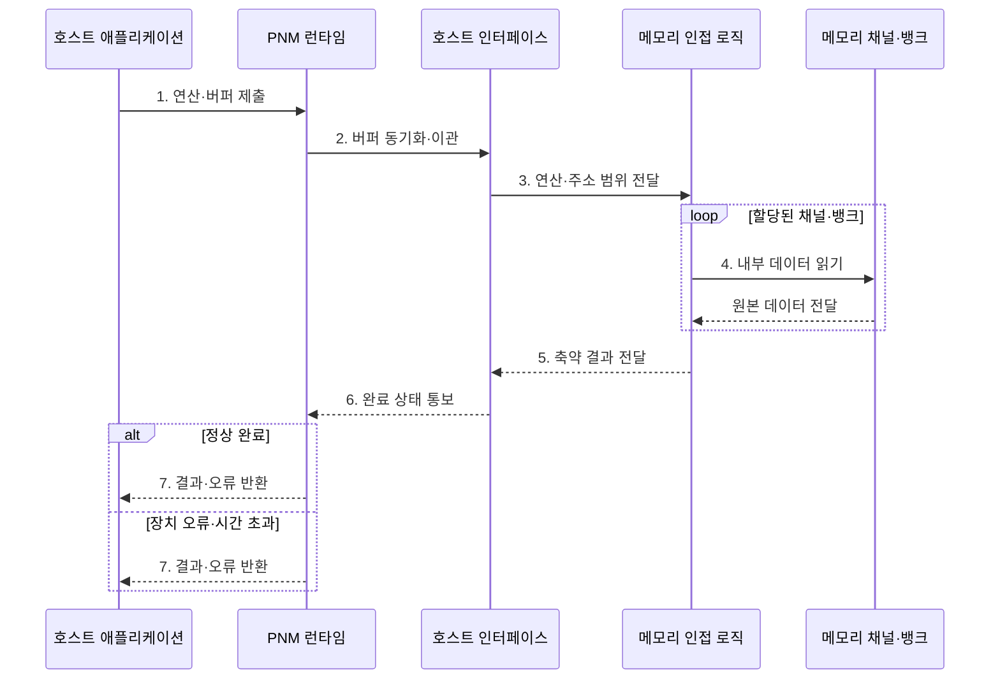

---
sidebar:
  order: 27
  label: "027. PNM 메모리 근접 처리 (Processing Near Memory)"
  badge:
    text: "기출 · 50%"
    variant: note
title: "PNM 메모리 근접 처리 (Processing Near Memory)"
date: "2026-07-28T21:27:55+09:00"
tags:
  - "notes-hardware"
weight: 27
extra:
  question_no: "027"
  source_status: "기출"
  source_history: "131회"
  priority: 50
  priority_note: "연산 위치와 로직 유연성 비교"
---

## 미리 알고가기

- **메모리 근접 처리(Processing-Near-Memory, PNM)**: 메모리 모듈 또는 컨트롤러 인근의 로직에서 데이터를 처리하여 호스트 전송량을 줄이는 구조다
- **메모리 내 처리(Processing-in-Memory, PIM)**: 메모리 셀 또는 뱅크 내부에서 연산하여 데이터 이동을 최소화하는 방식
- **로직 다이(Logic Die)**: 메모리와 같은 패키지 안에 함께 담긴 디지털 연산 전용 칩이며 PNM 연산이 실제로 도는 자리다
- **패키지(Package)**: 여러 다이와 배선·기판을 한 덩어리로 조립한 단위이며, 이 안에 있으면 바깥 보드보다 훨씬 짧고 넓은 연결을 쓸 수 있다
- **디지털 로직(Digital Logic)**: 0과 1 신호로 명령을 수행하는 회로이며, 셀 물리 동작이 아니라 회로 설계이므로 다양한 연산을 프로그래밍해 넣을 수 있다
- **메모리 채널·뱅크(Memory Channel·Bank)**: 데이터를 주고받는 독립 경로가 채널, 동시에 열 수 있는 셀 배열이 뱅크이며 이 둘이 인접 로직에 내부 대역폭을 준다
- **호스트(Host)**: 작업·주소·버퍼 정보를 넘기고 축약 결과와 완료 상태를 받아 가는 실행 주체
- **호스트 인터페이스(Host Interface)**: 그 명령과 결과가 오가는 장치 바깥쪽 연결 규약
- **버퍼(Buffer)**: 입력 데이터와 작업 정보, 결과를 주고받으려고 잡아 두는 메모리 영역
- **연산 이관(Offloading)**: 호스트가 할 일 일부를 메모리 인접 로직으로 넘기는 것
- **스캔(Scan)**: 지정한 데이터 범위를 순차로 훑어 뒤 연산의 입력으로 넘기는 전처리 동작
- **필터·압축·집계(Filter·Compression·Aggregation)**: 조건에 맞는 것만 고르는 동작, 표현 크기를 줄이는 동작, 여러 값을 통계 하나로 합치는 동작이며 셋 다 돌려보낼 양을 줄인다
- **결과 축약(Result Reduction)**: 그렇게 원본보다 훨씬 작은 결과만 만들어 내는 것이며, 이 비율이 낮으면 이관 자체가 이득이 없다
- **곱셈-누산(Multiply-Accumulate, MAC)**: 두 값을 곱한 결과를 기존 부분합에 누적하는 반복 연산
- **런타임(Runtime)**: 실행 중에 작업 이관과 버퍼 배정, 완료와 오류 처리를 관리하는 소프트웨어 계층
- **장애 격리(Fault Isolation)**: 장치 쪽 오류가 호스트까지 번지지 않도록 전파 경로를 끊어 두는 설계
- **PNM DIMM(Processing-Near-Memory Dual In-line Memory Module)**: 메모리 모듈의 버퍼 영역에 연산 로직을 배치한 근접 메모리 처리 장치
- **컴퓨트 익스프레스 링크(Compute Express Link, CXL)**: 호스트와 메모리 장치 사이의 일관성 있는 접근과 메모리 확장을 제공하는 인터커넥트 규격

## Ⅰ. 개요

- 정의/개념: 메모리 가까운 로직에서 데이터를 연산하는 **처리 구조**
- 배경/필요성: 원본 전량의 **호스트 왕복 전송** 축소

### 쉽게 이해하기 (학습용)

- PNM은 메모리 가까이에서 데이터를 처리해 호스트 전송량과 메모리 채널 부하를 줄인다

## Ⅱ. 특징

- **메모리 인접 로직**의 다중 채널·뱅크 데이터 통합
- 프로그래밍 가능한 **디지털 로직**의 연산 유연성
- 축약 결과만 내보내는 **호스트 전송량** 감소

### 쉽게 이해하기 (학습용)

- 메모리 인접 로직은 여러 채널의 데이터를 유연하게 처리하고 작은 결과만 호스트로 보낸다

## Ⅲ. 구조 및 구성요소

| 구성요소 | 책임 |
|:---|:---|
| 호스트 인터페이스 | 명령 수신·**축약 결과** 반환 |
| 메모리 인접 로직 | **필터·압축·집계** 수행 |
| 메모리 장치 | 채널·뱅크 **내부 대역폭** 공급 |

### 쉽게 이해하기 (학습용)

- 호스트 인터페이스가 작업을 받고 인접 로직이 메모리 장치의 데이터를 내부에서 처리한다.

## Ⅳ. 흐름도

**동작 원리**

- **1. 연산·버퍼 제출**: 작업 정보 제출
- **2. 버퍼 동기화·이관**: 접근 순서 확정
- **3. 연산·주소 범위 전달**: 실행 범위 설정
- **4. 내부 데이터 읽기**: 채널·뱅크 조회
- **5. 축약 결과 전달**: 결과만 전달
- **6. 완료 상태 통보**: 작업 상태 전달
- **7. 결과·오류 반환**: 결과 또는 재시도 상태 전달

### 쉽게 이해하기 (학습용)

- PNM은 원본을 장치 안에서 처리하고 명령과 축약 결과만 호스트 링크로 전달한다

## Ⅴ. 종류 및 비교

| 연산 배치 위치 | PNM | PIM |
|:---|:---|:---|
| 적용 기준 | 질의마다 연산이 바뀔 때 | **MAC** 같은 고정 반복이 지배할 때 |
| 핵심 특징 | 로직 다이의 **프로그래밍 가능** 연산 | 셀·뱅크 내부의 **최단 이동** 처리 |
| 한계 | 호스트 왕복만 절감하는 **이동 감소 폭** | 메모리 공정에 갇힌 **연산 표현력** |

> 요약: 이동을 더 줄일수록 **연산 자유도**가 줄어드는 위치 교환

### 쉽게 이해하기 (학습용)

- PNM은 연산 유연성이 높고, PIM은 데이터 이동이 짧지만 지원 연산이 제한된다

## Ⅵ. 실무 고려사항 및 대책

| 고려사항 | 대책 | 효과 |
|:---|:---|:---|
| 작업 전달·결과 반환 비용이 축약 이득 초과 | 원본·결과 크기와 장치 실행 지연으로 손익 판정 | 비효율 이관 방지 |
| 호스트와 장치가 같은 버퍼를 동시 수정 | 버퍼 소유권·완료 장벽과 일관성 규칙 명시 | 경합·오래된 읽기 방지 |
| 장치 로직 오류가 호스트 작업을 중단 | 타임아웃·취소·재시도와 장애 격리 적용 | 복구 가능성 향상 |
| 요청이 특정 채널·뱅크에 집중 | 데이터 파티셔닝과 큐 깊이·대역폭 관찰 | 내부 병렬성 활용 |

> 사례: **CXL 메모리 장치**는 PNM 로직에서 스캔·압축 선수행

### 쉽게 이해하기 (학습용)

- 장치 내부 축약으로 아낀 전송 비용이 이관 비용보다 클 때 PNM을 사용한다

## Ⅶ. 결론

- **축약률·이관 지연·연산 변경·오류 복구** 기반 적용

### 쉽게 이해하기 (학습용)

- 연산이 자주 바뀌면 PNM, 고정 연산의 데이터 이동 최소화가 중요하면 PIM이 적합하다
