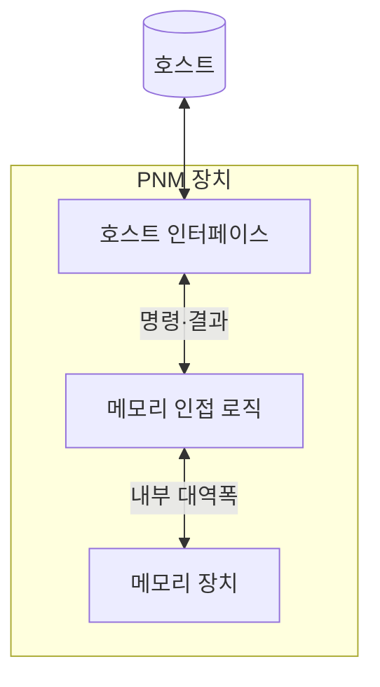
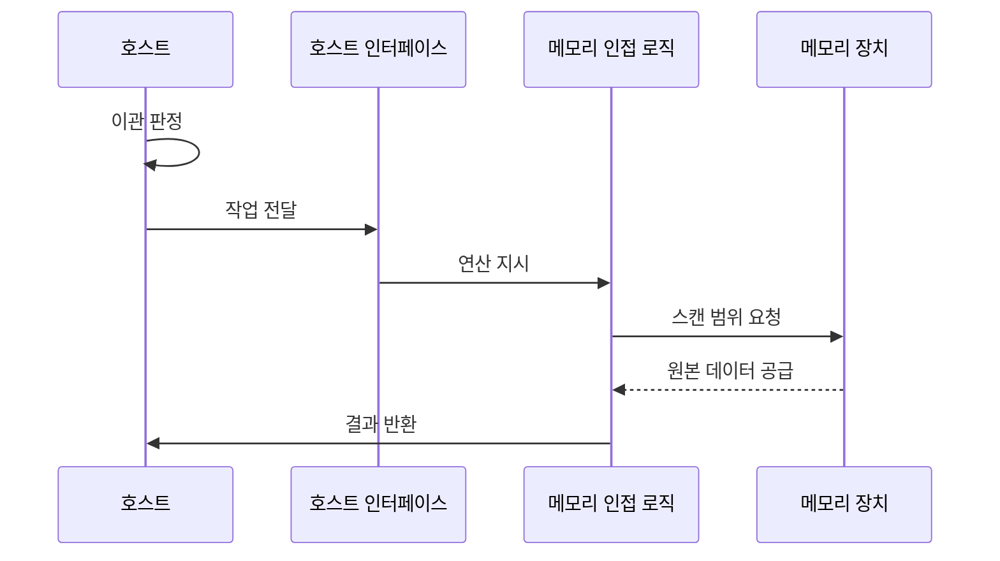

---
sidebar:
  order: 27
  label: "027. PNM 메모리 근접 처리 (Processing Near Memory)"
  badge:
    text: "기출 · 50%"
    variant: note
title: "PNM 메모리 근접 처리 (Processing Near Memory)"
date: "2026-07-26T10:45:00+09:00"
tags:
  - "notes-hardware"
weight: 27
extra:
  question_no: "027"
  source_status: "기출"
  source_history: "131회"
  priority: 50
  priority_note: "연산 위치와 로직 유연성 비교"
---

## 미리 알고가기

- **메모리 근접 처리(Processing-Near-Memory, PNM)**: 창고 선반 사이가 아니라 창고 문 옆 하역장에 작업대를 놓고 짐을 골라 실어 보내는 것처럼, 메모리 셀 안이 아니라 그 바로 옆 로직에서 데이터를 가공해 호스트로 보낼 양을 줄이는 구조
- **메모리 내 처리(Processing-in-Memory, PIM)**: 작업대를 아예 선반 사이에 놓는 방식이며, 셀과 뱅크 내부에서 처리해 이동을 더 줄이는 대신 넣을 수 있는 연산이 단순해진다
- **로직 다이(Logic Die)**: 메모리와 같은 패키지 안에 함께 담긴 디지털 연산 전용 칩이며 PNM 연산이 실제로 도는 자리다
- **패키지(Package)**: 여러 다이와 배선·기판을 한 덩어리로 조립한 단위이며, 이 안에 있으면 바깥 보드보다 훨씬 짧고 넓은 연결을 쓸 수 있다
- **디지털 로직(Digital Logic)**: 0과 1 신호로 명령을 수행하는 회로이며, 셀 물리 동작이 아니라 회로 설계이므로 다양한 연산을 프로그래밍해 넣을 수 있다
- **메모리 채널·뱅크(Memory Channel·Bank)**: 데이터를 주고받는 독립 경로가 채널, 동시에 열 수 있는 셀 배열이 뱅크이며 이 둘이 인접 로직에 내부 대역폭을 준다
- **호스트(Host)**: 작업·주소·버퍼 정보를 넘기고 축약 결과와 완료 상태를 받아 가는 실행 주체
- **호스트 인터페이스(Host Interface)**: 그 명령과 결과가 오가는 장치 바깥쪽 연결 규약
- **버퍼(Buffer)**: 입력 데이터와 작업 정보, 결과를 주고받으려고 잡아 두는 메모리 영역
- **연산 이관(Offloading)**: 호스트가 할 일 일부를 메모리 인접 로직으로 넘기는 것
- **스캔(Scan)**: 지정한 데이터 범위를 순차로 훑어 뒤 연산의 입력으로 넘기는 전처리 동작
- **필터·압축·집계(Filter·Compression·Aggregation)**: 조건에 맞는 것만 고르는 동작, 표현 크기를 줄이는 동작, 여러 값을 통계 하나로 합치는 동작이며 셋 다 돌려보낼 양을 줄인다
- **결과 축약(Result Reduction)**: 그렇게 원본보다 훨씬 작은 결과만 만들어 내는 것이며, 이 비율이 낮으면 이관 자체가 이득이 없다
- **곱셈-누산(Multiply-Accumulate, MAC)**: 곱한 값을 계속 더해 나가는 고정된 단순 반복 연산이며 PIM이 잘하는 작업의 대표다
- **런타임(Runtime)**: 실행 중에 작업 이관과 버퍼 배정, 완료와 오류 처리를 관리하는 소프트웨어 계층
- **장애 격리(Fault Isolation)**: 장치 쪽 오류가 호스트까지 번지지 않도록 전파 경로를 끊어 두는 설계
- **PNM DIMM(Processing-Near-Memory Dual In-line Memory Module)**: 일반 메모리 모듈의 버퍼 자리에 연산 로직을 얹어 슬롯에 그대로 꽂아 쓰는 형태
- **컴퓨트 익스프레스 링크(Compute Express Link, CXL)**: 호스트와 메모리 장치를 캐시 일관성까지 유지하며 잇는 링크 규격이며 PNM 장치를 붙이는 대표 통로다

## Ⅰ. 개요

- **정의/개념**: 메모리 인접 **로직 다이**에서 처리해 호스트 전송을 줄이는 구조
- **기존 한계**: 호스트 왕복 없이는 원본 전량 **전송 불가피**

### 쉽게 이해하기 (학습용)

- 창고 짐을 고르려면 본사로 실어 와야만 한다면 버릴 짐까지 전부 트럭에 태워야 하는데, 답안이 배경 자리에 이 전량 운송을 적은 이유는 PNM이 연산을 빠르게 하려는 것이 아니라 버릴 짐을 창고 문 앞에서 미리 걸러 트럭을 비우려는 구조이기 때문이다

## Ⅱ. 특징

- **메모리 인접 로직**의 다중 채널·뱅크 데이터 통합
- 프로그래밍 가능한 **디지털 로직**의 연산 유연성
- 축약 결과만 내보내는 **호스트 전송량** 감소

### 쉽게 이해하기 (학습용)

- 하역장은 선반 사이보다 자리가 넉넉해 여러 통로에서 나온 짐을 한곳에 모아 볼 수 있고 작업대에 어떤 기계를 놓을지도 자유로우며, 그렇게 걸러 낸 작은 결과만 트럭에 실으므로 본사로 가는 길이 한산해진다

## Ⅲ. 아키텍처 및 구성요소

| 설계 요소 | 설명 |
|:---|:---|
| 호스트 인터페이스 | 명령·버퍼 정보 수신과 **축약 결과** 반환 |
| 메모리 인접 로직 | **로직 다이**에서 필터·압축·집계 수행 |
| 메모리 장치 | 채널·뱅크 데이터의 **내부 대역폭** 공급 |

> 요약: 원본은 **장치 경계** 안에 남고 결과만 인터페이스 통과

### 쉽게 이해하기 (학습용)

- 호스트로 나가는 선이 인터페이스 한 곳뿐이고 메모리와 로직 사이의 굵은 선은 경계 안에만 있다는 배치가 요지인데, 원본이 그 좁은 문을 지나지 않아도 되기 때문에 문 폭이 그대로여도 실제로 처리하는 양은 크게 늘어난다

## Ⅳ. 원리 및 절차 흐름도

| 절차 | 설명 |
|:---|:---|
| 이관 판정 | 전송 감소 이득과 **지원 연산** 확인 |
| 작업 전달 | 연산·주소·**버퍼** 정보의 장치 전달 |
| 연산 지시 | 필터·압축·집계 중 **수행 연산** 지정 |
| 스캔 범위 요청 | 대상 **채널·뱅크** 범위 지정 |
| 원본 데이터 공급 | 내부 대역폭 경유 **경계 내 전달** |
| 결과 반환 | 완료 상태와 **축약 결과**만 외부 전송 |

> 요약: **이관 판정**이 전송 감소량을 먼저 확인해야 성립

### 쉽게 이해하기 (학습용)

- 첫 줄이 호스트가 스스로에게 보내는 화살표라는 점이 중요한데, 장치가 알아서 가져가는 구조가 아니라 이 일을 넘겨서 실제로 트럭이 줄어드는지를 호스트가 먼저 계산해 봐야 하고 줄지 않으면 그냥 자기가 처리하는 편이 낫다

## Ⅴ. 종류 및 비교

| 연산 배치 위치 | PNM | PIM |
|:---|:---|:---|
| 적용 기준 | 질의마다 연산이 바뀔 때 | **MAC** 같은 고정 반복이 지배할 때 |
| 핵심 특징 | 로직 다이의 **프로그래밍 가능** 연산 | 셀·뱅크 내부의 **최단 이동** 처리 |
| 한계 | 호스트 왕복만 절감하는 **이동 감소 폭** | 메모리 공정에 갇힌 **연산 표현력** |

> 요약: 이동을 더 줄일수록 **연산 자유도**가 줄어드는 위치 교환

### 쉽게 이해하기 (학습용)

- 작업대를 창고 문 쪽에 둘수록 어떤 기계든 놓을 수 있지만 선반에서 문까지 짐을 끌고 나와야 하고, 선반 사이로 밀어 넣을수록 끌고 나올 일은 없어지지만 좁고 더운 자리라 단순한 기계밖에 못 놓는다

## Ⅵ. 실무 사례

1. **CXL 메모리 장치**는 PNM 로직에서 스캔·압축 선수행
2. **PNM DIMM** 서버는 전용 버퍼와 **장애 격리**로 오류 전파 차단

### 쉽게 이해하기 (학습용)

- 링크로 붙인 메모리는 호스트까지 거리가 멀어 원본을 그대로 끌어오면 링크가 먼저 막히므로, 장치 안에서 조건을 걸고 압축해 훨씬 작아진 결과만 링크에 태운다
- 메모리 슬롯에 꽂힌 장치가 스스로 연산까지 하면 그 안의 오류가 곧바로 호스트 메모리 오류로 보일 수 있으므로, 쓰는 영역을 전용 버퍼로 묶고 오류 신호가 넘어가는 경로를 끊어 둔다

## Ⅶ. 결론

- 연산이 자주 바뀌면 **PNM**, 고정 반복이면 **PIM** 배치

### 쉽게 이해하기 (학습용)

- 무엇을 계산할지가 질의마다 달라지는 데이터 처리에는 프로그래밍이 되는 문 옆 작업대가 맞고, 늘 같은 곱셈과 덧셈만 반복하는 계산에는 이동이 아예 없는 선반 사이 회로가 맞는다
