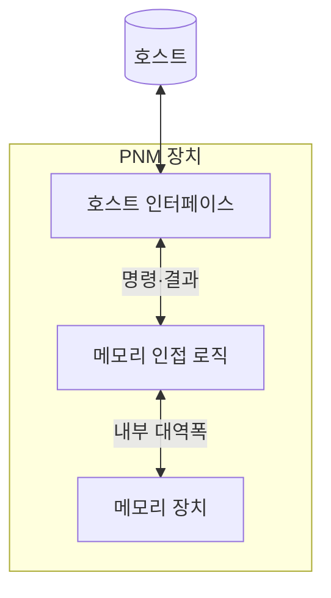
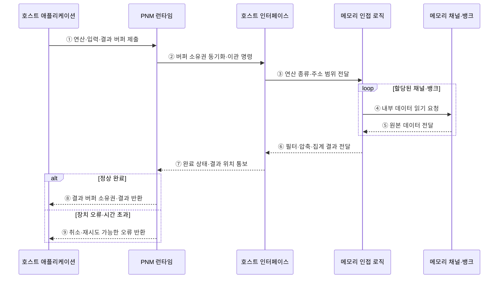

---
sidebar:
  order: 27
  label: "027. PNM 메모리 근접 처리 (Processing Near Memory)"
  badge:
    text: "기출 · 50%"
    variant: note
title: "PNM 메모리 근접 처리 (Processing Near Memory)"
date: "2026-07-28T21:27:55+09:00"
tags:
  - "notes-hardware"
weight: 27
extra:
  question_no: "027"
  source_status: "기출"
  source_history: "131회"
  priority: 50
  priority_note: "연산 위치와 로직 유연성 비교"
---

## 미리 알고가기

- **메모리 근접 처리(Processing-Near-Memory, PNM)**: 메모리 모듈 또는 컨트롤러 인근의 로직에서 데이터를 처리하여 호스트 전송량을 줄이는 구조다
- **메모리 내 처리(Processing-in-Memory, PIM)**: 메모리 셀 또는 뱅크 내부에서 연산하여 데이터 이동을 최소화하는 방식
- **로직 다이(Logic Die)**: 메모리와 같은 패키지 안에 함께 담긴 디지털 연산 전용 칩이며 PNM 연산이 실제로 도는 자리다
- **패키지(Package)**: 여러 다이와 배선·기판을 한 덩어리로 조립한 단위이며, 이 안에 있으면 바깥 보드보다 훨씬 짧고 넓은 연결을 쓸 수 있다
- **디지털 로직(Digital Logic)**: 0과 1 신호로 명령을 수행하는 회로이며, 셀 물리 동작이 아니라 회로 설계이므로 다양한 연산을 프로그래밍해 넣을 수 있다
- **메모리 채널·뱅크(Memory Channel·Bank)**: 데이터를 주고받는 독립 경로가 채널, 동시에 열 수 있는 셀 배열이 뱅크이며 이 둘이 인접 로직에 내부 대역폭을 준다
- **호스트(Host)**: 작업·주소·버퍼 정보를 넘기고 축약 결과와 완료 상태를 받아 가는 실행 주체
- **호스트 인터페이스(Host Interface)**: 그 명령과 결과가 오가는 장치 바깥쪽 연결 규약
- **버퍼(Buffer)**: 입력 데이터와 작업 정보, 결과를 주고받으려고 잡아 두는 메모리 영역
- **연산 이관(Offloading)**: 호스트가 할 일 일부를 메모리 인접 로직으로 넘기는 것
- **스캔(Scan)**: 지정한 데이터 범위를 순차로 훑어 뒤 연산의 입력으로 넘기는 전처리 동작
- **필터·압축·집계(Filter·Compression·Aggregation)**: 조건에 맞는 것만 고르는 동작, 표현 크기를 줄이는 동작, 여러 값을 통계 하나로 합치는 동작이며 셋 다 돌려보낼 양을 줄인다
- **결과 축약(Result Reduction)**: 그렇게 원본보다 훨씬 작은 결과만 만들어 내는 것이며, 이 비율이 낮으면 이관 자체가 이득이 없다
- **곱셈-누산(Multiply-Accumulate, MAC)**: 두 값을 곱한 결과를 기존 부분합에 누적하는 반복 연산
- **런타임(Runtime)**: 실행 중에 작업 이관과 버퍼 배정, 완료와 오류 처리를 관리하는 소프트웨어 계층
- **장애 격리(Fault Isolation)**: 장치 쪽 오류가 호스트까지 번지지 않도록 전파 경로를 끊어 두는 설계
- **PNM DIMM(Processing-Near-Memory Dual In-line Memory Module)**: 메모리 모듈의 버퍼 영역에 연산 로직을 배치한 근접 메모리 처리 장치
- **컴퓨트 익스프레스 링크(Compute Express Link, CXL)**: 호스트와 메모리 장치 사이의 일관성 있는 접근과 메모리 확장을 제공하는 인터커넥트 규격

## Ⅰ. 개요

- 정의/개념: 메모리 인접 **로직 다이**에서 처리해 호스트 전송을 줄이는 구조
- 기존 한계: 호스트 왕복 없이는 원본 전량 **전송 불가피**

### 쉽게 이해하기 (학습용)

- PNM은 메모리 모듈 또는 컨트롤러 인근에서 필터링·집계 연산을 수행하여 호스트로 전송할 데이터량과 메모리 채널의 부하를 줄이는 구조다

## Ⅱ. 특징

- **메모리 인접 로직**의 다중 채널·뱅크 데이터 통합
- 프로그래밍 가능한 **디지털 로직**의 연산 유연성
- 축약 결과만 내보내는 **호스트 전송량** 감소

### 쉽게 이해하기 (학습용)

- 하역장은 선반 사이보다 자리가 넉넉해 여러 통로에서 나온 짐을 한곳에 모아 볼 수 있고 작업대에 어떤 기계를 놓을지도 자유로우며, 그렇게 걸러 낸 작은 결과만 트럭에 실으므로 본사로 가는 길이 한산해진다

## Ⅲ. 아키텍처

**도표안 A — 구조도**

| 구성요소 | 책임 |
|:---|:---|
| 호스트 인터페이스 | 명령·버퍼 수신과 **축약 결과** 반환 |
| 메모리 인접 로직 | 원본 데이터의 **필터·압축·집계** 수행 |
| 메모리 장치 | 채널·뱅크의 **내부 대역폭** 공급 |

> 요약: 원본은 **장치 경계** 안에 남고 결과만 인터페이스 통과

**도표안 B — PNM 작업 이관·결과 반환 시퀀스**

### 동작 원리

1. **① 연산·입력·결과 버퍼 제출**: 호스트 애플리케이션은 수행할 스캔·필터·압축·집계와 입력·결과 버퍼 정보를 PNM 런타임에 제출한다.
2. **② 버퍼 소유권 동기화·이관 명령**: 런타임은 호스트와 장치가 같은 버퍼를 동시에 수정하지 않도록 소유권과 접근 순서를 정한 뒤 명령을 보낸다.
3. **③ 연산 종류·주소 범위 전달**: 호스트 인터페이스는 장치 명령을 해석해 메모리 인접 로직에 실행 코드와 처리 주소 범위를 설정한다.
4. **④ 내부 데이터 읽기 요청**: 인접 로직은 할당된 여러 메모리 채널과 뱅크에 원본 데이터 읽기를 요청한다.
5. **⑤ 원본 데이터 전달**: 메모리 장치는 호스트 링크를 거치지 않고 패키지 내부 대역폭으로 데이터를 인접 로직에 제공한다.
6. **⑥ 필터·압축·집계 결과 전달**: 인접 로직은 원본을 처리하고 크기가 줄어든 결과만 호스트 인터페이스에 전달한다.
7. **⑦ 완료 상태·결과 위치 통보**: 인터페이스는 작업의 정상·오류 상태와 결과 버퍼 위치를 런타임에 알린다.
8. **⑧ 결과 버퍼 소유권·결과 반환**: 정상 완료이면 런타임은 동기화 장벽을 마치고 결과 버퍼의 소유권을 호스트에 돌려준다.
9. **⑨ 취소·재시도 가능한 오류 반환**: 장치 오류나 시간 초과이면 런타임은 장애를 격리하고 호스트가 취소 또는 재시도할 수 있는 상태를 반환한다.

### 쉽게 이해하기 (학습용)

- 호스트로 나가는 선이 인터페이스 한 곳뿐이고 메모리와 로직 사이의 굵은 선은 경계 안에만 있다는 배치가 요지인데, 원본이 그 좁은 문을 지나지 않아도 되기 때문에 문 폭이 그대로여도 실제로 처리하는 양은 크게 늘어난다

## Ⅳ. 종류 및 비교

| 연산 배치 위치 | PNM | PIM |
|:---|:---|:---|
| 적용 기준 | 질의마다 연산이 바뀔 때 | **MAC** 같은 고정 반복이 지배할 때 |
| 핵심 특징 | 로직 다이의 **프로그래밍 가능** 연산 | 셀·뱅크 내부의 **최단 이동** 처리 |
| 한계 | 호스트 왕복만 절감하는 **이동 감소 폭** | 메모리 공정에 갇힌 **연산 표현력** |

> 요약: 이동을 더 줄일수록 **연산 자유도**가 줄어드는 위치 교환

### 쉽게 이해하기 (학습용)

- 연산 로직을 메모리 컨트롤러 쪽에 배치하면 연산 유연성은 높지만 내부 데이터 이동이 남고, 셀 배열 가까이 배치하면 이동량은 줄지만 면적·발열 제약으로 연산 기능이 제한된다

## Ⅴ. 실무 고려사항 및 대책

| 고려사항 | 대책 | 효과 |
|:---|:---|:---|
| 작업 전달·결과 반환 비용이 축약 이득 초과 | 원본·결과 크기와 장치 실행 지연으로 손익 판정 | 비효율 이관 방지 |
| 호스트와 장치가 같은 버퍼를 동시 수정 | 버퍼 소유권·완료 장벽과 일관성 규칙 명시 | 경합·오래된 읽기 방지 |
| 장치 로직 오류가 호스트 작업을 중단 | 타임아웃·취소·재시도와 장애 격리 적용 | 복구 가능성 향상 |
| 요청이 특정 채널·뱅크에 집중 | 데이터 파티셔닝과 큐 깊이·대역폭 관찰 | 내부 병렬성 활용 |

> 사례: **CXL 메모리 장치**는 PNM 로직에서 스캔·압축 선수행

### 쉽게 이해하기 (학습용)

- 링크로 붙인 메모리에서 원본을 그대로 끌어오면 링크가 먼저 막히므로 장치 안에서 조건을 걸고 압축한 결과만 전송하되 이관 비용이 축약 이득보다 크면 호스트 처리를 선택한다

## Ⅵ. 결론

- 질의별 연산 변경이 크고 전송 축약 이득이 이관 비용보다 크면 **PNM** 선택

### 쉽게 이해하기 (학습용)

- 무엇을 계산할지가 질의마다 달라지는 데이터 처리에는 프로그래밍이 되는 문 옆 작업대가 맞고, 늘 같은 곱셈과 덧셈만 반복하는 계산에는 이동이 아예 없는 선반 사이 회로가 맞는다
