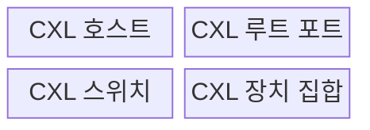
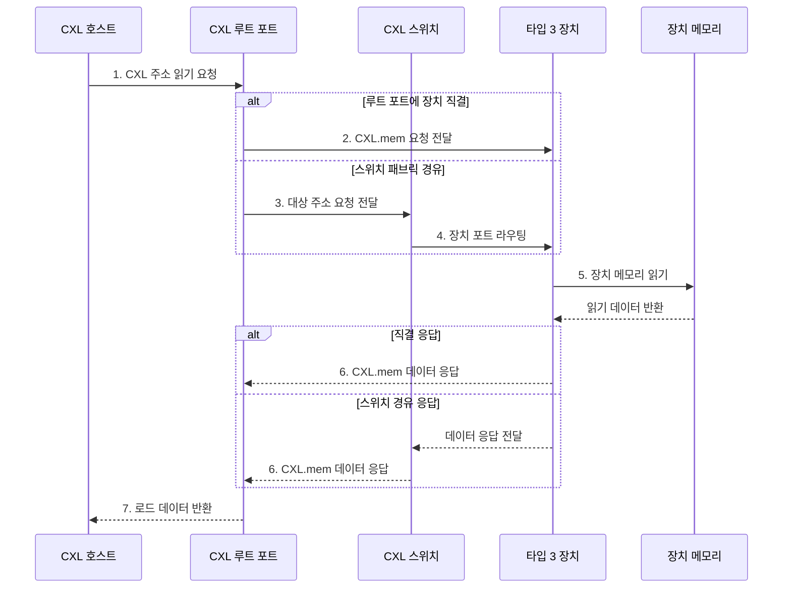

---
sidebar:
  order: 28
  label: "028. CXL 컴퓨트 익스프레스 링크 (Compute Express Link)"
  badge:
    text: "기출 · 70%"
    variant: note
title: "CXL 컴퓨트 익스프레스 링크 (Compute Express Link)"
date: "2026-07-28T21:27:55+09:00"
tags:
  - "notes-hardware"
weight: 28
extra:
  question_no: "028"
  source_status: "기출"
  source_history: "129회"
  priority: 70
  priority_note: "메모리 확장·공유 구조의 핵심 인터커넥트"
---

## 미리 알고가기

- **컴퓨트 익스프레스 링크(Compute Express Link, CXL)**: PCIe 물리 계층 위에서 호스트와 장치 사이의 캐시 일관성과 메모리 공유를 제공하는 인터커넥트 규격이다
- **주변 구성요소 상호연결 익스프레스(Peripheral Component Interconnect Express, PCIe)**: CXL이 물리·전기 계층으로 사용하는 고속 직렬 점대점 인터커넥트
- **CXL.io**: 장치 발견·설정과 비일관성 입출력 트랜잭션을 처리하는 CXL 프로토콜
- **CXL.cache**: 장치가 호스트 메모리를 일관성 있게 캐시하도록 지원하는 CXL 프로토콜
- **CXL.mem**: 호스트가 장치 메모리를 로드·스토어 방식으로 접근하도록 지원하는 CXL 프로토콜
- **로드·스토어(Load·Store)**: 메모리 값을 프로세서로 읽어 오는 명령과 값을 메모리에 적는 명령이며, 이 방식이 되면 별도 전송 API 없이 일반 주소처럼 쓸 수 있다
- **다중화(Multiplexing)**: 성격이 다른 여러 논리 요청을 한 물리 링크에 구분해 실어 보내는 방식이며, 그래서 배선 한 벌로 세 프로토콜이 다 다닌다
- **트랜잭션(Transaction)**: 주소·명령·데이터·응답으로 하나가 완결되는 링크 요청 단위
- **루트 포트(Root Port)**: 프로세서 쪽에서 장치 링크로 나가는 시작점이며 장치 발견과 주소 경로가 여기서 출발한다
- **패브릭·스위치(Fabric·Switch)**: 여러 연결을 아우르는 전체 경로망이 패브릭, 요청을 대상 장치로 갈라 주는 장치가 스위치이며 스위치가 있어야 여러 호스트가 한 메모리 무리를 나눠 쓸 수 있다
- **타입 3 장치(Type 3 Device)**: CXL.io와 CXL.mem만 갖춰 확장 메모리 용량을 제공하는 장치 유형
- **CXL 메모리 풀링(CXL Memory Pooling)**: 여러 호스트가 공용 메모리 무리에서 필요한 만큼 용량을 받아 가고 반납하는 운영 방식
- **동적 랜덤 접근 메모리(Dynamic Random-Access Memory, DRAM)**: CXL 확장 메모리의 지연·대역폭을 비교하는 호스트 직결 주기억장치
- **메모리 매핑 입출력(Memory-Mapped Input/Output, MMIO)**: 장치 제어 레지스터를 메모리 주소 공간에 배치하여 읽고 쓰는 방식
- **직접 메모리 접근(Direct Memory Access, DMA)**: 장치가 프로세서의 데이터 복사 없이 호스트 메모리와 직접 데이터를 전송하는 방식
- **상호운용성(Interoperability)**: 서로 다른 회사의 호스트·스위치·장치가 같은 규격으로 문제없이 통신하는 능력
- **장애 도메인(Failure Domain)**: 한 고장이 함께 영향을 주는 장치·링크·스위치의 경계
- **신뢰성·가용성·서비스성(Reliability, Availability, Serviceability, RAS)**: 오류를 탐지·격리·복구하고 정비 중에도 서비스를 지속할 수 있는 시스템 품질 특성

## Ⅰ. 개요

- 정의/개념: PCIe 기반 **캐시·메모리 일관성**
- 배경/필요성: 분리 주소 공간의 **복사·동기화 부담** 완화

### 쉽게 이해하기 (학습용)

- CXL은 호스트와 장치가 일관된 캐시·메모리 접근을 사용해 복사와 메모리 중복을 줄인다

## Ⅱ. 특징

- 한 링크가 **I/O·캐시·메모리** 요청을 다중화
- **하드웨어 일관성** 기반의 복사 없는 메모리 공유
- 지역 **DRAM** 대비 높은 확장 메모리 접근 지연

### 쉽게 이해하기 (학습용)

- CXL은 한 링크에 I/O·캐시·메모리 프로토콜을 싣고, 확장 메모리는 로컬 DRAM보다 느린 별도 계층으로 관리한다

## Ⅲ. 구조 및 구성요소

| 구성요소 | 책임 |
|:---|:---|
| CXL 호스트 | 프로세서 요청과 **메모리 일관성** 관리 |
| CXL 루트 포트 | 호스트·장치 **경로 시작** |
| CXL 스위치 | 요청 분기와 **메모리 풀링** |
| CXL 장치 집합 | 가속기 캐시·**확장 메모리** 제공 |

### 쉽게 이해하기 (학습용)

- 루트 포트와 스위치가 호스트 요청을 일관성을 유지한 채 CXL 장치로 전달한다.

## Ⅳ. 흐름도

**동작 원리**

- **1. CXL 주소 읽기 요청**: 일반 로드 실행
- **2. CXL.mem 요청 전달**: 직결 장치 전달
- **3. 대상 주소 요청 전달**: 스위치 전달
- **4. 장치 포트 라우팅**: 대상 장치 분기
- **5. 장치 메모리 읽기**: 내부 DRAM 조회
- **6. CXL.mem 데이터 응답**: 루트 포트 반환
- **7. 로드 데이터 반환**: 호스트 로드 완료

### 쉽게 이해하기 (학습용)

- 직결은 지연을 줄이고, 스위치 경유는 지연을 더하는 대신 여러 호스트·장치의 메모리 풀링을 지원한다

## Ⅴ. 종류 및 비교

| 인터커넥트 규격 | CXL | PCIe |
|:---|:---|:---|
| 적용 기준 | 일관된 **캐시·메모리 접근**이 필요할 때 | 장치 I/O와 DMA 전송이면 충분할 때 |
| 핵심 특징 | **하드웨어 일관성** 기반 로드·스토어 접근 | **MMIO·DMA** 기반 비일관 전송 |
| 한계 | 링크 경유 **접근 지연**과 상호운용 검증 | 공유 데이터의 **소프트웨어 동기화** |

> 요약: CXL은 PCIe에 일관성 추가

### 쉽게 이해하기 (학습용)

- PCIe는 장치 전송에, CXL은 일관된 캐시·메모리 접근과 용량 확장에 적합하다

## Ⅵ. 실무 고려사항 및 대책

| 고려사항 | 대책 | 효과 |
|:---|:---|:---|
| 로컬 DRAM보다 긴 CXL 메모리 접근 지연 | 데이터 온도·접근 빈도에 따른 계층 배치 | 지연 민감 데이터 보호 |
| 여러 호스트·장치의 패브릭 대역폭 경합 | 경로별 대역폭·큐 깊이 감시와 풀 할당 제한 | 혼잡·꼬리 지연 완화 |
| 일관성 요청 정체로 장치 진행 중단 | 타임아웃·재시도·순환 의존성 검증 | 교착 방지 |
| 링크·스위치 장애와 구현 차이 | 장애 도메인 격리, RAS 시험, 상호운용성 검증 | 서비스 지속성 확보 |

> 사례: **CXL.cache** 기반 호스트 메모리 공유

### 쉽게 이해하기 (학습용)

- CXL.cache로 복사를 줄이되 접근 지연·패브릭 경합·장애 범위를 함께 검증한다

## Ⅶ. 결론

- **복사량·접근 지연·대역폭·장애 범위** 기반 적용

### 쉽게 이해하기 (학습용)

- 용량 확장과 공유 이득이 링크 지연보다 클 때 CXL을 별도 메모리 계층으로 적용한다
