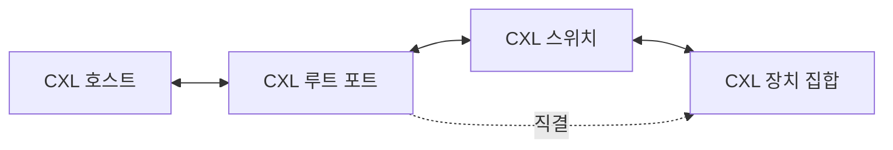
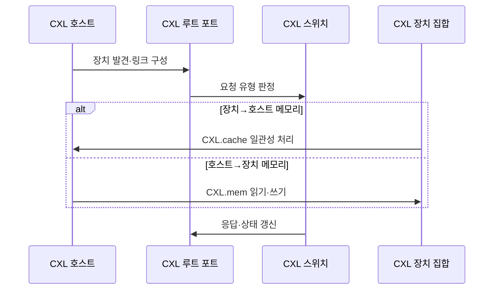

---
sidebar:
  order: 28
  label: "028. CXL 컴퓨트 익스프레스 링크 (Compute Express Link)"
  badge:
    text: "기출 · 70%"
    variant: note
title: "CXL 컴퓨트 익스프레스 링크 (Compute Express Link)"
date: "2026-07-26T11:00:00+09:00"
tags:
  - "notes-hardware"
weight: 28
extra:
  question_no: "028"
  source_status: "기출"
  source_history: "129회"
  priority: 70
  priority_note: "메모리 확장·공유 구조의 핵심 인터커넥트"
---

## 미리 알고가기

- **컴퓨트 익스프레스 링크(Compute Express Link, CXL)**: 이미 깔려 있는 PCIe 도로를 그대로 쓰면서 그 위에 장치가 본사 창고를 직접 읽고 본사가 장치 창고를 자기 것처럼 쓰는 규칙을 얹은 연결 규격이며, 복사해 주고받던 데이터를 같은 주소로 함께 보게 만든다
- **주변 구성요소 상호연결 익스프레스(Peripheral Component Interconnect Express, PCIe)**: 장치를 패킷 기반 직렬 링크로 잇는 표준이며 CXL은 이 물리 계층을 그대로 빌려 쓴다
- **CXL.io**: ‘씨엑스엘 닷 아이오’로 읽으며 장치를 찾아내고 설정하며 일관성이 필요 없는 트랜잭션을 처리하는 프로토콜 영역
- **CXL.cache**: 장치가 호스트 메모리를 자기 캐시에 담고도 하드웨어가 일관성을 지켜 주는 프로토콜 영역
- **CXL.mem**: 호스트가 장치에 붙은 메모리를 로드·스토어 명령으로 자기 메모리처럼 직접 읽고 쓰는 프로토콜 영역
- **로드·스토어(Load·Store)**: 메모리 값을 프로세서로 읽어 오는 명령과 값을 메모리에 적는 명령이며, 이 방식이 되면 별도 전송 API 없이 일반 주소처럼 쓸 수 있다
- **다중화(Multiplexing)**: 성격이 다른 여러 논리 요청을 한 물리 링크에 구분해 실어 보내는 방식이며, 그래서 배선 한 벌로 세 프로토콜이 다 다닌다
- **트랜잭션(Transaction)**: 주소·명령·데이터·응답으로 하나가 완결되는 링크 요청 단위
- **루트 포트(Root Port)**: 프로세서 쪽에서 장치 링크로 나가는 시작점이며 장치 발견과 주소 경로가 여기서 출발한다
- **패브릭·스위치(Fabric·Switch)**: 여러 연결을 아우르는 전체 경로망이 패브릭, 요청을 대상 장치로 갈라 주는 장치가 스위치이며 스위치가 있어야 여러 호스트가 한 메모리 무리를 나눠 쓸 수 있다
- **타입 3 장치(Type 3 Device)**: CXL.io와 CXL.mem만 갖춰 확장 메모리 용량을 제공하는 장치 유형
- **CXL 메모리 풀링(CXL Memory Pooling)**: 여러 호스트가 공용 메모리 무리에서 필요한 만큼 용량을 받아 가고 반납하는 운영 방식
- **동적 랜덤 접근 메모리(Dynamic Random-Access Memory, DRAM)**: 프로세서에 직결된 주기억장치이며 CXL 확장 메모리의 지연을 견주는 기준이 된다
- **메모리 매핑 입출력(Memory-Mapped Input/Output, MMIO)**: 장치 레지스터를 메모리 주소처럼 읽고 쓰는 기존 방식
- **직접 메모리 접근(Direct Memory Access, DMA)**: 장치가 프로세서를 거치지 않고 호스트 메모리를 옮기는 기존 방식이며, 복사가 전제라는 점이 CXL과 갈린다
- **상호운용성(Interoperability)**: 서로 다른 회사의 호스트·스위치·장치가 같은 규격으로 문제없이 통신하는 능력
- **장애 도메인(Failure Domain)**: 한 고장이 함께 영향을 주는 장치·링크·스위치의 경계
- **신뢰성·가용성·서비스성(Reliability, Availability, Serviceability, RAS)**: 오류를 가두고 복구하며 서비스를 이어 가는 능력이며, 메모리가 링크 너머로 나가는 순간 이 설계가 필수가 된다

## Ⅰ. 개요

- **정의/개념**: PCIe 물리 계층 위에 **캐시·메모리 일관성**을 얹은 인터커넥트
- **기존 한계**: 장치 메모리가 분리돼 **복사 없는 공유** 불가

### 쉽게 이해하기 (학습용)

- 가속기에 데이터를 넘기려면 본사 창고에서 꺼내 트럭에 싣고 장치 창고에 부린 뒤 결과를 다시 실어 오는 왕복이 필요했는데, 답안이 배경 자리에 이 복사 강제를 적은 이유는 CXL이 링크를 빠르게 만든 규격이 아니라 옮기지 않고 같은 주소를 함께 보게 만든 규격이기 때문이다

## Ⅱ. 특징

- 한 링크가 **I/O·캐시·메모리** 요청을 다중화
- **하드웨어 일관성** 기반의 복사 없는 메모리 공유
- 지역 **DRAM** 대비 높은 확장 메모리 접근 지연

### 쉽게 이해하기 (학습용)

- 도로 한 벌에 등록·공유·확장 규칙을 함께 태우면 배선을 새로 깔지 않고도 장치와 본사가 같은 창고를 볼 수 있지만, 그 창고는 어차피 도로 건너편에 있어 옆방 창고보다 늘 한 박자 늦으므로 같은 메모리로 취급하지 말고 아래 계층으로 따로 두어야 한다

## Ⅲ. 아키텍처 및 구성요소

| 설계 요소 | 설명 |
|:---|:---|
| CXL 호스트 | 프로세서·호스트 메모리의 **일관성 관리 주체** |
| CXL 루트 포트 | 호스트와 장치 링크를 잇는 **경로 시작점** |
| CXL 스위치 | 요청 분기와 **메모리 풀링** 경로 제공 |
| CXL 장치 집합 | 가속기 캐시 또는 **확장 메모리** 제공 |

> 요약: **스위치** 경유 여부가 풀링 가능 범위를 결정

### 쉽게 이해하기 (학습용)

- 루트 포트에서 장치로 곧장 가는 점선과 스위치를 거치는 실선이 함께 그려진 것이 요지인데, 한 대만 붙일 때는 곧장 이어 지연을 아끼고 여러 호스트가 창고를 나눠 써야 할 때만 분기점을 세워 그 대가로 한 단 더 거치는 시간을 낸다

## Ⅳ. 원리 및 절차 흐름도

| 절차 | 설명 |
|:---|:---|
| 장치 발견·링크 구성 | **CXL.io** 기반 링크 초기화와 기능 구성 |
| 요청 유형 판정 | 접근 주체·대상별 **프로토콜 선택** |
| CXL.cache 일관성 처리 | 장치의 호스트 메모리 접근 **일관성 유지** |
| CXL.mem 읽기·쓰기 | 호스트의 장치 메모리 **로드·스토어** 처리 |
| 응답·상태 갱신 | **트랜잭션** 완료와 일관성 상태 반영 |

> 요약: 방향이 반대인 두 접근을 **서로 다른 프로토콜**이 분담

### 쉽게 이해하기 (학습용)

- 가운데 두 갈래가 화살표 방향까지 반대라는 점이 이 절의 핵심인데, 장치가 본사 창고를 볼 때는 사본을 들고 있어도 되는지가 문제라 캐시 규칙이 붙고 본사가 장치 창고를 볼 때는 그냥 주소를 읽고 쓰면 되므로 메모리 규칙이 붙는다

## Ⅴ. 종류 및 비교

| 인터커넥트 규격 | CXL | PCIe |
|:---|:---|:---|
| 적용 기준 | 복사 없이 **메모리를 공유**해야 할 때 | 장치와 데이터만 주고받으면 될 때 |
| 핵심 특징 | **하드웨어 일관성** 기반 로드·스토어 접근 | **MMIO·DMA** 기반 비일관 전송 |
| 한계 | 링크 경유에 따른 **접근 지연**과 상호운용 검증 | 소프트웨어 동기화와 **복사 비용** |

> 요약: PCIe의 **복사 비용**을 CXL이 지연·검증 부담으로 대체

### 쉽게 이해하기 (학습용)

- 두 한계를 견주면 값을 어디서 내는지가 갈리는데, 복사하는 쪽은 옮길 때마다 시간과 메모리를 쓰고 공유하는 쪽은 옮기지는 않지만 매 접근이 도로를 건너므로 한 번의 접근이 늘 느리고 회사마다 다른 구현이 맞물리는지도 확인해야 한다

## Ⅵ. 실무 사례

1. 가속기 연계는 **CXL.cache**로 호스트 메모리 직접 공유
2. **타입 3 장치** 풀링으로 호스트별 메모리 용량 재할당

### 쉽게 이해하기 (학습용)

- 가속기에 데이터를 복사해 넘기면 큰 모델일수록 옮기는 시간이 계산 시간을 넘어서므로, 본사 창고 주소를 그대로 읽게 하고 사본 정합은 하드웨어가 지키게 맡긴다
- 서버마다 메모리를 넉넉히 꽂아 두면 대부분이 남아도는데, 공용 무리로 빼 두고 지금 필요한 서버에만 나눠 주면 같은 총량으로 더 많은 서버를 돌릴 수 있다

## Ⅶ. 결론

- 공유 이득이 크면 CXL을 쓰되 **지연 계층·RAS 도메인** 분리

### 쉽게 이해하기 (학습용)

- 복사를 없애 얻는 이득이 클 때만 도로 건너 창고를 쓰되, 그 창고는 옆방과 속도가 다르므로 아래 계층으로 따로 두고 고장이 본사까지 번지지 않게 경계도 함께 나눠야 한다
