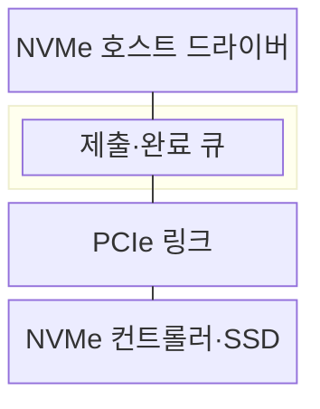
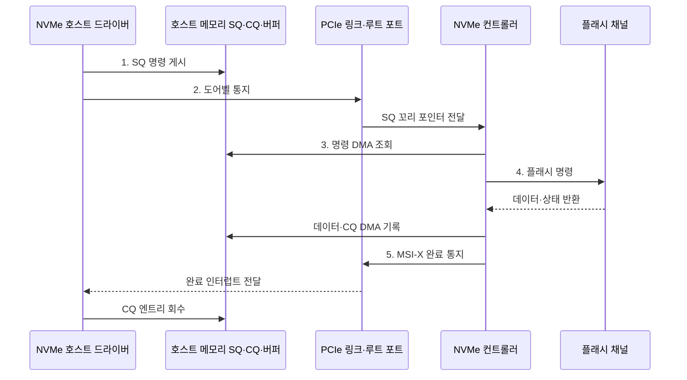

---
sidebar:
  order: 29
  label: "029. NVMe·PCIe 인터페이스 (NVMe PCIe)"
  badge:
    text: "미출 · 50%"
    variant: note
title: "NVMe·PCIe 인터페이스 (NVMe PCIe)"
date: "2026-08-02T10:49:00+09:00"
tags:
  - "notes-hardware"
weight: 29
extra:
  question_no: "029"
  source_status: "미출"
  source_history: ""
  priority: 50
  priority_note: "다중 큐·PCIe 병렬 처리의 핵심 저장 인터페이스"
---

## Ⅰ. 개요

핵심 용어

- **비휘발성 메모리 익스프레스(Non-Volatile Memory Express, NVMe)**: 피시아이 익스프레스(Peripheral Component Interconnect Express, PCIe) 기반 솔리드 스테이트 드라이브(Solid-State Drive, SSD)의 플래시 병렬성을 활용하는 저지연 다중 큐 인터페이스
- **피시아이 익스프레스(Peripheral Component Interconnect Express, PCIe)**: 호스트와 장치를 여러 점대점 직렬 레인으로 연결하는 고속 인터커넥트

- 정의/개념: PCIe SSD의 플래시 병렬성을 활용하도록 설계한 **저지연 다중 큐 저장 인터페이스**
- 배경/필요성: 단일 큐의 **플래시 병렬성 제한** 해소

#### 한줄 요약

- 창구를 여러 개 두고 넓은 통로로 연결해 요청을 함께 처리한다

## Ⅱ. 특징

핵심 용어

- **제출 큐(Submission Queue, SQ)·완료 큐(Completion Queue, CQ)**: 호스트가 명령을 게시하고 컨트롤러가 완료 정보를 기록하는 메모리 큐
- **도어벨·직접 메모리 접근(Direct Memory Access, DMA)**: 새 큐 포인터를 알리는 메모리 매핑 입출력(Memory-Mapped Input/Output, MMIO) 레지스터와 중앙 처리 장치(Central Processing Unit, CPU) 복사 없이 메모리를 읽고 쓰는 전송 방식
- **큐 깊이**: 큐에 동시에 대기시킬 수 있는 명령 수
- **99번째 백분위 지연(99th Percentile Latency, p99 지연)**: 전체 요청의 99%가 이 값 이하에 완료되는 꼬리 지연 지표

- 코어별 **다중 SQ·CQ 구성** 기반 잠금 경합 축소
- 명령 통지와 데이터 전송을 분리하는 **도어벨·DMA 구조**
- 큐 깊이 증가 시 포화 전 **처리량 증가**, 포화 후 **p99 지연 증가**

#### 한줄 요약

- 창구를 늘리면 처리량이 오르지만 작업장 한계 뒤에는 줄만 길어진다

## Ⅲ. 구조 및 구성요소

핵심 용어

- **비휘발성 메모리 익스프레스(Non-Volatile Memory Express, NVMe) 호스트 드라이버**: 운영체제 입출력(Input/Output, I/O)을 NVMe 명령으로 바꾸고 제출·완료 큐를 관리하는 소프트웨어
- **호스트 메모리 큐·버퍼**: 명령·완료 상태와 실제 읽기·쓰기 데이터를 직접 메모리 접근 방식으로 읽고 쓰도록 저장하는 영역
- **직접 메모리 접근(Direct Memory Access, DMA)**: 장치가 CPU 복사 없이 호스트 메모리의 큐와 버퍼를 읽고 쓰는 방식
- **피시아이 익스프레스(Peripheral Component Interconnect Express, PCIe)**: 호스트 메모리와 NVMe 장치 사이의 명령·데이터 경로
- **NVMe 컨트롤러**: 큐 명령을 해석하고 플래시 채널에 병렬 실행하는 솔리드 스테이트 드라이브(Solid-State Drive, SSD) 제어기

| 구성요소 | 책임 |
|:---|:---|
| NVMe 호스트 드라이버 | 명령 변환·**완료 회수** |
| 제출·완료 큐 | 비동기 **작업 상태 기록** |
| PCIe 링크 | 도어벨·명령·**데이터 전송** |
| NVMe 컨트롤러·SSD | DMA·명령 해석·**병렬 처리** |

#### 한줄 요약

- 드라이버와 SSD는 호스트 메모리의 제출·완료 큐를 PCIe로 공유하며 비동기로 작업한다.

## Ⅳ. 흐름도

핵심 용어

- **큐 포인터**: 원형 큐에서 새 항목을 넣거나 회수할 위치를 나타내는 값
- **메시지 신호 인터럽트 확장(Message Signaled Interrupts eXtended, MSI-X)**: 완료를 담당 중앙 처리 장치(Central Processing Unit, CPU)에 알리는 메시지 기반 인터럽트
- **플래시 채널**: 솔리드 스테이트 드라이브(Solid-State Drive, SSD) 컨트롤러가 여러 플래시 메모리 묶음에 병렬 접근하는 독립 경로
- **비휘발성 메모리 익스프레스(Non-Volatile Memory Express, NVMe)**: SQ·CQ와 도어벨·DMA로 비동기 저장 요청을 처리하는 인터페이스
- **제출 큐(Submission Queue, SQ)·완료 큐(Completion Queue, CQ)**: 명령 게시와 완료 회수에 사용하는 호스트 메모리 큐
- **피시아이 익스프레스(Peripheral Component Interconnect Express, PCIe)**: NVMe 컨트롤러와 호스트를 연결하는 직렬 링크

**동작 원리**

1. **SQ 명령 게시**: 명령·버퍼 주소를 호스트 큐에 저장
2. **도어벨 통지**: 새 SQ 꼬리 위치를 컨트롤러에 전달
3. **명령 DMA 조회**: 컨트롤러가 명령 엔트리 회수
4. **플래시 명령**: 채널 실행 후 데이터·상태 생성
5. **MSI-X 완료 통지**: 담당 CPU가 CQ를 회수해 I/O 종료

#### 한줄 요약

- 드라이버가 SQ에 명령을 넣고 도어벨을 누르면 SSD가 DMA로 처리한 뒤 CQ와 인터럽트로 완료를 알린다

## Ⅴ. 종류 및 비교

핵심 용어

- **직렬 ATA(Serial Advanced Technology Attachment, SATA)·고급 호스트 컨트롤러 인터페이스(Advanced Host Controller Interface, AHCI)**: 호환성을 중심으로 단일 명령 큐를 사용하는 전통적인 직렬 저장 인터페이스
- **다중 큐**: 중앙 처리 장치(Central Processing Unit, CPU) 코어나 워크로드별로 독립 제출 큐(Submission Queue, SQ)·완료 큐(Completion Queue, CQ)를 사용해 잠금 경합을 줄이는 구조
- **직렬 레인**: 두 장치 사이의 한 쌍 송수신 경로로 여러 레인을 묶어 PCIe 대역폭을 늘리는 단위
- **비휘발성 메모리 익스프레스(Non-Volatile Memory Express, NVMe)·피시아이 익스프레스(Peripheral Component Interconnect Express, PCIe)**: 다중 큐와 고속 직렬 링크를 결합한 저장 인터페이스

| 저장 인터페이스 | NVMe·PCIe | SATA·AHCI |
|:---|:---|:---|
| 적용 기준 | **고동시성•저지연 SSD** | **호환성 중심 저장장치** |
| 핵심 특징 | 다중 SQ·CQ와 **PCIe 연결** | **SATA·AHCI** 단일 큐 연결 |
| 한계 | 발열·레인·**큐 조정 복잡도** | 큐 병목·**대역폭 한계** |

> 요약: 저지연•동시성은 **NVMe**, 호환성은 **AHCI** 선택

#### 한줄 요약

- NVMe는 다중 창구, AHCI는 호환성 높은 단일 창구에 가깝다

## Ⅵ. 실무 고려사항 및 대책

핵심 용어

- **99번째 백분위 꼬리 지연(99th Percentile Tail Latency, p99 꼬리 지연)**: 전체 요청의 99%가 완료되는 상위 응답시간으로 큐 포화의 영향을 드러내는 지표
- **인터럽트 병합·적응형 폴링**: 여러 완료 통지를 묶거나 부하에 따라 완료 큐(Completion Queue, CQ) 확인 방식을 바꾸는 최적화
- **비균등 메모리 접근(Non-Uniform Memory Access, NUMA) 친화도**: 큐·버퍼·인터럽트 처리 중앙 처리 장치(Central Processing Unit, CPU)와 솔리드 스테이트 드라이브(Solid-State Drive, SSD) 경로를 같은 노드에 배치하는 정책

| 문제 | 대책 | 효과 |
|:---|:---|:---|
| 과도한 큐 깊이로 **p99 지연 증가** | 처리량·꼬리 지연을 측정해 **큐 깊이 제한** | **대기 시간 변동** 완화 |
| 인터럽트 폭증 또는 **폴링 CPU 낭비** | 부하별 **인터럽트 병합•적응형 폴링** | 목표 지연 내 **CPU 사용량 제한** |
| 큐·버퍼·인터럽트의 **원격 NUMA 접근** | 큐 메모리와 **처리 코어•SSD 친화도** 정렬 | **원격 지연** 감소 |
| 지속 쓰기로 **온도 상승•스로틀링** | **온도·대역폭** 감시와 냉각·쓰기 속도 조정 | **지속 처리량** 유지 |

> 사례: 큐·벡터·CPU를 같은 노드에 배치

#### 한줄 요약

- 큐·버퍼·인터럽트를 처리 코어와 같은 NUMA 노드에 두고 큐 깊이를 조절해 p99 지연을 낮춘다

## Ⅶ. 결론

핵심 용어

- **고동시성 입출력(High-Concurrency Input/Output, 고동시성 I/O)**: 많은 독립 저장 요청을 동시에 제출하고 완료할 수 있는 작업 특성
- **큐 포화**: 장치 처리 능력보다 대기 명령이 많아 처리량은 늘지 않고 지연만 증가하는 상태
- **비휘발성 메모리 익스프레스(Non-Volatile Memory Express, NVMe)**: 다중 큐로 많은 저장 요청을 동시에 처리하는 인터페이스
- **99번째 백분위 지연(99th Percentile Latency, p99 지연)**: 큐 포화 시 증가하는 상위 꼬리 지연 지표

- 고동시성은 **NVMe 다중 큐**, p99 상승 시 **큐 깊이 축소**

#### 한줄 요약

- 다중 큐를 쓰되 큐 깊이와 NUMA 배치를 함께 조정해 처리량과 지연을 균형화한다
