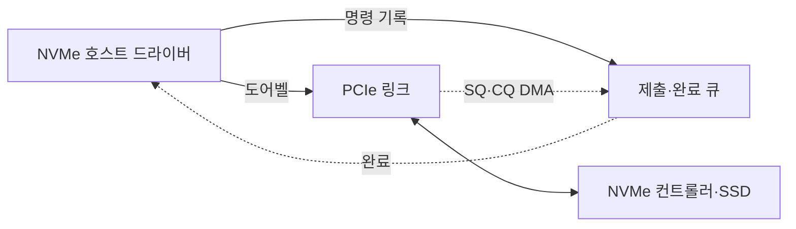
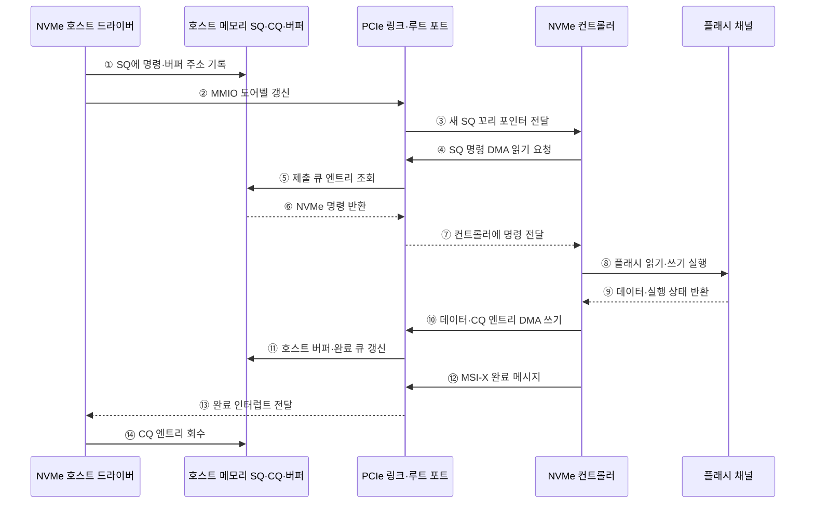

---
sidebar:
  order: 29
  label: "029. NVMe·PCIe 인터페이스 (NVMe PCIe)"
  badge:
    text: "미출 · 50%"
    variant: note
title: "NVMe·PCIe 인터페이스 (NVMe PCIe)"
date: "2026-07-28T12:50:06+09:00"
tags:
  - "notes-hardware"
weight: 29
extra:
  question_no: "029"
  source_status: "미출"
  source_history: ""
  priority: 50
  priority_note: "다중 큐·PCIe 병렬 처리의 핵심 저장 인터페이스"
---

## 미리 알고가기

- **비휘발성 메모리 익스프레스(Non-Volatile Memory Express, NVMe)**: PCIe SSD용 저지연 명령·큐 인터페이스
- **주변 구성요소 상호연결 익스프레스(Peripheral Component Interconnect Express, PCIe)**: 호스트와 장치를 점대점 직렬 레인으로 연결
- **제출 큐(Submission Queue, SQ)**: 호스트가 NVMe 명령을 기록하는 메모리 큐
- **완료 큐(Completion Queue, CQ)**: 컨트롤러가 완료 정보를 기록하는 메모리 큐
- **도어벨(Doorbell)**: 큐 포인터 갱신을 알리는 MMIO 레지스터
- **직접 메모리 접근(Direct Memory Access, DMA)**: 장치가 CPU 개입 없이 호스트 메모리를 읽고 씀
- **확장 메시지 신호 인터럽트(Message Signaled Interrupts eXtended, MSI-X)**: 완료를 CPU에 알리는 메시지 기반 인터럽트
- **큐 깊이(Queue Depth)**: 큐에 동시에 대기할 수 있는 명령 수
- **솔리드 스테이트 드라이브(Solid-State Drive, SSD)**: 플래시 메모리로 비휘발 데이터를 저장하는 장치
- **메모리 매핑 입출력(Memory-Mapped Input/Output, MMIO)**: 장치 레지스터를 메모리 주소처럼 읽고 쓰는 방식
- **직렬 ATA(Serial Advanced Technology Attachment, SATA)**: 저장장치를 직렬 링크로 연결하는 인터페이스
- **고급 호스트 컨트롤러 인터페이스(Advanced Host Controller Interface, AHCI)**: SATA 저장장치의 명령·단일 큐 동작을 정한 인터페이스
- **불균일 메모리 접근(Non-Uniform Memory Access, NUMA)**: 프로세서와 메모리 위치에 따라 접근 지연이 달라지는 구조
- **99백분위 응답시간(99th Percentile, $p99$)**: 전체 요청의 99%가 해당 값 이내에 완료되는 꼬리 응답시간 지표
- **중앙처리장치(Central Processing Unit, CPU)**: 저장장치 드라이버를 실행하고 NVMe 큐와 인터럽트를 처리하며 DMA가 데이터 복사 개입을 줄이는 대상 프로세서
- **호스트 드라이버(Host Driver)**: 운영체제의 읽기·쓰기 요청을 NVMe 명령으로 바꾸고 제출·완료 큐를 관리하는 소프트웨어
- **직렬 레인(Serial Lane)**: 두 장치 사이에서 비트를 순차 전송하는 한 쌍의 송수신 경로로서 PCIe는 여러 레인을 묶어 대역폭을 확장함
- **큐 포인터(Queue Pointer)**: 원형 큐에서 새 항목을 넣거나 회수할 위치를 가리키며 도어벨 레지스터로 SQ 꼬리 갱신을 컨트롤러에 알림
- **버퍼(Buffer)**: NVMe 명령이 읽거나 쓸 데이터를 호스트 메모리에 임시 보관하고 DMA가 접근하도록 주소를 제공하는 영역
- **인터럽트·폴링(Interrupt·Polling)**: 인터럽트는 장치가 완료를 CPU에 비동기로 알리고 폴링은 CPU가 완료 큐를 반복 확인해 지연과 처리 비용을 조절하는 방식
- **플래시 메모리(Flash Memory)**: 전원 없이도 데이터를 보존하며 SSD 컨트롤러가 여러 채널로 병렬 접근하는 비휘발성 반도체 메모리
- **꼬리 응답시간(Tail Latency)**: 대부분의 요청보다 오래 걸리는 상위 백분위 요청의 지연으로서 큐 포화와 NUMA 원격 접근의 영향을 드러내는 지표

## Ⅰ. 개요

- 정의/개념: PCIe 기반 SSD 저지연 다중 큐 인터페이스
- 기존 한계: 단일 명령 큐와 레거시 저장장치 인터페이스는 플래시 메모리의 병렬성과 낮은 지연을 충분히 활용하기 어렵다.

### 쉽게 이해하기 (학습용)

- 창구를 여러 개 두고 넓은 통로로 연결해 요청을 함께 처리한다

## Ⅱ. 특징

- 코어별 **다중 SQ·CQ**로 잠금 경합 축소
- **도어벨·DMA**로 명령 통지와 데이터 전송 분리
- 포화 전 큐 깊이 증가로 **병렬 처리량** 향상
- 포화 후 명령 대기로 **p99 지연** 악화

### 쉽게 이해하기 (학습용)

- 창구를 늘리면 처리량이 오르지만 작업장 한계 뒤에는 줄만 길어진다

## Ⅲ. 아키텍처

**도표안 A — 구조도**

**도표안 B — sequenceDiagram**

| 구성요소 | 입력·상태 | 역할 |
|:---|:---|:---|
| NVMe 호스트 드라이버 | 운영체제 I/O·완료 상태 | NVMe 명령 변환·회수 |
| 제출·완료 큐 | 명령·버퍼 주소·완료 항목 | 호스트–장치 비동기 작업 기록 |
| PCIe 링크 | 도어벨·명령·데이터 | 직렬 레인 전송 |
| NVMe 컨트롤러·SSD | SQ 명령·플래시 상태 | DMA·명령 해석·병렬 처리 |

> 요약: 호스트 메모리 큐와 PCIe가 드라이버와 SSD를 비동기로 연결

**동작 원리**

- **① SQ에 명령·버퍼 주소 기록**: I/O를 NVMe 명령으로 변환해 SQ에 기록
- **② MMIO 도어벨 갱신**: 새 SQ 꼬리 포인터를 레지스터에 기록
- **③ 새 SQ 꼬리 포인터 전달**: MMIO 쓰기를 컨트롤러에 전달
- **④ SQ 명령 DMA 읽기 요청**: 새 SQ 엔트리의 DMA 읽기 시작
- **⑤ 제출 큐 엔트리 조회**: 지정된 호스트 메모리 주소 조회
- **⑥ NVMe 명령 반환**: 명령·논리 블록·버퍼 정보 반환
- **⑦ 컨트롤러에 명령 전달**: DMA로 읽은 명령 전달
- **⑧ 플래시 읽기·쓰기 실행**: 여러 채널·다이에 명령 병렬 배치
- **⑨ 데이터·실행 상태 반환**: 읽기 데이터 또는 완료·오류 상태 반환
- **⑩ 데이터·CQ 엔트리 DMA 쓰기**: 데이터와 완료 정보를 호스트 메모리에 쓰기
- **⑪ 호스트 버퍼·완료 큐 갱신**: 데이터 버퍼와 CQ 엔트리 갱신
- **⑫ MSI-X 완료 메시지**: 새 완료 항목을 메시지로 통지
- **⑬ 완료 인터럽트 전달**: 담당 CPU의 드라이버에 인터럽트 전달
- **⑭ CQ 엔트리 회수**: 상태·명령 식별자를 읽고 I/O 완료

### 쉽게 이해하기 (학습용)

- 드라이버가 SQ에 명령을 넣고 도어벨을 누르면 SSD가 DMA로 처리한 뒤 CQ와 인터럽트로 완료를 알린다

## Ⅳ. 종류 및 비교

| 비교축 | NVMe·PCIe | SATA·AHCI |
|:---|:---|:---|
| 핵심 특징 | 다중 큐·PCIe 점대점 연결 | 단일 큐·SATA 직렬 연결 |
| 큐 구조 | 다중 SQ·CQ | 단일 큐·최대 32명령 |
| 병렬 처리 | 코어별 큐·SSD 채널 활용 | 공유 큐 중심의 제한된 동시성 |
| 적용 기준 | 고동시성·저지연 SSD | 호환성 중심 저장장치 |
| 주요 위험 | 발열·레인·큐 조정 복잡도 | 큐 병목·대역폭 한계 |

> 요약: 저지연·동시성은 NVMe, 호환성은 AHCI가 적합하다

### 쉽게 이해하기 (학습용)

- NVMe는 다중 창구, AHCI는 호환성 높은 단일 창구에 가깝다

## Ⅴ. 실무 고려사항 및 대책

| 운영 위험 | 대응 | 기대 효과 |
|:---|:---|:---|
| 과도한 큐 깊이로 p99 지연 증가 | 처리량·꼬리 지연을 함께 측정해 큐 깊이 제한 | 대기 시간 안정화 |
| 인터럽트 폭증 또는 폴링 CPU 낭비 | 부하별 인터럽트 병합·적응형 폴링 적용 | 지연·CPU 비용 균형 |
| 큐·버퍼·인터럽트의 원격 NUMA 접근 | 큐 메모리와 처리 코어·SSD 친화도 정렬 | 원격 지연 감소 |
| 지속 쓰기로 SSD 온도 상승·스로틀링 | 온도·대역폭 감시와 냉각·쓰기 속도 조정 | 지속 성능 유지 |

> 데이터베이스는 처리 코어별 SQ·CQ와 MSI-X 벡터를 같은 NUMA 노드에 배치해 공유 큐 경합과 원격 접근으로 인한 p99 지연을 줄인다.

### 쉽게 이해하기 (학습용)

- 큐·버퍼·인터럽트를 처리 코어와 같은 NUMA 노드에 두고 큐 깊이를 조절해 p99 지연을 낮춘다

## Ⅵ. 결론

- 고동시성 SSD는 NVMe, 큐·인터럽트·SSD는 같은 노드

### 쉽게 이해하기 (학습용)

- 다중 큐를 쓰되 큐 깊이와 NUMA 배치를 함께 조정해 처리량과 지연을 균형화한다
