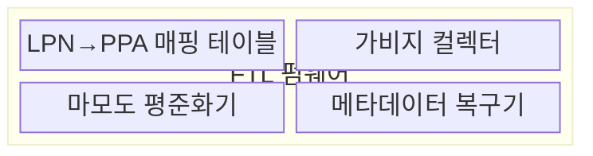
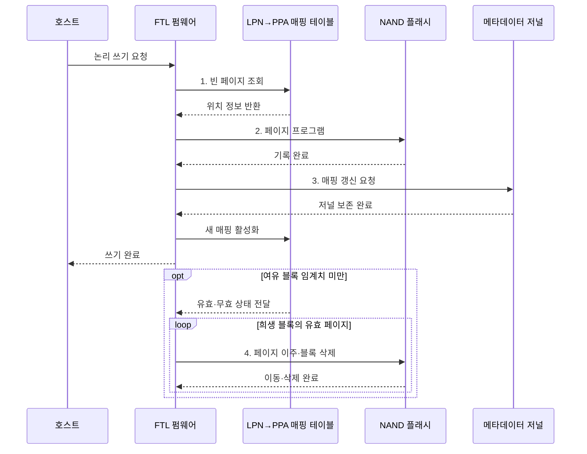

---
sidebar:
  order: 30
  label: "030. SSD FTL 플래시 변환 계층 (Flash Translation Layer)"
  badge:
    text: "기출 · 50%"
    variant: note
title: "SSD FTL 플래시 변환 계층 (Flash Translation Layer)"
date: "2026-08-02T10:50:00+09:00"
tags:
  - "notes-hardware"
weight: 30
extra:
  question_no: "030"
  source_status: "기출"
  source_history: "128회"
  priority: 50
  priority_note: "주소 매핑·GC·쓰기 증폭 판별"
---

## Ⅰ. 개요

핵심 용어

- **FTL**: 호스트 논리 주소를 NAND 물리 위치로 변환해 삭제·마모 제약을 숨기는 SSD 펌웨어 계층
- **NAND 플래시**: 페이지 단위로 기록하고 여러 페이지를 묶은 블록 단위로 삭제하는 비휘발성 메모리

- 정의/개념: NAND 제약을 숨기는 **논리·물리 주소 변환 계층**
- 배경/필요성: 페이지 쓰기·블록 삭제 불일치로 **제자리 갱신 불가**

### 쉽게 이해하기 (학습용)

- 같은 문장을 고칠 때 새 종이에 쓴 뒤 목차를 바꾸고 낡은 종이는 모아 버린다

## Ⅱ. 특징

핵심 용어

- **비제자리 갱신**: 새 물리 페이지에 데이터를 기록한 뒤 기존 페이지를 무효화하는 방식
- **가비지 컬렉션**: 유효 페이지를 옮기고 희생 블록을 삭제해 쓰기 가능한 공간을 회수하는 작업
- **마모도 평준화**: 프로그램·삭제 횟수를 여러 NAND 블록에 분산하는 기법

- **비제자리 갱신**으로 기존 페이지 덮어쓰기 회피
- **가비지 컬렉션**으로 무효 페이지 블록 회수
- **마모도 평준화**로 프로그램·삭제 횟수 분산

$$
Write\ Amplification = \frac{NAND\ Physical\ Write\ Amount}{Host\ Logical\ Write\ Amount}
$$

> GC·메타데이터 쓰기도 물리 쓰기에 포함

### 쉽게 이해하기 (학습용)

- 한 장씩 쓸 수 있지만 묶음째 지워야 하는 규칙을 목차와 빈 공간 관리로 감춘다

## Ⅲ. 구조 및 구성요소

핵심 용어

- **LPN→PPA 매핑**: 논리 페이지 번호를 채널·다이·플레인·블록·페이지의 최신 물리 위치에 연결하는 정보
- **가비지 컬렉터**: 유효 페이지 이주와 블록 삭제를 실행해 여유 공간을 만드는 구성요소
- **메타데이터 복구기**: 체크포인트와 저널을 이용해 정전 후 주소 매핑을 복원하는 구성요소

| 구성요소 | 책임 |
|:---|:---|
| LPN→PPA 매핑 테이블 | 논리 페이지의 **최신 물리 위치** 제공 |
| 가비지 컬렉터 | 유효 페이지 이주와 **블록 회수** |
| 마모도 평준화기 | 블록별 **삭제 부하 분산** |
| 메타데이터 복구기 | 저널 기반 **매핑 복원** |

### 쉽게 이해하기 (학습용)

- 매핑 테이블이 최신 위치를 찾고 수집기·평준화기·복구기가 빈 공간과 수명·정전을 관리한다.

## Ⅳ. 흐름도

핵심 용어

- **페이지 프로그램·블록 삭제**: 빈 NAND 페이지에 데이터를 쓰는 동작과 블록 전체를 초기화하는 동작
- **매핑 저널**: 새 물리 위치를 활성화하기 전에 주소 변경 기록을 영구 저장하는 로그
- **희생 블록**: 유효 페이지를 옮긴 뒤 삭제해 여유 공간으로 회수할 NAND 블록

**동작 원리**

1. **빈 페이지 조회**: 매핑표에서 새 물리 위치 확보
2. **페이지 프로그램**: 기존 페이지 대신 새 페이지에 저장
3. **매핑 갱신 요청**: 저널 보존 후 새 PPA 활성화
4. **페이지 이주·블록 삭제**: 유효 페이지 이동 후 블록 회수

### 쉽게 이해하기 (학습용)

- 목차가 새 위치를 가리키고 청소부가 유효한 종이만 옮긴 뒤 묶음을 비운다

## Ⅴ. 종류 및 비교

핵심 용어

- **페이지 매핑 FTL**: 논리 페이지마다 물리 페이지를 직접 연결해 임의 쓰기 지연을 줄이는 방식
- **블록 매핑 FTL**: 논리 블록과 물리 블록을 연결해 매핑 메모리를 줄이는 방식
- **하이브리드 FTL**: 데이터 블록과 로그 블록 매핑을 결합해 지연과 메타데이터 크기를 절충하는 방식

| FTL 방식 | 페이지 매핑 FTL | 블록 매핑 FTL | 하이브리드 FTL |
|:---|:---|:---|:---|
| 적용 기준 | **임의 쓰기·낮은 지연** | 순차 쓰기·**작은 매핑 메모리** | 임의·순차 **혼합 쓰기** |
| 핵심 특징 | 논리 페이지별 **물리 페이지 직접 매핑** | 논리·물리 **블록 단위 매핑** | 데이터·로그 **블록 매핑 결합** |
| 한계 | 큰 **매핑 테이블 메모리** | 블록 병합의 **쓰기 증폭** | 병합·**메타데이터 복잡도** |

> 요약: 쓰기 패턴과 **매핑 메모리**에 따라 **FTL 방식** 선택

### 쉽게 이해하기 (학습용)

- 문장마다 목차를 두면 빠르고 장마다 두면 작으며 혼합 목차는 두 비용을 절충한다

## Ⅵ. 실무 고려사항 및 대책

핵심 용어

- **초과 예비 공간·TRIM**: 호스트에 숨긴 여유 블록과 사용하지 않는 논리 주소를 SSD에 알리는 명령
- **쓰기 증폭**: 호스트가 쓴 논리 데이터 양에 비해 NAND에 실제로 기록한 물리 데이터 양의 비율
- **체크포인트·저널**: 매핑 기준 상태와 이후 변경을 기록해 정전 후 일관성을 복구하는 메타데이터

| 문제 | 대책 | 효과 |
|:---|:---|:---|
| 여유 블록 고갈로 **전경 GC 발생** | **초과 예비 공간·TRIM** 전달 검증 | **쓰기 꼬리 지연** 완화 |
| 임의 쓰기로 **유효 페이지 이주 증가** | **쓰기 병합•순차화**와 GC 임계치 조정 | **쓰기 증폭** 감소 |
| 특정 블록에 **프로그램•삭제 집중** | **동적•정적 마모도 평준화**와 수명 지표 감시 | **NAND 수명 편차** 감소 |
| 정전 중 매핑 전환으로 **주소 손실** | **체크포인트•저널**과 장애 주입 복구 시험 | **매핑 일관성** 확보 |

> 사례: 여유 공간·TRIM으로 GC 지연 완화

### 쉽게 이해하기 (학습용)

- 데이터베이스 SSD는 초과 예비 공간을 남기고 TRIM으로 버린 주소를 알려 전경 GC와 쓰기 꼬리 지연을 줄인다

## Ⅶ. 결론

핵심 용어

- **임의·순차 쓰기**: 떨어진 논리 주소를 갱신하거나 연속 주소를 차례로 기록하는 쓰기 패턴
- **매핑 메모리**: 논리 주소와 물리 위치의 대응 정보를 SSD 컨트롤러가 보관하는 메모리

- 임의 쓰기는 **페이지**, 순차는 **블록**, 혼합은 하이브리드 선택

### 쉽게 이해하기 (학습용)

- 임의 쓰기는 페이지 매핑, 순차 쓰기는 블록 매핑, 혼합 쓰기는 하이브리드 FTL이 적합하다
