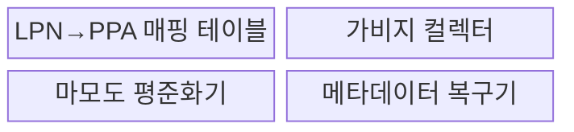
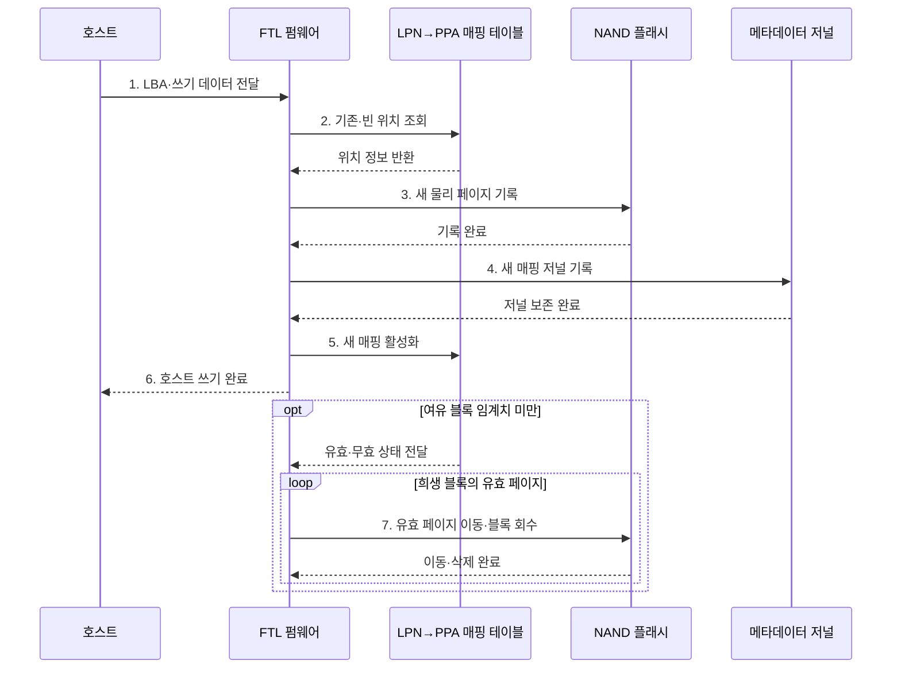

---
sidebar:
  order: 30
  label: "030. SSD FTL 플래시 변환 계층 (Flash Translation Layer)"
  badge:
    text: "기출 · 50%"
    variant: note
title: "SSD FTL 플래시 변환 계층 (Flash Translation Layer)"
date: "2026-07-28T21:27:55+09:00"
tags:
  - "notes-hardware"
weight: 30
extra:
  question_no: "030"
  source_status: "기출"
  source_history: "128회"
  priority: 50
  priority_note: "주소 매핑·GC·쓰기 증폭 판별"
---

## 미리 알고가기

- **솔리드 스테이트 드라이브(Solid-State Drive, SSD)**: NAND 플래시 기반의 비휘발성 저장장치다.
- **플래시 변환 계층(Flash Translation Layer, FTL)**: 논리 블록 주소를 NAND 물리 위치로 변환하여 삭제·마모 제약을 숨기는 SSD 펌웨어
- **낸드 플래시(NAND Flash)**: 페이지 단위 프로그램과 블록 단위 삭제로 데이터를 비휘발성 저장하는 플래시 메모리
- **논리 블록 주소(Logical Block Address, LBA)**: 호스트가 저장장치에 읽기·쓰기를 요청할 때 사용하는 논리 블록 주소
- **논리 페이지 번호(Logical Page Number, LPN)**: NAND 페이지 크기에 맞춰 여러 논리 블록 주소를 묶어 식별하는 번호
- **물리 페이지 주소(Physical Page Address, PPA)**: NAND의 채널·다이·플레인·블록·페이지로 실제 저장 위치를 나타내는 주소
- **비제자리 갱신(Out-of-place Update)**: 새 페이지 기록 후 기존 페이지 무효화
- **가비지 컬렉션(Garbage Collection, GC)**: 유효 페이지를 다른 블록으로 이동한 뒤 희생 블록을 삭제하여 쓰기 가능한 공간을 회수하는 작업
- **마모도 평준화(Wear Leveling)**: 프로그램·삭제 횟수를 블록에 분산
- **초과 예비 공간(Over-provisioning)**: 호스트에 숨긴 여유 블록 공간
- **트림(TRIM)**: 운영체제가 더 이상 사용하지 않는 논리 블록 주소를 SSD에 알려 가비지 컬렉션의 유효 페이지 이동을 줄이는 명령
- **쓰기 증폭(Write Amplification)**: 호스트 쓰기 대비 NAND 물리 쓰기 비율
- **매핑 메타데이터(Mapping Metadata, $LPN \rightarrow PPA$)**: FTL이 논리 페이지별 최신 물리 위치와 체크포인트·저널을 관리하는 주소 대응 정보
- **페이지 매핑 FTL(Page Mapping FTL)**: 논리 페이지마다 물리 페이지를 직접 연결해 임의 쓰기 지연을 줄이는 방식
- **블록 매핑 FTL(Block Mapping FTL)**: 논리 블록과 물리 블록을 연결해 매핑 메모리를 줄이는 방식
- **하이브리드 FTL(Hybrid FTL)**: 데이터·로그 블록 매핑을 결합해 지연과 매핑 크기를 절충하는 방식
- **체크포인트·저널(Checkpoint·Journal)**: 매핑 기준 상태와 이후 변경을 기록해 정전 후 복구하는 메타데이터
- **펌웨어(Firmware)**: 장치 내부 프로세서에서 실행되어 주소 매핑·가비지 컬렉션·마모도 평준화·정전 복구를 제어하는 내장 소프트웨어
- **페이지 프로그램·블록 삭제(Page Program·Block Erase)**: 페이지 프로그램은 비어 있는 NAND 페이지에 데이터를 기록하고 블록 삭제는 여러 페이지를 묶어 초기화하는 서로 다른 쓰기·삭제 단위
- **다이·플레인(Die·Plane)**: 다이는 개별 NAND 반도체 칩이고 플레인은 다이 내부에서 병렬 명령을 수행할 수 있는 블록 배열 구획
- **희생 블록(Victim Block)**: 가비지 컬렉션이 유효 페이지를 옮긴 뒤 삭제해 여유 공간으로 회수하기로 선택한 NAND 블록
- **임의·순차 쓰기(Random·Sequential Write)**: 임의 쓰기는 떨어진 논리 주소를 갱신하고 순차 쓰기는 연속 주소를 기록해 FTL 매핑 크기와 블록 병합 비용에 다른 영향을 줌
- **축전기(Capacitor)**: 전하를 저장했다가 정전 시 잠시 전력을 공급해 기업용 SSD가 매핑 저널 기록을 마무리하도록 돕는 소자

## Ⅰ. 개요

- 정의/개념: NAND 제약을 숨기는 **논리·물리 주소 변환 계층**
- 배경/필요성: 쓰기·삭제 **단위 불일치** 은닉

### 쉽게 이해하기 (학습용)

- 같은 문장을 고칠 때 새 종이에 쓴 뒤 목차를 바꾸고 낡은 종이는 모아 버린다

## Ⅱ. 특징

- **비제자리 갱신**으로 기존 페이지 덮어쓰기 회피
- **가비지 컬렉션**으로 무효 페이지 블록 회수
- **마모도 평준화**로 프로그램·삭제 횟수 분산

$$
Write\ Amplification = \frac{NAND\ Physical\ Write\ Amount}{Host\ Logical\ Write\ Amount}
$$

> GC·메타데이터 쓰기도 물리 쓰기에 포함

### 쉽게 이해하기 (학습용)

- 한 장씩 쓸 수 있지만 묶음째 지워야 하는 규칙을 목차와 빈 공간 관리로 감춘다

## Ⅲ. 구조 및 구성요소

| 구성요소 | 책임 |
|:---|:---|
| LPN→PPA 매핑 테이블 | 논리 페이지의 **최신 물리 위치** 제공 |
| 가비지 컬렉터 | 유효 페이지 이주와 **블록 회수** |
| 마모도 평준화기 | 블록별 **삭제 부하 분산** |
| 메타데이터 복구기 | 저널 기반 **매핑 복원** |

### 쉽게 이해하기 (학습용)

- 매핑 테이블이 최신 위치를 찾고 수집기·평준화기·복구기가 빈 공간과 수명·정전을 관리한다.

## Ⅳ. 흐름도

**동작 원리**

- **1. LBA·쓰기 데이터 전달**: 주소·데이터 전달
- **2. 기존·빈 위치 조회**: 물리 위치 확인
- **3. 새 물리 페이지 기록**: 비제자리 쓰기
- **4. 새 매핑 저널 기록**: 복구 정보 보존
- **5. 새 매핑 활성화**: 이전 페이지 무효화
- **6. 호스트 쓰기 완료**: 완료 반환
- **7. 유효 페이지 이동·블록 회수**: 여유 공간 확보

### 쉽게 이해하기 (학습용)

- 목차가 새 위치를 가리키고 청소부가 유효한 종이만 옮긴 뒤 묶음을 비운다

## Ⅴ. 종류 및 비교

| FTL 방식 | 페이지 매핑 FTL | 블록 매핑 FTL | 하이브리드 FTL |
|:---|:---|:---|:---|
| 적용 기준 | **임의 쓰기·낮은 지연** | 순차 쓰기·**작은 매핑 메모리** | 임의·순차 **혼합 쓰기** |
| 핵심 특징 | 논리 페이지별 **물리 페이지 직접 매핑** | 논리·물리 **블록 단위 매핑** | 데이터·로그 **블록 매핑 결합** |
| 한계 | 큰 **매핑 테이블 메모리** | 블록 병합의 **쓰기 증폭** | 병합·**메타데이터 복잡도** |

> 요약: 쓰기 패턴과 매핑 메모리로 FTL 방식 선택

### 쉽게 이해하기 (학습용)

- 문장마다 목차를 두면 빠르고 장마다 두면 작으며 혼합 목차는 두 비용을 절충한다

## Ⅵ. 실무 고려사항 및 대책

| 고려사항 | 대책 | 효과 |
|:---|:---|:---|
| 여유 블록 고갈로 전경 GC 발생 | 초과 예비 공간 확보와 TRIM 전달 검증 | 쓰기 꼬리 지연 완화 |
| 임의 쓰기로 유효 페이지 이주 증가 | 쓰기 병합·순차화와 GC 임계치 조정 | 쓰기 증폭 감소 |
| 특정 블록 프로그램·삭제 집중 | 동적·정적 마모도 평준화와 수명 지표 감시 | NAND 수명 균등화 |
| 정전 중 매핑 전환으로 주소 손실 | 체크포인트·저널·축전기와 장애 주입 복구 시험 | 매핑 일관성 확보 |

> 사례: 여유 공간·TRIM으로 GC 지연 완화

### 쉽게 이해하기 (학습용)

- 데이터베이스 SSD는 초과 예비 공간을 남기고 TRIM으로 버린 주소를 알려 전경 GC와 쓰기 꼬리 지연을 줄인다

## Ⅶ. 결론

- **쓰기 패턴·매핑 메모리·증폭률·복구 시간** 기반 선택

### 쉽게 이해하기 (학습용)

- 임의 쓰기는 페이지 매핑, 순차 쓰기는 블록 매핑, 혼합 쓰기는 하이브리드 FTL이 적합하다
