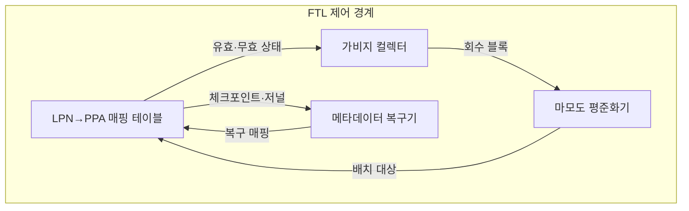
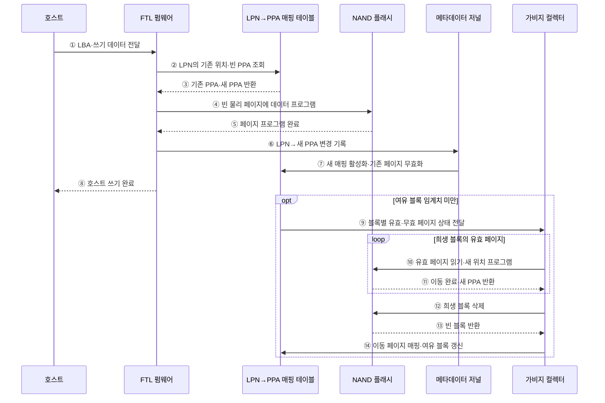

---
sidebar:
  order: 30
  label: "030. SSD FTL 플래시 변환 계층 (Flash Translation Layer)"
  badge:
    text: "기출 · 50%"
    variant: note
title: "SSD FTL 플래시 변환 계층 (Flash Translation Layer)"
date: "2026-07-28T21:27:55+09:00"
tags:
  - "notes-hardware"
weight: 30
extra:
  question_no: "030"
  source_status: "기출"
  source_history: "128회"
  priority: 50
  priority_note: "주소 매핑·GC·쓰기 증폭 판별"
---

## 미리 알고가기

- **솔리드 스테이트 드라이브(Solid-State Drive, SSD)**: NAND 플래시 기반의 비휘발성 저장장치다.
- **플래시 변환 계층(Flash Translation Layer, FTL)**: 논리 블록 주소를 NAND 물리 위치로 변환하여 삭제·마모 제약을 숨기는 SSD 펌웨어
- **낸드 플래시(NAND Flash)**: 페이지 단위 프로그램과 블록 단위 삭제로 데이터를 비휘발성 저장하는 플래시 메모리
- **논리 블록 주소(Logical Block Address, LBA)**: 호스트가 저장장치에 읽기·쓰기를 요청할 때 사용하는 논리 블록 주소
- **논리 페이지 번호(Logical Page Number, LPN)**: NAND 페이지 크기에 맞춰 여러 논리 블록 주소를 묶어 식별하는 번호
- **물리 페이지 주소(Physical Page Address, PPA)**: NAND의 채널·다이·플레인·블록·페이지로 실제 저장 위치를 나타내는 주소
- **비제자리 갱신(Out-of-place Update)**: 새 페이지 기록 후 기존 페이지 무효화
- **가비지 컬렉션(Garbage Collection, GC)**: 유효 페이지를 다른 블록으로 이동한 뒤 희생 블록을 삭제하여 쓰기 가능한 공간을 회수하는 작업
- **마모도 평준화(Wear Leveling)**: 프로그램·삭제 횟수를 블록에 분산
- **초과 예비 공간(Over-provisioning)**: 호스트에 숨긴 여유 블록 공간
- **트림(TRIM)**: 운영체제가 더 이상 사용하지 않는 논리 블록 주소를 SSD에 알려 가비지 컬렉션의 유효 페이지 이동을 줄이는 명령
- **쓰기 증폭(Write Amplification)**: 호스트 쓰기 대비 NAND 물리 쓰기 비율
- **매핑 메타데이터(Mapping Metadata, $LPN \rightarrow PPA$)**: FTL이 논리 페이지별 최신 물리 위치와 체크포인트·저널을 관리하는 주소 대응 정보
- **페이지 매핑 FTL(Page Mapping FTL)**: 논리 페이지마다 물리 페이지를 직접 연결해 임의 쓰기 지연을 줄이는 방식
- **블록 매핑 FTL(Block Mapping FTL)**: 논리 블록과 물리 블록을 연결해 매핑 메모리를 줄이는 방식
- **하이브리드 FTL(Hybrid FTL)**: 데이터·로그 블록 매핑을 결합해 지연과 매핑 크기를 절충하는 방식
- **체크포인트·저널(Checkpoint·Journal)**: 매핑 기준 상태와 이후 변경을 기록해 정전 후 복구하는 메타데이터
- **펌웨어(Firmware)**: 장치 내부 프로세서에서 실행되어 주소 매핑·가비지 컬렉션·마모도 평준화·정전 복구를 제어하는 내장 소프트웨어
- **페이지 프로그램·블록 삭제(Page Program·Block Erase)**: 페이지 프로그램은 비어 있는 NAND 페이지에 데이터를 기록하고 블록 삭제는 여러 페이지를 묶어 초기화하는 서로 다른 쓰기·삭제 단위
- **다이·플레인(Die·Plane)**: 다이는 개별 NAND 반도체 칩이고 플레인은 다이 내부에서 병렬 명령을 수행할 수 있는 블록 배열 구획
- **희생 블록(Victim Block)**: 가비지 컬렉션이 유효 페이지를 옮긴 뒤 삭제해 여유 공간으로 회수하기로 선택한 NAND 블록
- **임의·순차 쓰기(Random·Sequential Write)**: 임의 쓰기는 떨어진 논리 주소를 갱신하고 순차 쓰기는 연속 주소를 기록해 FTL 매핑 크기와 블록 병합 비용에 다른 영향을 줌
- **축전기(Capacitor)**: 전하를 저장했다가 정전 시 잠시 전력을 공급해 기업용 SSD가 매핑 저널 기록을 마무리하도록 돕는 소자

## Ⅰ. 개요

- 정의/개념: NAND 제약을 숨기는 **논리·물리 주소 변환 계층**
- 기존 한계: 페이지 쓰기·블록 삭제의 **단위 불일치**로 제자리 갱신 제약

### 쉽게 이해하기 (학습용)

- 같은 문장을 고칠 때 새 종이에 쓴 뒤 목차를 바꾸고 낡은 종이는 모아 버린다

## Ⅱ. 특징

- **비제자리 갱신**으로 기존 페이지 덮어쓰기 회피
- **가비지 컬렉션**으로 무효 페이지 블록 회수
- **마모도 평준화**로 프로그램·삭제 횟수 분산

$$
Write\ Amplification = \frac{NAND\ Physical\ Write\ Amount}{Host\ Logical\ Write\ Amount}
$$

> 같은 측정 구간의 호스트 쓰기와 GC·메타데이터를 포함한 NAND 물리 쓰기를 비교하며, 값이 클수록 내부 데이터 이동과 수명 소모가 크다.

### 쉽게 이해하기 (학습용)

- 한 장씩 쓸 수 있지만 묶음째 지워야 하는 규칙을 목차와 빈 공간 관리로 감춘다

## Ⅲ. 아키텍처

**도표안 A — 구조도**

| 구성요소 | 책임 |
|:---|:---|
| LPN→PPA 매핑 테이블 | 논리 페이지의 **최신 물리 위치** 제공 |
| 가비지 컬렉터 | 유효 페이지 이주와 **블록 회수** |
| 마모도 평준화기 | 블록별 **프로그램·삭제 부하** 분산 |
| 메타데이터 복구기 | 체크포인트·저널 기반 **매핑 복원** |

> 요약: 매핑·블록 회수·마모 분산·정전 복구 결합

**도표안 B — 비제자리 쓰기·가비지 컬렉션 시퀀스**

### 동작 원리

1. **① LBA·쓰기 데이터 전달**: 호스트는 논리 블록 주소와 새 데이터를 SSD의 FTL 펌웨어에 전달한다.
2. **② LPN의 기존 위치·빈 PPA 조회**: FTL은 LBA를 논리 페이지 번호로 바꾸고 현재 데이터 위치와 쓸 수 있는 빈 물리 페이지를 조회한다.
3. **③ 기존 PPA·새 PPA 반환**: 매핑 테이블은 기존 최신 페이지와 마모도·채널 병렬성을 고려해 할당한 새 물리 페이지 주소를 반환한다.
4. **④ 빈 물리 페이지에 데이터 프로그램**: FTL은 기존 NAND 페이지를 덮어쓰지 않고 새 PPA에 데이터를 기록한다.
5. **⑤ 페이지 프로그램 완료**: NAND는 새 페이지 기록과 오류 검사를 마친 뒤 성공 여부를 FTL에 알린다.
6. **⑥ LPN→새 PPA 변경 기록**: FTL은 정전 후에도 변경 순서를 복구할 수 있도록 새 매핑을 메타데이터 저널에 기록한다.
7. **⑦ 새 매핑 활성화·기존 페이지 무효화**: 저널 기록이 안전해지면 매핑 테이블은 새 PPA를 최신 위치로 바꾸고 기존 페이지를 무효 상태로 표시한다.
8. **⑧ 호스트 쓰기 완료**: 데이터와 필수 매핑 정보가 보존되면 FTL은 호스트에 쓰기 완료를 반환한다.
9. **⑨ 블록별 유효·무효 페이지 상태 전달**: 여유 블록이 임계치 아래로 줄면 매핑 테이블은 무효 페이지 비율이 높은 희생 후보 정보를 가비지 컬렉터에 제공한다.
10. **⑩ 유효 페이지 읽기·새 위치 프로그램**: 가비지 컬렉터는 희생 블록에 남은 유효 페이지를 읽어 다른 빈 블록으로 옮긴다.
11. **⑪ 이동 완료·새 PPA 반환**: NAND는 각 유효 페이지의 이동이 끝날 때 새 물리 위치를 가비지 컬렉터에 반환한다.
12. **⑫ 희생 블록 삭제**: 모든 유효 페이지가 이동하면 가비지 컬렉터는 블록 단위 삭제 명령을 실행한다.
13. **⑬ 빈 블록 반환**: NAND는 삭제가 완료된 블록을 후속 페이지 프로그램에 사용할 수 있는 빈 블록으로 반환한다.
14. **⑭ 이동 페이지 매핑·여유 블록 갱신**: 가비지 컬렉터는 이동한 페이지의 새 PPA와 회수한 여유 블록 상태를 매핑 테이블에 반영한다.

### 쉽게 이해하기 (학습용)

- 목차가 새 위치를 가리키고 청소부가 유효한 종이만 옮긴 뒤 묶음을 비운다

## Ⅳ. 종류 및 비교

| FTL 방식 | 페이지 매핑 FTL | 블록 매핑 FTL | 하이브리드 FTL |
|:---|:---|:---|:---|
| 적용 기준 | **임의 쓰기·낮은 지연** | 순차 쓰기·**작은 매핑 메모리** | 임의·순차 **혼합 쓰기** |
| 핵심 특징 | 논리 페이지별 **물리 페이지 직접 매핑** | 논리·물리 **블록 단위 매핑** | 데이터·로그 **블록 매핑 결합** |
| 한계 | 큰 **매핑 테이블 메모리** | 블록 병합의 **쓰기 증폭** | 병합·**메타데이터 복잡도** |

> 요약: 쓰기 패턴과 매핑 메모리로 FTL 방식 선택

### 쉽게 이해하기 (학습용)

- 문장마다 목차를 두면 빠르고 장마다 두면 작으며 혼합 목차는 두 비용을 절충한다

## Ⅴ. 실무 고려사항 및 대책

| 고려사항 | 대책 | 효과 |
|:---|:---|:---|
| 여유 블록 고갈로 전경 GC 발생 | 초과 예비 공간 확보와 TRIM 전달 검증 | 쓰기 꼬리 지연 완화 |
| 임의 쓰기로 유효 페이지 이주 증가 | 쓰기 병합·순차화와 GC 임계치 조정 | 쓰기 증폭 감소 |
| 특정 블록 프로그램·삭제 집중 | 동적·정적 마모도 평준화와 수명 지표 감시 | NAND 수명 균등화 |
| 정전 중 매핑 전환으로 주소 손실 | 체크포인트·저널·축전기와 장애 주입 복구 시험 | 매핑 일관성 확보 |

> 사례: 데이터베이스 SSD는 여유 공간·TRIM으로 GC 지연 완화

### 쉽게 이해하기 (학습용)

- 데이터베이스 SSD는 초과 예비 공간을 남기고 TRIM으로 버린 주소를 알려 전경 GC와 쓰기 꼬리 지연을 줄인다

## Ⅵ. 결론

- 임의 쓰기 지연은 페이지 매핑, 메모리 제약은 블록·하이브리드 **FTL** 선택

### 쉽게 이해하기 (학습용)

- 무작위 수정은 세밀한 목차를, 순차 기록은 작은 목차를, 혼합은 두 방식을 선택한다
