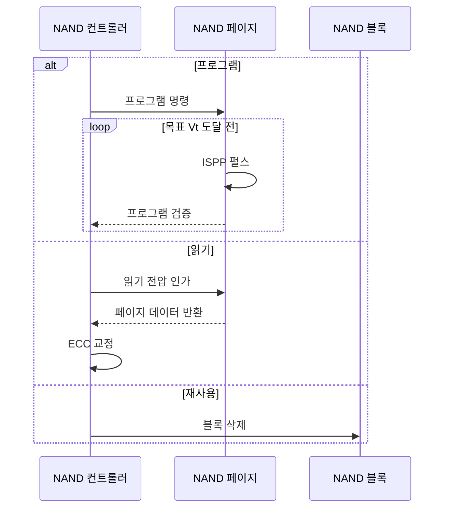

---
sidebar:
  order: 31
  label: "031. 3D V-NAND와 2D NAND 비교 (3D vs 2D NAND)"
  badge:
    text: "기출 · 50%"
    variant: note
title: "3D V-NAND와 2D NAND 비교 (3D vs 2D NAND)"
date: "2026-07-25T17:26:00+09:00"
tags:
  - "notes-hardware"
weight: 31
extra:
  question_no: "031"
  source_status: "기출"
  source_history: "126회"
  priority: 50
  priority_note: "수직 적층·셀 상태·공정 비교"
---

## 미리 알고가기

- **낸드 플래시(NAND Flash)**: ‘낸드 플래시’로 읽고 논리 연산 NOT-AND의 결합을 NAND로 줄여 셀 직렬 구조를 부르는 관례 명칭이며 페이지 기록과 블록 삭제로 비휘발성 데이터를 저장함
- **삼차원 수직 낸드(Three-Dimensional Vertical NAND, 3D V-NAND)**: ‘쓰리디 브이 낸드’로 읽고 공간 차원을 뜻하는 3D와 수직의 머리글자 V를 NAND 앞에 붙이는 관례 표기이며 워드라인 층과 채널을 수직 적층한 구조를 나타냄
- **이차원 평면 낸드(Two-Dimensional Planar NAND, 2D NAND)**: ‘투디 낸드’로 읽고 평면의 두 공간 차원을 숫자 2와 Dimension의 D로 나타내는 관례 표기이며 기판 위 셀 간격을 줄여 집적하는 구조를 나타냄
- **임계 전압(Threshold Voltage, $V_t$)**: ‘브이 서브 티’로 읽고 전압을 뜻하는 $V$의 아래 첨자에 threshold의 머리글자 $t$를 붙이는 반도체 관례 표기이며 NAND 셀의 전하 상태를 구분하는 문턱 전압을 나타냄
- **전하 트랩층(Charge Trap Layer)**: 3D 셀에서 전자를 가두는 절연막
- **워드라인(Word Line)**: 같은 층의 셀 게이트를 선택하는 배선
- **수직 채널 스트링(Vertical Channel String)**: 적층 셀을 직렬로 잇는 수직 통로
- **페이지(Page)**: 같은 워드라인에서 읽고 프로그램하는 단위
- **블록(Block)**: 여러 스트링을 묶은 NAND 삭제 단위
- **셀당 비트(Bits per Cell)**: SLC 1·MLC 2·TLC 3·QLC 4비트
- **단일 수준 셀(Single-Level Cell, SLC)**: 셀 하나에 1비트를 저장해 상태 간 전압 여유와 쓰기 수명이 큰 방식
- **다중 수준 셀(Multi-Level Cell, MLC)**: 셀 하나에 2비트를 저장해 용량과 전압 여유를 절충한 방식
- **삼중 수준 셀(Triple-Level Cell, TLC)**: 셀 하나에 3비트를 저장해 용량을 늘리되 오류 여유와 쓰기 수명이 줄어드는 방식
- **사중 수준 셀(Quad-Level Cell, QLC)**: 셀 하나에 4비트를 저장해 용량을 더 늘리되 전압 상태 구분이 어려워지는 방식
- **증분 단계 펄스 프로그래밍(Incremental Step Pulse Programming, ISPP)**: 펄스와 검증을 반복해 목표 Vt에 도달
- **오류 정정 코드(Error-Correcting Code, ECC)**: NAND 원시 비트 오류를 탐지·교정
- **솔리드 스테이트 드라이브(Solid-State Drive, SSD)**: NAND 플래시와 컨트롤러로 데이터를 저장하는 반도체 저장장치
- **비트라인(Bit Line)**: 수직 채널 스트링의 전류를 감지 회로와 연결하는 배선
- **고종횡비 식각(High-Aspect-Ratio Etching)**: 깊이에 비해 폭이 매우 좁은 수직 구멍을 여러 적층에 균일하게 뚫는 공정
- **SLC 캐시(SLC Cache)**: NAND 일부를 셀당 1비트처럼 사용해 짧은 구간의 쓰기 속도를 높이는 버퍼 영역
- **프로그램(Program)**: NAND 셀에 전압 펄스를 가해 전하 상태를 목표 임계 전압 구간으로 바꾸는 쓰기 동작
- **원시 비트(Raw Bit)**: 오류 정정 전 감지 회로가 읽어 낸 비트로서 ECC가 검출·복구할 입력 데이터
- **감지 회로(Sense Circuit)**: 비트라인 전류나 전압을 기준값과 비교해 셀의 임계 전압 상태를 판독하는 회로
- **셀 간섭·누설(Cell Interference·Leakage)**: 간섭은 인접 셀의 전기장이 임계 전압을 흔드는 현상이고 누설은 갇힌 전하가 빠져나가 데이터 상태가 변하는 현상
- **쓰기 수명(Write Endurance)**: 프로그램·삭제를 반복해도 셀이 규정된 오류 범위에서 데이터를 보존할 수 있는 횟수

## Ⅰ. 개요

- **정의/개념**: 워드라인을 수직 적층해 면적당 용량을 높인 NAND
- **배경/필요성**: 2D 미세화 간섭·누설로 수직 적층 필요

### 쉽게 이해하기 (학습용)

- 집 사이를 더 좁히는 대신 층을 위로 쌓고 수직 통로로 연결해 같은 땅의 방을 늘린다

## Ⅱ. 특징

- 수직 적층은 평면 미세화 없이 면적당 용량을 높인다.
- 큰 셀 치수는 간섭·누설을 줄여 데이터 보존을 돕는다.

### 쉽게 이해하기 (학습용)

- 셀 간격을 더 줄이지 않고 층을 쌓아 용량을 늘리므로 간섭과 누설도 줄일 수 있다

## Ⅲ. 아키텍처 및 구성요소

| 설계 요소 | 설명 |
|:---|:---|
| 워드라인 적층 | 층별 게이트가 같은 높이의 셀 선택 |
| 전하 저장 셀 | 전하량에 따른 임계 전압 상태로 비트 저장 |
| 수직 채널 스트링 | 적층 셀을 직렬 연결해 비트라인과 접속 |
| 페이지·블록 배열 | 페이지 읽기·프로그램, 블록 단위 삭제 |

> 요약: 워드라인 층과 수직 스트링으로 셀 배열 구성

### 쉽게 이해하기 (학습용)

- 층마다 문을 선택하고 수직 통로로 방을 직렬 연결해 페이지와 블록을 만든다

## Ⅳ. 원리 및 절차 흐름도

| 절차 | 설명 |
|:---|:---|
| 프로그램 명령 | 빈 페이지에 목표 임계 전압 상태 지정 |
| ISPP 펄스 | 단계별 전압 펄스로 셀 전하 증가 |
| 프로그램 검증 | 목표 임계 전압 구간 도달 여부 판정 |
| 읽기 전압 인가 | 기준 전압으로 셀 도통 상태 구분 |
| 페이지 데이터 반환 | 감지 결과를 원시 비트로 출력 |
| ECC 교정 | 원시 비트 오류를 검출·복구 |
| 블록 삭제 | 전체 블록의 셀 임계 전압 초기화 |

> 요약: 펄스·검증으로 기록, 기준 전압·ECC로 판독

### 쉽게 이해하기 (학습용)

- 전압을 조금씩 올려 목표 칸에 맞추고 읽을 때는 경계와 오류 정정으로 값을 판별한다

## Ⅴ. 종류 및 비교

| 판단 기준 | 3D V-NAND | 2D NAND |
|:---|:---|:---|
| 핵심 특징 | 워드라인 층을 수직 적층 | 평면 셀 간격 미세화 |
| 채널 구조 | 적층을 관통하는 수직 스트링 | 기판 위 평면 채널 |
| 간섭·누설 | 큰 셀 치수로 완화 | 미세화할수록 증가 |
| 적용 기준 | 고용량·고집적 SSD | 저용량·기존 공정 |
| 주요 위험 | 고종횡비 식각·층 균일도 | 선폭·인접 셀 결합 |

> 요약: 3D는 수직 적층, 2D는 평면 미세화

### 쉽게 이해하기 (학습용)

- 3D는 아파트 층을 늘리고 2D는 단층집 사이를 좁혀 같은 땅의 방을 늘린다

## Ⅵ. 실무 사례

1. 데이터센터 SSD는 3D TLC·강한 ECC로 내구성 확보
2. 고용량 SSD는 3D QLC·SLC 캐시로 쓰기 보완

### 쉽게 이해하기 (학습용)

- 데이터센터 SSD는 셀당 상태 수를 제한하고 ECC로 읽기 오류를 고친다
- 고용량 SSD는 한 셀에 더 담되 빠른 SLC 영역이 먼저 쓰기를 받는다

## Ⅶ. 결론

- 용량은 3D 적층, 수명은 셀당 비트·ECC로 조정

### 쉽게 이해하기 (학습용)

- 같은 면적의 용량은 층수로 늘리고 오류 여유는 셀당 비트 수와 ECC로 지킨다
