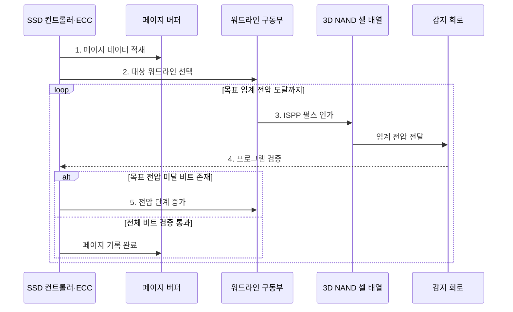

---
sidebar:
  order: 31
  label: "031. 3D V-NAND와 2D NAND 비교 (3D vs 2D NAND)"
  badge:
    text: "기출 · 50%"
    variant: note
title: "3D V-NAND와 2D NAND 비교 (3D vs 2D NAND)"
date: "2026-07-30T18:48:58+09:00"
tags:
  - "notes-hardware"
weight: 31
extra:
  question_no: "031"
  source_status: "기출"
  source_history: "126회"
  priority: 50
  priority_note: "수직 적층·셀 상태·공정 비교"
---

## 미리 알고가기

- **낸드 플래시(NAND Flash)**: 페이지 단위 기록과 블록 단위 삭제로 데이터를 비휘발성 저장하는 플래시 메모리
- **삼차원 수직 낸드(Three-Dimensional Vertical NAND, 3D V-NAND)**: 워드라인 층과 채널을 수직으로 적층하여 집적도를 높인 NAND 구조
- **이차원 평면 낸드(Two-Dimensional Planar NAND, 2D NAND)**: 기판 평면에서 셀 간격을 줄여 집적도를 높이는 NAND 구조
- **임계 전압(Threshold Voltage, $V_t$)**: ‘브이 서브 티’로 읽고 전압을 뜻하는 $V$의 아래 첨자에 threshold의 머리글자 $t$를 붙이는 반도체 관례 표기이며 NAND 셀의 전하 상태를 구분하는 문턱 전압을 나타냄
- **전하 트랩층(Charge Trap Layer)**: 3D 셀에서 전자를 가두는 절연막
- **워드라인(Word Line)**: 같은 층의 셀 게이트를 선택하는 배선
- **수직 채널 스트링(Vertical Channel String)**: 적층 셀을 직렬로 잇는 수직 통로
- **페이지(Page)**: 같은 워드라인에서 읽고 프로그램하는 단위
- **블록(Block)**: 여러 스트링을 묶은 NAND 삭제 단위
- **셀당 비트(Bits per Cell)**: SLC 1·MLC 2·TLC 3·QLC 4비트
- **단일 수준 셀(Single-Level Cell, SLC)**: 셀 하나에 1비트를 저장하여 전압 여유와 쓰기 수명이 큰 NAND 셀
- **다중 수준 셀(Multi-Level Cell, MLC)**: 셀 하나에 2비트를 저장하는 NAND 셀
- **삼중 수준 셀(Triple-Level Cell, TLC)**: 셀 하나에 3비트를 저장하는 NAND 셀
- **사중 수준 셀(Quad-Level Cell, QLC)**: 셀 하나에 4비트를 저장하는 NAND 셀
- **증분 단계 펄스 프로그래밍(Incremental Step Pulse Programming, ISPP)**: 프로그램 펄스와 검증을 반복하여 셀을 목표 임계 전압에 도달시키는 방식
- **오류 정정 코드(Error-Correcting Code, ECC)**: NAND에서 발생한 원시 비트 오류를 탐지하고 허용 범위 안에서 교정하는 부호
- **솔리드 스테이트 드라이브(Solid-State Drive, SSD)**: NAND 플래시와 컨트롤러를 결합한 비휘발성 저장장치
- **비트라인(Bit Line)**: 수직 채널 스트링의 전류를 감지 회로와 연결하는 배선
- **고종횡비 식각(High-Aspect-Ratio Etching)**: 깊이에 비해 폭이 매우 좁은 수직 구멍을 여러 적층에 균일하게 뚫는 공정
- **SLC 캐시(SLC Cache)**: NAND 일부를 셀당 1비트처럼 사용해 짧은 구간의 쓰기 속도를 높이는 버퍼 영역
- **프로그램(Program)**: NAND 셀에 전압 펄스를 가해 전하 상태를 목표 임계 전압 구간으로 바꾸는 쓰기 동작
- **원시 비트(Raw Bit)**: 오류 정정 전 감지 회로가 읽어 낸 비트로서 ECC가 검출·복구할 입력 데이터
- **감지 회로(Sense Circuit)**: 비트라인 전류나 전압을 기준값과 비교해 셀의 임계 전압 상태를 판독하는 회로
- **셀 간섭·누설(Cell Interference·Leakage)**: 간섭은 인접 셀의 전기장이 임계 전압을 흔드는 현상이고 누설은 갇힌 전하가 빠져나가 데이터 상태가 변하는 현상
- **쓰기 수명(Write Endurance)**: 프로그램·삭제를 반복해도 셀이 규정된 오류 범위에서 데이터를 보존할 수 있는 횟수
- **페이지 버퍼(Page Buffer)**: 한 페이지의 프로그램 데이터와 읽기 결과를 셀 배열과 외부 인터페이스 사이에서 임시 보관하는 회로
- **워드라인 구동부(Word-line Driver)**: 선택한 워드라인에 읽기·프로그램·삭제에 필요한 전압을 인가하는 회로

## Ⅰ. 개요

- 정의/개념: 워드라인을 **수직 적층**해 면적당 용량을 높인 NAND
- 배경/필요성: 평면 미세화의 **간섭·누설 증가** 완화

### 쉽게 이해하기 (학습용)

- 집 사이를 더 좁히는 대신 층을 위로 쌓고 수직 통로로 연결해 같은 땅의 방을 늘린다

## Ⅱ. 특징

- 평면 미세화 대신 **수직 층수**로 면적당 용량 확대
- 큰 셀 치수로 **셀 간섭·전하 누설** 완화
- **SLC·MLC** 셀당 1·2비트 저장
- **TLC·QLC** 셀당 3·4비트 저장
- 층수 증가에 따른 **고종횡비 식각·균일도** 부담

### 쉽게 이해하기 (학습용)

- 셀 간격을 더 줄이지 않고 층을 쌓아 용량을 늘리므로 간섭과 누설도 줄일 수 있다

## Ⅲ. 구조 및 구성요소

| 구성요소 | 책임 |
|:---|:---|
| 워드라인 적층 | 같은 높이의 **셀 선택** |
| 전하 저장 셀 | 임계 전압으로 **비트 저장** |
| 수직 채널 스트링 | 선택 셀·**비트라인 연결** |
| 페이지·블록 배열 | 페이지 입출력·**블록 삭제** |

### 쉽게 이해하기 (학습용)

- 워드라인 층과 수직 채널이 적층 셀을 선택하고 페이지·블록 단위로 읽고 지운다.

## Ⅳ. 흐름도

**동작 원리**

- **1. 페이지 데이터 적재**: 데이터·ECC 비트를 버퍼에 보관
- **2. 대상 워드라인 선택**: 기록할 수직 문자열의 층 지정
- **3. ISPP 펄스 인가**: 셀 전하를 단계적으로 증가
- **4. 프로그램 검증**: 임계 전압의 목표 도달 여부 판정
- **5. 전압 단계 증가**: 미달 셀만 다음 펄스로 재처리

### 쉽게 이해하기 (학습용)

- ISPP는 전압을 조금씩 높여 기록하고 매번 임계 전압을 확인해 과도한 프로그램을 막는다

## Ⅴ. 종류 및 비교

| NAND 구조 | 3D V-NAND | 2D NAND |
|:---|:---|:---|
| 적용 기준 | **고용량·고집적 SSD** | 저용량·**성숙 평면 공정** |
| 핵심 특징 | 워드라인 **수직 적층·수직 스트링** | 셀 간격 축소의 **평면 미세화** |
| 한계 | **고종횡비 식각·층 균일도** | 미세화에 따른 **셀 간섭·누설** |

> 요약: 3D는 수직 적층, 2D는 평면 미세화

### 쉽게 이해하기 (학습용)

- 3D는 아파트 층을 늘리고 2D는 단층집 사이를 좁혀 같은 땅의 방을 늘린다

## Ⅵ. 실무 고려사항 및 대책

| 고려사항 | 대책 | 효과 |
|:---|:---|:---|
| 층수 증가로 식각·셀 특성 편차 확대 | 층·블록별 보정값과 불량 블록 관리 | 적층 균일도 보완 |
| 보존·마모에 따른 원시 비트 오류 증가 | **ECC** 여유·읽기 재시도·수명 지표 감시 | 데이터 복구 가능성 유지 |
| 인접 워드라인 프로그램 간섭 | ISPP 단계와 프로그램 순서·검증 조정 | 임계 전압 분포 안정화 |
| SLC 캐시 소진 후 지속 쓰기 급락 | 캐시 크기·회수 속도와 캐시 외 쓰기 성능 관찰 | 실제 쓰기 성능 예측 |

> 사례: 3D TLC·ECC로 내구성 확보

### 쉽게 이해하기 (학습용)

- 데이터센터 SSD는 층·블록 편차와 원시 비트 오류를 관찰하고 3D TLC와 강한 ECC로 용량·내구성을 맞춘다

## Ⅶ. 결론

- 고집적은 **3D V-NAND**, 성숙 저용량은 **2D NAND** 선택

### 쉽게 이해하기 (학습용)

- 같은 면적의 용량은 층수로 늘리고 오류 여유는 셀당 비트 수와 ECC로 지킨다
