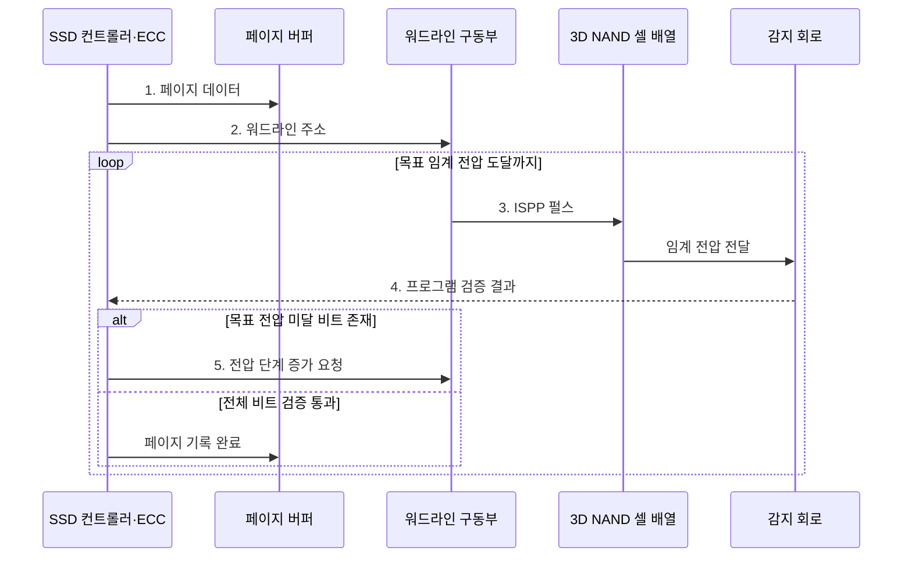

---
sidebar:
  order: 31
  label: "031. 3D V-NAND와 2D NAND 비교 (3D vs 2D NAND)"
  badge:
    text: "기출 · 50%"
    variant: note
title: "3D V-NAND와 2D NAND 비교 (3D vs 2D NAND)"
date: "2026-08-02T10:51:00+09:00"
tags:
  - "notes-hardware"
weight: 31
extra:
  question_no: "031"
  source_status: "기출"
  source_history: "126회"
  priority: 50
  priority_note: "수직 적층·셀 상태·공정 비교"
---

## Ⅰ. 개요

핵심 용어

- **3D V-NAND**: 워드라인 층과 채널을 수직 적층해 면적당 저장 용량을 높인 NAND 구조
- **2D NAND**: 기판 평면에서 셀 간격을 줄여 집적도를 높이는 NAND 구조

- 정의/개념: 워드라인 층과 채널을 **수직 적층**해 면적당 저장 용량을 높인 NAND 구조
- 배경/필요성: 평면 미세화의 **간섭·누설 증가** 완화

#### 한줄 요약

- 집 사이를 더 좁히는 대신 층을 위로 쌓고 수직 통로로 연결해 같은 땅의 방을 늘린다

## Ⅱ. 특징

핵심 용어

- **수직 층수**: 평면 미세화 대신 위로 쌓아 집적도를 높이는 워드라인 적층 수
- **셀 간섭·누설**: 인접 전기장이나 저장 전하 유출로 셀 임계 전압이 흔들리는 현상
- **고종횡비 식각**: 깊고 좁은 수직 채널 구멍을 여러 적층에 균일하게 뚫는 공정

- 평면 미세화 대신 **수직 층수**로 면적당 용량 확대
- 큰 셀 치수로 **셀 간섭·전하 누설** 완화
- 층수 증가에 따른 **고종횡비 식각·균일도** 부담

#### 한줄 요약

- 셀 간격을 더 줄이지 않고 층을 쌓아 용량을 늘리므로 간섭과 누설도 줄일 수 있다

## Ⅲ. 구조 및 구성요소

핵심 용어

- **워드라인 적층**: 같은 높이의 셀 게이트를 선택하도록 층별로 배치한 배선
- **전하 트랩 셀**: 절연막에 전자를 가두고 임계 전압 구간으로 비트를 표현하는 셀
- **수직 채널 스트링**: 여러 적층 셀을 직렬로 연결해 비트라인으로 이어 주는 수직 통로

| 구성요소 | 책임 |
|:---|:---|
| 워드라인 적층 | 같은 높이의 **셀 선택** |
| 전하 저장 셀 | 임계 전압으로 **비트 저장** |
| 수직 채널 스트링 | 선택 셀·**비트라인 연결** |
| 페이지·블록 배열 | 페이지 입출력·**블록 삭제** |

#### 한줄 요약

- 워드라인 층과 수직 채널이 적층 셀을 선택하고 페이지·블록 단위로 읽고 지운다.

## Ⅳ. 흐름도

핵심 용어

- **ISPP**: 프로그램 펄스와 검증을 반복해 셀을 목표 임계 전압에 단계적으로 도달시키는 방식
- **페이지 버퍼**: 한 페이지의 프로그램 데이터와 판독 결과를 임시 보관하는 회로
- **프로그램 검증**: 셀 임계 전압이 목표 구간에 들어왔는지 감지 회로로 확인하는 과정

**동작 원리**

1. **페이지 데이터**: 데이터·ECC 비트를 버퍼에 보관
2. **워드라인 주소**: 기록할 수직 문자열의 층 지정
3. **ISPP 펄스**: 셀 전하를 단계적으로 증가
4. **프로그램 검증 결과**: 목표 임계 전압 도달 여부 판정
5. **전압 단계 증가 요청**: 미달 셀만 다음 펄스로 재처리

#### 한줄 요약

- ISPP는 전압을 조금씩 높여 기록하고 매번 임계 전압을 확인해 과도한 프로그램을 막는다

## Ⅴ. 종류 및 비교

핵심 용어

- **평면 미세화**: 셀 간격과 배선 폭을 줄여 2D 면적당 용량을 높이는 방식
- **층 균일도**: 적층 높이와 위치가 달라도 셀과 채널의 전기 특성이 일정한 정도
- **면적당 용량**: 칩의 평면 면적 하나에 저장할 수 있는 총 데이터 양

| NAND 구조 | 3D V-NAND | 2D NAND |
|:---|:---|:---|
| 적용 기준 | **고용량·고집적 SSD** | 저용량·**성숙 평면 공정** |
| 핵심 특징 | 워드라인 **수직 적층·수직 스트링** | 셀 간격 축소의 **평면 미세화** |
| 한계 | **고종횡비 식각·층 균일도** | 미세화에 따른 **셀 간섭·누설** |

> 요약: **3D 수직 적층**, **2D 평면 미세화**

#### 한줄 요약

- 3D는 아파트 층을 늘리고 2D는 단층집 사이를 좁혀 같은 땅의 방을 늘린다

## Ⅵ. 실무 고려사항 및 대책

핵심 용어

- **원시 비트 오류·ECC**: 감지 회로가 읽은 교정 전 오류와 이를 검출·정정하는 부호
- **프로그램 간섭**: 인접 워드라인의 쓰기 전압이 다른 셀 임계 전압을 변화시키는 현상
- **SLC 캐시**: NAND 일부를 셀당 1비트처럼 사용해 짧은 구간의 쓰기 속도를 높이는 영역

| 문제 | 대책 | 효과 |
|:---|:---|:---|
| 층수 증가로 **식각•셀 특성 편차 확대** | **층•블록별 보정값**과 불량 블록 관리 | 층·블록별 **임계 전압 편차 감소** |
| 보존·마모에 따른 **원시 비트 오류 증가** | **ECC** 여유·읽기 재시도·수명 지표 감시 | 허용 범위 내 **원시 비트 오류 정정** |
| 인접 워드라인의 **프로그램 간섭** | **ISPP 단계•프로그램 순서** 조정 | **임계 전압 분포 겹침 감소** |
| SLC 캐시 소진 후 **지속 쓰기 급락** | **캐시 크기•회수 속도**와 캐시 외 성능 관찰 | 캐시 소진 후 **지속 쓰기 처리량 산정** |

> 사례: 3D TLC·ECC로 내구성 확보

#### 한줄 요약

- 데이터센터 SSD는 층·블록 편차와 원시 비트 오류를 관찰하고 3D TLC와 강한 ECC로 용량·내구성을 맞춘다

## Ⅶ. 결론

핵심 용어

- **고집적 SSD**: 제한된 칩 면적에 많은 NAND 용량을 제공해야 하는 저장장치
- **성숙 평면 공정**: 제조 경험과 수율이 안정된 2D NAND 생산 기술

- 고집적은 **3D V-NAND**, 성숙 저용량은 **2D NAND** 선택

#### 한줄 요약

- 같은 면적의 용량은 층수로 늘리고 오류 여유는 셀당 비트 수와 ECC로 지킨다
