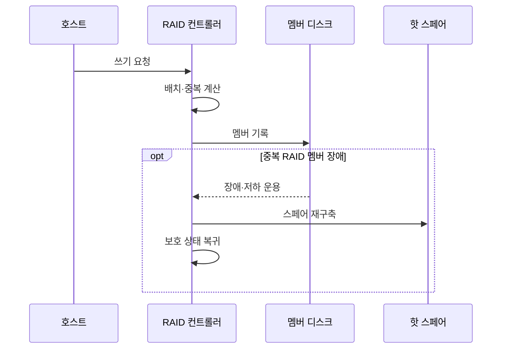

---
sidebar:
  order: 32
  label: "032. RAID 레벨 0·1·5·6·10 비교 (RAID Levels)"
  badge:
    text: "기출 · 70%"
    variant: note
title: "RAID 레벨 0·1·5·6·10 비교 (RAID Levels)"
date: "2026-07-27T23:59:59+09:00"
tags:
  - "notes-hardware"
weight: 32
extra:
  question_no: "032"
  source_status: "기출"
  source_history: "125회, 131회"
  priority: 70
  priority_note: "반복 기출·용량·장애·재구축 비교"
---

## 미리 알고가기

- **독립 디스크 중복 배열(Redundant Array of Independent Disks, RAID)**: ‘레이드’로 읽고 영문 머리글자를 단어처럼 읽는 약어이며, 여러 디스크에 데이터를 분산·중복해 성능과 가용성을 조절하는 배열이다.
- **스트라이핑(Striping)**: 데이터를 스트라이프 단위로 멤버에 분산
- **스트라이프 단위(Stripe Unit)**: 한 멤버에 연속 기록하는 데이터 조각
- **미러링(Mirroring)**: 같은 데이터를 별도 멤버에 복제
- **패리티(Parity)**: 남은 데이터와 결합해 손실 데이터를 계산·복원하는 중복 정보
- **레이드 텐(RAID 10·RAID 1+0)**: ‘레이드 텐·레이드 원 플러스 제로’로 읽고 덧셈 기호($+$)가 안쪽 RAID 1 미러 쌍 위에 바깥쪽 RAID 0 스트라이핑을 조합함을 나타내는 관례 표기이며 쓰기 병렬성과 미러 장애 복구를 함께 제공함
- **RAID 0**: 중복 없이 데이터를 여러 디스크에 분산해 처리량을 높이지만 한 디스크 장애에도 전체 배열이 손실되는 레벨
- **RAID 1**: 같은 데이터를 두 디스크에 복제해 한쪽 장애를 견디지만 사용 가능 용량이 절반인 레벨
- **RAID 5**: 데이터와 단일 패리티를 분산해 디스크 한 개 장애를 견디는 레벨
- **RAID 6**: 데이터와 이중 패리티를 분산해 디스크 두 개 장애를 견디는 레벨
- **성능 저하 모드(Degraded Mode)**: 멤버 장애 후 중복 정보로 운용하는 상태
- **재구축(Rebuild)**: 미러·패리티로 교체 멤버를 복원
- **핫 스페어(Hot Spare)**: 장애 시 재구축에 즉시 쓰는 대기 디스크
- **장애 도메인(Failure Domain)**: 함께 고장 날 수 있는 전원·섀시·컨트롤러 경계
- **멤버 수 $N$·디스크 용량 $S$**: ‘엔·에스’로 읽고 개수를 뜻하는 Number의 $N$과 크기를 뜻하는 Size의 $S$를 쓰는 계산 관례 표기이며 동일 용량 RAID의 전체 멤버 수와 멤버 한 개의 용량을 나타냄
- **입출력(Input/Output, I/O)**: ‘아이오’로 읽고 입력·출력의 영문 머리글자를 빗금으로 구분한 표기이며, 호스트와 디스크 사이의 읽기·쓰기 요청과 데이터 전달이다.
- **호스트(Host)**: RAID 배열에 논리 블록 읽기·쓰기를 요청하는 서버
- **논리 블록(Logical Block)**: 운영체제가 연속 번호로 다루며 컨트롤러가 실제 디스크 위치로 매핑하는 저장 단위
- **쓰기 패널티(Write Penalty)**: 패리티 RAID의 작은 쓰기에서 기존 데이터·패리티 읽기와 새 패리티 기록이 추가되는 비용
- **레이드 레벨 0·1·5·6·10(RAID Levels 0·1·5·6·10)**: 각각 ‘레이드 제로·원·파이브·식스·텐’으로 읽고 RAID 규격의 데이터 배치·중복 방식을 구분하는 관례 번호이며 스트라이핑·미러링·단일 패리티·이중 패리티·미러 쌍 스트라이핑을 나타냄
- **배타적 논리합(Exclusive OR, XOR)**: ‘엑스오알’로 읽고 영문 핵심 글자를 딴 약어이며, RAID 5·6의 패리티 생성과 손실 데이터 복원에 쓰는 논리 연산이다.
- **가용성(Availability)**: 디스크 장애가 발생해도 배열이 읽기·쓰기 서비스를 계속 제공할 수 있는 성질
- **백업(Backup)**: 원본과 독립된 시점·매체에 데이터 사본을 보관해 삭제·변조·배열 전체 손실에서 복구하는 수단으로서 RAID의 장애 가용성과 구분됨
- **레이드 컨트롤러(RAID Controller)**: 호스트 논리 블록을 멤버·오프셋으로 매핑하고 스트라이핑·미러·패리티·장애·재구축을 제어하는 장치나 소프트웨어
- **오프셋(Offset)**: 멤버 디스크 내부의 기준 위치에서 얼마나 떨어진 블록인지를 나타내는 상대 주소
- **섀시·전원(Chassis·Power Supply)**: 섀시는 디스크와 제어기를 수용하는 물리 구조이고 전원은 장치에 전력을 공급하며 공유 여부가 함께 고장 날 수 있는 장애 도메인을 결정함
- **부팅 볼륨(Boot Volume)**: 운영체제를 시작하는 코드와 시스템 파일을 담는 논리 저장 영역으로서 단순 복제 RAID 1의 적용 대상이 됨
- **재구축 위험(Rebuild Risk)**: 고장 멤버를 복원하는 동안 남은 디스크에 부하가 집중되고 추가 장애에 대한 중복 여유가 줄어드는 위험

## Ⅰ. 개요

- 정의/개념: 디스크 **분산·중복**으로 성능·가용성을 조절하는 배열
- 기존 한계: 단일 디스크의 **처리량·장애 허용성** 확장 한계

### 쉽게 이해하기 (학습용)

- 짐을 여러 트럭에 나누고 복사본이나 복구표를 더해 속도와 고장 대비를 조절한다

## Ⅱ. 특징

- **스트라이핑**으로 디스크 병렬 처리량 확대
- **미러·패리티**로 멤버 장애 중 서비스 지속
- 재구축 중 부하 증가와 **추가 장애 위험** 확대

### 쉽게 이해하기 (학습용)

- 배열이 고장을 버텨도 삭제·변조된 파일까지 되돌리지는 못하므로 별도 백업이 필요하다

## Ⅲ. 아키텍처 및 구성요소

| 설계 요소 | 설명 |
|:---|:---|
| RAID 컨트롤러 | 호스트 I/O·레벨 상태·장애 제어 |
| 스트라이프 매퍼 | 논리 블록을 멤버·오프셋으로 변환 |
| 중복 엔진 | 미러·패리티 생성과 손실 데이터 복원 |
| 멤버 디스크·장애 도메인 | 데이터·중복 정보를 독립 경계에 배치 |

> 요약: 블록 매핑 후 미러·패리티를 멤버에 배치

### 쉽게 이해하기 (학습용)

- 배차표가 트럭과 칸을 선택하면 중복 엔진이 복사본이나 복구표를 함께 싣는다

## Ⅳ. 원리 및 절차 흐름도

| 절차 | 설명 |
|:---|:---|
| 쓰기 요청 | 호스트 논리 블록과 데이터 수신 |
| 배치·중복 계산 | 멤버·오프셋과 미러·패리티 계산 |
| 멤버 기록 | 데이터·중복 정보를 대상 디스크에 기록 |
| 장애·저하 운용 | 실패 멤버 격리 후 중복 정보로 처리 |
| 스페어 재구축 | 미러·패리티로 스페어에 데이터 복원 |
| 보호 상태 복귀 | 재구축 완료 후 정상 중복 상태 전환 |

> 요약: 중복 기록으로 장애 운용 후 스페어 재구축

### 쉽게 이해하기 (학습용)

- 고장 난 트럭의 짐을 복사본이나 복구표로 계속 읽고 예비 트럭에 다시 채운다

## Ⅴ. 종류 및 비교

| RAID 레벨 | RAID 0 | RAID 1 | RAID 5 | RAID 6 | RAID 10 |
|:---|:---|:---|:---|:---|:---|
| 적용 기준 | **임시·재생성 데이터** | 단순 복제·**부팅 볼륨** | 읽기 중심·**용량 효율** | 대형 배열·**재구축 위험** | 쓰기 집중형 **데이터베이스** |
| 핵심 특징 | 스트라이핑·**중복 없음** | 미러링·**한쪽 장애 허용** | 단일 분산 패리티·**1개 장애 허용** | 이중 분산 패리티·**2개 장애 허용** | 미러 쌍 스트라이핑·**쌍별 1개 허용** |
| 한계 | 한 멤버 장애 시 **전체 손실** | 사용 가능 **용량 절반** | 작은 쓰기의 **패리티 갱신** | 이중 패리티 **쓰기 패널티** | 같은 미러 쌍 **동시 장애** |

> 요약: 처리량·사용 용량·허용 장애 수로 레벨 선택

### 쉽게 이해하기 (학습용)

- 복구 불필요 데이터는 0, 복제는 1·10, 한두 장애와 용량 효율은 5·6을 선택한다

## Ⅵ. 실무 사례

1. 쓰기 집중형 데이터베이스는 RAID 10으로 패리티 갱신 제거

### 쉽게 이해하기 (학습용)

- 장부 쓰기가 잦은 데이터베이스는 미러 쌍을 병렬 배치해 패리티 계산을 피한다

## Ⅶ. 결론

- 쓰기 부하는 **RAID 10**, 대형 배열 2장애는 **RAID 6**

### 쉽게 이해하기 (학습용)

- 잦은 쓰기는 미러 쌍을, 긴 재구축 중 두 고장까지 버텨야 하면 이중 패리티를 선택한다
