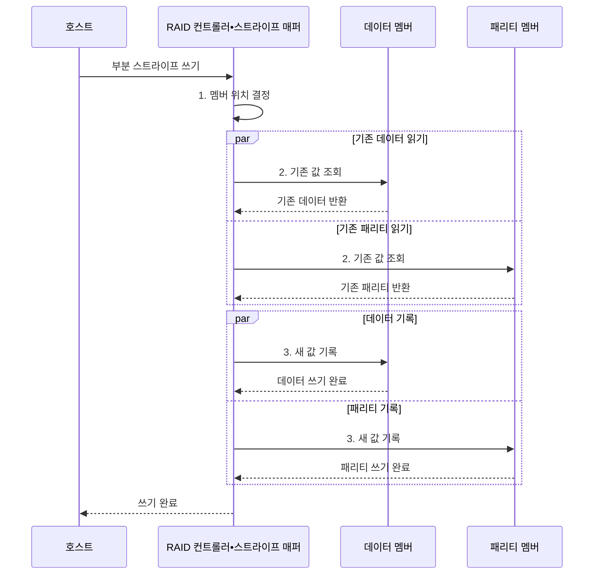

---
sidebar:
  order: 32
  label: "032. RAID 레벨 0•1•5•6•10 비교 (RAID Levels)"
  badge:
    text: "기출 • 70%"
    variant: note
title: "RAID 레벨 0•1•5•6•10 비교 (RAID Levels)"
date: "2026-08-03T09:07:03+09:00"
tags:
  - "notes-hardware"
weight: 32
extra:
  question_no: "032"
  source_status: "기출"
  source_history: "125회, 131회"
  priority: 70
  priority_note: "반복 기출•용량•장애•재구축 비교"
---

## Ⅰ. 개요

핵심 용어

- **독립 디스크 중복 배열(Redundant Array of Independent Disks, RAID)**: 여러 디스크에 데이터를 분산하거나 중복해 처리량과 장애 가용성을 조절하는 구성
- **가용성**: 일부 디스크 장애 중에도 배열이 읽기•쓰기 서비스를 계속 제공하는 성질

- 정의/개념: 디스크 **분산•중복** 으로 성능•가용성을 조절하는 배열
- 배경/필요성: 단일 디스크로는 병렬 처리•장애 중 **서비스 지속 불가**

#### 한줄 요약

- 짐을 여러 트럭에 나누고 복사본이나 복구표를 더해 속도와 고장 대비를 조절한다

## Ⅱ. 특징

핵심 용어

- **스트라이핑**: 데이터를 조각으로 나눠 여러 멤버 디스크에 병렬 배치하는 방식
- **미러링•패리티**: 같은 데이터를 복제하거나 남은 데이터로 손실분을 계산할 중복 정보를 저장하는 방식
- **읽기-수정-쓰기**: 작은 패리티 쓰기에서 기존 데이터•패리티를 읽고 새 값을 다시 기록하는 절차
- **독립 디스크 중복 배열(Redundant Array of Independent Disks, RAID)**: 스트라이핑•미러링•패리티를 조합해 성능과 장애 내성을 정하는 디스크 배열

- 디스크 병렬 처리량을 확대하는 **스트라이핑**
- 멤버 장애 중 서비스를 지속하는 **미러•패리티**
- 패리티 쓰기 패널티를 만드는 **읽기-수정-쓰기**

#### 한줄 요약

- 배열이 고장을 버텨도 삭제•변조된 파일까지 되돌리지는 못하므로 별도 백업이 필요하다

## Ⅲ. 구조 및 구성요소

핵심 용어

- **독립 디스크 중복 배열(Redundant Array of Independent Disks, RAID) 컨트롤러**: 논리 블록 매핑과 스트라이핑•중복•장애•재구축을 제어하는 장치나 소프트웨어
- **스트라이프 매퍼**: 호스트 논리 블록을 실제 멤버 디스크와 오프셋으로 변환하는 구성요소
- **중복 엔진**: 미러 복제와 배타적 논리합(Exclusive OR, XOR) 패리티 생성•손실 데이터 복원을 수행하는 구성요소
- **입출력(Input/Output, I/O)**: 호스트와 디스크 배열 사이의 읽기•쓰기 요청과 데이터 전송

| 구성요소 | 책임 |
|:---|:---|
| RAID 컨트롤러 | 호스트 I/O•**배열 장애** 제어 |
| 스트라이프 매퍼 | 논리 블록의 **멤버•오프셋** 변환 |
| 중복 엔진 | 미러•패리티 생성•**데이터 복원** |
| 멤버 디스크•장애 도메인 | 데이터•중복 블록의 **독립 저장** |

#### 한줄 요약

- 컨트롤러가 블록 위치를 정하고 중복 엔진이 미러•패리티를 만들어 독립 디스크에 저장한다.

## Ⅳ. 흐름도

핵심 용어

- **부분 스트라이프 쓰기**: 한 스트라이프 전체보다 작은 데이터만 갱신해 기존 패리티 조회가 필요한 쓰기
- **배타적 논리합(Exclusive OR, XOR) 패리티**: 여러 데이터 블록의 배타적 논리합으로 생성해 손실 블록을 복원하는 값
- **쓰기 완료 원자성**: 데이터와 패리티가 모두 반영돼 서로 일치한 뒤 호스트에 완료를 알리는 성질
- **독립 디스크 중복 배열(Redundant Array of Independent Disks, RAID) 5**: 단일 분산 패리티로 한 멤버 장애를 허용하는 배열

**동작 원리**

1. **멤버 위치 결정**: 논리 블록의 데이터•패리티 멤버 지정
2. **기존 값 조회**: 데이터와 패리티의 이전 XOR 확보
3. **새 값 기록**: 변경 데이터와 재계산 XOR 저장

#### 한줄 요약

- RAID 5 작은 쓰기는 이전 데이터•패리티를 읽고 새 패리티를 계산한 뒤 데이터•패리티를 함께 갱신한다

## Ⅴ. 종류 및 비교

핵심 용어

- **독립 디스크 중복 배열(Redundant Array of Independent Disks, RAID) 0•1•10**: 중복 없는 스트라이핑, 단순 미러링, 미러 쌍을 다시 스트라이핑한 구성
- **RAID 5•6**: 단일 또는 이중 분산 패리티로 한 개나 두 개 디스크 장애를 견디는 구성
- **사용 가능 용량**: 중복 정보에 쓰는 공간을 제외하고 호스트 데이터에 사용할 수 있는 총용량

| RAID 레벨 | RAID 0 | RAID 1 | RAID 5 | RAID 6 | RAID 10 |
|:---|:---|:---|:---|:---|:---|
| 적용 기준 | **임시•재생성 데이터** | 단순 복제•**부팅 볼륨** | 읽기 중심•**용량 효율** | 대형 배열•**재구축 위험** | 쓰기 집중형 **데이터베이스** |
| 핵심 특징 | 스트라이핑•**용량 \(N S\)** | 미러링•**용량 \(S\)** | 단일 패리티•**용량 \((N-1)S\)** | 이중 패리티•**용량 \((N-2)S\)** | 미러 쌍•**용량 \(NS/2\)** |
| 한계 | 한 멤버 장애 시 **전체 손실** | 사용 가능 **용량 절반** | 작은 쓰기의 **패리티 갱신** | 이중 패리티 **쓰기 패널티** | 같은 미러 쌍 **동시 장애** |

> 용량식은 동일 용량 디스크를 가정

> 요약: **처리량•사용 용량** 및 **허용 장애 수** 기준 레벨 선택

#### 한줄 요약

- 복구 불필요 데이터는 0, 복제는 1•10, 한두 장애와 용량 효율은 5•6을 선택한다

## Ⅵ. 실무 고려사항 및 대책

핵심 용어

- **재구축•핫 스페어**: 중복 정보로 교체 멤버를 복원하는 작업과 즉시 사용할 대기 디스크
- **쓰기 구멍**: 정전이나 부분 실패로 데이터와 패리티 중 일부만 기록돼 서로 불일치하는 문제
- **장애 도메인•백업**: 함께 고장 날 수 있는 전원•섀시 경계와 삭제•변조•배열 전체 손실에 대비한 독립 사본
- **독립 디스크 중복 배열(Redundant Array of Independent Disks, RAID)**: 중복 멤버로 물리 장애를 견디지만 논리 삭제•변조를 복구하는 백업은 아닌 배열

| 문제 | 대책 | 효과 |
|:---|:---|:---|
| 재구축 중 남은 멤버의 **추가 장애** | **핫 스페어•순찰 읽기** 와 재구축 우선순위 조정 | **재구축 취약 시간** 단축 |
| 정전•부분 쓰기로 **데이터•패리티 불일치** | **쓰기 저널•배터리 보호 캐시** 와 패리티 검사 | **쓰기 구멍** 방지 |
| 같은 전원•섀시에 **중복 멤버 집중** | 미러•패리티를 **장애 도메인별 분산** | **상관 장애 내성** 향상 |
| RAID를 백업으로 오인해 **삭제•변조 복구 불가** | **독립 백업** 과 정기 복원 시험 병행 | **논리•배열 전체 손실** 대응 |

> 사례: RAID 10으로 패리티 갱신 제거

#### 한줄 요약

- 쓰기 집중형 데이터베이스는 RAID 10으로 패리티 갱신을 피하고 미러 쌍을 서로 다른 장애 도메인에 배치한다

## Ⅶ. 결론

핵심 용어

- **쓰기 집중 워크로드**: 작은 갱신이 빈번해 패리티 계산과 쓰기 패널티가 성능을 제한하는 작업
- **이중 장애 허용**: 서로 다른 두 멤버가 동시에 고장 나도 데이터를 복원하고 서비스를 유지하는 능력
- **독립 디스크 중복 배열(Redundant Array of Independent Disks, RAID) 10•6**: 각각 미러 쌍 스트라이핑과 이중 패리티로 쓰기 성능이나 이중 장애 허용을 우선하는 구성

- 쓰기 집중은 **RAID 10**, 2개 장애 허용은 **RAID 6** 선택

#### 한줄 요약

- 잦은 쓰기는 미러 쌍을, 긴 재구축 중 두 고장까지 버텨야 하면 이중 패리티를 선택한다
