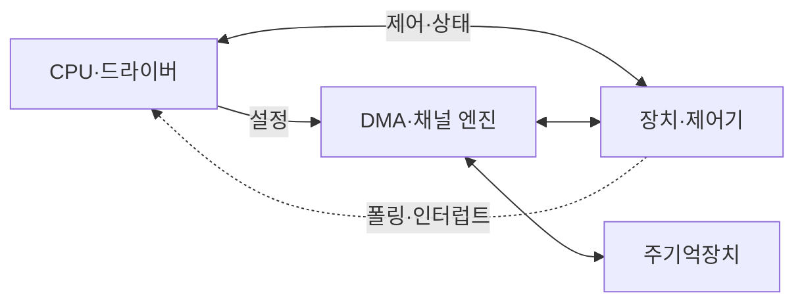
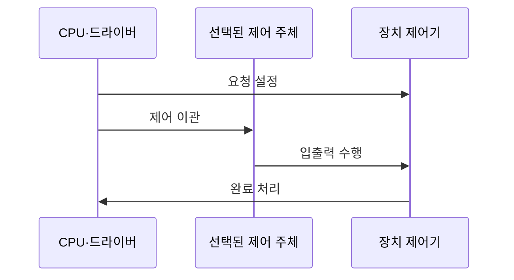

---
sidebar:
  order: 33
  label: "033. I/O 인터페이스 — 폴링·인터럽트·DMA·채널 I/O (I/O Interface)"
  badge:
    text: "기출 · 70%"
    variant: note
title: "I/O 인터페이스 — 폴링·인터럽트·DMA·채널 I/O (I/O Interface)"
date: "2026-07-25T17:27:00+09:00"
tags:
  - "notes-hardware"
weight: 33
extra:
  question_no: "033"
  source_status: "기출"
  source_history: "128회, 132회"
  priority: 70
  priority_note: "반복 기출, 입출력 방식 선택의 상위 주제"
---

## 미리 알고가기

- **입출력 인터페이스(I/O Interface)**: CPU·메모리·장치 사이의 명령·상태·데이터를 중계하는 체계
- **장치 제어기(Device Controller)**: 장치 신호를 레지스터·데이터로 변환
- **폴링(Polling)**: CPU가 장치 상태를 반복 확인
- **인터럽트(Interrupt)**: 장치가 CPU에 상태 변화를 통지
- **직접 메모리 접근(Direct Memory Access, DMA)**: 장치·메모리 간 블록 직접 전송
- **채널 입출력(Channel I/O)**: 채널 프로세서의 I/O 명령열 실행
- **인터럽트 서비스 루틴(Interrupt Service Routine, ISR)**: 인터럽트 원인·완료 상태 처리
- **비휘발성 메모리 익스프레스(Non-Volatile Memory Express, NVMe)**: 병렬 명령·완료 큐 저장장치 인터페이스
- **중앙 처리 장치(Central Processing Unit, CPU)**: 명령을 실행하며 입출력 요청 설정과 완료 처리를 맡는 프로세서
- **버퍼(Buffer)**: 속도가 다른 장치 사이에서 데이터를 임시 저장해 전송 속도 차이를 흡수하는 공간
- **핸드셰이크(Handshake)**: 송수신 측이 준비·완료 신호를 교환해 전송 시점을 맞추는 절차
- **장치 드라이버(Device Driver)**: 운영체제의 입출력 요청을 장치 제어기의 명령으로 바꾸는 소프트웨어
- **DMA 디스크립터(DMA Descriptor)**: 직접 메모리 접근 엔진이 사용할 메모리 주소·길이·방향을 기록한 제어 정보
- **바쁜 대기(Busy Waiting)**: 처리기가 장치 상태를 반복 확인하느라 다른 일을 하지 못하는 대기 방식
- **문맥 전환(Context Switch)**: 인터럽트나 작업 전환 때 현재 실행 상태를 저장하고 다른 실행 상태를 복원하는 처리
- **버스 경합·캐시 일관성**: 버스 경합은 여러 주체가 전송 경로를 동시에 요구하는 충돌이고 캐시 일관성은 DMA 전후 CPU 캐시와 메모리 값을 맞추는 규칙임
- **인터럽트 폭주(Interrupt Storm)**: 짧은 시간에 인터럽트가 과도하게 발생해 CPU가 서비스 루틴 처리에 묶이는 현상
- **메인프레임(Mainframe)**: 많은 입출력과 동시 업무를 전용 채널 프로세서로 처리하는 대형 컴퓨터

## Ⅰ. 개요

- **정의/개념**: CPU·메모리·주변장치의 제어와 전송을 잇는 체계
- **배경/필요성**: 장치 속도 차이로 제어·전송 분리 필요

### 쉽게 이해하기 (학습용)

- 관리자가 배송을 직접 나르지 않고 알림 담당자와 운송 기사에게 일을 나눈다

## Ⅱ. 특징

- 데이터 경로를 분리해 CPU의 전송 관여 시간을 줄인다.
- 버퍼·핸드셰이크가 장치 간 속도 차이를 흡수한다.
- 비동기 완료는 CPU 연산과 I/O를 겹쳐 처리량을 높인다.

### 쉽게 이해하기 (학습용)

- 접수대와 대기표가 장치 속도 차이를 흡수해 관리 업무와 배송을 겹친다

## Ⅲ. 아키텍처 및 구성요소

| 설계 요소 | 설명 |
|:---|:---|
| CPU·드라이버 | 요청 설정과 폴링·인터럽트 완료 처리 |
| 장치·제어기 | 장치 신호와 명령·상태·데이터 변환 |
| DMA·채널 엔진 | 블록 전송 또는 I/O 명령열 실행 |
| 주기억장치 | 데이터·DMA 디스크립터·채널 명령 보관 |

> 요약: 제어기는 상태, 전용 엔진은 데이터 전송 담당

### 쉽게 이해하기 (학습용)

- 접수대는 상태를 알리고 운송 기사나 비서는 큰 전송을 대신 처리한다

## Ⅳ. 원리 및 절차 흐름도

| 절차 | 설명 |
|:---|:---|
| 요청 설정 | 명령·주소·길이를 제어기에 기록 |
| 제어 이관 | CPU·DMA·채널 중 수행 주체 결정 |
| 입출력 수행 | 선택된 주체가 장치 데이터 전송 |
| 완료 처리 | 폴링 확인이나 인터럽트로 완료 회수 |

> 요약: 수행 주체에 제어를 넘기고 완료 상태 회수

### 쉽게 이해하기 (학습용)

- 요청 성격에 맞는 담당자에게 맡기고 완료를 확인한 뒤 작업을 잇는다

## Ⅴ. 종류 및 비교

| 판단 기준 | 폴링 | 인터럽트 | DMA | 채널 I/O |
|:---|:---|:---|:---|:---|
| 핵심 특징 | CPU 상태 확인·전송 | 장치 알림·CPU 서비스 | DMA 엔진 블록 전송 | 채널 프로세서 명령열 실행 |
| 적용 기준 | 매우 짧고 잦은 대기 | 불규칙하고 드문 사건 | 대용량 연속 블록 | 다중 장치·복합 명령열 |
| CPU 개입 | 전 과정 반복 개입 | 사건마다 ISR 실행 | 설정·블록 완료만 처리 | 채널 프로그램·완료만 처리 |
| 주요 위험 | 바쁜 대기·CPU 점유 | 문맥 전환·인터럽트 폭주 | 버스 경합·캐시 일관성 | 전용 하드웨어·명령 복잡도 |

### 쉽게 이해하기 (학습용)

- 짧으면 직접 확인하고 사건은 알림, 큰 블록은 기사, 명령열은 비서에게 맡긴다

## Ⅵ. 실무 사례

1. NVMe는 DMA와 완료 큐 폴링·인터럽트 결합
2. 메인프레임은 채널 프로그램으로 다중 장치 제어

### 쉽게 이해하기 (학습용)

- NVMe는 큰 짐을 기사에게 맡기고 완료 소식은 상황에 맞게 확인한다
- 메인프레임 비서는 여러 배송 명령을 묶어 대신 실행한다

## Ⅶ. 결론

- 대기는 폴링, 사건은 인터럽트, 블록은 DMA, 명령열은 채널

### 쉽게 이해하기 (학습용)

- 대기·사건·짐 크기·명령 수에 맞춰 담당자를 선택해 CPU 시간을 아낀다
