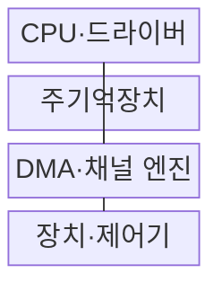
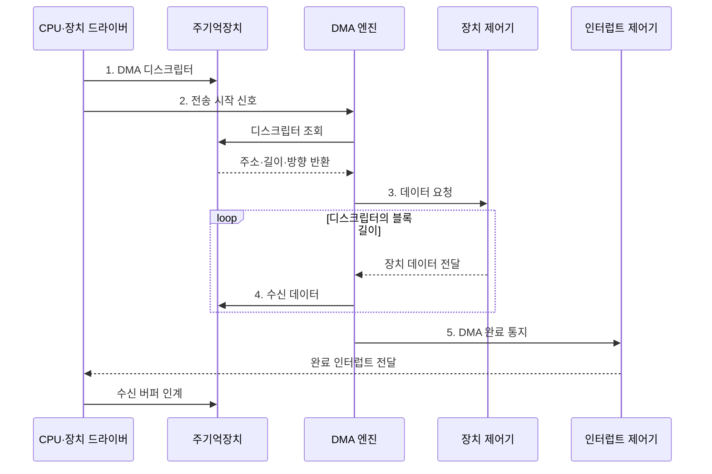

---
sidebar:
  order: 33
  label: "033. I/O 인터페이스: 폴링·인터럽트·DMA·채널 I/O (I/O Interface)"
  badge:
    text: "기출 · 70%"
    variant: note
title: "I/O 인터페이스: 폴링·인터럽트·DMA·채널 I/O (I/O Interface)"
date: "2026-08-02T10:53:00+09:00"
tags:
  - "notes-hardware"
weight: 33
extra:
  question_no: "033"
  source_status: "기출"
  source_history: "128회, 132회"
  priority: 70
  priority_note: "반복 기출, 입출력 방식 선택의 상위 주제"
---

## Ⅰ. 개요

핵심 용어

- **I/O 인터페이스**: CPU·메모리·주변장치 사이에서 명령·상태·데이터를 중계하는 체계
- **장치 제어기**: 장치 고유 신호를 CPU가 다룰 수 있는 레지스터 상태와 데이터로 변환하는 하드웨어

- 정의/개념: CPU·메모리·주변장치의 **제어·전송**을 잇는 체계
- 배경/필요성: 장치 대기와 직접 데이터 복사로 **CPU 처리 시간 소모**

#### 한줄 요약

- 관리자가 배송을 직접 나르지 않고 알림 담당자와 운송 기사에게 일을 나눈다

## Ⅱ. 특징

핵심 용어

- **데이터 경로 분리**: CPU가 명령만 설정하고 전용 엔진이 실제 데이터를 전송하게 하는 구조
- **버퍼·핸드셰이크**: 속도가 다른 장치 사이에서 데이터를 임시 보관하고 준비·완료 신호로 시점을 맞추는 방식
- **비동기 완료 통지**: CPU가 다른 일을 하는 동안 I/O를 수행한 뒤 장치가 완료를 알리는 방식

- **데이터 경로 분리**로 CPU의 전송 관여 시간 절감
- **버퍼·핸드셰이크**로 장치 간 속도 차이 흡수
- **비동기 완료 통지**로 CPU 연산·I/O 중첩

#### 한줄 요약

- 접수대와 대기표가 장치 속도 차이를 흡수해 관리 업무와 배송을 겹친다

## Ⅲ. 구조 및 구성요소

핵심 용어

- **장치 드라이버**: 운영체제의 I/O 요청을 장치 제어기 명령으로 바꾸는 소프트웨어
- **DMA 엔진**: CPU 데이터 복사 없이 장치와 주기억장치 사이의 블록을 직접 전송하는 하드웨어
- **채널 프로세서**: 여러 장치의 복합 I/O 명령열을 CPU 대신 실행하는 전용 처리기

| 구성요소 | 책임 |
|:---|:---|
| CPU·드라이버 | 전송 설정·**완료 처리** |
| 장치·제어기 | 장치 신호의 **상태·데이터 변환** |
| DMA·채널 엔진 | 블록 전송·**I/O 명령열 실행** |
| 주기억장치 | 데이터·**제어 정보 보관** |

#### 한줄 요약

- CPU가 전송을 설정하면 전용 엔진이 장치와 메모리 사이의 데이터를 옮긴다.

## Ⅳ. 흐름도

핵심 용어

- **DMA 디스크립터**: 전송할 메모리 주소·길이·방향을 기록한 제어 정보
- **인터럽트 제어기**: 장치 완료 요청을 우선순위와 대상 CPU에 맞게 전달하는 하드웨어
- **버퍼 소유권 인계**: DMA 완료 후 CPU가 수신 메모리를 안전하게 처리할 수 있도록 접근 주체를 바꾸는 절차

**동작 원리**

1. **DMA 디스크립터**: 버퍼 주소·길이·방향 설정
2. **전송 시작 신호**: 엔진이 전송 조건 회수
3. **데이터 요청**: CPU 복사 없이 블록 전달
4. **수신 데이터**: 주기억장치 버퍼에 직접 저장
5. **DMA 완료 통지**: 인터럽트 후 버퍼 소유권 인계

#### 한줄 요약

- CPU가 전송 조건만 설정하면 DMA가 장치 데이터를 메모리에 옮기고 인터럽트로 완료를 알린다

## Ⅴ. 종류 및 비교

핵심 용어

- **폴링·인터럽트**: CPU가 상태를 반복 확인하거나 장치가 사건을 비동기로 알리는 완료 처리 방식
- **DMA**: 전용 엔진이 대용량 블록을 장치와 메모리 사이에서 직접 전송하는 방식
- **채널 I/O**: 전용 채널 프로세서가 다중 장치의 I/O 명령열을 실행하는 방식

| I/O 방식 | 폴링 | 인터럽트 | DMA | 채널 I/O |
|:---|:---|:---|:---|:---|
| 적용 기준 | 매우 짧고 잦은 대기 | 불규칙하고 드문 사건 | 대용량 연속 블록 | 다중 장치·복합 명령열 |
| 핵심 특징 | CPU의 **상태 반복 확인** | 장치 알림 후 **ISR 실행** | 전용 엔진의 **블록 직접 전송** | 채널 프로세서의 **명령열 실행** |
| 한계 | 바쁜 대기·**CPU 점유** | 문맥 전환·**인터럽트 폭주** | 버스 경합·**캐시 일관성** | 전용 하드웨어·**명령 복잡도** |

#### 한줄 요약

- 짧으면 직접 확인하고 사건은 알림, 큰 블록은 기사, 명령열은 비서에게 맡긴다

## Ⅵ. 실무 고려사항 및 대책

핵심 용어

- **인터럽트 폭주·병합**: 과도한 완료 통지로 CPU가 묶이는 현상과 여러 통지를 하나로 모으는 완화 기법
- **캐시 clean·invalidate**: CPU 수정분을 메모리에 반영하고 DMA가 바꾼 메모리의 오래된 캐시 사본을 버리는 동작
- **IOMMU**: 장치 DMA 주소를 변환하고 장치별 허용 메모리 범위를 격리하는 하드웨어

| 문제 | 대책 | 효과 |
|:---|:---|:---|
| 긴 대기에서 폴링이 CPU를 독점 | 짧은 구간만 폴링하고 이후 **인터럽트 전환** | **CPU 사용률** 절감 |
| 높은 완료율로 인터럽트 폭주 | **인터럽트 병합**·예산과 적응형 폴링 적용 | **문맥 전환** 감소 |
| 비일관 DMA에서 오래된 캐시 데이터 사용 | 전송 방향별 **clean·invalidate**와 장벽 적용 | **CPU·장치 데이터** 일치 |
| DMA 주소 오류·버스 경합 | **IOMMU 격리**와 전송 크기·우선순위 조정 | 메모리 보호·대역폭 안정화 |

> 사례: NVMe는 DMA와 완료 큐 폴링·인터럽트 결합

#### 한줄 요약

- NVMe는 큰 블록을 DMA로 전송하고 완료율이 높으면 폴링, 불규칙하면 인터럽트를 사용해 CPU 점유와 문맥 전환을 조절한다

## Ⅶ. 결론

핵심 용어

- **바쁜 대기**: CPU가 장치 상태를 반복 확인하느라 다른 일을 수행하지 못하는 대기 방식
- **문맥 전환 비용**: 인터럽트 처리 시 현재 실행 상태를 저장하고 복원하는 데 드는 시간

- 짧은 대기는 폴링, 드문 사건은 인터럽트, 대용량·복합 명령은 **DMA·채널 I/O** 선택

#### 한줄 요약

- 대기·사건·짐 크기·명령 수에 맞춰 담당자를 선택해 CPU 시간을 아낀다
