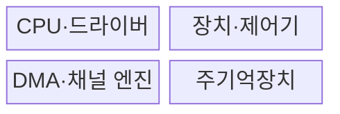
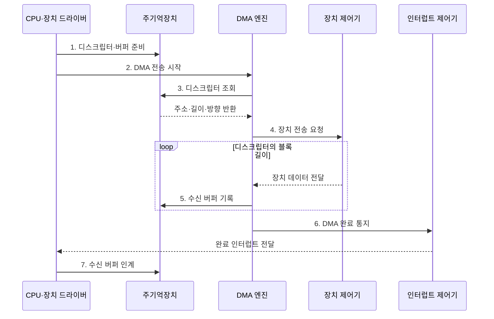

---
sidebar:
  order: 33
  label: "033. I/O 인터페이스: 폴링·인터럽트·DMA·채널 I/O (I/O Interface)"
  badge:
    text: "기출 · 70%"
    variant: note
title: "I/O 인터페이스: 폴링·인터럽트·DMA·채널 I/O (I/O Interface)"
date: "2026-07-28T21:27:55+09:00"
tags:
  - "notes-hardware"
weight: 33
extra:
  question_no: "033"
  source_status: "기출"
  source_history: "128회, 132회"
  priority: 70
  priority_note: "반복 기출, 입출력 방식 선택의 상위 주제"
---

## 미리 알고가기

- **입출력 인터페이스(Input/Output Interface, I/O Interface)**: CPU·메모리·장치 사이에서 명령·상태·데이터를 중계하는 연결 규격이다.
- **장치 제어기(Device Controller)**: 장치 신호를 레지스터·데이터로 변환
- **폴링(Polling)**: CPU가 장치 상태를 반복 확인
- **인터럽트(Interrupt)**: 장치가 CPU에 상태 변화를 통지
- **직접 메모리 접근(Direct Memory Access, DMA)**: 전용 제어기가 프로세서의 데이터 복사 없이 장치와 메모리 사이의 블록을 직접 전송하는 방식
- **채널 입출력(Channel I/O)**: 채널 프로세서의 I/O 명령열 실행
- **인터럽트 서비스 루틴(Interrupt Service Routine, ISR)**: 인터럽트 원인과 장치 완료 상태를 확인하고 후속 처리를 예약하는 코드
- **비휘발성 메모리 익스프레스(Non-Volatile Memory Express, NVMe)**: 병렬 명령·완료 큐로 PCIe SSD의 입출력을 처리하는 저장장치 인터페이스
- **중앙 처리 장치(Central Processing Unit, CPU)**: 입출력 요청을 설정하고 인터럽트 또는 폴링으로 완료를 처리하는 프로세서
- **버퍼(Buffer)**: 속도가 다른 장치 사이에서 데이터를 임시 저장해 전송 속도 차이를 흡수하는 공간
- **핸드셰이크(Handshake)**: 송수신 측이 준비·완료 신호를 교환해 전송 시점을 맞추는 절차
- **장치 드라이버(Device Driver)**: 운영체제의 입출력 요청을 장치 제어기의 명령으로 바꾸는 소프트웨어
- **DMA 디스크립터(DMA Descriptor)**: 직접 메모리 접근 엔진이 사용할 메모리 주소·길이·방향을 기록한 제어 정보
- **바쁜 대기(Busy Waiting)**: 처리기가 장치 상태를 반복 확인하느라 다른 일을 하지 못하는 대기 방식
- **문맥 전환(Context Switch)**: 인터럽트나 작업 전환 때 현재 실행 상태를 저장하고 다른 실행 상태를 복원하는 처리
- **버스 경합·캐시 일관성**: 버스 경합은 여러 주체가 전송 경로를 동시에 요구하는 충돌이고 캐시 일관성은 DMA 전후 CPU 캐시와 메모리 값을 맞추는 규칙임
- **인터럽트 폭주(Interrupt Storm)**: 짧은 시간에 인터럽트가 과도하게 발생해 CPU가 서비스 루틴 처리에 묶이는 현상
- **메인프레임(Mainframe)**: 많은 입출력과 동시 업무를 전용 채널 프로세서로 처리하는 대형 컴퓨터
- **입출력 메모리 관리 장치(Input-Output Memory Management Unit, IOMMU)**: 장치 DMA 주소를 허용된 물리 메모리로 변환하고 장치별 접근 범위를 격리하는 하드웨어
- **캐시 정리·무효화(Cache Clean·Invalidate)**: CPU가 수정한 캐시 데이터를 메모리에 반영하는 동작과 DMA가 바꾼 메모리의 오래된 캐시 사본을 버리는 동작
- **인터럽트 제어기(Interrupt Controller)**: 장치의 인터럽트 요청을 우선순위와 대상 CPU에 맞게 전달하는 하드웨어

## Ⅰ. 개요

- 정의/개념: CPU·메모리·주변장치의 **제어·전송**을 잇는 체계
- 배경/필요성: 장치 대기 중 **CPU 점유 시간** 절감

### 쉽게 이해하기 (학습용)

- 관리자가 배송을 직접 나르지 않고 알림 담당자와 운송 기사에게 일을 나눈다

## Ⅱ. 특징

- **데이터 경로 분리**로 CPU의 전송 관여 시간 절감
- **버퍼·핸드셰이크**로 장치 간 속도 차이 흡수
- **비동기 완료 통지**로 CPU 연산·I/O 중첩

### 쉽게 이해하기 (학습용)

- 접수대와 대기표가 장치 속도 차이를 흡수해 관리 업무와 배송을 겹친다

## Ⅲ. 구조 및 구성요소

| 구성요소 | 책임 |
|:---|:---|
| CPU·드라이버 | 전송 설정·**완료 처리** |
| 장치·제어기 | 장치 신호의 **상태·데이터 변환** |
| DMA·채널 엔진 | 블록 전송·**I/O 명령열 실행** |
| 주기억장치 | 데이터·**제어 정보 보관** |

### 쉽게 이해하기 (학습용)

- CPU가 전송을 설정하면 전용 엔진이 장치와 메모리 사이의 데이터를 옮긴다.

## Ⅳ. 흐름도

**동작 원리**

- **1. 디스크립터·버퍼 준비**: 주소·권한 설정
- **2. DMA 전송 시작**: 작업 등록
- **3. 디스크립터 조회**: 전송 조건 확인
- **4. 장치 전송 요청**: 준비 상태 확인
- **5. 수신 버퍼 기록**: 메모리에 직접 쓰기
- **6. DMA 완료 통지**: 인터럽트 요청
- **7. 수신 버퍼 인계**: 캐시 처리 후 전달

### 쉽게 이해하기 (학습용)

- CPU가 전송 조건만 설정하면 DMA가 장치 데이터를 메모리에 옮기고 인터럽트로 완료를 알린다

## Ⅴ. 종류 및 비교

| I/O 방식 | 폴링 | 인터럽트 | DMA | 채널 I/O |
|:---|:---|:---|:---|:---|
| 적용 기준 | 매우 짧고 잦은 대기 | 불규칙하고 드문 사건 | 대용량 연속 블록 | 다중 장치·복합 명령열 |
| 핵심 특징 | CPU의 **상태 반복 확인** | 장치 알림 후 **ISR 실행** | 전용 엔진의 **블록 직접 전송** | 채널 프로세서의 **명령열 실행** |
| 한계 | 바쁜 대기·**CPU 점유** | 문맥 전환·**인터럽트 폭주** | 버스 경합·**캐시 일관성** | 전용 하드웨어·**명령 복잡도** |

### 쉽게 이해하기 (학습용)

- 짧으면 직접 확인하고 사건은 알림, 큰 블록은 기사, 명령열은 비서에게 맡긴다

## Ⅵ. 실무 고려사항 및 대책

| 고려사항 | 대책 | 효과 |
|:---|:---|:---|
| 긴 대기에서 폴링이 CPU를 독점 | 짧은 구간만 폴링하고 이후 인터럽트로 전환 | CPU 사용률 절감 |
| 높은 완료율로 인터럽트 폭주 | 인터럽트 병합·예산과 적응형 폴링 적용 | 문맥 전환 감소 |
| 비일관 DMA에서 오래된 캐시 데이터 사용 | 전송 방향별 clean·invalidate와 장벽 적용 | CPU·장치 데이터 일치 |
| DMA 주소 오류·버스 경합 | IOMMU 격리와 전송 크기·우선순위 조정 | 메모리 보호·대역폭 안정화 |

> 사례: NVMe는 DMA와 완료 큐 폴링·인터럽트 결합

### 쉽게 이해하기 (학습용)

- NVMe는 큰 블록을 DMA로 전송하고 완료율이 높으면 폴링, 불규칙하면 인터럽트를 사용해 CPU 점유와 문맥 전환을 조절한다

## Ⅶ. 결론

- **대기 시간·완료율·전송 크기·CPU 사용률** 기반 선택

### 쉽게 이해하기 (학습용)

- 대기·사건·짐 크기·명령 수에 맞춰 담당자를 선택해 CPU 시간을 아낀다
