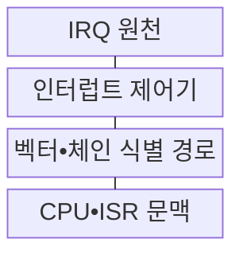
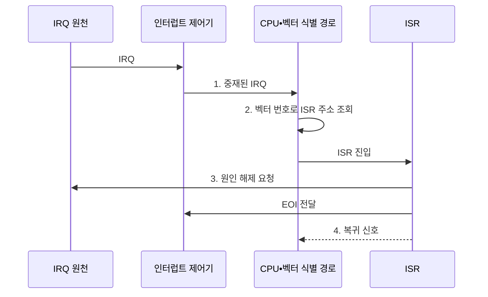

---
sidebar:
  order: 34
  label: "034. 인터럽트 처리 방식: 벡터•데이지체인 (Interrupt Handling)"
  badge:
    text: "기출 • 70%"
    variant: note
title: "인터럽트 처리 방식: 벡터•데이지체인 (Interrupt Handling)"
date: "2026-08-04T11:26:00+09:00"
tags:
  - "notes-hardware"
weight: 34
extra:
  question_no: "034"
  source_status: "기출"
  source_history: "128회, 132회"
  priority: 70
  priority_note: "반복 기출, 우선순위•벡터 비교"
---

## Ⅰ. 개요

핵심 용어

- **인터럽트 처리**: 비동기 요청으로 실행을 전환해 원인을 처리한 뒤 이전 문맥으로 복귀하는 절차
- **IRQ**: Interrupt Request, 장치나 타이머가 CPU에 비동기 처리를 요구하는 신호
- **CPU**: Central Processing Unit, 명령을 실행하는 중앙 처리 장치

- 정의/개념: 비동기 요청에 따라 **실행 문맥을 전환•복귀하는 절차**
- 배경/필요성: 폴링의 **CPU 반복 점유** 제거

#### 한줄 요약

- 일하다 알림이 오면 급한 요청을 응대한 뒤 표시해 둔 자리로 돌아간다

## Ⅱ. 특징

핵심 용어

- **ISR**: Interrupt Service Routine, 인터럽트 원인의 긴급 처리를 수행하는 코드
- **인터럽트 지연**: 요청이 발생한 시점부터 ISR 실행이 시작될 때까지 걸리는 시간
- **중첩 인터럽트**: ISR 실행 중 더 높은 우선순위 요청의 진입을 허용하는 방식

- 명령 경계에서 **실행 흐름 전환** 후 ISR 진입
- 마스킹•우선순위•문맥 저장에 따라 달라지는 **인터럽트 지연**
- 고우선 지연 감소와 문맥 비용 증가를 만드는 **중첩 인터럽트**

#### 한줄 요약

- 급한 알림이 겹칠수록 응대 순서와 잠시 멈춘 자리의 기록이 늘어난다

## Ⅲ. 구조 및 구성요소

핵심 용어

- **인터럽트 제어기**: 마스킹•우선순위 중재 후 대상 CPU에 IRQ를 전달하는 하드웨어
- **인터럽트 벡터**: 원인별 ISR을 식별하는 번호
- **인터럽트 벡터 테이블**: 인터럽트 벡터별 ISR 진입 주소를 저장한 표
- **실행 문맥**: 인터럽트 복귀를 위해 저장하는 프로그램 카운터•레지스터•상태 정보

| 구성요소 | 책임 |
|:---|:---|
| IRQ 원천 | 장치•타이머의 **비동기 요청** 발생 |
| 인터럽트 제어기 | 마스크•우선순위 기반 **요청 중재** |
| 벡터•체인 식별 경로 | 벡터•승인 순서로 **원인 식별** |
| CPU•ISR 문맥 | 문맥 저장•**원인 처리•복귀** |

#### 한줄 요약

- 제어기가 요청을 고르고 식별 경로가 ISR을 찾으면 CPU가 문맥을 저장하고 처리한다.

## Ⅳ. 흐름도

핵심 용어

- **마스킹**: 특정 인터럽트 요청의 CPU 전달을 차단하는 제어
- **중재**: 여러 IRQ 중 처리할 하나를 우선순위로 선택하는 제어
- **EOI**: End of Interrupt, ISR 완료를 제어기에 알리는 신호
- **원인 해제**: 장치의 완료•오류 상태를 확인하고 IRQ가 다시 발생하지 않도록 상태를 정리하는 동작

**동작 원리**

1. **중재된 IRQ**: 마스크•우선순위로 전달 요청 선택
2. **벡터 번호**: ISR 주소와 복귀 상태 확보
3. **원인 해제 요청**: 장치 상태 해제 후 EOI 전달
4. **복귀 신호**: 저장 문맥으로 중단된 명령 흐름 재개

#### 한줄 요약

- 제어기가 IRQ를 중재하면 CPU가 문맥을 저장하고 ISR로 전환한 뒤 원인을 해제하고 복귀한다

## Ⅴ. 종류 및 비교

핵심 용어

- **벡터 방식**: 인터럽트 번호로 ISR 주소를 직접 찾아 원인을 식별하는 방식
- **데이지체인**: 승인 신호를 장치 연결 순서대로 전달해 요청자와 고정 우선순위를 찾는 방식
- **기아**: 낮은 우선순위 요청이 높은 요청에 계속 밀려 처리되지 못하는 상태

| 인터럽트 식별 방식 | 벡터 | 데이지체인 |
|:---|:---|:---|
| 적용 기준 | 많은 원인•빠른 식별•독립 중재 | 소수 장치•단순 배선•고정 순위 |
| 핵심 특징 | ISR을 직접 식별하는 **벡터 번호** | 요청자•순위를 찾는 **직렬 승인** |
| 한계 | 벡터 테이블•**제어기 복잡도** | 전파 지연•**후순위 기아**•연쇄 장애 |

#### 한줄 요약

- 벡터는 담당자를 찾고 체인은 줄의 선두를 정하므로 함께 쓸 수도 있다

## Ⅵ. 실무 고려사항 및 대책

핵심 용어

- **지연 처리**: ISR에서는 원인만 해제하고 긴 작업을 별도 커널 작업으로 넘기는 방식
- **우선순위 노화**: 오래 기다린 낮은 우선순위 요청의 순위를 점차 높여 기아를 막는 방법
- **MSI-X**: Message Signaled Interrupts eXtended, 메시지 기반 다중 인터럽트 방식
- **MSI-X 벡터 친화도**: 독립 벡터를 담당 큐와 CPU에 배정하는 정책
- **비휘발성 메모리 익스프레스(Non-Volatile Memory Express, NVMe)**: 멀티큐별 MSI-X 벡터를 사용할 수 있는 저장장치 인터페이스

| 문제 | 대책 | 효과 |
|:---|:---|:---|
| ISR의 긴 처리로 낮은 우선순위 지연 | 원인 해제 후 별도 작업으로 **지연 처리 이관** | **인터럽트 지연** 단축 |
| 고정 우선순위로 후순위 기아 발생 | **우선순위 노화**•예산과 처리율 감시 | **처리 공정성** 확보 |
| 과도한 중첩으로 스택•문맥 비용 증가 | **중첩 깊이** 제한과 전용 인터럽트 스택 사용 | **자원 고갈** 방지 |
| 인터럽트 폭주•코어 편중 | 병합•마스킹•**MSI-X 벡터 친화도** | CPU 처리 안정화 |

> 사례: NVMe 멀티큐는 MSI-X 벡터를 큐•CPU에 배정

#### 한줄 요약

- NVMe는 큐마다 MSI-X 벡터와 담당 CPU를 배정하고 ISR은 원인 해제만 수행한 뒤 긴 처리를 지연 작업으로 넘긴다

## Ⅶ. 결론

핵심 용어

- **빠른 원인 식별**: 다수 요청 중 해당 ISR을 짧은 시간에 직접 선택하는 능력
- **고정 순위**: 물리 연결 순서로 장치 우선순위가 미리 결정되는 방식

- 다수 원인은 **벡터**, 소수•고정 순위는 **데이지체인** 선택

#### 한줄 요약

- 손님 수에 맞춰 번호표나 줄을 쓰고 현장 응대는 짧게 끝낸다
