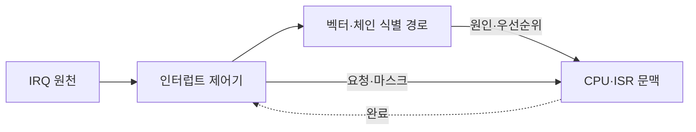
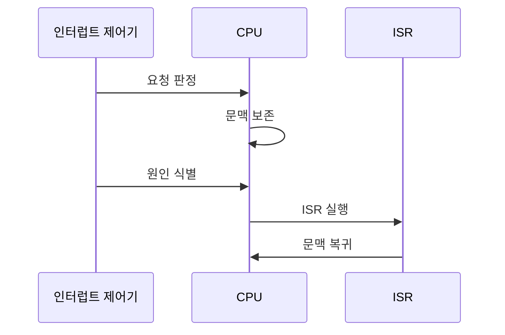

---
sidebar:
  order: 34
  label: "034. 인터럽트 처리 방식 — 벡터·데이지체인 (Interrupt Handling)"
  badge:
    text: "기출 · 70%"
    variant: note
title: "인터럽트 처리 방식 — 벡터·데이지체인 (Interrupt Handling)"
date: "2026-07-25T17:28:00+09:00"
tags:
  - "notes-hardware"
weight: 34
extra:
  question_no: "034"
  source_status: "기출"
  source_history: "128회, 132회"
  priority: 70
  priority_note: "반복 기출, 우선순위·벡터 비교"
---

## 미리 알고가기

- **인터럽트 처리(Interrupt Handling)**: 비동기 요청으로 실행을 전환해 원인을 처리한 뒤 이전 문맥으로 복귀하는 절차
- **인터럽트 요청(Interrupt Request, IRQ)**: 장치의 CPU 서비스 요구 신호
- **인터럽트 제어기(Interrupt Controller)**: 요청 마스킹·중재 후 CPU 전달
- **인터럽트 서비스 루틴(Interrupt Service Routine, ISR)**: 인터럽트 원인을 확인하고 필요한 최소 처리를 수행하는 코드
- **인터럽트 벡터(Interrupt Vector)**: ISR 위치를 찾는 식별 번호
- **벡터 테이블(Vector Table)**: 벡터별 ISR 진입 주소 저장
- **데이지체인(Daisy Chain)**: 승인 신호가 연결 순서대로 요청자 탐색
- **인터럽트 지연(Interrupt Latency)**: 요청부터 ISR 시작까지의 시간
- **중앙 처리 장치(Central Processing Unit, CPU)**: 명령을 실행하며 인터럽트 수락·문맥 저장·서비스 루틴 진입을 담당하는 프로세서
- **프로그램 카운터(Program Counter, PC)**: 다음에 실행할 명령의 주소이며 인터럽트 복귀를 위해 저장하는 레지스터
- **마스킹(Masking)**: 특정 인터럽트 요청을 일시적으로 수락하지 않도록 차단하는 제어
- **중첩 인터럽트(Nested Interrupt)**: 서비스 루틴 실행 중 더 높은 우선순위 인터럽트의 진입을 허용하는 방식
- **기아(Starvation)**: 낮은 우선순위 요청이 높은 우선순위 요청에 계속 밀려 처리되지 못하는 상태
- **비휘발성 메모리 익스프레스(Non-Volatile Memory Express, NVMe)**: 여러 명령·완료 큐를 병렬 처리하는 저장장치 인터페이스
- **확장 메시지 신호 인터럽트(Message Signaled Interrupts Extended, MSI-X)**: 장치가 메모리 쓰기 메시지와 여러 벡터로 인터럽트를 전달하는 방식
- **유로카드 모듈 버스(Versa Module Europa Bus, VMEbus)**: 산업·임베디드 장치 모듈을 연결하며 데이지체인 인터럽트 승인을 지원하는 병렬 버스
- **멀티큐(Multiqueue)**: 요청을 여러 독립 큐로 나눠 CPU 코어별 병렬 처리를 가능하게 하는 구조

## Ⅰ. 개요

- **정의/개념**: 비동기 요청 처리 후 문맥을 복원하는 절차
- **배경/필요성**: 폴링 CPU 점유로 비동기 사건 처리 필요

### 쉽게 이해하기 (학습용)

- 일하다 알림이 오면 급한 요청을 응대한 뒤 표시해 둔 자리로 돌아간다

## Ⅱ. 특징

- CPU는 명령 경계에서 흐름을 바꿔 비동기 사건에 응답한다.
- 마스킹·상위 요청·진입 시간이 인터럽트 지연을 좌우한다.
- 중첩은 고우선 지연을 줄이지만 문맥 저장 비용을 늘린다.

### 쉽게 이해하기 (학습용)

- 급한 알림이 겹칠수록 응대 순서와 잠시 멈춘 자리의 기록이 늘어난다

## Ⅲ. 아키텍처 및 구성요소

| 설계 요소 | 설명 |
|:---|:---|
| IRQ 원천 | 장치·타이머의 비동기 요청 발생 |
| 인터럽트 제어기 | 요청 마스킹·우선순위 중재 |
| 벡터·체인 식별 경로 | 벡터 번호·승인 순서로 원인 식별 |
| CPU·ISR 문맥 | PC·상태 저장 후 원인 처리·복귀 |

> 요약: 제어기가 원인·우선순위를 정해 ISR로 연결

### 쉽게 이해하기 (학습용)

- 접수대가 우선순위와 담당자 명부로 요청을 올바른 담당자에게 보낸다

## Ⅳ. 원리 및 절차 흐름도

| 절차 | 설명 |
|:---|:---|
| 요청 판정 | 마스크·우선순위로 수락 요청 결정 |
| 문맥 보존 | PC·상태·필요 레지스터 저장 |
| 원인 식별 | 벡터 번호나 체인 승인 장치 확인 |
| ISR 실행 | 원인 해제 후 긴 작업은 큐로 이관 |
| 문맥 복귀 | 저장 문맥 복원 후 중단 작업 재개 |

> 요약: 요청을 식별·처리하고 저장 문맥으로 복귀

### 쉽게 이해하기 (학습용)

- 현재 자리를 기록하고 급한 일만 처리한 뒤 긴 일은 대기함에 넘긴다

## Ⅴ. 종류 및 비교

| 판단 기준 | 벡터 | 데이지체인 |
|:---|:---|:---|
| 핵심 특징 | 벡터 번호로 ISR 식별 | 직렬 승인으로 요청자·순위 식별 |
| 식별 경로 | 제어기·장치가 벡터 전달 | 승인 신호가 장치를 순차 통과 |
| 적용 기준 | 많은 원인·빠른 식별·독립 중재 | 소수 장치·단순 배선·고정 순위 |
| 주요 위험 | 벡터 테이블·제어기 복잡도 | 전파 지연·후순위 기아·연쇄 장애 |

### 쉽게 이해하기 (학습용)

- 벡터는 담당자를 찾고 체인은 줄의 선두를 정하므로 함께 쓸 수도 있다

## Ⅵ. 실무 사례

1. NVMe 멀티큐는 MSI-X 벡터를 큐·CPU에 배정
2. VMEbus 장치는 데이지체인 승인으로 고정 순위

### 쉽게 이해하기 (학습용)

- NVMe는 큐마다 번호표와 담당 CPU를 정해 요청을 바로 보낸다
- VMEbus는 줄 앞 장치부터 확인해 먼저 응답할 장치를 정한다

## Ⅶ. 결론

- 다수 원인은 벡터, 소수 고정 순위는 체인, ISR은 최소화

### 쉽게 이해하기 (학습용)

- 손님 수에 맞춰 번호표나 줄을 쓰고 현장 응대는 짧게 끝낸다
