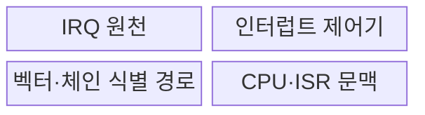
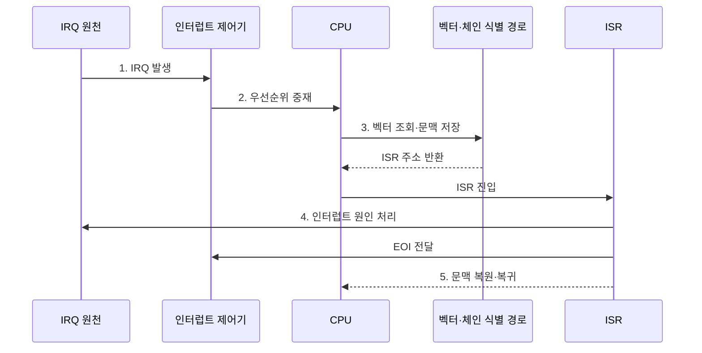

---
sidebar:
  order: 34
  label: "034. 인터럽트 처리 방식: 벡터·데이지체인 (Interrupt Handling)"
  badge:
    text: "기출 · 70%"
    variant: note
title: "인터럽트 처리 방식: 벡터·데이지체인 (Interrupt Handling)"
date: "2026-07-28T21:27:55+09:00"
tags:
  - "notes-hardware"
weight: 34
extra:
  question_no: "034"
  source_status: "기출"
  source_history: "128회, 132회"
  priority: 70
  priority_note: "반복 기출, 우선순위·벡터 비교"
---

## 미리 알고가기

- **인터럽트 처리(Interrupt Handling)**: 비동기 요청으로 실행을 전환해 원인을 처리한 뒤 이전 문맥으로 복귀하는 절차
- **인터럽트 요청(Interrupt Request, IRQ)**: 장치가 프로세서에 비동기 처리를 요구하는 신호
- **인터럽트 제어기(Interrupt Controller)**: 요청 마스킹·중재 후 CPU 전달
- **인터럽트 서비스 루틴(Interrupt Service Routine, ISR)**: 인터럽트 원인을 확인하고 긴급한 최소 처리를 수행하는 전용 코드
- **인터럽트 벡터(Interrupt Vector)**: ISR 위치를 찾는 식별 번호
- **벡터 테이블(Vector Table)**: 벡터별 ISR 진입 주소 저장
- **데이지체인(Daisy Chain)**: 승인 신호가 연결 순서대로 요청자 탐색
- **인터럽트 지연(Interrupt Latency)**: 요청부터 ISR 시작까지의 시간
- **중앙 처리 장치(Central Processing Unit, CPU)**: 인터럽트를 수락하고 실행 문맥을 저장한 뒤 서비스 루틴으로 진입하는 처리장치
- **프로그램 카운터(Program Counter, PC)**: 다음 명령어 주소를 저장하며 인터럽트 복귀 시 이전 실행 위치로 복원하는 레지스터
- **마스킹(Masking)**: 특정 인터럽트 요청을 일시적으로 수락하지 않도록 차단하는 제어
- **중첩 인터럽트(Nested Interrupt)**: 서비스 루틴 실행 중 더 높은 우선순위 인터럽트의 진입을 허용하는 방식
- **기아(Starvation)**: 낮은 우선순위 요청이 높은 우선순위 요청에 계속 밀려 처리되지 못하는 상태
- **비휘발성 메모리 익스프레스(Non-Volatile Memory Express, NVMe)**: 여러 명령·완료 큐를 병렬 처리하는 PCIe 저장장치 인터페이스
- **확장 메시지 신호 인터럽트(Message Signaled Interrupts Extended, MSI-X)**: 다수의 독립 벡터를 메모리 쓰기 메시지로 전달하는 PCIe 인터럽트 방식
- **유로카드 모듈 버스(Versa Module Europa Bus, VMEbus)**: 산업·임베디드 장치 모듈을 연결하며 데이지체인 인터럽트 승인을 지원하는 병렬 버스
- **멀티큐(Multiqueue)**: 요청을 여러 독립 큐로 나눠 CPU 코어별 병렬 처리를 가능하게 하는 구조
- **인터럽트 종료(End of Interrupt, EOI)**: ISR이 현재 인터럽트 처리를 끝냈음을 제어기에 알려 다음 요청을 전달할 수 있게 하는 신호
- **지연 처리(Deferred Processing)**: ISR에서는 긴급한 원인 해제만 하고 실행 시간이 긴 작업은 별도 커널 작업으로 넘겨 나중에 수행하는 방식

## Ⅰ. 개요

- 정의/개념: 비동기 요청에 따라 **실행 문맥을 전환·복귀하는 절차**
- 배경/필요성: 폴링의 **CPU 반복 점유** 제거

### 쉽게 이해하기 (학습용)

- 일하다 알림이 오면 급한 요청을 응대한 뒤 표시해 둔 자리로 돌아간다

## Ⅱ. 특징

- 명령 경계에서 **실행 흐름 전환** 후 ISR 진입
- 마스킹·우선순위·문맥 저장이 **인터럽트 지연** 좌우
- **중첩 인터럽트**는 고우선 지연과 문맥 비용 상충

### 쉽게 이해하기 (학습용)

- 급한 알림이 겹칠수록 응대 순서와 잠시 멈춘 자리의 기록이 늘어난다

## Ⅲ. 구조 및 구성요소

| 구성요소 | 책임 |
|:---|:---|
| IRQ 원천 | 장치·타이머의 **비동기 요청** 발생 |
| 인터럽트 제어기 | 마스크·우선순위 기반 **요청 중재** |
| 벡터·체인 식별 경로 | 벡터·승인 순서로 **원인 식별** |
| CPU·ISR 문맥 | 문맥 저장·**원인 처리·복귀** |

### 쉽게 이해하기 (학습용)

- 제어기가 요청을 고르고 식별 경로가 ISR을 찾으면 CPU가 문맥을 저장하고 처리한다.

## Ⅳ. 흐름도

**동작 원리**

- **1. IRQ 발생**: 장치의 비동기 서비스 요청 접수
- **2. 우선순위 중재**: 마스크·우선순위로 전달 IRQ 선택
- **3. 벡터 조회·문맥 저장**: ISR 주소와 복귀 상태 확보
- **4. 인터럽트 원인 처리**: 장치 상태 해제 후 EOI 전달
- **5. 문맥 복원·복귀**: 중단된 명령 흐름 재개

### 쉽게 이해하기 (학습용)

- 제어기가 IRQ를 중재하면 CPU가 문맥을 저장하고 ISR로 전환한 뒤 원인을 해제하고 복귀한다

## Ⅴ. 종류 및 비교

| 인터럽트 식별 방식 | 벡터 | 데이지체인 |
|:---|:---|:---|
| 적용 기준 | 많은 원인·빠른 식별·독립 중재 | 소수 장치·단순 배선·고정 순위 |
| 핵심 특징 | **벡터 번호**로 ISR 직접 식별 | **직렬 승인**으로 요청자·순위 식별 |
| 한계 | 벡터 테이블·**제어기 복잡도** | 전파 지연·**후순위 기아**·연쇄 장애 |

### 쉽게 이해하기 (학습용)

- 벡터는 담당자를 찾고 체인은 줄의 선두를 정하므로 함께 쓸 수도 있다

## Ⅵ. 실무 고려사항 및 대책

| 고려사항 | 대책 | 효과 |
|:---|:---|:---|
| ISR의 긴 처리로 낮은 우선순위 지연 | 원인 해제만 수행하고 나머지는 지연 처리로 이관 | 인터럽트 지연 단축 |
| 고정 우선순위로 후순위 기아 발생 | 우선순위 노화·예산과 처리율 감시 | 공정성 확보 |
| 과도한 중첩으로 스택·문맥 비용 증가 | 중첩 깊이 제한과 전용 인터럽트 스택 사용 | 자원 고갈 방지 |
| 인터럽트 폭주·코어 편중 | 병합·마스킹·벡터 친화도와 부하 분산 | CPU 처리 안정화 |

> 사례: NVMe 멀티큐는 MSI-X 벡터를 큐·CPU에 배정

### 쉽게 이해하기 (학습용)

- NVMe는 큐마다 MSI-X 벡터와 담당 CPU를 배정하고 ISR은 원인 해제만 수행한 뒤 긴 처리를 지연 작업으로 넘긴다

## Ⅶ. 결론

- **IRQ 수·식별 지연·우선순위·기아 시간** 기반 선택

### 쉽게 이해하기 (학습용)

- 손님 수에 맞춰 번호표나 줄을 쓰고 현장 응대는 짧게 끝낸다
