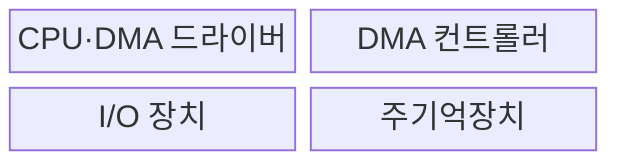
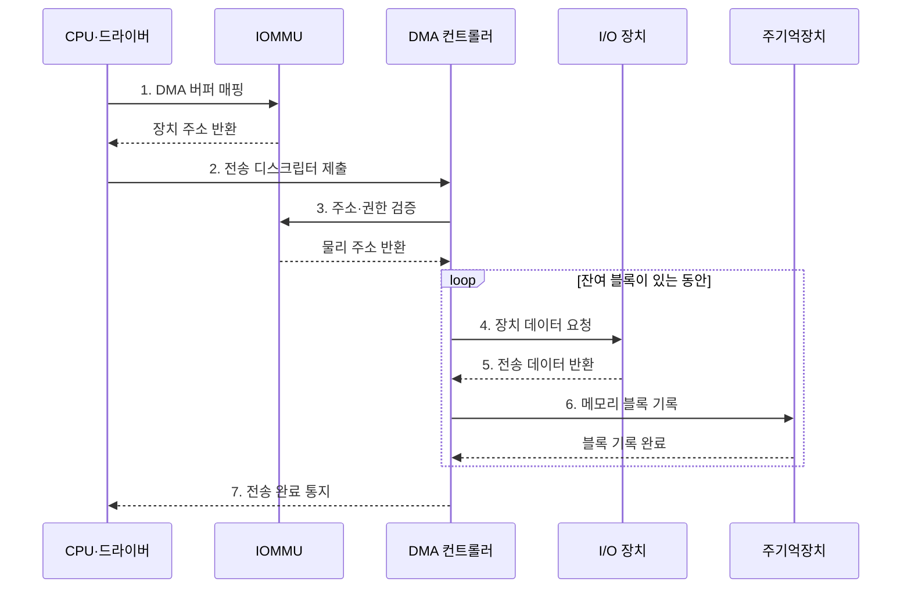

---
sidebar:
  order: 35
  label: "035. DMA 직접 메모리 접근 (Direct Memory Access)"
  badge:
    text: "기출 · 70%"
    variant: note
title: "DMA 직접 메모리 접근 (Direct Memory Access)"
date: "2026-07-28T21:27:55+09:00"
tags:
  - "notes-hardware"
weight: 35
extra:
  question_no: "035"
  source_status: "기출"
  source_history: "128회, 137회"
  priority: 70
  priority_note: "반복 기출, CPU 개입 절감과 전송 통제가 핵심"
---

## 미리 알고가기

- **직접 메모리 접근(Direct Memory Access, DMA)**: 전용 엔진이 장치와 메모리 사이의 블록을 직접 전송하여 CPU 개입을 줄이는 기법
- **DMA 컨트롤러(DMA Controller)**: 버스 마스터로 블록 전송을 수행하는 회로
- **버스 마스터(Bus Master)**: 인터커넥트 트랜잭션을 시작하는 주체
- **전송 디스크립터(Transfer Descriptor)**: 주소·길이·방향을 담은 전송 명세
- **분산 수집(Scatter-Gather)**: 분산 버퍼를 하나의 전송 목록으로 결합
- **입출력 메모리 관리 장치(Input-Output Memory Management Unit, IOMMU)**: 장치의 DMA 주소를 변환하고 메모리 접근 권한을 검사하는 하드웨어
- **캐시 일관성(Cache Coherence)**: CPU 캐시와 메모리 최신 상태의 일치
- **버퍼 소유권(Buffer Ownership)**: CPU와 장치의 버퍼 접근 순서·권한
- **중앙 처리 장치(Central Processing Unit, CPU)**: DMA 전송의 주소·길이·방향을 설정하고 완료를 처리하는 프로세서
- **입출력(Input/Output, I/O)**: 장치와 메모리·프로세서 사이에서 명령과 데이터를 전달하는 작업
- **대역폭(Bandwidth)**: 버스나 메모리 경로가 단위 시간에 전달할 수 있는 데이터 양
- **인터럽트 입출력(Interrupt-driven I/O)**: 장치가 준비될 때마다 CPU에 알려 CPU가 데이터 전송을 처리하는 방식
- **프로그램 입출력(Programmed I/O)**: CPU가 장치 상태를 반복 확인하며 데이터 전송까지 직접 수행하는 방식
- **비휘발성 메모리 익스프레스(Non-Volatile Memory Express, NVMe)**: 병렬 큐와 DMA로 PCIe SSD의 입출력을 처리하는 저장장치 인터페이스
- **범용 비동기 송수신기(Universal Asynchronous Receiver-Transmitter, UART)**: 시작·정지 비트로 클록을 공유하지 않는 직렬 데이터를 송수신하는 장치
- **버퍼 매핑(Buffer Mapping)**: 장치가 접근할 수 있도록 메모리 버퍼를 장치 주소 공간과 연결하는 작업
- **캐시 정리·무효화(Cache Clean·Invalidate)**: CPU가 수정한 캐시 데이터를 메모리에 반영하는 동작과 DMA가 바꾼 메모리의 오래된 캐시 사본을 버리는 동작
- **메모리 장벽(Memory Barrier)**: 장벽 전후의 메모리 접근과 장치 레지스터 쓰기가 지정 순서로 관찰되도록 보장하는 동기화 명령

## Ⅰ. 개요

- 정의/개념: CPU 개입 없이 장치와 메모리 사이를 전송하는 **기법**
- 배경/필요성: 대량 I/O의 **CPU 복사 시간** 절감

### 쉽게 이해하기 (학습용)

- CPU가 주소·길이·방향을 설정하면 DMA 엔진이 장치와 메모리 사이의 데이터를 직접 전송한다

## Ⅱ. 특징

- 큰 블록일수록 **CPU 복사 절감**이 설정 비용 상쇄
- **분산 수집**로 비연속 버퍼를 한 작업으로 전송
- CPU·DMA 동시 접근의 **메모리 대역폭 경합**

### 쉽게 이해하기 (학습용)

- 큰 짐은 운반자에게 맡기되 통로와 출입 권한을 함께 관리한다

## Ⅲ. 구조 및 구성요소

| 구성요소 | 책임 |
|:---|:---|
| CPU·DMA 드라이버 | 전송 명세·**시작·완료 처리** |
| DMA 컨트롤러 | 장치·메모리 **블록 전송** |
| I/O 장치 | 데이터 **출발지·목적지** 제공 |
| 주기억장치 | 데이터·**디스크립터 보관** |

### 쉽게 이해하기 (학습용)

- CPU가 전송 명세를 제출하면 DMA 컨트롤러가 장치와 메모리 사이의 블록을 옮긴다.

## Ⅳ. 흐름도

**동작 원리**

- **1. DMA 버퍼 매핑**: IOMMU 범위 설정
- **2. 전송 디스크립터 제출**: 주소·길이 등록
- **3. 주소·권한 검증**: 접근 허용 판정
- **4. 장치 데이터 요청**: 다음 블록 요구
- **5. 전송 데이터 반환**: 장치 데이터 전달
- **6. 메모리 블록 기록**: 허용 버퍼 쓰기
- **7. 전송 완료 통지**: 소유권 동기화

### 쉽게 이해하기 (학습용)

- CPU는 전송 디스크립터를 제출하고 DMA 엔진은 장치와 메모리 사이의 전송을 수행한다

## Ⅴ. 종류 및 비교

| I/O 방식 | DMA | 인터럽트 I/O | 프로그램 I/O |
|:---|:---|:---|:---|
| 적용 기준 | 대용량·연속·분산 블록 | 비정기 소량 이벤트 | 매우 짧고 단순한 I/O |
| 핵심 특징 | 전용 엔진의 **블록 직접 전송** | 인터럽트마다 **CPU 전송** | 대기 CPU의 **직접 전송** |
| 한계 | 설정·동기화·**디스크립터 관리** | 인터럽트·**문맥 전환** | 바쁜 대기·**CPU 복사** |

> 요약: 대량은 DMA, 소량은 인터럽트 I/O

### 쉽게 이해하기 (학습용)

- 큰 짐은 운반자, 드문 알림은 직원, 짧은 일은 직접 처리한다

## Ⅵ. 실무 고려사항 및 대책

| 고려사항 | 대책 | 효과 |
|:---|:---|:---|
| 비일관 캐시에서 CPU·장치 값 불일치 | 전송 방향별 clean·invalidate와 메모리 장벽 적용 | 최신 데이터 보장 |
| 완료 전 CPU가 버퍼를 재사용 | 소유권 상태와 완료 동기화·참조 수명 명시 | 동시 접근·손상 방지 |
| 잘못된 디스크립터로 임의 메모리 접근 | IOMMU 권한·범위 검증과 오류 로그 적용 | DMA 격리 강화 |
| 대용량 버스트의 버스 경합·부분 실패 | 전송 크기·우선순위 조정과 잔여 길이 기반 재시도 | 대역폭 공정성·복구성 향상 |

> 사례: NVMe는 **IOMMU**로 DMA 버퍼 접근 범위 제한

### 쉽게 이해하기 (학습용)

- NVMe는 IOMMU로 DMA 주소 범위를 제한하고 완료 전 버퍼 재사용을 막아 메모리 침범과 데이터 손상을 방지한다

## Ⅶ. 결론

- **전송 크기·설정 시간·CPU 사용률·대역폭** 기반 선택

### 쉽게 이해하기 (학습용)

- 큰 짐만 맡기고 출입 권한·재고표·공용 통로를 함께 관리한다
