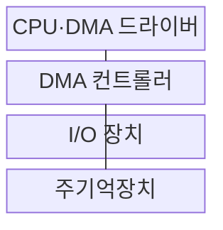
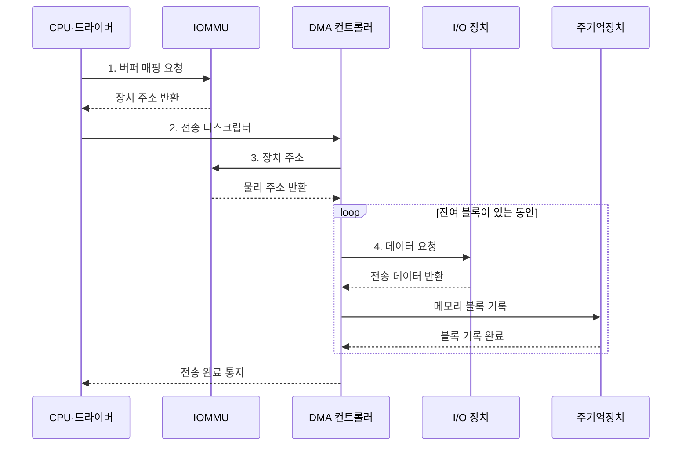

---
sidebar:
  order: 35
  label: "035. DMA 직접 메모리 접근 (Direct Memory Access)"
  badge:
    text: "기출 · 70%"
    variant: note
title: "DMA 직접 메모리 접근 (Direct Memory Access)"
date: "2026-08-02T10:55:00+09:00"
tags:
  - "notes-hardware"
weight: 35
extra:
  question_no: "035"
  source_status: "기출"
  source_history: "128회, 137회"
  priority: 70
  priority_note: "반복 기출, CPU 개입 절감과 전송 통제가 핵심"
---

## Ⅰ. 개요

핵심 용어

- **DMA**: 전용 엔진이 장치와 메모리 사이의 블록을 직접 전송해 CPU 개입을 줄이는 기법
- **CPU 복사 비용**: 프로세서가 I/O 데이터를 직접 읽고 다시 메모리에 쓰며 소비하는 연산 시간과 대역폭

- 정의/개념: CPU의 반복 복사 없이 장치와 메모리 사이를 전송하는 **DMA 기법**
- 배경/필요성: 대량 I/O 직접 복사로 **CPU 연산 시간 제약**

### 쉽게 이해하기 (학습용)

- CPU가 주소·길이·방향을 설정하면 DMA 엔진이 장치와 메모리 사이의 데이터를 직접 전송한다

## Ⅱ. 특징

핵심 용어

- **버스 마스터**: 인터커넥트에서 메모리 읽기·쓰기 트랜잭션을 직접 시작하는 주체
- **전송 디스크립터**: DMA가 사용할 주소·길이·방향을 기록한 작업 명세
- **분산 수집**: 흩어진 여러 메모리 버퍼를 하나의 디스크립터 목록으로 전송하는 방식

- 큰 블록일수록 **CPU 복사 절감**이 설정 비용 상쇄
- DMA 컨트롤러의 **버스 마스터** 전송
- **분산 수집**으로 비연속 버퍼를 한 작업으로 전송

### 쉽게 이해하기 (학습용)

- 큰 짐은 운반자에게 맡기되 통로와 출입 권한을 함께 관리한다

## Ⅲ. 구조 및 구성요소

핵심 용어

- **DMA 드라이버**: 전송 명세를 만들고 엔진 시작·완료·오류 처리를 담당하는 소프트웨어
- **DMA 컨트롤러**: 버스 마스터로 장치와 주기억장치 사이의 블록을 옮기는 회로
- **주기억장치 버퍼**: 실제 데이터와 DMA 디스크립터를 장치가 접근하도록 보관하는 영역

| 구성요소 | 책임 |
|:---|:---|
| CPU·DMA 드라이버 | 전송 명세·**시작·완료 처리** |
| DMA 컨트롤러 | 장치·메모리 **블록 전송** |
| I/O 장치 | 데이터 **출발지·목적지** 제공 |
| 주기억장치 | 데이터·**디스크립터 보관** |

### 쉽게 이해하기 (학습용)

- CPU가 전송 명세를 제출하면 DMA 컨트롤러가 장치와 메모리 사이의 블록을 옮긴다.

## Ⅳ. 흐름도

핵심 용어

- **버퍼 매핑**: 메모리 버퍼를 장치 주소 공간에 연결하고 접근 권한을 설정하는 작업
- **IOMMU**: DMA 주소를 물리 주소로 변환하고 장치별 접근 범위를 검사하는 하드웨어
- **전송 완료 통지**: 블록 이동이 끝났음을 CPU 드라이버에 알리는 인터럽트나 큐 상태

**동작 원리**

1. **버퍼 매핑 요청**: IOMMU에 장치 접근 범위 설정
2. **전송 디스크립터**: 주소·길이·방향을 작업으로 등록
3. **장치 주소**: 변환된 물리 주소의 접근 권한 판정
4. **데이터 요청**: CPU를 거치지 않고 블록 이동

### 쉽게 이해하기 (학습용)

- CPU는 전송 디스크립터를 제출하고 DMA 엔진은 장치와 메모리 사이의 전송을 수행한다

## Ⅴ. 종류 및 비교

핵심 용어

- **인터럽트 I/O**: 장치가 준비될 때마다 CPU에 알리고 CPU가 데이터 전송을 수행하는 방식
- **프로그램 I/O**: CPU가 장치 상태를 반복 확인하면서 데이터까지 직접 옮기는 방식
- **설정 비용**: DMA 디스크립터·주소 매핑·동기화를 준비하는 데 드는 고정 처리 시간

| I/O 방식 | DMA | 인터럽트 I/O | 프로그램 I/O |
|:---|:---|:---|:---|
| 적용 기준 | 대용량·연속·분산 블록 | 비정기 소량 이벤트 | 매우 짧고 단순한 I/O |
| 핵심 특징 | 전용 엔진의 **블록 직접 전송** | 인터럽트마다 **CPU 전송** | 대기 CPU의 **직접 전송** |
| 한계 | 설정·동기화·**디스크립터 관리** | 인터럽트·**문맥 전환** | 바쁜 대기·**CPU 복사** |

> 요약: 대량은 DMA, 소량은 인터럽트 I/O

### 쉽게 이해하기 (학습용)

- 큰 짐은 운반자, 드문 알림은 직원, 짧은 일은 직접 처리한다

## Ⅵ. 실무 고려사항 및 대책

핵심 용어

- **캐시 clean·invalidate**: CPU 수정분을 메모리에 반영하고 DMA가 바꾼 메모리의 오래된 캐시 사본을 버리는 동작
- **버퍼 소유권**: CPU와 장치 중 누가 버퍼를 읽거나 쓸 수 있는지 나타내는 접근 상태
- **메모리 장벽**: 버퍼 데이터와 장치 레지스터 접근이 정해진 순서로 관측되도록 보장하는 명령

| 문제 | 대책 | 효과 |
|:---|:---|:---|
| 비일관 캐시에서 CPU·장치 값 불일치 | 전송 방향별 **clean·invalidate**와 메모리 장벽 적용 | **최신 데이터** 보장 |
| 완료 전 CPU가 버퍼를 재사용 | **소유권 상태**와 완료 동기화·참조 수명 명시 | **동시 접근·손상** 방지 |
| 잘못된 디스크립터로 임의 메모리 접근 | **IOMMU 권한·범위** 검증과 오류 로그 적용 | **DMA 격리** 강화 |
| 대용량 버스트의 버스 경합·부분 실패 | 전송 크기·우선순위 조정과 잔여 길이 기반 **재시도** | **대역폭 공정성·복구성** 향상 |

> 사례: NVMe는 **IOMMU**로 DMA 버퍼 접근 범위 제한

### 쉽게 이해하기 (학습용)

- NVMe는 IOMMU로 DMA 주소 범위를 제한하고 완료 전 버퍼 재사용을 막아 메모리 침범과 데이터 손상을 방지한다

## Ⅶ. 결론

핵심 용어

- **대용량 블록 전송**: 설정 비용보다 CPU 복사 절감 이득이 큰 연속 또는 분산 데이터 이동
- **비정기 소량 I/O**: 전송 크기가 작고 발생 빈도가 낮아 DMA 준비보다 인터럽트 처리가 간단한 작업

- 대용량은 **DMA**, 비정기 소량은 **인터럽트 I/O** 선택

### 쉽게 이해하기 (학습용)

- 큰 짐만 맡기고 출입 권한·재고표·공용 통로를 함께 관리한다
