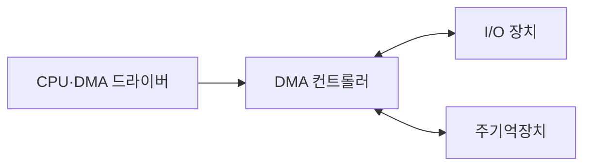
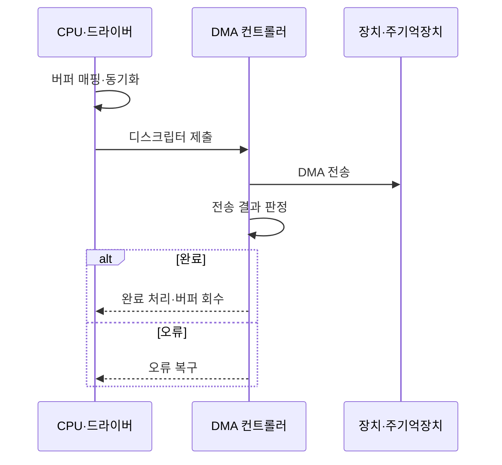

---
sidebar:
  order: 35
  label: "035. DMA 직접 메모리 접근 (Direct Memory Access)"
  badge:
    text: "기출 · 70%"
    variant: note
title: "DMA 직접 메모리 접근 (Direct Memory Access)"
date: "2026-07-27T23:59:59+09:00"
tags:
  - "notes-hardware"
weight: 35
extra:
  question_no: "035"
  source_status: "기출"
  source_history: "128회, 137회"
  priority: 70
  priority_note: "반복 기출, CPU 개입 절감과 전송 통제가 핵심"
---

## 미리 알고가기

- **직접 메모리 접근(Direct Memory Access, DMA)**: ‘디엠에이’로 읽고 영문 머리글자를 딴 약어이며, 전용 엔진이 장치·메모리 사이 블록을 전송해 CPU 개입을 줄이는 기법이다.
- **DMA 컨트롤러(DMA Controller)**: 버스 마스터로 블록 전송을 수행하는 회로
- **버스 마스터(Bus Master)**: 인터커넥트 트랜잭션을 시작하는 주체
- **전송 디스크립터(Transfer Descriptor)**: 주소·길이·방향을 담은 전송 명세
- **분산 수집(Scatter-Gather)**: 분산 버퍼를 하나의 전송 목록으로 결합
- **입출력 메모리 관리 장치(Input-Output Memory Management Unit, IOMMU)**: ‘아이오엠엠유’로 읽고 영문 머리글자를 딴 약어이며, 장치 주소 변환·접근 권한을 검사한다.
- **캐시 일관성(Cache Coherence)**: CPU 캐시와 메모리 최신 상태의 일치
- **버퍼 소유권(Buffer Ownership)**: CPU와 장치의 버퍼 접근 순서·권한
- **중앙 처리 장치(Central Processing Unit, CPU)**: ‘씨피유’로 읽고 영문 머리글자를 딴 약어이며, DMA 설정·완료 처리를 담당한다.
- **입출력(Input/Output, I/O)**: ‘아이오’로 읽고 영문 머리글자를 빗금으로 구분한 표기이며, 장치와 메모리·CPU 사이의 데이터 전송이다.
- **대역폭(Bandwidth)**: 버스나 메모리 경로가 단위 시간에 전달할 수 있는 데이터 양
- **인터럽트 입출력(Interrupt-driven I/O)**: 장치가 준비될 때마다 CPU에 알려 CPU가 데이터 전송을 처리하는 방식
- **프로그램 입출력(Programmed I/O)**: CPU가 장치 상태를 반복 확인하며 데이터 전송까지 직접 수행하는 방식
- **비휘발성 메모리 익스프레스(Non-Volatile Memory Express, NVMe)**: ‘엔브이엠이’로 읽고 영문 머리글자를 딴 약어이며, 병렬 큐와 DMA를 쓰는 저장장치 인터페이스다.
- **범용 비동기 송수신기(Universal Asynchronous Receiver-Transmitter, UART)**: ‘유아트’로 읽고 영문 머리글자를 단어처럼 읽는 약어이며, 시작·정지 비트로 직렬 데이터를 송수신한다.
- **버퍼 매핑(Buffer Mapping)**: 장치가 접근할 수 있도록 메모리 버퍼를 장치 주소 공간과 연결하는 작업

## Ⅰ. 개요

- 정의/개념: 전용 엔진이 장치·메모리 간 **블록을 직접 전송**하는 기법
- 기존 한계: CPU 직접 복사는 대량 I/O 동안 **연산 시간 점유**

### 쉽게 이해하기 (학습용)

- 관리자가 주소·길이만 적으면 전담 운반자가 창고와 장치 사이를 오간다

## Ⅱ. 특징

- 큰 블록일수록 **CPU 복사 절감**이 설정 비용 상쇄
- **분산 수집**로 비연속 버퍼를 한 작업으로 전송
- CPU·DMA 동시 접근의 **메모리 대역폭 경합**

### 쉽게 이해하기 (학습용)

- 큰 짐은 운반자에게 맡기되 통로와 출입 권한을 함께 관리한다

## Ⅲ. 아키텍처 및 구성요소

| 설계 요소 | 설명 |
|:---|:---|
| CPU·DMA 드라이버 | 전송 명세 작성·엔진 시작·완료 처리 |
| DMA 컨트롤러 | 버스 마스터로 장치·메모리 블록 전송 |
| I/O 장치 | 전송 데이터의 출발지 또는 목적지 |
| 주기억장치 | 디스크립터와 송수신 버퍼 저장 공간 |

> 요약: CPU가 명세를 주면 DMA 컨트롤러가 장치·메모리를 연결한다

### 쉽게 이해하기 (학습용)

- 관리자는 작업표만 주고 운반자가 창고와 장치 사이를 오간다

## Ⅳ. 원리 및 절차 흐름도

| 절차 | 설명 |
|:---|:---|
| 버퍼 매핑·동기화 | 필요 시 IOMMU 매핑과 캐시·소유권 동기화 |
| 디스크립터 제출 | 주소·길이·방향을 엔진 작업 큐에 등록 |
| DMA 전송 | 버스 마스터로 장치·메모리 블록 이동 |
| 전송 결과 판정 | 완료 상태·오류·잔여 길이 확인 |
| 완료 처리·버퍼 회수 | 캐시 동기화·매핑 해제·CPU 소유권 복귀 |
| 오류 복구 | 엔진 중지·부분 상태 정리 후 재시도·보고 |

> 요약: 완료 때는 버퍼를 회수하고 오류 때는 정리 후 재시도한다

### 쉽게 이해하기 (학습용)

- 구역을 넘겨 배송한 뒤 성공하면 회수하고 실패하면 다시 정리한다

## Ⅴ. 종류 및 비교

| I/O 방식 | DMA | 인터럽트 I/O | 프로그램 I/O |
|:---|:---|:---|:---|
| 적용 기준 | 대용량·연속·분산 블록 | 비정기 소량 이벤트 | 매우 짧고 단순한 I/O |
| 핵심 특징 | 전용 엔진의 **블록 직접 전송** | 인터럽트마다 **CPU 전송** | 대기 CPU의 **직접 전송** |
| 한계 | 설정·동기화·**디스크립터 관리** | 인터럽트·**문맥 전환** | 바쁜 대기·**CPU 복사** |

> 요약: 대량 전송은 DMA, 소량 이벤트는 인터럽트 I/O가 적합하다

### 쉽게 이해하기 (학습용)

- 큰 짐은 운반자, 드문 알림은 직원, 짧은 일은 직접 처리한다

## Ⅵ. 실무 사례

1. NVMe는 **IOMMU**로 DMA 버퍼 접근 범위 제한
2. 임베디드 UART는 **큰 블록**만 DMA로 전환

### 쉽게 이해하기 (학습용)

- 저장장치는 허가된 창고 구역만 드나들게 한다
- 작은 봉투는 직접, 큰 묶음만 운반자에게 맡긴다

## Ⅶ. 결론

- 대량 전송은 **DMA**, 접근 권한·캐시·대역폭 동시 통제

### 쉽게 이해하기 (학습용)

- 큰 짐만 맡기고 출입 권한·재고표·공용 통로를 함께 관리한다
