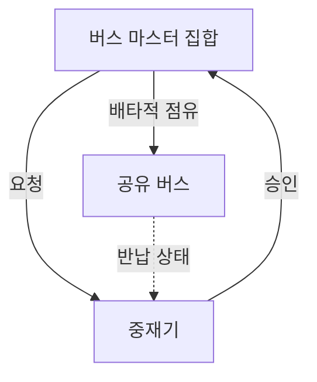
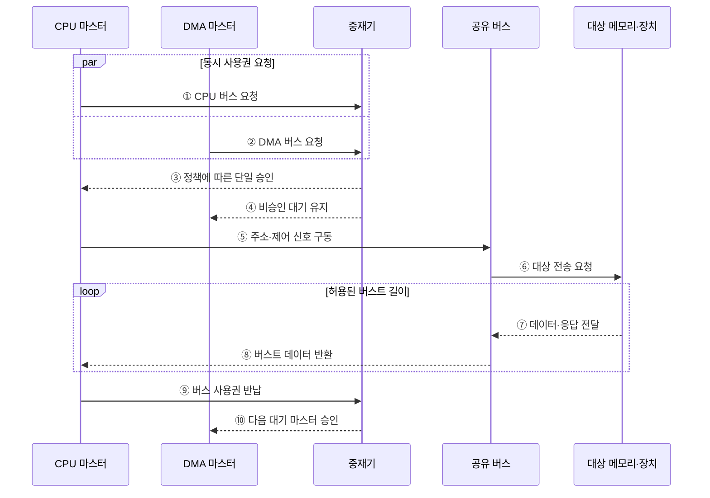

---
sidebar:
  order: 36
  label: "036. 버스 중재 방식 (Bus Arbitration)"
  badge:
    text: "기출 · 70%"
    variant: note
title: "버스 중재 방식 (Bus Arbitration)"
date: "2026-07-28T21:27:55+09:00"
tags:
  - "notes-hardware"
weight: 36
extra:
  question_no: "036"
  source_status: "기출"
  source_history: "128회, 137회"
  priority: 70
  priority_note: "공정성·지연 절충의 반복 기출 핵심 주제"
---

## 미리 알고가기

- **버스 중재(Bus Arbitration)**: 여러 요청 중 하나에 공유 버스를 배타적으로 승인해 충돌을 방지하는 제어
- **버스 마스터(Bus Master)**: 버스 사용권을 요청하고 전송을 시작하는 주체
- **중재기(Arbiter)**: 요청을 정책에 따라 하나만 승인하는 제어기
- **요청(Request)·승인(Grant)**: 사용 의사와 배타적 사용권을 나타내는 신호
- **고정 우선순위(Fixed Priority)**: 정해진 서열로 요청을 선택하는 정책
- **라운드 로빈(Round-Robin)**: 승인 기회를 요청자 순서대로 순환하는 정책
- **기아(Starvation)**: 낮은 순위 요청이 계속 선택되지 않는 상태
- **에이징(Aging)**: 대기 시간에 따라 우선순위를 높이는 기법
- **버스트 길이(Burst Length)**: 한 승인에서 연속 처리할 수 있는 전송량
- **중앙 처리 장치(Central Processing Unit, CPU)**: 명령어를 실행하고 공유 버스의 사용권을 요청하는 대표 버스 마스터
- **직접 메모리 접근(Direct Memory Access, DMA)**: 전용 엔진이 장치와 메모리 사이의 블록을 직접 전송하는 방식
- **시스템 온 칩(System on Chip, SoC)**: 프로세서·메모리 제어기·가속기·주변장치를 하나의 칩에 통합한 시스템
- **인터커넥트(Interconnect)**: 칩 안의 여러 마스터와 메모리·장치를 연결하는 통신 경로
- **중앙 집중식 중재(Centralized Arbitration)**: 하나의 중재기가 모든 요청을 모아 승인 대상을 정하는 방식
- **분산식 중재(Distributed Arbitration)**: 각 마스터가 공유 규칙·신호를 이용해 승인 대상을 함께 정하는 방식
- **단일 장애점(Single Point of Failure)**: 한 구성요소의 고장만으로 전체 기능이 중단되는 지점
- **순환 포인터(Round-Robin Pointer)**: 다음 승인 검사를 시작할 요청자 위치를 기억해 기회를 순환시키는 상태값

## Ⅰ. 개요

- 정의/개념: 다중 마스터의 **공유 버스 사용권**을 배타적으로 배정하는 방식
- 기존 한계: 동시 구동 요청은 **버스 경합·전기적 충돌** 유발

### 쉽게 이해하기 (학습용)

- 여러 사람이 마이크를 요청하면 사회자가 한 명에게만 발언권을 준다

## Ⅱ. 특징

- **배타적 소유권**으로 다중 마스터 동시 구동 차단
- **우선순위·공정성·버스트 한도**가 대기시간 결정
- **에이징**으로 저우선순위 요청의 기아 방지

### 쉽게 이해하기 (학습용)

- 급한 사람을 먼저 부르되 오래 기다린 사람의 차례도 보장한다

## Ⅲ. 아키텍처

**도표안 A — 구조도**

| 구성요소 | 책임 |
|:---|:---|
| 버스 마스터 집합 | 사용권 요청과 **승인 후 전송** 수행 |
| 중재기 | 요청·정책에 따른 **단일 승인 대상** 선택 |
| 공유 버스 | 승인 마스터의 **배타적 전송 경로** 제공 |

> 요약: 중재기가 요청 하나를 선택해 공유 버스 사용권을 준다

**도표안 B — 중앙 집중식 버스 요청·승인·반납 시퀀스**

### 동작 원리

1. **① CPU 버스 요청**: CPU 마스터는 메모리·장치 트랜잭션을 시작하기 위해 중재기에 사용권을 요청한다.
2. **② DMA 버스 요청**: DMA 마스터도 같은 시점에 블록 전송을 위한 버스 사용권을 요청할 수 있다.
3. **③ 정책에 따른 단일 승인**: 중재기는 고정 우선순위·라운드 로빈·에이징 상태를 평가해 CPU 하나만 승인한다.
4. **④ 비승인 대기 유지**: 선택되지 않은 DMA에는 승인 신호를 주지 않아 공유 신호선을 구동하지 못하게 한다.
5. **⑤ 주소·제어 신호 구동**: 승인받은 CPU만 공유 버스에 대상 주소와 읽기·쓰기 제어 신호를 출력한다.
6. **⑥ 대상 전송 요청**: 공유 버스는 주소가 가리키는 메모리나 장치에 트랜잭션을 전달한다.
7. **⑦ 데이터·응답 전달**: 대상은 버스트의 각 전송 단위마다 데이터와 준비·완료 상태를 버스에 반환한다.
8. **⑧ 버스트 데이터 반환**: 공유 버스는 허용된 버스트 길이 안에서 응답 데이터를 승인 마스터에 전달한다.
9. **⑨ 버스 사용권 반납**: 전송이 끝나거나 최대 버스트 한도에 도달하면 CPU는 점유를 해제하고 중재기에 반납을 알린다.
10. **⑩ 다음 대기 마스터 승인**: 중재기는 순환 포인터와 대기 시간을 갱신한 뒤 대기 중인 DMA를 다음 소유자로 승인한다.

### 쉽게 이해하기 (학습용)

- 요청자들이 손들면 사회자가 한 명을 선택해 마이크를 넘긴다

## Ⅳ. 종류 및 비교

| 버스 중재 방식 | 중앙 집중식 중재 | 분산식 중재 |
|:---|:---|:---|
| 적용 기준 | 빠른 판정·**유연한 정책** | 단일 장애점 제거·**확장성** |
| 핵심 특징 | 중재기의 **요청·승인 판정** | 마스터의 **분산 규칙 공동 판정** |
| 한계 | 중재기 병목·**단일 장애점** | 프로토콜 복잡도·**판정 지연** |

> 요약: 중앙식은 빠른 정책 제어, 분산식은 중재기 장애 완화에 적합하다

### 쉽게 이해하기 (학습용)

- 사회자 한 명은 빠르고, 공동 판정은 고장점이 적지만 복잡하다

## Ⅴ. 실무 고려사항 및 대책

| 고려사항 | 대책 | 효과 |
|:---|:---|:---|
| 고정 우선순위로 저순위 요청 기아 | 에이징·라운드 로빈과 최대 대기 시간 감시 | 공정성 확보 |
| 긴 버스트가 버스를 계속 독점 | 최대 버스트 길이·시간 할당량 제한 | 꼬리 지연 완화 |
| 중앙 중재기 병목·단일 장애 | 이중화·계층형 중재와 오류 검출 적용 | 가용성·확장성 향상 |
| 긴급 요청의 우선순위 역전·지연 상한 초과 | 트래픽 등급·예약 대역폭과 최악 지연 검증 | 실시간 요구 보장 |

> 사례: SoC 인터커넥트는 **CPU 긴급 요청**에 고정 우선순위 적용

### 쉽게 이해하기 (학습용)

- SoC 인터커넥트는 CPU 긴급 요청을 우선 승인하되 최대 버스트 길이와 에이징으로 다른 마스터의 꼬리 지연과 기아를 제한한다

## Ⅵ. 결론

- 긴급 지연은 고정 우선순위, 공정성은 **라운드 로빈·에이징** 선택

### 쉽게 이해하기 (학습용)

- 급한 요청을 먼저 보내되 오래 기다린 요청의 차례도 지킨다
