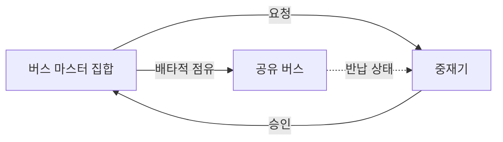
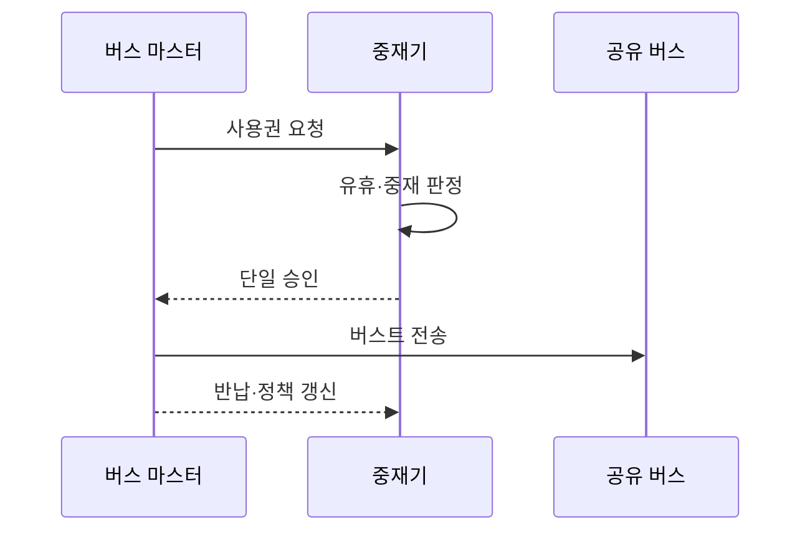

---
sidebar:
  order: 36
  label: "036. 버스 중재 방식 (Bus Arbitration)"
  badge:
    text: "기출 · 70%"
    variant: note
title: "버스 중재 방식 (Bus Arbitration)"
date: "2026-07-25T17:30:00+09:00"
tags:
  - "notes-hardware"
weight: 36
extra:
  question_no: "036"
  source_status: "기출"
  source_history: "128회, 137회"
  priority: 70
  priority_note: "공정성·지연 절충의 반복 기출 핵심 주제"
---

## 미리 알고가기

- **버스 중재(Bus Arbitration)**: 여러 요청 중 하나에 공유 버스를 배타적으로 승인해 충돌을 방지하는 제어
- **버스 마스터(Bus Master)**: 버스 사용권을 요청하고 전송을 시작하는 주체
- **중재기(Arbiter)**: 요청을 정책에 따라 하나만 승인하는 제어기
- **요청(Request)·승인(Grant)**: 사용 의사와 배타적 사용권을 나타내는 신호
- **고정 우선순위(Fixed Priority)**: 정해진 서열로 요청을 선택하는 정책
- **라운드 로빈(Round-Robin)**: 승인 기회를 요청자 순서대로 순환하는 정책
- **기아(Starvation)**: 낮은 순위 요청이 계속 선택되지 않는 상태
- **에이징(Aging)**: 대기 시간에 따라 우선순위를 높이는 기법
- **버스트 길이(Burst Length)**: 한 승인에서 연속 처리할 수 있는 전송량
- **중앙 처리 장치(Central Processing Unit, CPU)**: 명령을 실행하며 버스 사용권을 요청하는 대표 마스터
- **직접 메모리 접근(Direct Memory Access, DMA)**: 전용 엔진이 장치와 메모리 사이 블록을 직접 전송하는 방식
- **시스템 온 칩(System on Chip, SoC)**: 프로세서·메모리 제어기·가속기 등을 한 칩에 통합한 시스템
- **인터커넥트(Interconnect)**: 칩 안의 여러 마스터와 메모리·장치를 연결하는 통신 경로
- **중앙 집중식 중재(Centralized Arbitration)**: 하나의 중재기가 모든 요청을 모아 승인 대상을 정하는 방식
- **분산식 중재(Distributed Arbitration)**: 각 마스터가 공유 규칙·신호를 이용해 승인 대상을 함께 정하는 방식
- **단일 장애점(Single Point of Failure)**: 한 구성요소의 고장만으로 전체 기능이 중단되는 지점
- **순환 포인터(Round-Robin Pointer)**: 다음 승인 검사를 시작할 요청자 위치를 기억해 기회를 순환시키는 상태값

## Ⅰ. 개요

- **정의/개념**: 다중 마스터의 공유 버스 사용권 중재 방식
- **배경/필요성**: 다중 마스터 경합으로 단일 버스 중재 필요

### 쉽게 이해하기 (학습용)

- 여러 사람이 마이크를 요청하면 사회자가 한 명에게만 발언권을 준다

## Ⅱ. 특징

- 배타적 소유권은 다중 마스터의 전기 충돌을 방지한다.
- 우선순위·공정성·버스트 한도가 지연과 기아를 좌우한다.

### 쉽게 이해하기 (학습용)

- 급한 사람을 먼저 부르되 오래 기다린 사람의 차례도 보장한다

## Ⅲ. 아키텍처 및 구성요소

| 설계 요소 | 설명 |
|:---|:---|
| 버스 마스터 집합 | CPU·DMA·가속기 등 사용권 요청 주체 |
| 중재기 | 우선순위·공정성 정책으로 요청 하나를 선택 |
| 공유 버스 | 데이터 전송과 점유·반납 상태를 제공하는 경로 |

> 요약: 중재기가 요청 하나를 선택해 공유 버스 사용권을 준다

### 쉽게 이해하기 (학습용)

- 요청자들이 손들면 사회자가 한 명을 선택해 마이크를 넘긴다

## Ⅳ. 원리 및 절차 흐름도

| 절차 | 설명 |
|:---|:---|
| 사용권 요청 | 마스터가 중재기에 버스 사용 의사 전달 |
| 유휴·중재 판정 | 유휴 상태에서 우선순위·공정성으로 선택 |
| 단일 승인 | 선택 마스터에 배타적 소유권 부여 |
| 버스트 전송 | 승인 마스터가 점유 한도 안에서 전송 |
| 반납·정책 갱신 | 버스 반납 후 순환 포인터·대기 시간 갱신 |

> 요약: 반납 뒤 정책을 갱신해 다음 요청을 다시 판정한다

### 쉽게 이해하기 (학습용)

- 마이크가 비면 순서를 정해 한 명이 쓰고 반납 뒤 차례표를 고친다

## Ⅴ. 종류 및 비교

| 비교축 | 중앙 집중식 중재 | 분산식 중재 |
|:---|:---|:---|
| 핵심 특징 | 단일 중재기가 요청 판정 | 마스터가 분산 규칙으로 판정 |
| 적용 기준 | 빠른 판정·유연한 정책 | 단일 장애점 제거·확장성 |
| 제어 구조 | 분리된 요청·승인 배선 | 공유 신호·분산 제어 로직 |
| 주요 강점 | 빠른 판정·유연한 정책 | 중앙 중재기 단일 장애점 제거 |
| 주요 위험 | 중재기 병목·단일 장애점 | 프로토콜 복잡도·판정 지연 |

> 요약: 중앙식은 빠른 정책 제어, 분산식은 중재기 장애 완화에 적합하다

### 쉽게 이해하기 (학습용)

- 사회자 한 명은 빠르고, 공동 판정은 고장점이 적지만 복잡하다

## Ⅵ. 실무 사례

1. SoC 인터커넥트: CPU 긴급 요청에 고정 우선순위
2. DMA 경합: 라운드 로빈·버스트 한도로 기아 방지

### 쉽게 이해하기 (학습용)

- 급한 발표는 먼저 시켜도 긴 발표 시간은 제한한다
- 운반자들은 차례를 돌려 쓰며 통로 독점을 막는다

## Ⅶ. 결론

- 긴급 지연은 우선순위, 최악 대기는 순환·에이징으로 제한한다

### 쉽게 이해하기 (학습용)

- 급한 요청을 먼저 보내되 오래 기다린 요청의 차례도 지킨다
