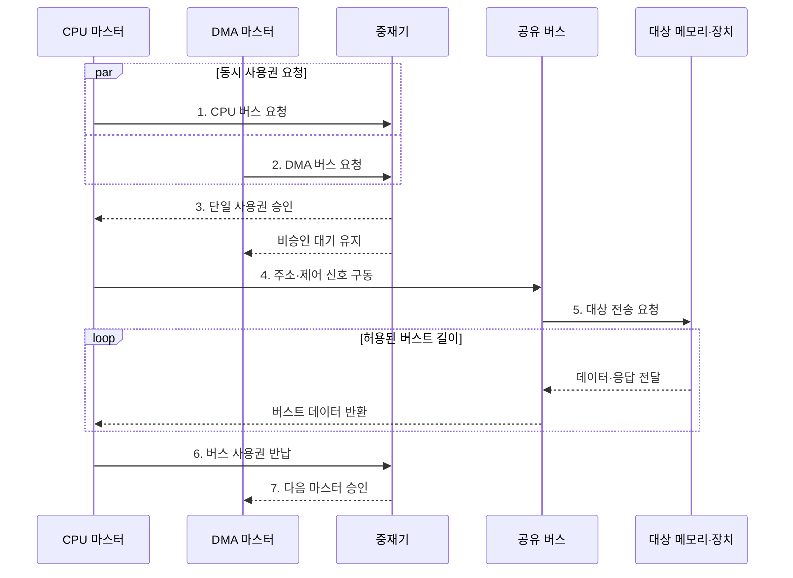

---
sidebar:
  order: 36
  label: "036. 버스 중재 방식 (Bus Arbitration)"
  badge:
    text: "기출 · 70%"
    variant: note
title: "버스 중재 방식 (Bus Arbitration)"
date: "2026-07-28T21:27:55+09:00"
tags:
  - "notes-hardware"
weight: 36
extra:
  question_no: "036"
  source_status: "기출"
  source_history: "128회, 137회"
  priority: 70
  priority_note: "공정성·지연 절충의 반복 기출 핵심 주제"
---

## 미리 알고가기

- **버스 중재(Bus Arbitration)**: 여러 요청 중 하나에 공유 버스를 배타적으로 승인해 충돌을 방지하는 제어
- **버스 마스터(Bus Master)**: 버스 사용권을 요청하고 전송을 시작하는 주체
- **중재기(Arbiter)**: 요청을 정책에 따라 하나만 승인하는 제어기
- **요청(Request)·승인(Grant)**: 사용 의사와 배타적 사용권을 나타내는 신호
- **고정 우선순위(Fixed Priority)**: 정해진 서열로 요청을 선택하는 정책
- **라운드 로빈(Round-Robin)**: 승인 기회를 요청자 순서대로 순환하는 정책
- **기아(Starvation)**: 낮은 순위 요청이 계속 선택되지 않는 상태
- **에이징(Aging)**: 대기 시간에 따라 우선순위를 높이는 기법
- **버스트 길이(Burst Length)**: 한 승인에서 연속 처리할 수 있는 전송량
- **중앙 처리 장치(Central Processing Unit, CPU)**: 명령어를 실행하고 공유 버스의 사용권을 요청하는 대표 버스 마스터
- **직접 메모리 접근(Direct Memory Access, DMA)**: 전용 엔진이 장치와 메모리 사이의 블록을 직접 전송하는 방식
- **시스템 온 칩(System on Chip, SoC)**: 프로세서·메모리 제어기·가속기·주변장치를 하나의 칩에 통합한 시스템
- **인터커넥트(Interconnect)**: 칩 안의 여러 마스터와 메모리·장치를 연결하는 통신 경로
- **중앙 집중식 중재(Centralized Arbitration)**: 하나의 중재기가 모든 요청을 모아 승인 대상을 정하는 방식
- **분산식 중재(Distributed Arbitration)**: 각 마스터가 공유 규칙·신호를 이용해 승인 대상을 함께 정하는 방식
- **단일 장애점(Single Point of Failure)**: 한 구성요소의 고장만으로 전체 기능이 중단되는 지점
- **순환 포인터(Round-Robin Pointer)**: 다음 승인 검사를 시작할 요청자 위치를 기억해 기회를 순환시키는 상태값

## Ⅰ. 개요

- 정의/개념: 공유 버스의 **배타적 사용권 배정**
- 배경/필요성: 동시 요청의 **버스 경합·신호 충돌** 방지

### 쉽게 이해하기 (학습용)

- 여러 사람이 마이크를 요청하면 사회자가 한 명에게만 발언권을 준다

## Ⅱ. 특징

- **배타적 소유권**으로 다중 마스터 동시 구동 차단
- **우선순위·공정성·버스트 한도**가 대기시간 결정
- **에이징**으로 저우선순위 요청의 기아 방지

### 쉽게 이해하기 (학습용)

- 급한 사람을 먼저 부르되 오래 기다린 사람의 차례도 보장한다

## Ⅲ. 구조 및 구성요소

| 구성요소 | 책임 |
|:---|:---|
| 버스 마스터 집합 | 사용권 요청·**승인 후 전송** |
| 중재기 | 정책 기반 **단일 승인 대상** 선택 |
| 공유 버스 | 승인 마스터의 **배타적 경로** 제공 |

### 쉽게 이해하기 (학습용)

- 여러 마스터가 요청하면 중재기가 하나만 승인해 공유 버스의 충돌을 막는다.

## Ⅳ. 흐름도

**동작 원리**

- **1. CPU 버스 요청**: 사용권 요구
- **2. DMA 버스 요청**: 블록 전송 요구
- **3. 단일 사용권 승인**: 정책으로 하나 선택
- **4. 주소·제어 신호 구동**: 승인 주체만 출력
- **5. 대상 전송 요청**: 트랜잭션 전달
- **6. 버스 사용권 반납**: 점유 해제
- **7. 다음 마스터 승인**: 대기자 선택

### 쉽게 이해하기 (학습용)

- 중재기는 동시 요청 중 하나만 승인하고 버스트가 끝나면 다음 대기자에게 사용권을 넘긴다

## Ⅴ. 종류 및 비교

| 버스 중재 방식 | 중앙 집중식 중재 | 분산식 중재 |
|:---|:---|:---|
| 적용 기준 | 빠른 판정·**유연한 정책** | 단일 장애점 제거·**확장성** |
| 핵심 특징 | 중재기의 **요청·승인 판정** | 마스터의 **분산 규칙 공동 판정** |
| 한계 | 중재기 병목·**단일 장애점** | 프로토콜 복잡도·**판정 지연** |

> 요약: 중앙식은 속도, 분산식은 장애 분산

### 쉽게 이해하기 (학습용)

- 사회자 한 명은 빠르고, 공동 판정은 고장점이 적지만 복잡하다

## Ⅵ. 실무 고려사항 및 대책

| 고려사항 | 대책 | 효과 |
|:---|:---|:---|
| 고정 우선순위로 저순위 요청 기아 | 에이징·라운드 로빈과 최대 대기 시간 감시 | 공정성 확보 |
| 긴 버스트가 버스를 계속 독점 | 최대 버스트 길이·시간 할당량 제한 | 꼬리 지연 완화 |
| 중앙 중재기 병목·단일 장애 | 이중화·계층형 중재와 오류 검출 적용 | 가용성·확장성 향상 |
| 긴급 요청의 우선순위 역전·지연 상한 초과 | 트래픽 등급·예약 대역폭과 최악 지연 검증 | 실시간 요구 보장 |

> 사례: **CPU 긴급 요청**에 고정 우선순위

### 쉽게 이해하기 (학습용)

- SoC 인터커넥트는 CPU 긴급 요청을 우선 승인하되 최대 버스트 길이와 에이징으로 다른 마스터의 꼬리 지연과 기아를 제한한다

## Ⅶ. 결론

- **최대 대기 시간·버스트 길이·기아율** 기반 정책 선택

### 쉽게 이해하기 (학습용)

- 급한 요청을 먼저 보내되 오래 기다린 요청의 차례도 지킨다
