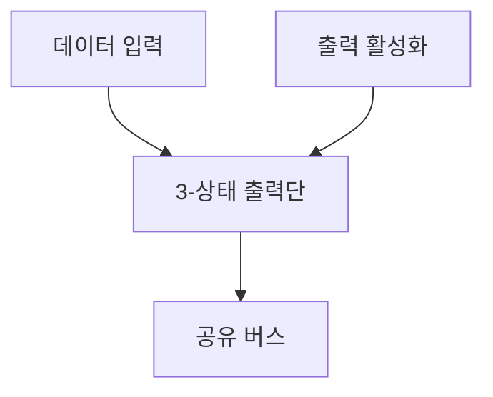

---
sidebar:
  order: 37
  label: "037. 3-상태 버퍼·트라이스테이트 (Tri-State Buffer)"
  badge:
    text: "기출 · 50%"
    variant: note
title: "3-상태 버퍼·트라이스테이트 (Tri-State Buffer)"
date: "2026-07-28T21:27:55+09:00"
tags:
  - "notes-hardware"
weight: 37
extra:
  question_no: "037"
  source_status: "기출"
  source_history: "129회"
  priority: 50
  priority_note: "외부 버스 공유와 경합 방지의 기출 주제"
---

## 미리 알고가기

- **3-상태 버퍼(Tri-State Buffer)**: 활성화에 따라 0·1 또는 고임피던스를 출력해 공유선 충돌을 방지하는 버퍼
- **고임피던스(High Impedance, Z)**: 출력 구동을 차단하여 공유선에 전기적으로 영향을 주지 않는 고저항 상태
- **출력 활성화(Output Enable, OE)**: 버퍼의 출력 구동 상태와 고임피던스 상태를 선택하는 제어 신호
- **버스 경합(Bus Contention)**: 여러 출력의 동시 구동으로 생기는 전류·논리 충돌
- **부동(Floating)**: 구동자가 없어 전압이 정해지지 않은 상태
- **원-핫(One-Hot)**: 활성 신호 하나만 참인 제어 조건
- **비중첩 전환(Break-Before-Make)**: 현재 출력을 끈 뒤 다음 출력을 켜는 전환
- **멀티플렉서(Multiplexer, MUX)**: 선택 신호에 따라 여러 입력 중 하나를 출력에 연결하는 조합 회로
- **오픈드레인(Open-Drain)**: 출력이 0이나 고임피던스만 만들고 외부 저항이 1 전압을 만드는 공유선 출력 방식
- **풀업 저항(Pull-up Resistor)**: 구동자가 없을 때 신호선을 높은 전압으로 끌어올리는 저항
- **유선 논리곱(Wired AND)**: 여러 오픈드레인 출력 중 하나라도 0을 구동하면 공유선이 0이 되는 연결
- **데이터 입출력(DQ) 버스**: 메모리와 제어기 사이에서 읽기·쓰기 데이터를 양방향으로 전달하는 신호선
- **현장 프로그래머블 게이트 배열(Field-Programmable Gate Array, FPGA)**: 제조 후에도 내부 논리와 배선을 재구성할 수 있는 반도체
- **턴어라운드(Turnaround)**: 양방향 버스의 구동 방향을 바꿀 때 두 출력이 동시에 켜지지 않도록 두는 전환 시간
- **논리 합성(Logic Synthesis)**: 하드웨어 논리 설명을 실제 게이트·멀티플렉서 연결로 변환하는 과정

## Ⅰ. 개요

- 정의/개념: 활성화 신호로 **0·1·고임피던스** 출력을 선택하는 회로
- 기존 한계: 다중 출력의 동시 구동은 **경합 전류·논리 충돌** 유발

### 쉽게 이해하기 (학습용)

- 마이크 스위치를 켠 한 사람만 선을 구동하고 나머지는 연결을 끊는다

## Ⅱ. 특징

- **고임피던스(Z)**로 비선택 출력의 공유선 분리
- **원-핫·비중첩 제어**로 동시 구동 경합 방지
- 무구동 구간은 **부동 입력** 방지를 위한 풀업 필요

### 쉽게 이해하기 (학습용)

- 두 사람이 동시에 말하거나 오래 선을 놓으면 신호가 틀어진다

## Ⅲ. 아키텍처

**도표안 A — 구조도**

| 구성요소 | 책임 |
|:---|:---|
| 데이터 입력 | 외부로 보낼 **논리 0·1** 제공 |
| 출력 활성화 | 출력 구동과 **고임피던스** 선택 |
| 3-상태 출력단 | 데이터·OE에 따라 **0·1·Z** 출력 |
| 공유 버스 | 단일 구동자의 **신호 전달** |

> 요약: 출력 활성화가 데이터 구동과 공유 버스 분리를 제어한다

### 쉽게 이해하기 (학습용)

- 스위치가 켜진 출력만 공유선에 말을 보내고 나머지는 물러난다

## Ⅳ. 종류 및 비교

| 공유 경로 구성 | 3-상태 버퍼 | 멀티플렉서 | 오픈드레인 |
|:---|:---|:---|:---|
| 적용 기준 | 외부 **양방향 데이터 버스** | 내부 **선택 경로** | 다중 장치 **공유 제어선** |
| 핵심 특징 | OE 기반 **0·1·Z 출력** | 선택 입력의 **단일 출력 연결** | 0·Z 출력과 **외부 풀업** |
| 한계 | 경합 전류·**무구동 부동** | 선택 지연·**배선 증가** | 풀업 지연·**High 직접 구동 불가** |

> 요약: 외부 버스는 3-상태, 내부 경로는 MUX가 적합하다

### 쉽게 이해하기 (학습용)

- 공유 마이크, 내부 선택기, 당김선은 연결 원리가 서로 다르다

## Ⅴ. 실무 고려사항 및 대책

| 고려사항 | 대책 | 효과 |
|:---|:---|:---|
| 둘 이상의 출력이 동시에 활성화 | OE 원-핫 속성과 경합 전류 감시 | 전기적 충돌 방지 |
| 방향 전환 시 구동 시간이 겹침 | 비중첩 제어와 최소 턴어라운드 시간 검증 | 순간 단락 방지 |
| 모든 출력이 Z인 동안 버스 부동 | 풀업·풀다운 또는 버스 홀드 적용 | 입력값 안정화 |
| FPGA 내부 3상 버퍼가 MUX로 합성 | 내부 경로는 명시적 MUX로 설계하고 핀에서만 3상 사용 | 합성 결과 예측성 향상 |

> 사례: 메모리 DQ 버스는 **읽기·쓰기 전환**에 턴어라운드 확보

### 쉽게 이해하기 (학습용)

- 메모리 DQ 버스는 읽기·쓰기 방향 전환 전에 모든 출력을 끄는 턴어라운드를 두고 OE 원-핫으로 순간 단락을 막는다

## Ⅵ. 결론

- 외부 양방향 버스는 **3상 버퍼**, FPGA 내부 선택 경로는 MUX 선택

### 쉽게 이해하기 (학습용)

- 외부 공유선은 한 사람만 켜고 내부 신호는 선택기로 정한다
