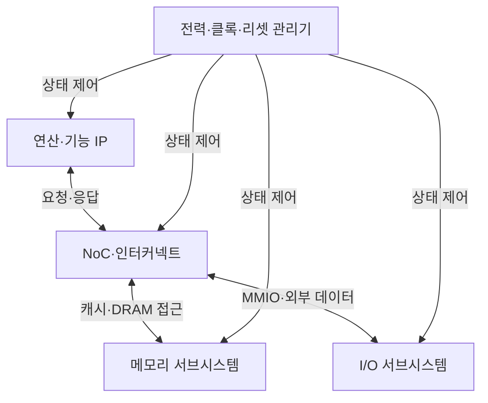
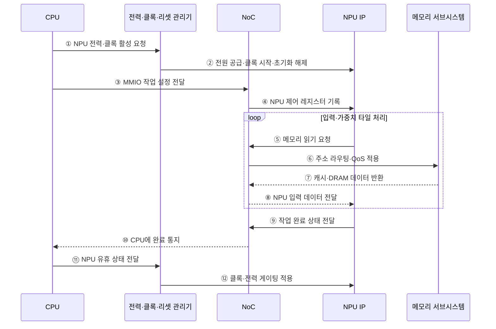

---
sidebar:
  order: 38
  label: "038. SoC 시스템온칩 (System on Chip)"
  badge:
    text: "기출 · 50%"
    variant: note
title: "SoC 시스템온칩 (System on Chip)"
date: "2026-07-28T21:27:55+09:00"
tags:
  - "notes-hardware"
weight: 38
extra:
  question_no: "038"
  source_status: "기출"
  source_history: "128회"
  priority: 50
  priority_note: "통합 경계·NoC·전력 도메인 비교"
---

## 미리 알고가기

- **시스템온칩(System on Chip, SoC)**: 연산·메모리·입출력 기능을 하나의 다이에 통합한 칩
- **다이(Die)**: 웨이퍼에서 절단해 패키지에 넣는 회로 조각
- **지식재산 블록(Intellectual Property Block, IP Block)**: 검증을 마쳐 여러 반도체 설계에 재사용할 수 있는 회로 모듈
- **이기종 연산 IP(Heterogeneous Compute IP)**: CPU·GPU·NPU 등 역할별 연산 블록
- **온칩 네트워크(Network on Chip, NoC)**: 칩 내부의 여러 IP 블록 사이에서 트랜잭션을 라우팅하는 패킷 기반 연결망
- **캐시 일관성(Cache Coherence)**: 공유 데이터의 코어별 복사본을 일치시키는 규칙
- **메모리 맵 입출력(Memory-mapped I/O, MMIO)**: 주변장치 레지스터를 메모리 주소 공간에 배치하여 제어하는 방식
- **서비스 품질(Quality of Service, QoS)**: 트래픽 종류별 우선순위·대역폭·지연 목표를 보장하는 자원 제어 정책
- **전력 도메인(Power Domain)**: 전원을 독립 제어하는 회로 영역
- **클록·전력 게이팅(Clock·Power Gating)**: 유휴 블록의 클록·전원을 차단
- **동적 전압·주파수 조절(Dynamic Voltage and Frequency Scaling, DVFS)**: 처리 부하와 전력 한도에 따라 동작 전압과 주파수를 조절하는 기법
- **패키지 내 시스템(System in Package, SiP)**: 서로 다른 기능의 여러 다이를 하나의 패키지 안에서 연결한 시스템
- **마이크로프로세서 장치 기반 보드(Microprocessor Unit-based Board, MPU-based Board)**: 독립 프로세서·메모리·주변 칩을 기판 배선으로 결합한 시스템
- **중앙 처리 장치(Central Processing Unit, CPU)**: 범용 명령 실행과 시스템 제어를 맡는 프로세서
- **그래픽 처리 장치(Graphics Processing Unit, GPU)**: 많은 연산 코어로 그래픽·병렬 계산을 처리하는 프로세서
- **신경망 처리 장치(Neural Processing Unit, NPU)**: 신경망의 행렬·텐서 연산을 낮은 전력으로 가속하는 프로세서
- **입출력(Input/Output, I/O)**: 칩과 외부 장치 사이의 명령·상태·데이터 전달
- **정적 임의 접근 메모리(Static Random-Access Memory, SRAM)**: 재충전 없이 값을 유지해 온칩 캐시에 쓰는 고속 메모리
- **동적 임의 접근 메모리(Dynamic Random-Access Memory, DRAM)**: 주기적 재충전이 필요하며 외부 주기억장치에 쓰는 고밀도 메모리
- **인쇄 회로 기판(Printed Circuit Board, PCB)**: 독립 칩과 부품을 배선으로 연결해 시스템을 구성하는 기판
- **이미지 신호 처리기(Image Signal Processor, ISP)**: 카메라 센서 원시 데이터를 보정·변환해 영상으로 만드는 전용 블록
- **인공지능(Artificial Intelligence, AI)**: 학습한 모델로 분류·예측을 수행하며 NPU가 해당 연산을 가속하는 기술
- **테이프아웃(Tape-out)**: 칩 설계를 제조용 최종 도면으로 확정해 반도체 공정에 넘기는 단계
- **수율(Yield)**: 제조한 다이 중 요구 기능과 품질 기준을 통과한 비율
- **칩렛(Chiplet)**: 기능별로 나눈 작은 다이를 패키지 안에서 연결해 하나의 시스템처럼 쓰는 구성 단위

## Ⅰ. 개요

- 정의/개념: 연산·메모리·I/O **IP를 단일 다이에 통합**한 시스템
- 기존 한계: 개별 칩 연결은 **통신 지연·I/O 전력** 증가

### 쉽게 이해하기 (학습용)

- 연산·메모리 제어·입출력 기능을 하나의 다이에 통합하고 온칩 인터커넥트로 연결하여 통신 지연과 외부 배선을 줄인다

## Ⅱ. 특징

- **단일 다이 통합**으로 보드 면적·I/O 전력 절감
- **NoC**로 이기종 IP의 주소·대역폭 중재
- **전력 도메인**으로 블록별 전원·클록 제어

### 쉽게 이해하기 (학습용)

- 서로 다른 부서를 한 건물에 넣기 전에 방 번호와 근무 시간, 비상 초기화 규칙을 맞춘다

## Ⅲ. 아키텍처

**도표안 A — 구조도**

| 구성요소 | 책임 |
|:---|:---|
| 연산·기능 IP | 명령에 따른 **연산·제어** 수행 |
| NoC·인터커넥트 | 주소 라우팅·중재와 **QoS 전달** |
| 메모리 서브시스템 | 캐시·SRAM·DRAM의 **데이터 저장·공급** |
| I/O 서브시스템 | MMIO 장치 제어와 **외부 데이터 이동** |
| 전력·클록·리셋 관리기 | 전원·주파수·**초기화 상태** 제어 |

> 요약: NoC가 IP·메모리·I/O를 잇고 전력 상태를 분리

**도표안 B — NPU 작업 설정·메모리 접근·전력 제어 시퀀스**

### 동작 원리

1. **① NPU 전력·클록 활성 요청**: CPU는 AI 작업을 시작하기 전에 전력 관리기에 NPU 도메인을 사용할 수 있는 상태로 전환하도록 요청한다.
2. **② 전원 공급·클록 시작·초기화 해제**: 관리기는 정해진 순서로 전원을 안정화하고 클록을 공급한 뒤 NPU의 초기화 상태를 해제한다.
3. **③ MMIO 작업 설정 전달**: CPU는 모델 입력·가중치·출력 주소와 연산 파라미터를 MMIO 쓰기로 NoC에 보낸다.
4. **④ NPU 제어 레지스터 기록**: NoC는 주소를 해석해 요청을 NPU IP의 제어 레지스터로 라우팅한다.
5. **⑤ 메모리 읽기 요청**: NPU는 처리할 입력·가중치 타일의 주소를 NoC 트랜잭션으로 발행한다.
6. **⑥ 주소 라우팅·QoS 적용**: NoC는 목적지 메모리와 경로를 정하고 영상·AI 등 트래픽 등급에 따른 대역폭·우선순위를 적용한다.
7. **⑦ 캐시·DRAM 데이터 반환**: 메모리 서브시스템은 온칩 캐시나 외부 DRAM에서 요청 데이터를 읽어 NoC에 반환한다.
8. **⑧ NPU 입력 데이터 전달**: NoC는 응답을 요청 NPU로 라우팅하고 NPU는 타일 연산을 수행한다.
9. **⑨ 작업 완료 상태 전달**: 모든 타일의 연산과 출력 기록이 끝나면 NPU는 완료 상태를 NoC에 보낸다.
10. **⑩ CPU에 완료 통지**: NoC는 완료 메시지를 CPU의 인터럽트·상태 경로로 전달해 소프트웨어가 결과를 회수하게 한다.
11. **⑪ NPU 유휴 상태 전달**: 후속 작업이 없으면 CPU는 전력 관리기에 NPU가 유휴 상태임을 알린다.
12. **⑫ 클록·전력 게이팅 적용**: 관리기는 상태 보존과 기동 지연 정책에 따라 NPU의 클록 또는 전원을 차단한다.

### 쉽게 이해하기 (학습용)

- CPU·가속기·메모리·입출력 IP를 온칩 인터커넥트로 연결하고 전력 관리기가 블록별 전압·클록 상태를 제어한다

## Ⅳ. 종류 및 비교

| 시스템 통합 방식 | SoC | SiP | MPU 기반 보드 |
|:---|:---|:---|:---|
| 적용 기준 | 대량·**소형·저전력** | 이종 공정·**칩렛 결합** | 소량·**잦은 사양 변경** |
| 핵심 특징 | 단일 다이·**온다이 NoC** | 복수 다이·**다이 간 링크** | 독립 칩·**PCB 링크** |
| 한계 | 대형 다이 **수율·검증** | 패키지 **수율·발열** | 보드 면적·**I/O 전력** |

> 요약: 통합 범위와 변경 주기로 구현 방식 선택

### 쉽게 이해하기 (학습용)

- 한 건물은 이동이 가장 짧고 한 단지는 건물을 바꿀 수 있으며 보드는 부품 교체가 가장 쉽다

## Ⅴ. 실무 고려사항 및 대책

| 고려사항 | 대책 | 효과 |
|:---|:---|:---|
| 이기종 IP 트래픽으로 NoC 혼잡 | 흐름별 대역폭·지연 감시와 QoS·가상 채널 설정 | 우선 트래픽 지연 보장 |
| 전력 게이팅 해제의 기동 지연 | 사용 예측·유휴 임계치와 상태 유지 수준 조정 | 전력·응답성 균형 |
| 주소 맵·캐시 일관성 규칙 불일치 | IP 통합 검증과 경계·동시성 시험 | 데이터·제어 오류 방지 |
| 대형 다이의 수율 저하·열 집중 | 기능 분할·칩렛 대안과 DVFS·열 감시 적용 | 제조비·지속 성능 개선 |

> 사례: 스마트폰 SoC는 **ISP·NPU 대역폭**을 NoC에 예약

### 쉽게 이해하기 (학습용)

- 스마트폰 SoC는 ISP·NPU 트래픽에 NoC 대역폭을 예약하고 유휴 블록을 게이팅해 영상 지연과 전력 예산을 함께 맞춘다

## Ⅵ. 결론

- 대량 고정 기능은 **SoC**, 이종 공정은 SiP, 잦은 변경은 MPU 보드 선택

### 쉽게 이해하기 (학습용)

- 많이 만들 고정 기능은 한 칩에, 다른 공정은 한 패키지에, 자주 바꾸면 보드에 둔다
