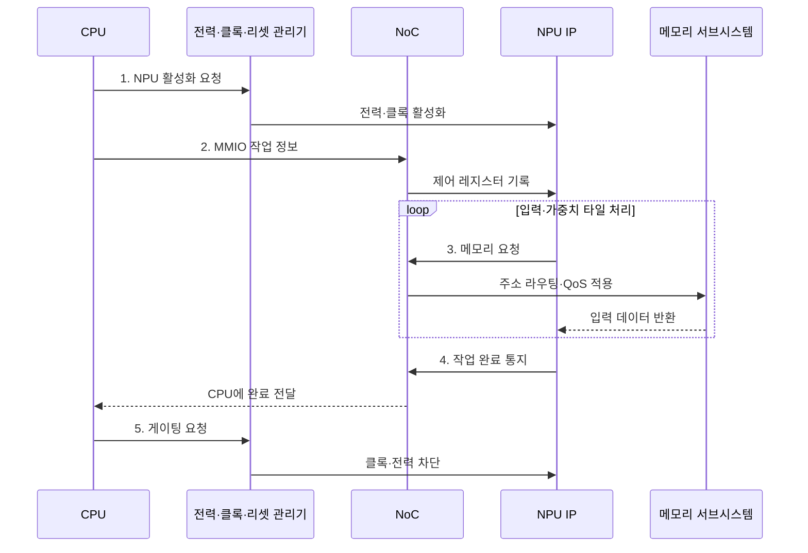

---
sidebar:
  order: 38
  label: "038. SoC 시스템온칩 (System on Chip)"
  badge:
    text: "기출 · 50%"
    variant: note
title: "SoC 시스템온칩 (System on Chip)"
date: "2026-08-02T10:58:00+09:00"
tags:
  - "notes-hardware"
weight: 38
extra:
  question_no: "038"
  source_status: "기출"
  source_history: "128회"
  priority: 50
  priority_note: "통합 경계·NoC·전력 도메인 비교"
---

## Ⅰ. 개요

핵심 용어

- **시스템온칩(System on Chip, SoC)**: 연산·메모리·입출력 기능을 하나의 반도체 다이에 통합한 시스템이다.
- **다이(Die)**: 웨이퍼에서 절단하여 패키지에 넣는 하나의 반도체 회로 조각이다.
- **입출력 전력(I/O Power)**: 칩 사이의 물리 연결을 통해 신호를 송수신할 때 소비되는 전력이다.

- 정의/개념: 연산·메모리·I/O를 **단일 다이에 통합한 시스템**
- 배경/필요성: 개별 칩 간 **통신 지연·I/O 전력**으로 소형화 제약

#### 한줄 요약

- 연산·메모리 제어·입출력 기능을 하나의 다이에 통합하고 온칩 인터커넥트로 연결하여 통신 지연과 외부 배선을 줄인다

## Ⅱ. 특징

핵심 용어

- **온칩 네트워크(Network on Chip, NoC)**: 하나의 칩 안에서 여러 IP 블록 사이의 트랜잭션을 라우팅하고 중재하는 연결망이다.
- **지식재산(Intellectual Property, IP) 블록**: 검증된 연산·제어 기능을 재사용하도록 모듈화한 설계 블록이다.
- **전력 도메인(Power Domain)**: 전원을 다른 영역과 독립적으로 공급하거나 차단할 수 있도록 구분한 회로 영역이다.
- **클록 게이팅(Clock Gating)**: 유휴 블록에 공급되는 클록을 차단하여 불필요한 동적 전력을 줄이는 기법이다.

- 보드 면적·I/O 전력을 줄이는 **단일 다이 통합**
- 이기종 IP의 주소·대역폭을 중재하는 **NoC**
- 블록별 전원·클록을 제어하는 **전력 도메인**

#### 한줄 요약

- 서로 다른 부서를 한 건물에 넣기 전에 방 번호와 근무 시간, 비상 초기화 규칙을 맞춘다

## Ⅲ. 구조 및 구성요소

핵심 용어

- **지식재산 블록(Intellectual Property Block, IP Block)**: 검증된 연산·제어 기능을 재사용할 수 있도록 모듈화한 반도체 설계 블록이다.
- **메모리 서브시스템(Memory Subsystem)**: 캐시와 메모리 제어기를 통해 연산 블록에 명령과 데이터를 공급하는 구성이다.
- **리셋 관리기(Reset Manager)**: 전원과 클록의 준비 순서에 맞춰 각 블록의 초기화와 해제를 제어하는 회로이다.
- **온칩 네트워크(Network on Chip, NoC)·서비스 품질(Quality of Service, QoS)**: IP 사이의 요청을 라우팅하고 트래픽별 대역폭·지연 목표를 적용하는 연결망과 정책이다.
- **동적 임의 접근 메모리(Dynamic Random-Access Memory, DRAM)·입출력(Input/Output, I/O)·메모리 맵 입출력(Memory-Mapped I/O, MMIO)**: 메모리 데이터 공급과 외부 전송 및 장치 레지스터 접근을 담당하는 구성이다.

| 구성요소 | 책임 |
|:---|:---|
| 연산·기능 IP | 명령 기반 **연산·제어** 수행 |
| NoC·인터커넥트 | 주소 라우팅·중재·**QoS 적용** |
| 메모리 서브시스템 | 캐시·DRAM **데이터 공급** |
| I/O 서브시스템 | MMIO·**외부 데이터 이동** |
| 전력·클록·리셋 관리기 | 전원·주파수·**초기화 제어** |

#### 한줄 요약

- NoC가 연산·메모리·I/O 블록을 연결하고 관리기가 각 블록의 전력 상태를 제어한다.

## Ⅳ. 흐름도

핵심 용어

- **메모리 맵 입출력(Memory-mapped I/O, MMIO)**: 장치 제어 레지스터를 메모리 주소 공간에 배치하여 읽기·쓰기로 제어하는 방식이다.
- **서비스 품질(Quality of Service, QoS)**: 트래픽 종류별 우선순위와 대역폭 및 지연 목표를 보장하도록 자원을 제어하는 정책이다.
- **전력 게이팅(Power Gating)**: 사용하지 않는 회로 블록의 전원을 차단하여 누설 전력을 줄이는 기법이다.
- **중앙 처리 장치(Central Processing Unit, CPU)·신경망 처리 장치(Neural Processing Unit, NPU)**: 작업을 설정하는 범용 프로세서와 신경망 연산을 가속하는 전용 처리기이다.
- **온칩 네트워크(Network on Chip, NoC)·지식재산(Intellectual Property, IP) 블록**: SoC 내부 요청을 전달하는 연결망과 재사용 가능한 기능 블록이다.

**동작 원리**

1. **NPU 활성화 요청**: 전력·클록 공급 후 초기화 해제
2. **MMIO 작업 정보**: 주소·연산 정보를 IP에 전달
3. **메모리 요청**: NoC 경로·QoS를 적용해 타일 공급
4. **작업 완료 통지**: 결과 회수 가능 상태로 전환
5. **게이팅 요청**: 미사용 IP의 동적 전력 차단

#### 한줄 요약

- CPU가 NPU를 깨워 작업을 설정하면 NoC가 메모리 데이터를 전달하고, 완료 후 전력 관리기가 다시 게이팅한다

## Ⅴ. 종류 및 비교

핵심 용어

- **패키지 내 시스템(System in Package, SiP)**: 서로 다른 기능이나 공정의 여러 다이를 하나의 패키지 안에서 연결한 시스템이다.
- **마이크로프로세서 기반 보드(MPU-based Board)**: 독립 프로세서와 메모리 및 주변 칩을 인쇄회로기판 배선으로 결합한 시스템이다.
- **칩렛(Chiplet)**: 기능별로 나눈 작은 다이를 패키지 안에서 연결하여 하나의 시스템처럼 사용하는 구성 단위이다.
- **시스템온칩(System on Chip, SoC)·온칩 네트워크(Network on Chip, NoC)**: 단일 다이에 기능을 통합하고 내부 연결망으로 블록을 잇는 방식이다.
- **인쇄회로기판(Printed Circuit Board, PCB)·입출력(Input/Output, I/O)**: 독립 칩을 보드 배선으로 연결하는 기판과 칩 사이 데이터 전송 경로이다.

| 시스템 통합 방식 | SoC | SiP | MPU 기반 보드 |
|:---|:---|:---|:---|
| 적용 기준 | 대량·**소형·저전력** | 이종 공정·**칩렛 결합** | 소량·**잦은 사양 변경** |
| 핵심 특징 | 단일 다이·**온다이 NoC** | 복수 다이·**다이 간 링크** | 독립 칩·**PCB 링크** |
| 한계 | 대형 다이 **수율·검증** | 패키지 **수율·발열** | 보드 면적·**I/O 전력** |

> 요약: 통합 범위와 변경 주기로 구현 방식 선택

#### 한줄 요약

- 한 건물은 이동이 가장 짧고 한 단지는 건물을 바꿀 수 있으며 보드는 부품 교체가 가장 쉽다

## Ⅵ. 실무 고려사항 및 대책

핵심 용어

- **가상 채널(Virtual Channel)**: 하나의 물리 링크를 여러 논리 흐름으로 분리하여 혼잡과 선두 차단을 줄이는 전송 자원이다.
- **캐시 일관성(Cache Coherence)**: 여러 연산 주체가 가진 공유 데이터의 캐시 복사본을 동일하게 유지하는 규칙이다.
- **동적 전압·주파수 조절(Dynamic Voltage and Frequency Scaling, DVFS)**: 부하와 전력·열 한도에 맞춰 동작 전압과 주파수를 조절하는 기법이다.
- **수율(Yield)**: 제조한 전체 다이 가운데 요구 기능과 품질 기준을 통과한 다이의 비율이다.
- **온칩 네트워크(Network on Chip, NoC)·서비스 품질(Quality of Service, QoS)**: 칩 내부 트래픽을 전달하고 흐름별 대역폭·지연을 제어하는 연결망과 정책이다.
- **지식재산(Intellectual Property, IP)·이미지 신호 처리기(Image Signal Processor, ISP)·신경망 처리 장치(Neural Processing Unit, NPU)**: 재사용 설계 블록과 영상·신경망 전용 가속 블록이다.
- **시스템온칩(System on Chip, SoC)**: 연산·메모리·입출력 기능을 단일 다이에 통합한 시스템이다.

| 문제 | 대책 | 효과 |
|:---|:---|:---|
| 이기종 IP 트래픽으로 NoC 혼잡 | 흐름별 대역폭·지연 감시와 **QoS·가상 채널** 설정 | 우선 트래픽 **지연 보장** |
| 전력 게이팅 해제의 기동 지연 | 사용 예측·**유휴 임계치**와 상태 유지 수준 조정 | **전력·응답성** 균형 |
| 주소 맵·**캐시 일관성** 규칙 불일치 | **IP 통합 검증**과 경계·동시성 시험 | **데이터·제어 오류** 방지 |
| 대형 다이의 수율 저하·열 집중 | 기능 분할·칩렛과 **DVFS·열 감시** 적용 | 제조비·지속 성능 개선 |

> 사례: 스마트폰 SoC는 **ISP·NPU 대역폭**을 NoC에 예약

#### 한줄 요약

- 스마트폰 SoC는 ISP·NPU 트래픽에 NoC 대역폭을 예약하고 유휴 블록을 게이팅해 영상 지연과 전력 예산을 함께 맞춘다

## Ⅶ. 결론

핵심 용어

- **이종 공정(Heterogeneous Process)**: 기능별 블록을 서로 다른 제조 공정으로 구현하여 비용과 성능을 최적화하는 방식이다.
- **통합 범위(Integration Scope)**: 한 다이·한 패키지·한 보드 중 시스템 기능을 묶어 구현하는 물리적 경계이다.
- **사양 변경 주기(Specification Change Cycle)**: 제품 기능이나 인터페이스 요구가 갱신되어 설계를 수정해야 하는 시간 간격이다.
- **시스템온칩(System on Chip, SoC)·패키지 내 시스템(System in Package, SiP)**: 기능을 한 다이에 통합하거나 여러 다이를 한 패키지에 연결하는 구현 방식이다.

- 고정 대량은 **SoC**, 이종 공정은 **SiP**, 변경 잦으면 보드 구성

#### 한줄 요약

- 많이 만들 고정 기능은 한 칩에, 다른 공정은 한 패키지에, 자주 바꾸면 보드에 둔다
