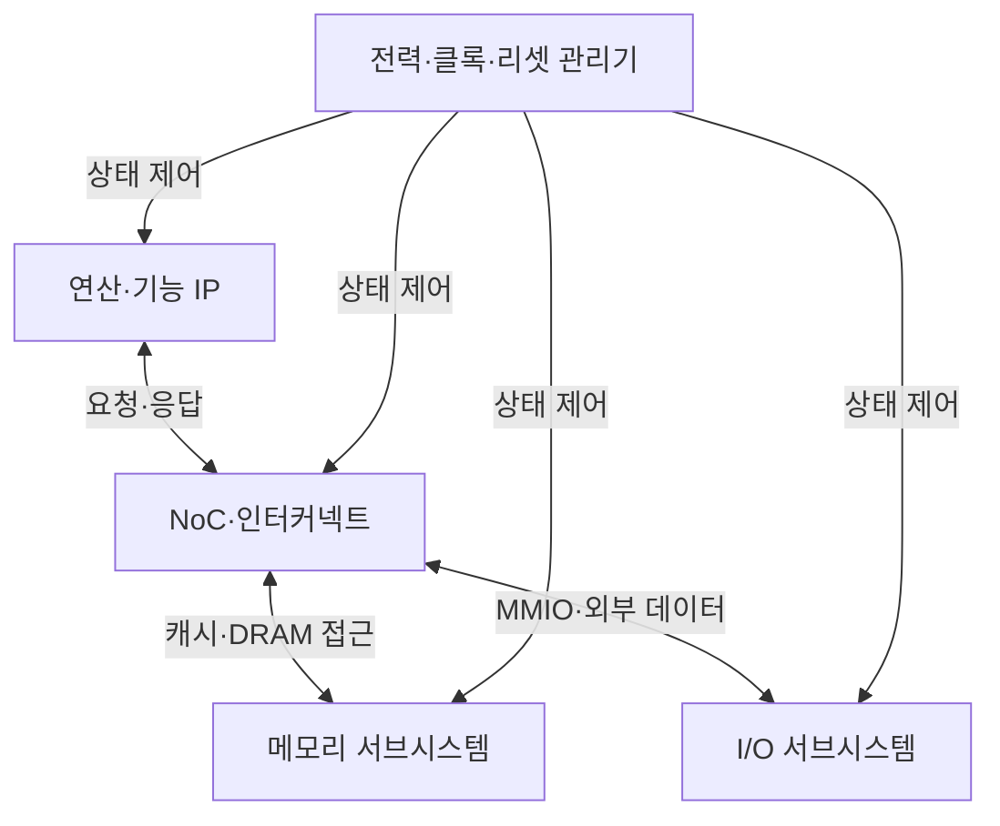
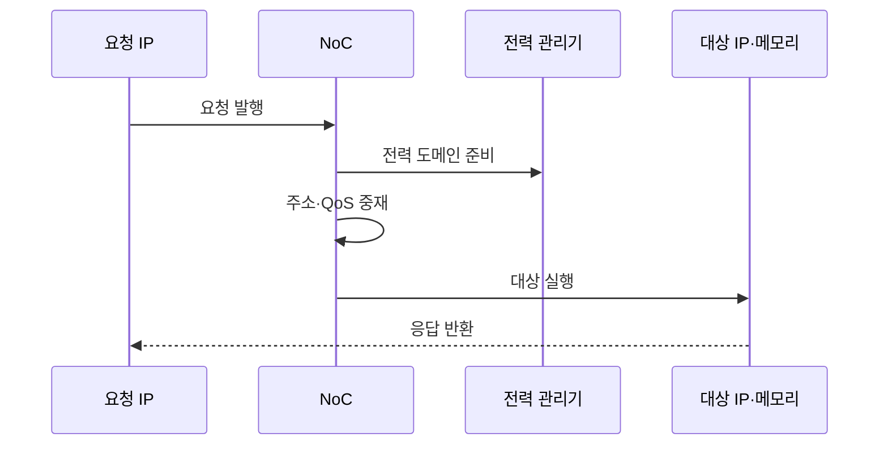

---
sidebar:
  order: 38
  label: "038. SoC 시스템온칩 (System on Chip)"
  badge:
    text: "기출 · 50%"
    variant: note
title: "SoC 시스템온칩 (System on Chip)"
date: "2026-07-27T23:59:59+09:00"
tags:
  - "notes-hardware"
weight: 38
extra:
  question_no: "038"
  source_status: "기출"
  source_history: "128회"
  priority: 50
  priority_note: "통합 경계·NoC·전력 도메인 비교"
---

## 미리 알고가기

- **시스템온칩(System on Chip, SoC)**: ‘에스오씨’로 읽고 영문 핵심 글자를 딴 약어이며, 연산·메모리·입출력 기능을 한 다이에 통합한 칩
- **다이(Die)**: 웨이퍼에서 절단해 패키지에 넣는 회로 조각
- **지식재산 블록(Intellectual Property Block, IP Block)**: ‘아이피 블록’으로 읽고 영문 머리글자를 딴 약어이며, 재사용 가능한 검증 회로 모듈
- **이기종 연산 IP(Heterogeneous Compute IP)**: CPU·GPU·NPU 등 역할별 연산 블록
- **온칩 네트워크(Network on Chip, NoC)**: ‘엔오씨’로 읽고 영문 핵심 글자를 딴 약어이며, IP 간 트랜잭션을 라우팅하는 연결망
- **캐시 일관성(Cache Coherence)**: 공유 데이터의 코어별 복사본을 일치시키는 규칙
- **메모리 맵 입출력(Memory-mapped I/O, MMIO)**: ‘엠엠아이오’로 읽고 영문 핵심 글자를 딴 약어이며, 주변장치를 주소 공간으로 제어하는 방식
- **서비스 품질(Quality of Service, QoS)**: ‘큐오에스’로 읽고 영문 핵심 글자를 딴 약어이며, 우선순위·대역폭·지연을 트래픽별 보장
- **전력 도메인(Power Domain)**: 전원을 독립 제어하는 회로 영역
- **클록·전력 게이팅(Clock·Power Gating)**: 유휴 블록의 클록·전원을 차단
- **동적 전압·주파수 조절(Dynamic Voltage and Frequency Scaling, DVFS)**: ‘디브이에프에스’로 읽고 영문 머리글자를 딴 약어이며, 부하에 맞춰 전압·주파수 변경
- **패키지 내 시스템(System in Package, SiP)**: ‘에스아이피’로 읽고 영문 핵심 글자를 딴 약어이며, 여러 다이를 한 패키지에 연결
- **마이크로프로세서 장치 기반 보드(Microprocessor Unit-based Board, MPU-based Board)**: 독립 프로세서·메모리·주변 칩을 기판 배선으로 결합한 시스템
- **중앙 처리 장치(Central Processing Unit, CPU)**: 범용 명령 실행과 시스템 제어를 맡는 프로세서
- **그래픽 처리 장치(Graphics Processing Unit, GPU)**: 많은 연산 코어로 그래픽·병렬 계산을 처리하는 프로세서
- **신경망 처리 장치(Neural Processing Unit, NPU)**: 신경망의 행렬·텐서 연산을 낮은 전력으로 가속하는 프로세서
- **입출력(Input/Output, I/O)**: 칩과 외부 장치 사이의 명령·상태·데이터 전달
- **정적 임의 접근 메모리(Static Random-Access Memory, SRAM)**: 재충전 없이 값을 유지해 온칩 캐시에 쓰는 고속 메모리
- **동적 임의 접근 메모리(Dynamic Random-Access Memory, DRAM)**: 주기적 재충전이 필요하며 외부 주기억장치에 쓰는 고밀도 메모리
- **인쇄 회로 기판(Printed Circuit Board, PCB)**: 독립 칩과 부품을 배선으로 연결해 시스템을 구성하는 기판
- **이미지 신호 처리기(Image Signal Processor, ISP)**: 카메라 센서 원시 데이터를 보정·변환해 영상으로 만드는 전용 블록
- **인공지능(Artificial Intelligence, AI)**: 학습한 모델로 분류·예측을 수행하며 NPU가 해당 연산을 가속하는 기술
- **테이프아웃(Tape-out)**: 칩 설계를 제조용 최종 도면으로 확정해 반도체 공정에 넘기는 단계
- **수율(Yield)**: 제조한 다이 중 요구 기능과 품질 기준을 통과한 비율
- **칩렛(Chiplet)**: 기능별로 나눈 작은 다이를 패키지 안에서 연결해 하나의 시스템처럼 쓰는 구성 단위

## Ⅰ. 개요

- 정의/개념: 연산·메모리·I/O **IP를 단일 다이에 통합**한 시스템
- 기존 한계: 개별 칩 연결은 **통신 지연·I/O 전력** 증가

### 쉽게 이해하기 (학습용)

- 부서와 창고를 한 건물에 모아 공용 통로로 연결하면 이동 거리와 외부 배선을 줄일 수 있다

## Ⅱ. 특징

- **단일 다이 통합**으로 보드 면적·I/O 전력 절감
- **NoC**로 이기종 IP의 주소·대역폭 중재
- **전력 도메인**으로 블록별 전원·클록 제어

### 쉽게 이해하기 (학습용)

- 서로 다른 부서를 한 건물에 넣기 전에 방 번호와 근무 시간, 비상 초기화 규칙을 맞춘다

## Ⅲ. 아키텍처 및 구성요소

| 설계 요소 | 설명 |
|:---|:---|
| 연산·기능 IP | CPU·GPU·가속기가 연산·제어 수행 |
| NoC·인터커넥트 | 주소 라우팅·중재·QoS·일관성 전달 |
| 메모리 서브시스템 | 캐시·SRAM·외부 DRAM 제어기 |
| I/O 서브시스템 | MMIO·외부 인터페이스·데이터 이동 |
| 전력·클록·리셋 관리기 | 도메인별 전원·주파수·초기화 제어 |

> 요약: NoC가 IP·메모리·I/O를 잇고 전력 상태를 분리

### 쉽게 이해하기 (학습용)

- 연산 부서와 창고·출입구를 공용 통로로 잇고 관리실이 각 구역의 전원을 따로 조절한다

## Ⅳ. 원리 및 절차 흐름도

| 절차 | 설명 |
|:---|:---|
| 요청 발행 | 시작 IP가 주소·데이터·속성 전송 |
| 전력 도메인 준비 | 상태 확인 후 필요 시 전원·클록 활성화 |
| 주소·QoS 중재 | 주소 해석 후 우선순위·대역폭 배정 |
| 대상 실행 | IP·메모리가 요청을 처리 |
| 응답 반환 | NoC 경로로 결과·상태 전달 |

> 요약: 대상 전력을 준비해 중재·실행 후 응답 반환

### 쉽게 이해하기 (학습용)

- 잠든 부서를 깨운 뒤 공용 통로로 일을 보내고 결과를 요청자에게 돌려준다

## Ⅴ. 종류 및 비교

| 시스템 통합 방식 | SoC | SiP | MPU 기반 보드 |
|:---|:---|:---|:---|
| 적용 기준 | 대량·**소형·저전력** | 이종 공정·**칩렛 결합** | 소량·**잦은 사양 변경** |
| 핵심 특징 | 단일 다이·**온다이 NoC** | 복수 다이·**다이 간 링크** | 독립 칩·**PCB 링크** |
| 한계 | 대형 다이 **수율·검증** | 패키지 **수율·발열** | 보드 면적·**I/O 전력** |

> 요약: 통합 범위와 변경 주기로 구현 방식 선택

### 쉽게 이해하기 (학습용)

- 한 건물은 이동이 가장 짧고 한 단지는 건물을 바꿀 수 있으며 보드는 부품 교체가 가장 쉽다

## Ⅵ. 실무 사례

1. 스마트폰 SoC는 **ISP·NPU 대역폭**을 NoC에 예약

### 쉽게 이해하기 (학습용)

- 스마트폰은 카메라와 AI 데이터가 제시간에 흐르도록 공용 통로 용량을 먼저 배정한다

## Ⅶ. 결론

- 대량·저전력은 **SoC**, 이종 공정은 **SiP**, 잦은 변경은 보드

### 쉽게 이해하기 (학습용)

- 많이 만들 고정 기능은 한 칩에, 다른 공정은 한 패키지에, 자주 바꾸면 보드에 둔다
