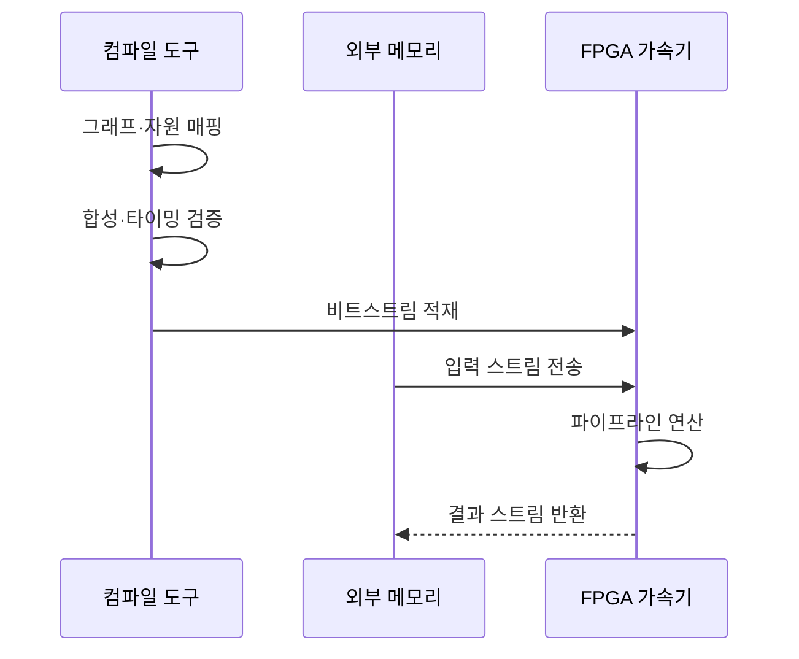

---
sidebar:
  order: 39
  label: "039. FPGA AI 가속 (FPGA AI Acceleration)"
  badge:
    text: "기출 · 70%"
    variant: note
title: "FPGA AI 가속 (FPGA AI Acceleration)"
date: "2026-07-25T17:33:00+09:00"
tags:
  - "notes-hardware"
weight: 39
extra:
  question_no: "039"
  source_status: "기출"
  source_history: "126회, 134회"
  priority: 70
  priority_note: "재구성·지연·전력의 가속기 선택"
---

## 미리 알고가기

- **필드 프로그래머블 게이트 배열(Field-Programmable Gate Array, FPGA)**: 제조 후 논리와 배선을 다시 구성하는 반도체
- **비트스트림(Bitstream)**: FPGA 논리·배선 구성을 담은 설정 파일
- **룩업 테이블(Look-Up Table, LUT)**: 사용자 정의 논리를 구현하는 기본 블록
- **플립플롭(Flip-Flop, FF)**: 파이프라인 상태를 저장하는 순차 회로
- **디지털 신호 처리(Digital Signal Processing, DSP) 슬라이스**: 곱셈·누산 전용 연산 블록
- **블록 램·울트라램(Block RAM·UltraRAM, BRAM·URAM)**: 가중치·특징맵용 온칩 메모리
- **직접 메모리 접근(Direct Memory Access, DMA)**: 프로세서 개입 없이 장치·메모리 사이 전송
- **개시 간격(Initiation Interval, II)**: 파이프라인이 새 입력을 받는 사이클 간격
- **타이밍 클로저(Timing Closure)**: 모든 배치·배선 경로가 목표 클록 주기를 만족한 상태
- **양자화(Quantization)**: 가중치·활성값의 수치 정밀도를 낮추는 변환
- **그래픽 처리장치(Graphics Processing Unit, GPU)**: 프로그램으로 병렬 연산을 수행하는 프로세서
- **주문형 반도체(Application-Specific Integrated Circuit, ASIC)**: 특정 기능으로 고정 제작한 전용 반도체
- **인공지능(Artificial Intelligence, AI)**: 학습한 모델로 분류·예측하며 FPGA가 해당 연산 그래프를 회로로 가속하는 기술
- **파이프라인(Pipeline)**: 연산을 여러 단계로 나눠 서로 다른 입력을 겹쳐 처리하는 회로 구조
- **텐서(Tensor)**: 신경망 입력·가중치·활성값을 다차원 배열로 나타낸 데이터
- **타일(Tile)**: 큰 텐서를 온칩 메모리와 연산기에 맞게 나눈 작은 블록
- **부분합(Partial Sum)**: 행렬 곱의 일부 곱셈 결과를 누적 중인 중간값
- **스트림 인터페이스(Stream Interface)**: 주소를 매번 지정하지 않고 순서대로 이어지는 데이터 흐름을 전달하는 연결
- **합성·배치·배선(Synthesis·Placement·Routing)**: 논리 설명을 회로로 바꾸고 칩 자원 위치와 연결 경로를 정하는 구현 단계
- **연산 그래프(Computation Graph)**: 모델의 연산자와 텐서 의존 관계를 노드·간선으로 나타낸 구조
- **추론(Inference)**: 학습된 모델에 새 입력을 넣어 예측 결과를 계산하는 과정
- **커널(Kernel)**: GPU 같은 가속기에서 여러 코어가 병렬 실행하는 연산 함수
- **배치 처리량(Batch Throughput)**: 여러 입력을 묶어 처리할 때 단위 시간당 완료하는 입력 수
- **산업 비전(Industrial Vision)**: 카메라와 영상 모델로 제품의 위치·치수·결함을 자동 판정하는 시스템

## Ⅰ. 개요

- **정의/개념**: AI 연산을 재구성 회로에 매핑하는 가속 방식
- **배경/필요성**: 모델 변경과 지연 제약으로 재구성 가속 필요

### 쉽게 이해하기 (학습용)

- 제품이 바뀔 때 배선을 다시 짤 수 있는 전용 생산 라인에서 처리하는 것과 같다

## Ⅱ. 특징

- 연산을 병렬 회로로 펼쳐 파이프라인 지연을 일정하게 한다.
- 비트스트림 재구성으로 모델 변경에 회로를 다시 맞춘다.

### 쉽게 이해하기 (학습용)

- 여러 작업대를 한 줄에 배치해 각 작업이 동시에 다른 제품을 처리한다

## Ⅲ. 아키텍처 및 구성요소

| 설계 요소 | 설명 |
|:---|:---|
| 비트스트림·구성 메모리 | 논리·배선·메모리·DSP 동작 모드 설정 |
| DMA·스트림 인터페이스 | 외부 메모리와 가속기 사이 텐서 전송 |
| BRAM·URAM 버퍼 | 입력·가중치·부분합을 타일 단위로 저장 |
| LUT·FF·DSP 파이프라인 | 제어·곱셈·누산을 단계별 동시 실행 |

> 요약: 비트스트림이 전송·버퍼·연산 경로를 구성

### 쉽게 이해하기 (학습용)

- 설계도로 운반대와 작업대, 가까운 부품함의 연결을 바꾼다

## Ⅳ. 원리 및 절차 흐름도

| 절차 | 설명 |
|:---|:---|
| 그래프·자원 매핑 | 연산자·텐서를 LUT·DSP·메모리에 배정 |
| 합성·타이밍 검증 | 합성·배치·배선 후 목표 클록 충족 확인 |
| 비트스트림 적재 | 검증한 회로 구성을 FPGA에 기록 |
| 입력 스트림 전송 | DMA가 입력·가중치를 온칩 버퍼로 이동 |
| 파이프라인 연산 | 설정한 II에 맞춰 곱셈·누산 단계 실행 |
| 결과 스트림 반환 | 결과를 외부 메모리로 전송 |

> 요약: 그래프를 회로로 검증·구성해 스트림 추론

### 쉽게 이해하기 (학습용)

- 작업을 여러 작업대에 나누고 속도를 검사한 뒤 원료를 연속 투입한다

## Ⅴ. 종류 및 비교

| 판단 기준 | FPGA | GPU | ASIC |
|:---|:---|:---|:---|
| 핵심 특징 | 재구성 공간 파이프라인 | 프로그램식 병렬 코어 | 고정 전용 회로 |
| 변경 방식 | 비트스트림 재합성 | 모델·커널 재배포 | 회로 재설계·제조 |
| 지연·전력 | 맞춤 정밀도·낮은 지연 변동 | 배치 처리량·높은 전력 소모 | 전용 최적화로 지연·전력 절감 |
| 적용 기준 | 주기적 변경·엄격한 지연 상한 | 잦은 변경·대규모 배치 | 안정된 모델·대량 생산 |
| 주요 위험 | 자원·대역폭·타이밍 클로저 | 전력·메모리·스케줄 변동 | 개발비·제조 기간·기능 고정 |

> 요약: 변경 주기·지연 상한·물량으로 가속기 선택

### 쉽게 이해하기 (학습용)

- FPGA는 설비를 다시 배선하고 GPU는 작업표를 바꾸며 ASIC은 공장을 새로 짓는다

## Ⅵ. 실무 사례

1. 산업 비전은 양자화 모델을 회로화해 지연 상한 준수

### 쉽게 이해하기 (학습용)

- 검사 부품이 도착할 때마다 전용 라인이 일정한 시간 안에 판정을 끝낸다

## Ⅶ. 결론

- 주기적 변경과 지연 상한을 자원 내에서 만족하면 FPGA 선택

### 쉽게 이해하기 (학습용)

- 가끔 바꾸는 전용 라인은 FPGA, 잦으면 GPU, 고정이면 ASIC이다
