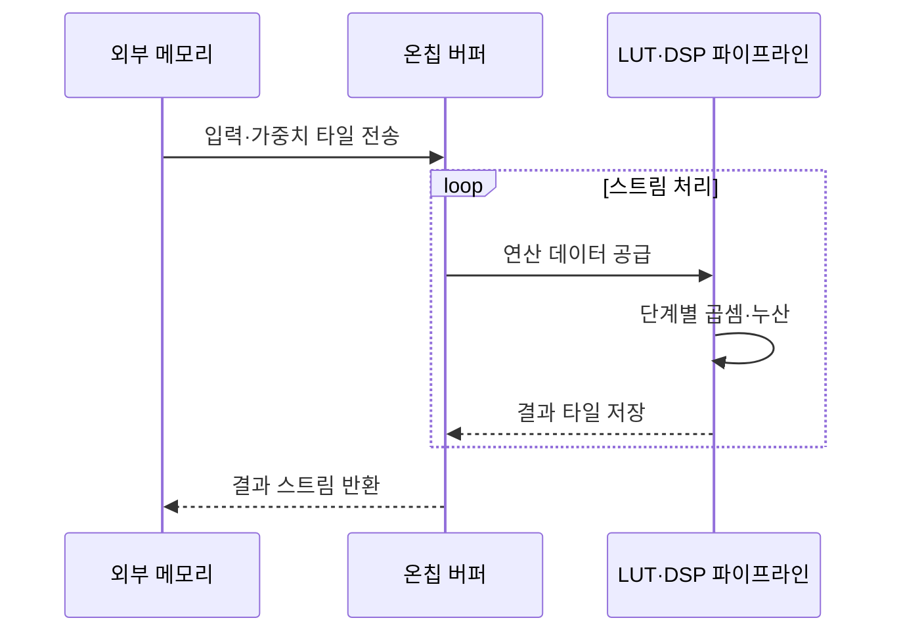

---
sidebar:
  order: 39
  label: "039. FPGA AI 가속 (FPGA AI Acceleration)"
  badge:
    text: "기출 · 70%"
    variant: note
title: "FPGA AI 가속 (FPGA AI Acceleration)"
date: "2026-07-27T23:59:59+09:00"
tags:
  - "notes-hardware"
weight: 39
extra:
  question_no: "039"
  source_status: "기출"
  source_history: "126회, 134회"
  priority: 70
  priority_note: "재구성·지연·전력의 가속기 선택"
---

## 미리 알고가기

- **필드 프로그래머블 게이트 배열(Field-Programmable Gate Array, FPGA)**: 제조 후에도 논리와 배선을 재구성할 수 있는 반도체
- **비트스트림(Bitstream)**: FPGA 논리·배선 구성을 담은 설정 파일
- **룩업 테이블(Look-Up Table, LUT)**: 진리표 기반으로 사용자 정의 조합 논리를 구현하는 FPGA의 기본 블록
- **플립플롭(Flip-Flop, FF)**: 파이프라인과 상태 값을 저장하는 FPGA의 순차 논리 소자
- **디지털 신호 처리(Digital Signal Processing, DSP) 슬라이스**: 곱셈·누산 전용 연산 블록
- **블록 램·울트라램(Block RAM·UltraRAM, BRAM·URAM)**: 가중치·특징맵용 온칩 메모리
- **직접 메모리 접근(Direct Memory Access, DMA)**: 프로세서의 데이터 복사 없이 장치와 메모리 사이에서 직접 전송하는 방식
- **개시 간격(Initiation Interval, II)**: 파이프라인이 연속된 새 입력을 받아들이는 사이의 클록 간격
- **타이밍 클로저(Timing Closure)**: 모든 배치·배선 경로가 목표 클록 주기를 만족한 상태
- **양자화(Quantization)**: 가중치·활성값의 수치 정밀도를 낮추는 변환
- **그래픽 처리장치(Graphics Processing Unit, GPU)**: 프로그램으로 병렬 연산을 수행하는 프로세서
- **주문형 반도체(Application-Specific Integrated Circuit, ASIC)**: 특정 기능으로 고정 제작한 전용 반도체
- **인공지능(Artificial Intelligence, AI)**: 학습한 모델로 분류·예측하며 FPGA가 해당 연산 그래프를 회로로 가속하는 기술
- **파이프라인(Pipeline)**: 연산을 여러 단계로 나눠 서로 다른 입력을 겹쳐 처리하는 회로 구조
- **텐서(Tensor)**: 신경망 입력·가중치·활성값을 다차원 배열로 나타낸 데이터
- **타일(Tile)**: 큰 텐서를 온칩 메모리와 연산기에 맞게 나눈 작은 블록
- **부분합(Partial Sum)**: 행렬 곱의 일부 곱셈 결과를 누적 중인 중간값
- **스트림 인터페이스(Stream Interface)**: 주소를 매번 지정하지 않고 순서대로 이어지는 데이터 흐름을 전달하는 연결
- **합성·배치·배선(Synthesis·Placement·Routing)**: 논리 설명을 회로로 바꾸고 칩 자원 위치와 연결 경로를 정하는 구현 단계
- **연산 그래프(Computation Graph)**: 모델의 연산자와 텐서 의존 관계를 노드·간선으로 나타낸 구조
- **추론(Inference)**: 학습된 모델에 새 입력을 넣어 예측 결과를 계산하는 과정
- **커널(Kernel)**: GPU 같은 가속기에서 여러 코어가 병렬 실행하는 연산 함수
- **배치 처리량(Batch Throughput)**: 여러 입력을 묶어 처리할 때 단위 시간당 완료하는 입력 수
- **산업 비전(Industrial Vision)**: 카메라와 영상 모델로 제품의 위치·치수·결함을 자동 판정하는 시스템

## Ⅰ. 개요

- 정의/개념: AI 연산을 **재구성 병렬 회로**에 매핑하는 가속 방식
- 기존 한계: 고정 회로는 **모델 변경 대응**, GPU는 지연 예측에 제약

### 쉽게 이해하기 (학습용)

- 제품이 바뀔 때 배선을 다시 짤 수 있는 전용 생산 라인에서 처리하는 것과 같다

## Ⅱ. 특징

- **공간 병렬 파이프라인**으로 일정한 처리 지연 확보
- **비트스트림 재구성**으로 모델 변경에 회로 재매핑
- **온칩 메모리 재사용**으로 외부 전송량 절감

### 쉽게 이해하기 (학습용)

- 여러 작업대를 한 줄에 배치해 각 작업이 동시에 다른 제품을 처리한다

## Ⅲ. 아키텍처 및 구성요소

| 설계 요소 | 설명 |
|:---|:---|
| 비트스트림·구성 메모리 | 논리·배선·메모리·DSP 동작 모드 설정 |
| DMA·스트림 인터페이스 | 외부 메모리와 가속기 사이 텐서 전송 |
| BRAM·URAM 버퍼 | 입력·가중치·부분합을 타일 단위로 저장 |
| LUT·FF·DSP 파이프라인 | 제어·곱셈·누산을 단계별 동시 실행 |

> 요약: 비트스트림이 전송·버퍼·연산 경로를 구성

### 쉽게 이해하기 (학습용)

- 설계도로 운반대와 작업대, 가까운 부품함의 연결을 바꾼다

## Ⅳ. 원리 및 절차 흐름도

| 절차 | 설명 |
|:---|:---|
| 입력·가중치 타일 전송 | DMA가 처리할 데이터만 온칩 버퍼로 이동 |
| 연산 데이터 공급 | BRAM·URAM이 파이프라인에 재사용 데이터를 제공 |
| 단계별 곱셈·누산 | LUT·DSP가 설정된 II에 맞춰 겹쳐 실행 |
| 결과 타일 저장 | 부분합·출력을 온칩 버퍼에 기록 |
| 결과 스트림 반환 | 완성된 결과를 외부 메모리로 전송 |

> 요약: 온칩 타일을 재사용하며 파이프라인 연산과 전송을 중첩

### 쉽게 이해하기 (학습용)

- 가까운 부품함에서 데이터를 되풀이 공급해 여러 작업대가 쉬지 않고 계산한다

## Ⅴ. 종류 및 비교

| AI 가속기 | FPGA | GPU | ASIC |
|:---|:---|:---|:---|
| 적용 기준 | 주기적 변경·**엄격한 지연 상한** | 잦은 변경·**대규모 배치** | 안정된 모델·**대량 생산** |
| 핵심 특징 | 재구성 **공간 파이프라인** | 프로그램식 **병렬 코어** | 고정 **전용 회로** |
| 한계 | 자원·대역폭·**타이밍 클로저** | 전력·메모리·**지연 변동** | 개발비·제조 기간·**기능 고정** |

> 요약: 변경 주기·지연 상한·물량으로 가속기 선택

### 쉽게 이해하기 (학습용)

- FPGA는 설비를 다시 배선하고 GPU는 작업표를 바꾸며 ASIC은 공장을 새로 짓는다

## Ⅵ. 실무 사례

1. 산업 비전은 **양자화 모델 회로화**로 지연 상한 준수

### 쉽게 이해하기 (학습용)

- 검사 부품이 도착할 때마다 전용 라인이 일정한 시간 안에 판정을 끝낸다

## Ⅶ. 결론

- 재구성 가속을 위해 지연·자원을 검토하여 **FPGA** 활용

### 쉽게 이해하기 (학습용)

- 가끔 바꾸는 전용 라인은 FPGA, 잦으면 GPU, 고정이면 ASIC이다
