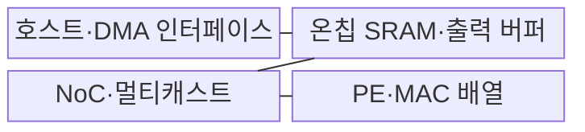
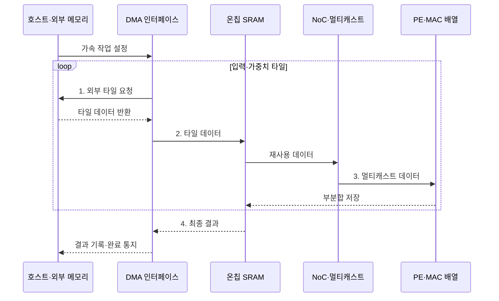

---
sidebar:
  order: 40
  label: "040. ASIC AI 가속 (ASIC AI Acceleration)"
  badge:
    text: "기출 · 70%"
    variant: note
title: "ASIC AI 가속 (ASIC AI Acceleration)"
date: "2026-08-02T11:00:00+09:00"
tags:
  - "notes-hardware"
weight: 40
extra:
  question_no: "040"
  source_status: "기출"
  source_history: "126회, 134회"
  priority: 70
  priority_note: "성능·전력 이득과 NRE 회수의 절충"
---

## Ⅰ. 개요

핵심 용어

- **주문형 반도체(Application-Specific Integrated Circuit, ASIC)**: 특정 용도에 맞춰 연산과 정밀도 및 데이터 경로를 고정하여 제작한 반도체이다.
- **전용 데이터 경로(Dedicated Data Path)**: 특정 연산의 데이터 이동과 처리를 위해 회로 연결을 고정한 실행 경로이다.
- **외부 데이터 이동(Off-chip Data Movement)**: 가속기와 외부 메모리 사이에서 입력·가중치·결과를 전송하는 동작이다.

- 정의/개념: 특정 AI 용도에 맞춰 연산·정밀도·**데이터 경로를 고정해 제작한 전용 반도체 가속기**
- 배경/필요성: 범용 명령 처리·외부 데이터 이동으로 **전력·지연 증가**

#### 한줄 요약

- 같은 메뉴를 많이 만들 때 조리 순서와 재료 위치를 고정한 전용 주방과 같다

## Ⅱ. 특징

핵심 용어

- **고정형 데이터플로우(Stationary Dataflow)**: 반복 사용하는 가중치·활성값·부분합 중 하나를 처리 요소 가까이에 유지하는 방식이다.
- **비반복 엔지니어링(Non-Recurring Engineering, NRE)**: 반도체 설계와 검증 및 마스크 제작에 한 번 발생하는 초기 개발 비용이다.
- **손익분기 수량(Break-Even Volume)**: ASIC의 초기 개발 비용을 대안 대비 칩당 비용 절감액으로 회수하는 생산 수량이다.

- **전용 데이터 경로**로 명령·재구성 오버헤드 제거
- **고정형 데이터플로우·온칩 재사용**으로 외부 전송 절감
- **NRE** 회수 가능성을 가르는 **손익분기 수량**

$$
BreakEven\ Volume = \frac{NRE}{UnitCost_{alternative} - UnitCost_{ASIC}}
$$

> ASIC의 개당 비용이 대안보다 낮고 동일한 기능·생산 기간을 비교한다는 전제의 단순식이다. 실제 판단에는 개발 기간, 재설계 위험과 운영 전력 절감도 함께 반영한다.

#### 한줄 요약

- 전용 주방은 같은 메뉴의 조리 단계를 줄이지만 메뉴 변경에는 설비 공사가 필요하다

## Ⅲ. 구조 및 구성요소

핵심 용어

- **처리 요소(Processing Element, PE)**: 행렬 연산의 일부를 병렬로 실행하는 가속기 내부의 연산 단위이다.
- **곱셈-누산(Multiply-Accumulate, MAC)**: 두 값을 곱한 결과를 기존 부분합에 더하는 행렬 연산의 기본 동작이다.
- **온칩 정적 임의 접근 메모리(On-chip SRAM)**: 가중치와 활성값 및 부분합을 가까이 저장하여 재사용하는 고속 메모리이다.
- **온칩 네트워크(Network on Chip, NoC)**: 피연산자와 결과를 처리 요소 배열에 분배하고 회수하는 칩 내부 연결망이다.

| 구성요소 | 책임 |
|:---|:---|
| 호스트·DMA 인터페이스 | 작업 시작·**타일 전송** |
| 온칩 SRAM·출력 버퍼 | 피연산자·부분합 **재사용** |
| NoC·멀티캐스트 | 여러 PE에 **데이터 분배** |
| PE·MAC 배열 | 행렬 **곱셈·누산 실행** |

#### 한줄 요약

- DMA가 타일을 SRAM에 놓고 NoC가 재사용 데이터를 PE 배열에 분배한다.

## Ⅳ. 흐름도

핵심 용어

- **직접 메모리 접근(Direct Memory Access, DMA)**: 프로세서의 직접 복사 없이 외부 메모리와 온칩 메모리 사이에서 데이터를 전송하는 방식이다.
- **타일(Tile)**: 큰 텐서를 온칩 메모리 용량과 처리 요소 배열 크기에 맞게 나눈 데이터 블록이다.
- **멀티캐스트(Multicast)**: 하나의 가중치나 활성값을 여러 처리 요소에 동시에 분배하는 전송 방식이다.
- **부분합(Partial Sum)**: 행렬 곱에서 여러 곱셈 결과를 모두 더하기 전까지 누적 중인 중간값이다.

**동작 원리**

1. **외부 타일 요청**: 입력·가중치 타일 회수
2. **타일 데이터**: 입력·가중치를 SRAM에 배치
3. **멀티캐스트 데이터**: 여러 처리 요소에 동시 전달
4. **최종 결과**: 누적 결과를 DMA로 반환

#### 한줄 요약

- DMA가 타일을 SRAM에 놓으면 NoC가 재사용 데이터를 PE에 분배하고 부분합을 가까이 유지한다

## Ⅴ. 종류 및 비교

핵심 용어

- **필드 프로그래머블 게이트 배열(Field-Programmable Gate Array, FPGA)**: 제조 후 논리 기능과 내부 배선을 다시 구성할 수 있는 반도체이다.
- **그래픽 처리 장치(Graphics Processing Unit, GPU)**: 프로그램 가능한 다수의 병렬 코어로 범용 수치 연산을 수행하는 프로세서이다.
- **재설계 비용(Redesign Cost)**: 고정된 ASIC 기능이나 오류를 수정하기 위해 설계·검증·제조를 다시 수행할 때 발생하는 비용이다.

| AI 가속기 | ASIC | FPGA | GPU |
|:---|:---|:---|:---|
| 적용 기준 | 안정된 연산·**대량 수요** | 변경 가능성·**중간 수량** | 잦은 변경·**범용 병렬** |
| 핵심 특징 | 고정 **전용 회로** | 재구성 **게이트 구조** | 명령 기반 **병렬 코어** |
| 한계 | NRE·개발 기간·**재설계 비용** | 자원·주파수·**합성 시간** | 제어·명령·**메모리 에너지** |

#### 한줄 요약

- ASIC은 전용 주방, FPGA는 개조 주방, GPU는 범용 주방에 가깝다

## Ⅵ. 실무 고려사항 및 대책

핵심 용어

- **프로그래머블 제어(Programmable Control)**: 고정 데이터 경로를 유지하면서 명령 순서나 지원 연산을 소프트웨어로 조정할 수 있게 하는 제어 구조이다.
- **연산기 가동률(Compute Utilization)**: 전체 시간 가운데 처리 요소가 유효한 연산을 수행한 시간의 비율이다.
- **에뮬레이션(Emulation)**: 제작 전 ASIC 설계를 재구성 하드웨어에서 실행하여 기능과 성능 오류를 검증하는 방법이다.
- **실리콘 검증(Silicon Validation)**: 제조된 실제 칩의 기능과 타이밍 및 전력·열 특성이 목표를 만족하는지 확인하는 절차이다.

| 문제 | 대책 | 효과 |
|:---|:---|:---|
| 생산량 부족으로 NRE 회수 실패 | 예상 물량·칩당 절감액으로 **손익분기 수량** 재검증 | **투자 위험** 축소 |
| 모델·수치 형식 변화로 회로 조기 노후화 | **프로그래머블 제어**·지원 연산 여유와 변경 로드맵 반영 | **제품 수명** 연장 |
| 외부 메모리 대역폭이 PE 배열을 제한 | **데이터플로우·타일링**·온칩 재사용률 최적화 | **연산기 가동률** 향상 |
| 전력 밀도·설계 오류가 양산 후 고정 | 열·전력 한도와 **에뮬레이션·실리콘 검증** 강화 | **재설계 위험** 감소 |

> 클라우드 TPU는 반복되는 행렬·저정밀 연산을 ASIC 데이터 경로로 고정해 높은 처리량과 전력 효율을 얻는다.

#### 한줄 요약

- 반복 행렬 연산은 데이터를 온칩에서 재사용해 전송 전력과 PE 대기를 줄인다

## Ⅶ. 결론

핵심 용어

- **모델 안정성(Model Stability)**: 제품 수명 동안 인공지능 모델의 구조와 핵심 연산 요구가 크게 바뀌지 않는 특성이다.
- **대량 수요(High-volume Demand)**: 초기 개발 비용을 칩당 비용 절감으로 회수할 만큼 충분한 생산 수량이 요구되는 조건이다.
- **전력 효율(Power Efficiency)**: 소비 전력 단위당 처리하는 연산량이나 완료하는 작업의 정도이다.

- 모델 안정·손익분기 수량 충족 시 **ASIC** 적용

#### 한줄 요약

- 메뉴와 손님 수가 오래 유지돼 건설비를 회수할 때 전용 주방을 짓는다
