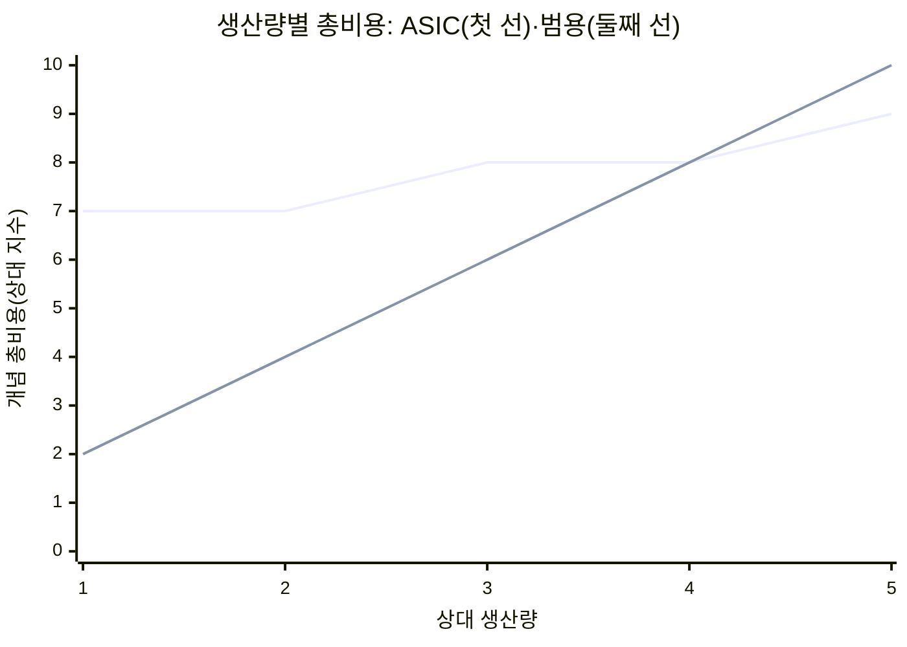
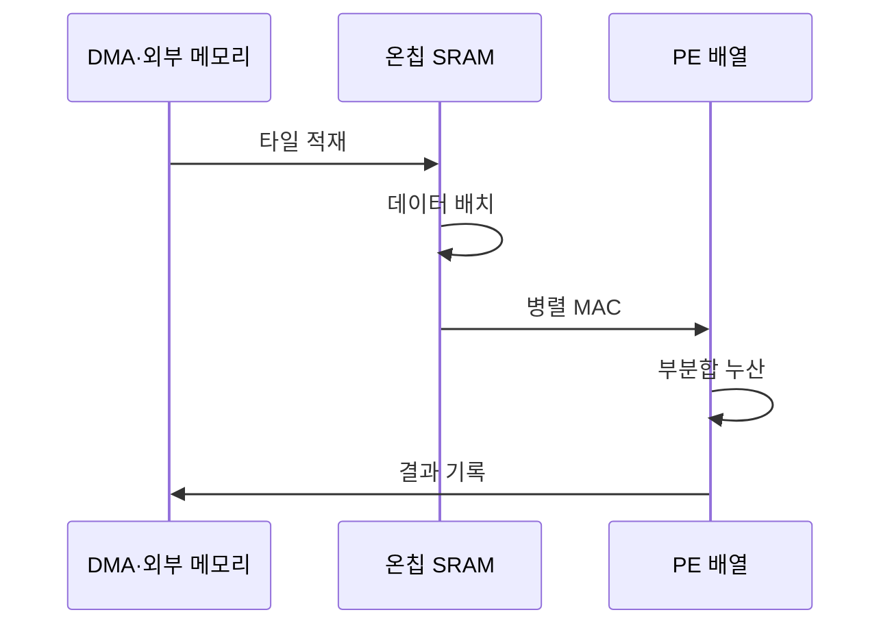

---
sidebar:
  order: 40
  label: "040. ASIC AI 가속 (ASIC AI Acceleration)"
  badge:
    text: "기출 · 70%"
    variant: note
title: "ASIC AI 가속 (ASIC AI Acceleration)"
date: "2026-07-27T23:59:59+09:00"
tags:
  - "notes-hardware"
weight: 40
extra:
  question_no: "040"
  source_status: "기출"
  source_history: "126회, 134회"
  priority: 70
  priority_note: "성능·전력 이득과 NRE 회수의 절충"
---

## 미리 알고가기

- **주문형 반도체(Application-Specific Integrated Circuit, ASIC)**: ‘에이식’으로 읽고 영문 머리글자를 딴 약어이며, 연산·정밀도·데이터 경로를 회로에 고정한 반도체
- **비반복 엔지니어링(Non-Recurring Engineering, NRE)**: ‘엔알이’로 읽고 영문 머리글자를 딴 약어이며, 설계·검증·마스크의 일회성 초기 비용
- **손익분기 수량(Break-Even Volume)**: NRE를 칩당 단가 절감으로 회수하는 수량
- **처리 요소(Processing Element, PE)**: ‘피이’로 읽고 영문 머리글자를 딴 약어이며, 행렬 연산 일부를 병렬 실행하는 단위
- **곱셈-누산(Multiply-Accumulate, MAC)**: ‘맥’으로 읽고 영문 머리글자를 딴 약어이며, 곱셈 결과를 부분합에 누적하는 연산
- **데이터플로우(Dataflow)**: 피연산자 배치·이동·재사용 순서
- **고정형 데이터플로우(Stationary Dataflow)**: 재사용 값을 PE 가까이에 유지하는 방식
- **온칩 정적 임의 접근 메모리(On-Chip Static Random-Access Memory, On-Chip SRAM)**: 가중치·활성값·부분합 재사용용 고속 메모리
- **온칩 네트워크(Network on Chip, NoC)**: 피연산자를 PE 배열에 분배하는 연결망
- **직접 메모리 접근(Direct Memory Access, DMA)**: 외부 메모리와 온칩 SRAM 사이 타일 전송
- **인공지능(Artificial Intelligence, AI)**: 학습한 모델로 분류·예측하며 ASIC이 반복 신경망 연산을 전용 회로로 가속하는 기술
- **현장 프로그래머블 게이트 배열(Field-Programmable Gate Array, FPGA)**: 제조 후 논리·배선을 다시 구성할 수 있는 반도체
- **그래픽 처리 장치(Graphics Processing Unit, GPU)**: 프로그램 가능한 병렬 코어로 그래픽·인공지능 연산을 처리하는 프로세서
- **텐서 처리 장치(Tensor Processing Unit, TPU)**: 행렬·텐서 연산을 가속하도록 설계된 구글의 전용 인공지능 프로세서
- **호스트(Host)**: 가속기에 작업을 설정하고 입력·출력 전송을 지시하는 중앙 프로세서 시스템
- **타일(Tile)**: 큰 텐서를 온칩 메모리와 PE 배열 크기에 맞게 나눈 데이터 블록
- **활성값·부분합(Activation·Partial Sum)**: 활성값은 신경망 층의 출력이고 부분합은 곱셈 결과를 누적 중인 중간값
- **멀티캐스트(Multicast)**: 하나의 가중치·활성값을 여러 처리 요소에 동시에 분배하는 전송
- **저정밀 연산(Low-Precision Arithmetic)**: 비트 수를 줄인 수치 형식으로 연산량·메모리 이동·전력을 낮추는 계산

## Ⅰ. 개요

- **정의/개념**: AI 연산·메모리 경로를 **고정 최적화**한 전용 가속기
- **기존 한계**: 범용 명령·데이터 이동은 **전력·지연 오버헤드** 증가

### 쉽게 이해하기 (학습용)

- 같은 메뉴를 많이 만들 때 조리 순서와 재료 위치를 고정한 전용 주방과 같다

## Ⅱ. 특징

- **전용 데이터 경로**로 명령·재구성 오버헤드 제거
- **온칩 데이터 재사용**으로 외부 메모리 전송 절감
- **NRE 회수 수량**이 경제적 도입 가능성 결정

### 쉽게 이해하기 (학습용)

- 전용 주방은 같은 메뉴의 조리 단계를 줄이지만 메뉴 변경에는 설비 공사가 필요하다

## Ⅲ. 아키텍처 및 구성요소

| 설계 요소 | 설명 |
|:---|:---|
| 호스트·DMA 인터페이스 | 가속기 시작과 외부 메모리 타일 전송 |
| 온칩 SRAM·출력 버퍼 | 가중치·활성값 재사용과 부분합·출력 보관 |
| NoC·멀티캐스트 | 피연산자를 여러 PE에 분배 |
| PE·MAC 배열 | 행렬 곱셈과 부분합 누산 병렬 실행 |

> 요약: SRAM 재사용·NoC 분배로 데이터 이동 최소화

### 쉽게 이해하기 (학습용)

- 가까운 선반과 배선이 여러 조리대에 재료를 나눠 주고 부분 결과를 모은다

## Ⅳ. 원리 및 절차 흐름도

| 절차 | 설명 |
|:---|:---|
| 타일 적재 | 가중치·활성값 타일을 SRAM으로 전송 |
| 데이터 배치 | 재사용 값을 SRAM·레지스터에 고정 |
| 병렬 MAC | NoC 분배 후 PE 배열의 곱셈·누산 |
| 부분합 누산 | 출력 타일 완료까지 부분합 누적 |
| 결과 기록 | 완성 출력 타일만 외부 메모리에 기록 |

> 요약: 타일을 온칩 재사용하고 완성 출력만 기록

### 쉽게 이해하기 (학습용)

- 재료를 가까이 두고 여러 조리대에서 재사용한 뒤 완성품만 밖으로 보낸다

## Ⅴ. 종류 및 비교

| AI 가속기 | ASIC | FPGA | GPU |
|:---|:---|:---|:---|
| 적용 기준 | 안정된 연산·**대량 수요** | 변경 가능성·**중간 수량** | 잦은 변경·**범용 병렬** |
| 핵심 특징 | 고정 **전용 회로** | 재구성 **게이트 구조** | 명령 기반 **병렬 코어** |
| 한계 | NRE·개발 기간·**재설계 비용** | 자원·주파수·**합성 시간** | 제어·명령·**메모리 에너지** |

### 쉽게 이해하기 (학습용)

- ASIC은 전용 주방, FPGA는 개조 주방, GPU는 범용 주방에 가깝다

## Ⅵ. 실무 사례

1. 클라우드 TPU는 **행렬·저정밀 연산**을 ASIC으로 가속

### 쉽게 이해하기 (학습용)

- 같은 행렬 메뉴를 대량 처리해 전용 조리대의 속도와 전력 이득을 얻는다

## Ⅶ. 결론

- 연산·정밀도가 안정되고 **수요가 손익분기**를 넘으면 ASIC 선택

### 쉽게 이해하기 (학습용)

- 메뉴와 손님 수가 오래 유지돼 건설비를 회수할 때 전용 주방을 짓는다
