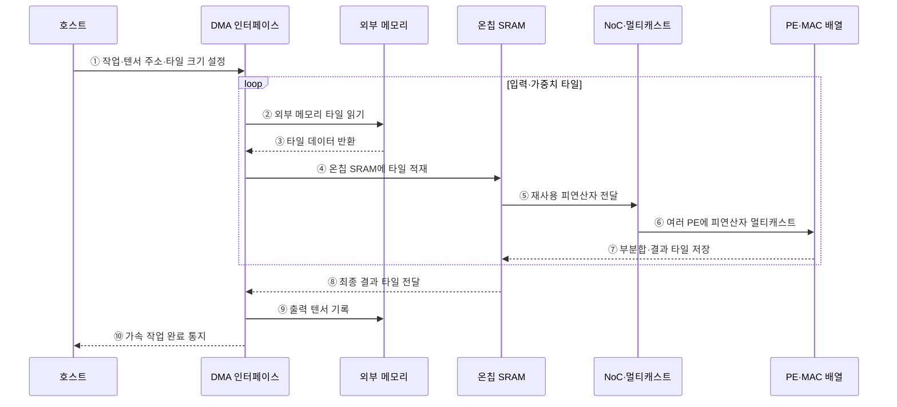

---
sidebar:
  order: 40
  label: "040. ASIC AI 가속 (ASIC AI Acceleration)"
  badge:
    text: "기출 · 70%"
    variant: note
title: "ASIC AI 가속 (ASIC AI Acceleration)"
date: "2026-07-28T12:55:34+09:00"
tags:
  - "notes-hardware"
weight: 40
extra:
  question_no: "040"
  source_status: "기출"
  source_history: "126회, 134회"
  priority: 70
  priority_note: "성능·전력 이득과 NRE 회수의 절충"
---

## 미리 알고가기

- **주문형 반도체(Application-Specific Integrated Circuit, ASIC)**: 특정 용도에 맞춰 연산·정밀도·데이터 경로를 회로로 고정한 반도체
- **비반복 엔지니어링(Non-Recurring Engineering, NRE)**: 반도체 설계·검증·마스크 제작에 한 번 발생하는 초기 개발 비용
- **손익분기 수량(Break-Even Volume)**: NRE를 칩당 단가 절감으로 회수하는 수량
- **처리 요소(Processing Element, PE)**: 행렬 연산의 일부를 병렬 실행하는 가속기 내부 연산 단위
- **곱셈-누산(Multiply-Accumulate, MAC)**: 두 값을 곱한 결과를 부분합에 누적하는 행렬 연산의 기본 단위
- **데이터플로우(Dataflow)**: 피연산자 배치·이동·재사용 순서
- **고정형 데이터플로우(Stationary Dataflow)**: 재사용 값을 PE 가까이에 유지하는 방식
- **온칩 정적 임의 접근 메모리(On-Chip Static Random-Access Memory, On-Chip SRAM)**: 가중치·활성값·부분합 재사용용 고속 메모리
- **온칩 네트워크(Network on Chip, NoC)**: 피연산자를 PE 배열에 분배하는 연결망
- **직접 메모리 접근(Direct Memory Access, DMA)**: 외부 메모리와 온칩 SRAM 사이 타일 전송
- **인공지능(Artificial Intelligence, AI)**: 학습한 모델로 분류·예측하며 ASIC이 반복 신경망 연산을 전용 회로로 가속하는 기술
- **현장 프로그래머블 게이트 배열(Field-Programmable Gate Array, FPGA)**: 제조 후 논리·배선을 다시 구성할 수 있는 반도체
- **그래픽 처리 장치(Graphics Processing Unit, GPU)**: 프로그램 가능한 병렬 코어로 그래픽·인공지능 연산을 처리하는 프로세서
- **텐서 처리 장치(Tensor Processing Unit, TPU)**: 행렬·텐서 연산을 가속하도록 설계된 구글의 전용 인공지능 프로세서
- **호스트(Host)**: 가속기에 작업을 설정하고 입력·출력 전송을 지시하는 중앙 프로세서 시스템
- **타일(Tile)**: 큰 텐서를 온칩 메모리와 PE 배열 크기에 맞게 나눈 데이터 블록
- **활성값·부분합(Activation·Partial Sum)**: 활성값은 신경망 층의 출력이고 부분합은 곱셈 결과를 누적 중인 중간값
- **멀티캐스트(Multicast)**: 하나의 가중치·활성값을 여러 처리 요소에 동시에 분배하는 전송
- **저정밀 연산(Low-Precision Arithmetic)**: 비트 수를 줄인 수치 형식으로 연산량·메모리 이동·전력을 낮추는 계산
- **에뮬레이션(Emulation)**: 제작 전 ASIC 설계를 대규모 재구성 하드웨어에서 실행해 기능·성능 오류를 검증하는 방법
- **실리콘 검증(Silicon Validation)**: 제조된 실제 칩에서 기능·타이밍·전력·열 특성이 설계 목표를 만족하는지 확인하는 절차

## Ⅰ. 개요

- 정의/개념: AI 연산·메모리 경로를 **고정 최적화**한 전용 가속기
- 기존 한계: 범용 명령·데이터 이동은 **전력·지연 오버헤드** 증가

### 쉽게 이해하기 (학습용)

- 같은 메뉴를 많이 만들 때 조리 순서와 재료 위치를 고정한 전용 주방과 같다

## Ⅱ. 특징

- **전용 데이터 경로**로 명령·재구성 오버헤드 제거
- **온칩 데이터 재사용**으로 외부 메모리 전송 절감
- **NRE 회수 수량**이 경제적 도입 가능성 결정

$$
BreakEven\ Volume = \frac{NRE}{UnitCost_{alternative} - UnitCost_{ASIC}}
$$

> ASIC의 개당 비용이 대안보다 낮고 동일한 기능·생산 기간을 비교한다는 전제의 단순식이다. 실제 판단에는 개발 기간, 재설계 위험과 운영 전력 절감도 함께 반영한다.

### 쉽게 이해하기 (학습용)

- 전용 주방은 같은 메뉴의 조리 단계를 줄이지만 메뉴 변경에는 설비 공사가 필요하다

## Ⅲ. 아키텍처 및 구성요소

### 도표안 A. ASIC AI 가속 정적 구조

| 설계 요소 | 입력·상태 | 역할 |
|:---|:---|:---|
| 호스트·DMA 인터페이스 | 작업·외부 타일 주소 | 가속기 시작·데이터 전송 |
| 온칩 SRAM·출력 버퍼 | 가중치·활성값·부분합 | 재사용·중간 결과 보관 |
| NoC·멀티캐스트 | 피연산자·대상 PE | 병렬 연산기로 데이터 분배 |
| PE·MAC 배열 | 연산 데이터·부분합 | 행렬 곱셈·누산 실행 |

> 요약: SRAM 재사용·NoC 분배로 데이터 이동 최소화

### 도표안 B. ASIC 타일 전송·행렬 연산 시퀀스

### 동작 원리

1. **① 작업·텐서 주소·타일 크기 설정**: 호스트는 실행할 신경망 연산과 입력·가중치·출력 주소, ASIC 데이터플로우에 맞춘 타일 크기를 DMA 인터페이스에 설정한다.
2. **② 외부 메모리 타일 읽기**: DMA는 PE 배열이 처리할 다음 입력·가중치 타일을 외부 메모리에 요청한다.
3. **③ 타일 데이터 반환**: 외부 메모리는 요청한 연속 데이터 블록을 DMA 인터페이스에 반환한다.
4. **④ 온칩 SRAM에 타일 적재**: DMA는 가중치·활성값을 온칩 SRAM의 고정된 데이터플로우 위치에 배치한다.
5. **⑤ 재사용 피연산자 전달**: SRAM은 여러 MAC 연산에서 반복 사용할 피연산자를 NoC에 한 번 공급한다.
6. **⑥ 여러 PE에 피연산자 멀티캐스트**: NoC는 고정 배선과 스케줄에 따라 같은 가중치나 활성값을 필요한 PE들에 동시에 분배한다.
7. **⑦ 부분합·결과 타일 저장**: PE·MAC 배열은 곱셈과 누산을 병렬 실행하고 부분합을 가까운 SRAM에 유지하다 완성된 결과 타일을 저장한다.
8. **⑧ 최종 결과 타일 전달**: 전체 누산이 끝난 결과 타일이 온칩 SRAM에서 DMA 출력 경로로 이동한다.
9. **⑨ 출력 텐서 기록**: DMA는 결과 타일을 외부 메모리의 지정된 출력 텐서 주소에 기록한다.
10. **⑩ 가속 작업 완료 통지**: 모든 타일 처리와 결과 기록이 끝나면 DMA 인터페이스가 호스트에 완료 상태를 알린다.

### 쉽게 이해하기 (학습용)

- 가까운 선반과 배선이 여러 조리대에 재료를 나눠 주고 부분 결과를 모은다

## Ⅳ. 종류 및 비교

| AI 가속기 | ASIC | FPGA | GPU |
|:---|:---|:---|:---|
| 적용 기준 | 안정된 연산·**대량 수요** | 변경 가능성·**중간 수량** | 잦은 변경·**범용 병렬** |
| 핵심 특징 | 고정 **전용 회로** | 재구성 **게이트 구조** | 명령 기반 **병렬 코어** |
| 한계 | NRE·개발 기간·**재설계 비용** | 자원·주파수·**합성 시간** | 제어·명령·**메모리 에너지** |

### 쉽게 이해하기 (학습용)

- ASIC은 전용 주방, FPGA는 개조 주방, GPU는 범용 주방에 가깝다

## Ⅴ. 실무 고려사항 및 대응 방안

| 운영 위험 | 대응 | 기대 효과 |
|:---|:---|:---|
| 생산량 부족으로 NRE 회수 실패 | 예상 물량·칩당 절감액으로 손익분기 수량 재검증 | 투자 위험 축소 |
| 모델·수치 형식 변화로 회로 조기 노후화 | 프로그래머블 제어·지원 연산 여유와 변경 로드맵 반영 | 제품 수명 연장 |
| 외부 메모리 대역폭이 PE 배열을 제한 | 데이터플로우·타일링·온칩 재사용률 최적화 | 연산기 가동률 향상 |
| 전력 밀도·설계 오류가 양산 후 고정 | 열·전력 한도와 형식·에뮬레이션·실리콘 검증 강화 | 재설계 위험 감소 |

> 클라우드 TPU는 반복되는 행렬·저정밀 연산을 ASIC 데이터 경로로 고정해 높은 처리량과 전력 효율을 얻는다.

### 쉽게 이해하기 (학습용)

- 재료를 가까이 두고 여러 조리대에서 재사용한 뒤 완성품만 밖으로 보낸다.
- 같은 행렬 메뉴를 대량 처리해 전용 조리대의 속도와 전력 이득을 얻는다

## Ⅵ. 결론

- 양산 가속을 위해 연산 안정성·수요를 검토하여 **ASIC** 활용

### 쉽게 이해하기 (학습용)

- 메뉴와 손님 수가 오래 유지돼 건설비를 회수할 때 전용 주방을 짓는다
