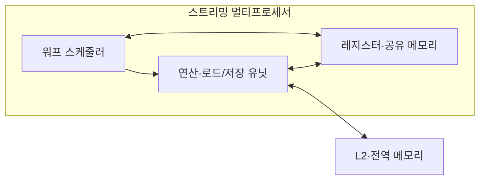
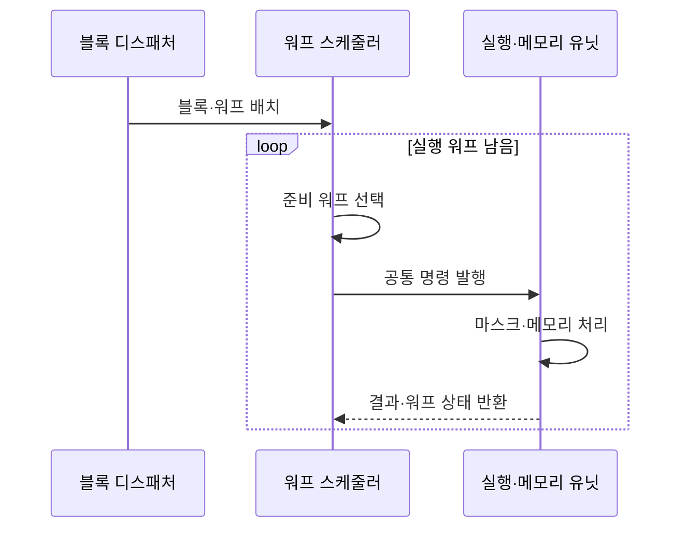

---
sidebar:
  order: 41
  label: "041. GPU 아키텍처·SIMT 모델 (GPU SIMT)"
  badge:
    text: "기출 · 85%"
    variant: note
title: "GPU 아키텍처·SIMT 모델 (GPU SIMT)"
date: "2026-07-27T23:59:59+09:00"
tags:
  - "notes-hardware"
weight: 41
extra:
  question_no: "041"
  source_status: "기출"
  source_history: "126회, 134회, 137회"
  priority: 85
  priority_note: "반복 기출, SIMT 병렬성과 메모리 효율의 핵심"
---

## 미리 알고가기

- **그래픽 처리 장치(Graphics Processing Unit, GPU)**: ‘지피유’로 읽고 영문 머리글자를 딴 약어이며, 다수 스레드로 데이터 병렬 연산을 수행하는 프로세서
- **단일 명령 다중 스레드(Single Instruction, Multiple Threads, SIMT)**: ‘에스아이엠티’로 읽고 영문 머리글자를 딴 약어이며, 워프의 활성 스레드에 공통 명령을 발행하는 실행 모델
- **스트리밍 멀티프로세서(Streaming Multiprocessor, SM)**: ‘에스엠’으로 읽고 영문 머리글자를 딴 약어이며, 워프 스케줄링·연산·온칩 메모리의 실행 단위
- **스레드 블록(Thread Block)**: SM에 함께 배치되는 스레드 묶음
- **워프(Warp)**: NVIDIA GPU의 32개 스레드 실행 묶음
- **분기 발산(Branch Divergence)**: 워프가 다른 경로를 마스크로 나눠 실행하는 현상
- **병합 접근(Coalesced Access)**: 워프 주소를 적은 메모리 트랜잭션으로 결합
- **점유율(Occupancy)**: SM에 상주한 워프와 최대 워프의 비율
- **지연 은닉(Latency Hiding)**: 준비 워프 교대로 연산·메모리 대기를 숨기는 기법
- **중앙 처리 장치(Central Processing Unit, CPU)**: 복잡한 제어와 적은 수의 독립 스레드를 빠르게 실행하는 범용 프로세서
- **단일 명령 다중 데이터(Single Instruction, Multiple Data, SIMD)**: ‘에스아이엠디’로 읽고 영문 머리글자를 딴 약어이며, 하나의 벡터 명령을 여러 데이터 레인에 동시에 적용하는 실행 방식
- **스레드(Thread)**: 독립 명령 흐름과 레지스터 상태를 가진 최소 실행 단위
- **레지스터·공유 메모리·전역 메모리**: 레지스터는 스레드 전용 상태, 공유 메모리는 블록 내 재사용 데이터, 전역 메모리는 모든 블록이 접근하는 장치 메모리를 저장함
- **2단계 캐시(Level 2 Cache, L2 Cache)**: 모든 스트리밍 멀티프로세서가 공유하며 전역 메모리 접근을 줄이는 캐시
- **활성 마스크(Active Mask)**: 워프에서 현재 명령을 실행할 스레드만 표시하는 비트 집합
- **벡터 레인(Vector Lane)**: SIMD 명령에서 서로 다른 데이터 원소를 병렬 처리하는 연산 통로
- **분기 예측(Branch Prediction)**: CPU가 조건 분기 방향을 미리 추정해 명령 처리를 이어 가는 기능
- **커널(Kernel)**: GPU의 많은 스레드가 병렬 실행하는 연산 함수

## Ⅰ. 개요

- **정의/개념**: 워프별 **공통 명령·다중 스레드**로 병렬 처리하는 구조
- **기존 한계**: 소수 범용 코어는 **대규모 동일 연산 처리량**에 한계

### 쉽게 이해하기 (학습용)

- 한 작업조가 같은 지시를 받고 많은 자료를 동시에 처리한다

## Ⅱ. 특징

- **워프 전환**으로 메모리 대기 시간 은닉
- **활성 마스크**로 분기 경로를 순차 실행
- **병합 접근·점유율**이 메모리 처리량 결정

### 쉽게 이해하기 (학습용)

- 한 조가 기다리면 준비된 조를 투입하고 재료는 묶어 가져온다

## Ⅲ. 아키텍처 및 구성요소

| 설계 요소 | 설명 |
|:---|:---|
| 워프 스케줄러 | 실행 가능한 워프 선택과 공통 명령 발행 |
| 연산·로드/저장 유닛 | 산술·분기·메모리 명령을 처리하는 실행 자원 |
| 레지스터·공유 메모리 | 스레드 상태와 블록 내 재사용 데이터 저장 |
| L2·전역 메모리 | 모든 SM이 공유하는 캐시와 장치 메모리 |

> 요약: 스케줄러가 워프를 실행 유닛과 메모리 계층에 연결한다

### 쉽게 이해하기 (학습용)

- 작업 지시자와 연산대·부품함·공용 창고가 한 작업장을 이룬다

## Ⅳ. 원리 및 절차 흐름도

| 절차 | 설명 |
|:---|:---|
| 블록·워프 배치 | 스레드 블록을 가용 SM에 배치해 워프 상주 |
| 준비 워프 선택 | 의존성·메모리 대기가 없는 워프 선택 |
| 공통 명령 발행 | 활성 스레드에 같은 명령을 동시 발행 |
| 마스크·메모리 처리 | 활성 경로 실행과 병합 메모리 접근 |
| 결과·워프 상태 반환 | 결과 저장 후 준비·대기·완료 상태 갱신 |

> 요약: 준비 워프를 선택해 대기를 숨기고 활성 마스크로 분기 실행

### 쉽게 이해하기 (학습용)

- 준비된 조를 선택해 같은 지시를 내리고 막히면 다른 조로 바꾼다

## Ⅴ. 종류 및 비교

| 병렬 실행 방식 | GPU SIMT | CPU SIMD | CPU 스레드 |
|:---|:---|:---|:---|
| 적용 기준 | 대규모 **동일 연산** | 벡터화 가능 **반복문** | 복잡한 분기·**낮은 병렬성** |
| 핵심 특징 | 워프의 **다중 스레드** | 고정 폭 **벡터 레인** | 독립 **명령 흐름 스레드** |
| 한계 | 분기 발산·**비병합 접근** | 벡터 폭 **미활용** | 문맥 전환·**동기화 비용** |

> 요약: 대규모 동일 연산은 SIMT, 복잡한 분기는 CPU가 적합하다

### 쉽게 이해하기 (학습용)

- 같은 일을 대량으로 하면 SIMT, 일정한 묶음은 SIMD, 복잡한 일은 CPU가 맞다

## Ⅵ. 실무 사례

1. 영상 필터는 **연속 화소 워프 배치**로 병합 접근
2. 조건 분기 커널은 **입력 사전 분류**로 워프 발산 완화

### 쉽게 이해하기 (학습용)

- 이웃 화소를 한 조에 모아 재료를 한 번에 가져온다
- 같은 조건의 작업을 묶어 조원들이 한 경로로 움직인다

## Ⅶ. 결론

- **병렬 처리 이득**이 발산·메모리 비용보다 클 때 GPU 선택

### 쉽게 이해하기 (학습용)

- 같은 일이 많으면 큰 작업조, 갈림길이 많으면 개별 작업자가 낫다
