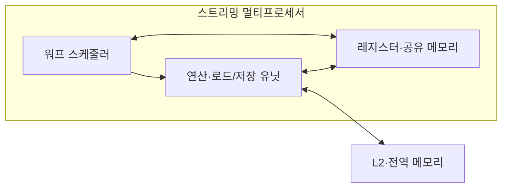
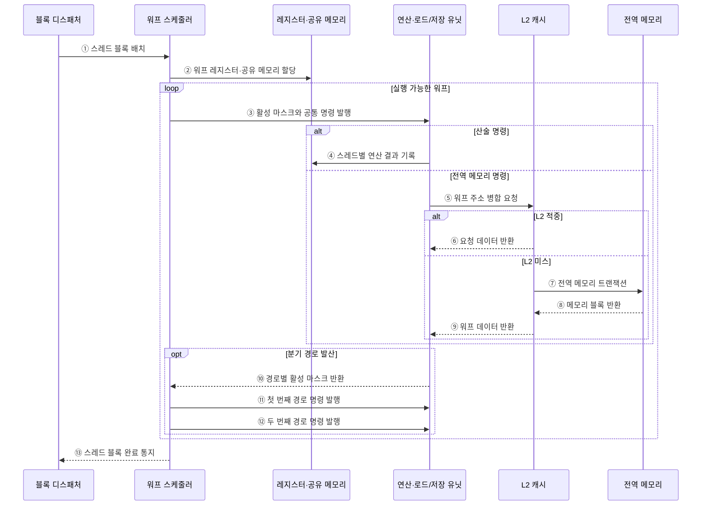

---
sidebar:
  order: 41
  label: "041. GPU 아키텍처·SIMT 모델 (GPU SIMT)"
  badge:
    text: "기출 · 85%"
    variant: note
title: "GPU 아키텍처·SIMT 모델 (GPU SIMT)"
date: "2026-07-28T12:55:59+09:00"
tags:
  - "notes-hardware"
weight: 41
extra:
  question_no: "041"
  source_status: "기출"
  source_history: "126회, 134회, 137회"
  priority: 85
  priority_note: "반복 기출, SIMT 병렬성과 메모리 효율의 핵심"
---

## 미리 알고가기

- **그래픽 처리 장치(Graphics Processing Unit, GPU)**: 다수 스레드로 데이터 병렬 연산을 수행하는 프로세서
- **단일 명령 다중 스레드(Single Instruction, Multiple Threads, SIMT)**: 하나의 명령어를 워프의 활성 스레드에 공통 발행하는 GPU 실행 모델
- **스트리밍 멀티프로세서(Streaming Multiprocessor, SM)**: 워프 스케줄링·연산·온칩 메모리를 담당하는 GPU 실행 단위
- **스레드 블록(Thread Block)**: SM에 함께 배치되는 스레드 묶음
- **워프(Warp)**: NVIDIA GPU의 32개 스레드 실행 묶음
- **분기 발산(Branch Divergence)**: 워프가 다른 경로를 마스크로 나눠 실행하는 현상
- **병합 접근(Coalesced Access)**: 워프 주소를 적은 메모리 트랜잭션으로 결합
- **점유율(Occupancy)**: SM에 상주한 워프와 최대 워프의 비율
- **지연 은닉(Latency Hiding)**: 준비 워프 교대로 연산·메모리 대기를 숨기는 기법
- **중앙 처리 장치(Central Processing Unit, CPU)**: 복잡한 제어와 적은 수의 독립 스레드를 빠르게 실행하는 범용 프로세서
- **단일 명령 다중 데이터(Single Instruction, Multiple Data, SIMD)**: 하나의 벡터 명령어를 여러 데이터 레인에 동시에 적용하는 실행 방식
- **스레드(Thread)**: 독립 명령 흐름과 레지스터 상태를 가진 최소 실행 단위
- **레지스터·공유 메모리·전역 메모리**: 레지스터는 스레드 전용 상태, 공유 메모리는 블록 내 재사용 데이터, 전역 메모리는 모든 블록이 접근하는 장치 메모리를 저장함
- **2단계 캐시(Level 2 Cache, L2 Cache)**: 모든 스트리밍 멀티프로세서가 공유하며 전역 메모리 접근을 줄이는 캐시
- **활성 마스크(Active Mask)**: 워프에서 현재 명령을 실행할 스레드만 표시하는 비트 집합
- **벡터 레인(Vector Lane)**: SIMD 명령에서 서로 다른 데이터 원소를 병렬 처리하는 연산 통로
- **분기 예측(Branch Prediction)**: CPU가 조건 분기 방향을 미리 추정해 명령 처리를 이어 가는 기능
- **커널(Kernel)**: GPU의 많은 스레드가 병렬 실행하는 연산 함수
- **블록 디스패처(Block Dispatcher)**: 커널의 스레드 블록을 자원이 충분한 스트리밍 멀티프로세서에 배치하는 하드웨어
- **커널 융합(Kernel Fusion)**: 연속 커널을 하나로 결합해 중간 결과의 전역 메모리 왕복과 실행 시작 비용을 줄이는 최적화
- **비동기 전송(Asynchronous Transfer)**: CPU나 GPU 연산과 데이터 이동을 겹치도록 완료를 기다리지 않고 전송을 시작하는 방식

## Ⅰ. 개요

- 정의/개념: 워프별 **공통 명령·다중 스레드**로 병렬 처리하는 구조
- 기존 한계: 소수 범용 코어는 **대규모 동일 연산 처리량**에 한계

### 쉽게 이해하기 (학습용)

- 한 작업조가 같은 지시를 받고 많은 자료를 동시에 처리한다

## Ⅱ. 특징

- **워프 전환**으로 메모리 대기 시간 은닉
- **활성 마스크**로 분기 경로를 순차 실행
- **병합 접근·점유율**이 메모리 처리량 결정

### 쉽게 이해하기 (학습용)

- 한 조가 기다리면 준비된 조를 투입하고 재료는 묶어 가져온다

## Ⅲ. 아키텍처 및 구성요소

### 도표안 A. GPU SIMT 정적 구조

| 설계 요소 | 입력·상태 | 역할 |
|:---|:---|:---|
| 워프 스케줄러 | 워프 준비·대기·활성 마스크 | 실행 워프 선택·명령 발행 |
| 연산·로드/저장 유닛 | 산술·분기·메모리 명령 | 연산·주소 접근 실행 |
| 레지스터·공유 메모리 | 스레드 상태·블록 데이터 | 상태·재사용 데이터 보관 |
| L2·전역 메모리 | 모든 SM의 메모리 요청 | 공유 캐시·장치 데이터 제공 |

> 요약: 스케줄러가 워프를 실행 유닛과 메모리 계층에 연결한다

### 도표안 B. 워프 발행·분기·메모리 지연 은닉 시퀀스

### 동작 원리

1. **① 스레드 블록 배치**: 블록 디스패처는 레지스터·공유 메모리·최대 워프 자원이 충분한 SM에 스레드 블록을 배치한다.
2. **② 워프 레지스터·공유 메모리 할당**: 워프 스케줄러는 블록의 스레드를 워프로 묶고 각 스레드 상태와 블록 공유 데이터를 위한 자원을 할당한다.
3. **③ 활성 마스크와 공통 명령 발행**: 스케줄러는 피연산자가 준비된 워프를 골라 현재 활성 스레드가 함께 실행할 명령 하나를 발행한다.
4. **④ 스레드별 연산 결과 기록**: 산술 명령이면 실행 유닛이 같은 연산을 활성 스레드의 서로 다른 데이터에 수행하고 결과를 레지스터에 기록한다.
5. **⑤ 워프 주소 병합 요청**: 로드·스토어 명령이면 인접한 스레드 주소를 가능한 적은 메모리 트랜잭션으로 합쳐 L2 캐시에 요청한다.
6. **⑥ 요청 데이터 반환**: L2에 블록이 있으면 캐시는 워프의 각 스레드에 필요한 데이터를 실행 유닛으로 반환한다.
7. **⑦ 전역 메모리 트랜잭션**: L2 미스이면 병합한 요청이 전역 메모리로 내려가고 해당 워프는 대기 상태가 된다.
8. **⑧ 메모리 블록 반환**: 전역 메모리는 요청 블록을 L2 캐시에 반환하며, 그동안 스케줄러는 다른 준비 워프를 실행해 지연을 숨긴다.
9. **⑨ 워프 데이터 반환**: L2는 도착한 데이터를 원래 요청한 워프에 전달해 다시 실행 가능한 상태로 만든다.
10. **⑩ 경로별 활성 마스크 반환**: 분기 결과가 갈리면 실행 유닛은 각 경로를 택한 스레드 집합을 별도 활성 마스크로 만든다.
11. **⑪ 첫 번째 경로 명령 발행**: 스케줄러는 첫 경로의 스레드만 활성화하고 다른 스레드는 마스킹한 채 명령을 실행한다.
12. **⑫ 두 번째 경로 명령 발행**: 첫 경로가 끝나면 반대 마스크로 두 번째 경로를 실행하므로 발산 경로는 시간상 순차 처리된다.
13. **⑬ 스레드 블록 완료 통지**: 블록의 모든 워프가 끝나면 스케줄러는 자원을 해제하고 디스패처에 완료를 알린다.

### 쉽게 이해하기 (학습용)

- 워프 스케줄러·연산 코어·레지스터 파일·공유 메모리가 하나의 스트리밍 멀티프로세서를 구성한다

## Ⅳ. 종류 및 비교

| 병렬 실행 방식 | GPU SIMT | CPU SIMD | CPU 스레드 |
|:---|:---|:---|:---|
| 적용 기준 | 대규모 **동일 연산** | 벡터화 가능 **반복문** | 복잡한 분기·**낮은 병렬성** |
| 핵심 특징 | 워프의 **다중 스레드** | 고정 폭 **벡터 레인** | 독립 **명령 흐름 스레드** |
| 한계 | 분기 발산·**비병합 접근** | 벡터 폭 **미활용** | 문맥 전환·**동기화 비용** |

> 요약: 대규모 동일 연산은 SIMT, 복잡한 분기는 CPU가 적합하다

### 쉽게 이해하기 (학습용)

- 같은 일을 대량으로 하면 SIMT, 일정한 묶음은 SIMD, 복잡한 일은 CPU가 맞다

## Ⅴ. 실무 고려사항 및 대응 방안

| 운영 위험 | 대응 | 기대 효과 |
|:---|:---|:---|
| 워프 내부 분기 발산 | 같은 경로 스레드를 묶고 분기·마스크 효율 측정 | 실행 레인 활용률 향상 |
| 비연속 주소로 메모리 트랜잭션 증가 | 자료 구조·스레드 인덱스를 연속 접근에 맞춤 | 병합 접근·대역폭 개선 |
| 레지스터·공유 메모리 과다 사용으로 점유율 감소 | 블록 크기·자원 사용량과 실제 지연 은닉을 함께 탐색 | 상주 워프 균형 |
| 작은 커널의 실행·전송 오버헤드 지배 | 커널 융합·배치 처리와 비동기 전송 적용 | 유효 처리량 증가 |

> 영상 필터는 인접 화소를 같은 워프의 연속 스레드에 배치해 전역 메모리 요청을 병합한다.

### 쉽게 이해하기 (학습용)

- 준비된 조를 선택해 같은 지시를 내리고 막히면 다른 조로 바꾼다.
- 이웃 화소를 한 조에 모아 재료를 한 번에 가져온다

## Ⅵ. 결론

- 병렬 처리를 위해 발산·메모리를 검토하여 **GPU SIMT** 활용

### 쉽게 이해하기 (학습용)

- 같은 일이 많으면 큰 작업조, 갈림길이 많으면 개별 작업자가 낫다
