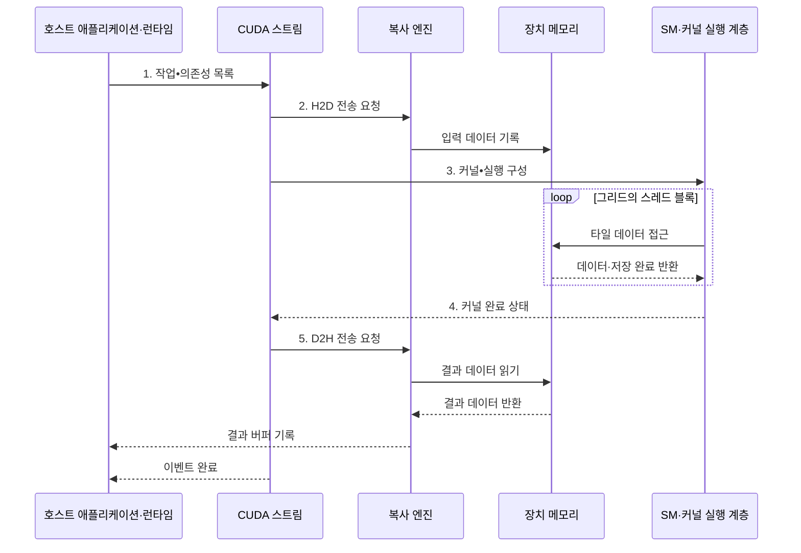

---
sidebar:
  order: 42
  label: "042. CUDA 병렬 컴퓨팅 (CUDA Parallel Computing)"
  badge:
    text: "기출 · 50%"
    variant: note
title: "CUDA 병렬 컴퓨팅 (CUDA Parallel Computing)"
date: "2026-07-31T10:23:00+09:00"
tags:
  - "notes-hardware"
weight: 42
extra:
  question_no: "042"
  source_status: "기출"
  source_history: "135회"
  priority: 50
  priority_note: "커널·메모리·스트림 최적화의 기출 주제"
---

## 미리 알고가기

- **통합 컴퓨팅 장치 구조(Compute Unified Device Architecture, CUDA)**: NVIDIA GPU에서 병렬 연산을 구현하는 플랫폼이자 프로그래밍 모델
- **호스트(Host)**: CUDA 작업을 제출하는 CPU 측 실행 환경
- **장치(Device)**: CUDA 커널과 메모리를 실행하는 GPU
- **커널(Kernel)**: GPU의 여러 스레드가 병렬 실행하는 함수
- **실행 계층(Grid, Block, Thread)**: 전체 작업·협력 묶음·개별 실행 단위
- **스트림(Stream)**: 작업을 등록 순서로 처리하는 장치 대기열
- **고정 호스트 메모리(Pinned Host Memory)**: 비동기 호스트 전송을 위한 페이지 고정 메모리
- **공유 메모리(Shared Memory)**: 블록 스레드가 재사용하는 온칩 메모리
- **이벤트(Event)**: 스트림 간 의존성과 완료를 표시하는 동기화 객체
- **중앙 처리 장치(Central Processing Unit, CPU)**: CUDA 작업을 준비·제출하고 결과를 처리하는 호스트 프로세서
- **그래픽 처리 장치(Graphics Processing Unit, GPU)**: 다수 스레드로 CUDA 커널을 병렬 실행하는 장치 프로세서
- **단일 명령 다중 스레드(Single Instruction, Multiple Threads, SIMT)**: 하나의 명령어를 워프의 활성 스레드에 공통 발행하는 GPU 실행 모델
- **스트리밍 멀티프로세서(Streaming Multiprocessor, SM)**: 스레드 블록을 배치하고 워프를 실행하는 GPU 연산 단위
- **연산 집약도(Arithmetic Intensity)**: 이동한 데이터 양에 비해 수행한 연산량의 비율
- **병합 접근(Coalesced Access)**: 인접 스레드의 메모리 요청을 적은 전송으로 합치는 접근
- **SYCL**: 여러 제조사의 가속기를 표준 C++ 코드로 제어하는 크로노스 그룹의 이식형 병렬 프로그래밍 모델
- **다차원 실행 범위(N-Dimensional Range, ND-range)**: SYCL에서 전체 작업 항목과 작업 그룹의 다차원 배치를 나타내는 실행 범위
- **통합 공유 메모리(Unified Shared Memory, USM)**: 호스트와 장치가 같은 포인터 주소로 접근하도록 메모리를 관리하는 SYCL 기능
- **불균일 메모리 접근(Non-Uniform Memory Access, NUMA)**: 프로세서와 메모리의 물리적 위치에 따라 접근 시간이 달라지는 구조
- **호스트→장치·장치→호스트 복사(Host-to-Device·Device-to-Host, H2D·D2H)**: CPU 메모리에서 GPU 메모리로 입력을 보내는 전송과 계산 결과를 반대로 가져오는 전송
- **복사 엔진(Copy Engine)**: GPU 연산 코어와 별도로 호스트·장치 메모리 사이의 DMA 전송을 수행하는 하드웨어

## Ⅰ. 개요

- 정의/개념: NVIDIA GPU의 **병렬 실행 플랫폼**
- 배경/필요성: CPU 소수 스레드로는 대규모 데이터 **처리량 제약**

### 쉽게 이해하기 (학습용)

- CPU가 작업표를 만들면 GPU의 여러 작업조가 일을 나눠 처리한다

## Ⅱ. 특징

- **호스트·장치 분리**로 작업 제출과 커널 실행 구분
- **그리드·블록·스레드** 계층으로 병렬 작업 구성
- **병합 접근**은 트랜잭션 감소, **스트림 중첩**은 복사 지연 은닉

### 쉽게 이해하기 (학습용)

- 작업조 크기를 맞추고 조건이 되면 운반과 계산을 겹쳐 진행한다

## Ⅲ. 구조 및 구성요소

| 구성요소 | 책임 |
|:---|:---|
| 호스트 런타임 | 할당·복사·**실행 관리** |
| CUDA 스트림 | 작업 순서·**의존성 관리** |
| 커널 실행 계층 | 병렬 **그리드·블록 배치** |
| 장치 메모리 계층 | 범위별 **데이터 저장·공급** |

### 쉽게 이해하기 (학습용)

- 런타임이 스트림에 작업을 등록하면 실행 계층과 메모리가 순서대로 처리한다.

## Ⅳ. 흐름도

**동작 원리**

1. **작업•의존성 목록**: 복사•커널의 비동기 순서
2. **H2D 전송 요청**: 장치 메모리에 적재할 입력
3. **커널•실행 구성**: 함수와 그리드•블록 크기
4. **커널 완료 상태**: 타일 처리 종료와 복사 허용
5. **D2H 전송 요청**: 호스트에 기록할 결과 범위

### 쉽게 이해하기 (학습용)

- 스트림은 입력 복사·커널·결과 복사를 순서대로 실행하고 이벤트로 완료를 알린다

## Ⅴ. 종류 및 비교

| 병렬 프로그래밍 방식 | CUDA | SYCL | CPU 멀티스레딩 |
|:---|:---|:---|:---|
| 적용 기준 | NVIDIA **세부 최적화** | 다중 제조사 **이식성** | 복잡한 분기·**작은 작업** |
| 핵심 특징 | **그리드·블록·스레드** | **ND-range·작업 그룹** | 독립 **스레드·태스크** |
| 한계 | 공급자 종속·**전송 병목** | 구현별 **성능 편차** | 제한된 **병렬 처리량** |

> 요약: NVIDIA 최적화는 CUDA, 이식성은 SYCL이 적합하다

### 쉽게 이해하기 (학습용)

- 전용 공장 최적화는 CUDA, 여러 공장 이동은 SYCL이 알맞다

## Ⅵ. 실무 고려사항 및 대책

| 고려사항 | 대책 | 효과 |
|:---|:---|:---|
| **전역 동기화**가 복사•커널 중첩 차단 | **스트림•이벤트**로 실제 의존성만 표현 | **동시 실행** 확대 |
| 호스트·장치 전송이 연산 시간을 초과 | **고정 호스트 메모리**·비동기 복사·배치 적용 | 전송 비용 절감 |
| **비동기 커널 오류**의 지연 발견 | 실행 직후 확인과 경계별 **로그** 적용 | 오류 **원인 위치** 식별 |
| 블록•레지스터•공유 메모리 **불균형** | **점유율•대역폭•연산 집약도** 공동 탐색 | 병목별 **자원 조정** |

> 행렬 곱은 입력을 공유 메모리 크기의 타일로 나누고 블록 안의 여러 스레드가 같은 값을 반복 사용해 전역 메모리 전송을 줄인다.

### 쉽게 이해하기 (학습용)

- 행렬 타일을 공유 메모리에서 재사용하고 여러 스트림의 복사·연산을 겹쳐 전송 병목을 줄인다

## Ⅶ. 결론

- **NVIDIA 최적화**는 CUDA, **다중 제조사 이식성**은 SYCL 선택

### 쉽게 이해하기 (학습용)

- 전용 공장을 채울 일감이 많고 이동비를 줄일 수 있을 때 CUDA를 쓴다
